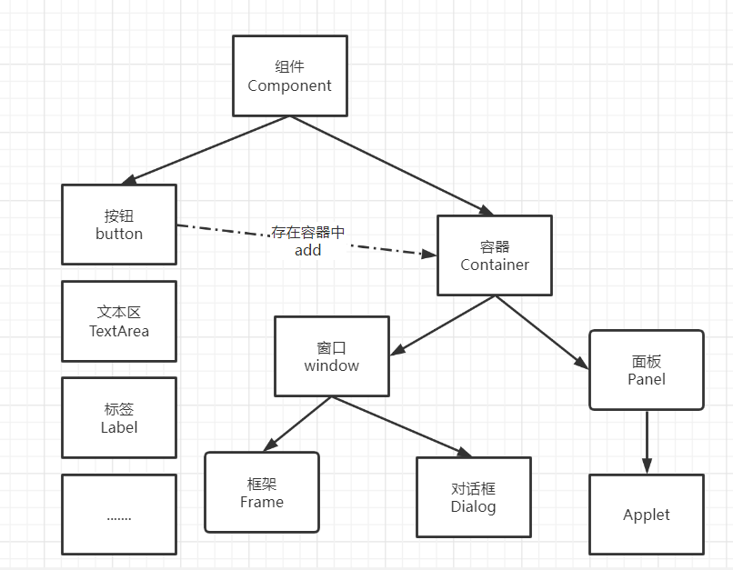
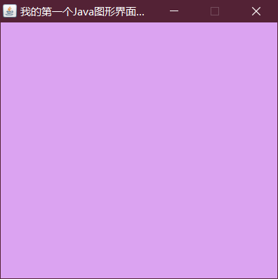
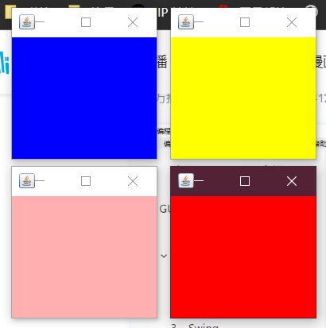
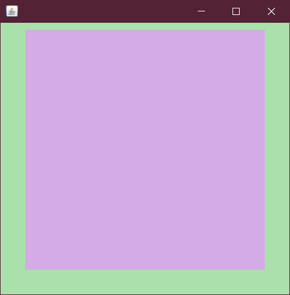
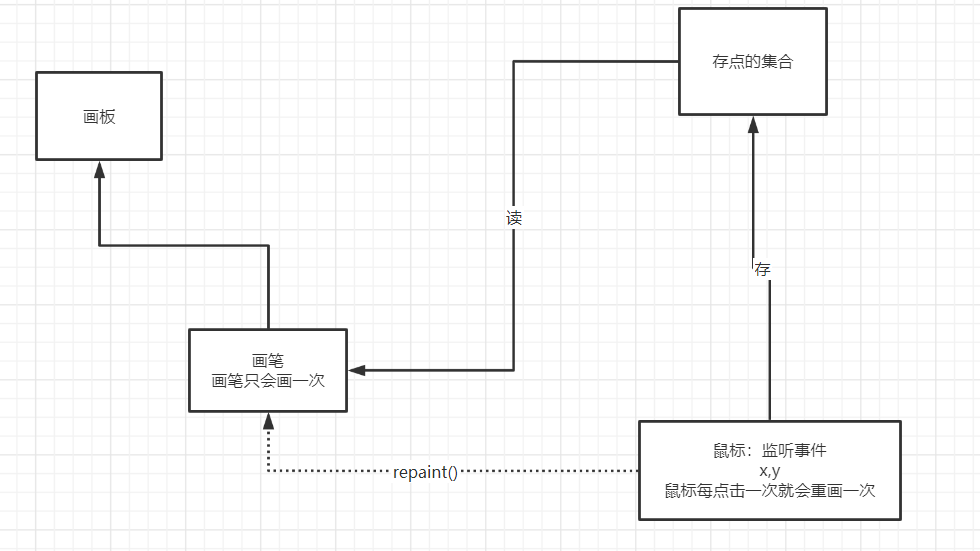

## GUI编程

告诉大家该怎么学？

- 这是什么？
- 它怎么玩？
- 该如何去在我们平时运用？


组件

- 窗口
- 弹窗
- 面板
- 文本框
- 列表框
- 按钮
- 图片
- 监听事件
- 鼠标
- 键盘事件
- 破解工具


### 1、简介

------

GUI的核心技术:Swing  AWT

1.因为界面不美观

2.需要jre环境

为什么我们要学习？

1.可以写出自己心中想要的一些小工具

2.工作时候，也可能要维护到swing界面，概率极小！

3.了解MVC架构，了解监听！


### 2、AWT

------


#### 2.1、Awt介绍

1.包含了很多类和接口！GUI：图形用户界面!

2.元素：窗口、按钮、文本框

3.Java.awt

#### 

##### 1、Frame

```java
package com.pengfei.gui;

import java.awt.*;

public class TestFrame {
    public static void main(String[] args) {

        //Frame,JDK,看源码！！！
       Frame frame = new Frame("我的第一个Java图形界面窗口");

       //需要设置可见性
        frame.setVisible(true);

        //设置窗口大小
        frame.setSize(400,400);

        //设置背景颜色 Color
        frame.setBackground(new Color(145, 227, 167));

        //弹出的初始位置
        frame.setLocation(200,200);

        //设置大小固定
        frame.setResizable(false);
    }
}

```





问题：发现窗口关闭不掉，停止Java程序！

尝试回顾封装：

```java
package com.pengfei.gui;

import java.awt.*;

public class testframe2 {
    public static void main(String[] args) {
        //展示多个窗口 new
        Myframe Myframe1= new Myframe(100,100,200,200,Color.blue);
        Myframe Myframe2= new Myframe(300,100,200,200,Color.yellow);
        Myframe Myframe3= new Myframe(100,300,200,200,Color.pink);
        Myframe Myframe4= new Myframe(300,300,200,200,Color.red);
    }
    static class Myframe extends Frame{
        static int id = 0; //可能存在多个窗口
        public Myframe(int x,int y,int w,int h,Color color){
            super("Myframe"+(++id));
            setBackground(color);
            setBounds(x,y,w,h);
            setVisible(true);
        }
    }
}

```




##### 2、面板Panel

解决了关闭问题

```java
package com.pengfei.gui;

import java.awt.*;
import java.awt.event.WindowAdapter;
import java.awt.event.WindowEvent;

//Panel 可以看成是一个空间，但是不能单独存在
public class testPanel {
    public static void main(String[] args) {
        Frame frame= new Frame();
        //布局的概念
         Panel panel = new Panel();

         //设置布局
        frame.setLayout(null);

        //坐标
        frame.setBounds(300,300,500,500);
        frame.setBackground(new Color(170, 224, 170));

        //panel设置坐标，相对于frame
        panel.setBounds(50,50,400,400);
        panel.setBackground(new Color(212, 171, 229));

        //frame.add(panel)
        frame.add(panel);

        frame.setVisible(true);

        //监听事件，监听窗口关闭事件 System。exit()
        //适配器模式
        frame.addWindowListener(new WindowAdapter() {

            //窗口关闭的时候需要做的事情
            @Override
            public void windowClosing(WindowEvent e) {
                //结束程序
                System.exit(0);
            }
        });
    }
}


```




#### 2.3、布局管理器

- 流式布局

```java
package com.pengfei.gui;

import java.awt.*;

public class testFlowlayout {
    public static void main(String[] args) {
        Frame frame = new Frame();

        //组件-按钮
       Button button1= new Button("button1");
       Button button2= new Button("button2");
       Button button3= new Button("button3");

       //frame.setLayout(new FlowLayout());
        //frame.setLayout(new FlowLayout(FlowLayout.LEFT));
        frame.setLayout(new FlowLayout(FlowLayout.RIGHT));

       frame.setSize(200,200);

       //把按钮添加上去
        frame.add(button1);
        frame.add(button2);
        frame.add(button3);

       frame.setVisible(true);
    }
}
```

- 东南西北中

```java
package com.pengfei.gui;

import java.awt.*;

public class testBorderLayout {
    public static void main(String[] args) {
        Frame frame = new Frame("testBorderLayout");

        Button east = new Button("East");
        Button west = new Button("West");
        Button south = new Button("South");
        Button north = new Button("North");
        Button center = new Button("Center");

        frame.add(east,BorderLayout.EAST);
        frame.add(west,BorderLayout.WEST);
        frame.add(south,BorderLayout.SOUTH);
        frame.add(north,BorderLayout.NORTH);
        frame.add(center,BorderLayout.CENTER);
        frame.setSize(300,300);
        frame.setVisible(true);
    }
}
```

- 表格布局

```java
package com.pengfei.gui;

import java.awt.*;

public class testGridLayout {
    public static void main(String[] args) {

        Frame frame = new Frame("testGridLayout");

        Button btn1 = new Button("btn1");
        Button btn2 = new Button("btn2");
        Button btn3 = new Button("btn3");
        Button btn4 = new Button("btn4");
        Button btn5 = new Button("btn5");
        Button btn6 = new Button("btn6");

        frame.setLayout(new GridLayout(3,2));

        frame.add(btn1);
        frame.add(btn2);
        frame.add(btn3);
        frame.add(btn4);
        frame.add(btn5);
        frame.add(btn6);

        frame.pack(); //Java函数！
        frame.setVisible(true);

    }
}
```


布局练习

通过不同布局的嵌套我们可以设计出我们想要的布局，下面是一个练习

```java
package com.pengfei.gui;

import java.awt.*;
import java.awt.event.WindowAdapter;
import java.awt.event.WindowEvent;

public class test {
    public static void main(String[] args) {
        Frame frame = new Frame();
        frame.setSize(400,300);
        frame.setLocation(300,400);
        frame.setBackground(Color.BLACK);
        frame.setVisible(true);
        frame.setLayout(new GridLayout(2,1));

        //4个面板
        Panel panel1 = new Panel(new BorderLayout());
        Panel panel2 = new Panel(new GridLayout(2,1));
        Panel panel3 = new Panel(new BorderLayout());
        Panel panel4 = new Panel(new GridLayout(2,1));

        //上面
        panel1.add(new Button("East-1"),BorderLayout.EAST);
        panel1.add(new Button("East-2"),BorderLayout.WEST);
        panel2.add(new Button("p2-btn-1"));
        panel2.add(new Button("p2-btn-2"));
        panel1.add(panel2,BorderLayout.CENTER);

        //下面
        panel3.add(new Button("East-1"),BorderLayout.EAST);
        panel3.add(new Button("East-2"),BorderLayout.WEST);
        //中间的四个
        for (int i = 0; i < 4; i++) {
            panel4.add(new Button("btn"+i));
        }
        panel3.add(panel4,BorderLayout.CENTER);

        frame.add(panel1);
        frame.add(panel3);

        frame.addWindowListener(new WindowAdapter() {
            @Override
            public void windowClosing(WindowEvent e) {
                System.exit(0);
            }
        });
    }
}

```


总结：

1. Frame是一个顶级窗口
2. Panel无法单独显示，必须添加到某个容器中。
3. 布局管理器
   1. 流式
   2. 东西南北中
   3. 表格
4. 大小，定位，背景颜色，可见性，监听


#### 2.4、事件监听

事件监听：当某个事情发生的时候，干什么？

```java
package com.pengfei.gui;

import java.awt.*;
import java.awt.event.ActionEvent;
import java.awt.event.ActionListener;
import java.awt.event.WindowAdapter;
import java.awt.event.WindowEvent;

public class 事件监听 {
    public static void main(String[] args) {
        //按下按钮，触发一些事件
        Button button = new Button();
        Frame frame = new Frame();
        //因为，addActionListener（）需要一个ActionListener，所以我们需要构造一个ActionListener
        MyActionListen myActionListen = new MyActionListen();
        button.addActionListener(myActionListen);
        
        frame.add(button,BorderLayout.CENTER);
        frame.pack();
        windowClose(frame);//关闭窗口
        frame.setVisible(true);


    }
    //关闭窗体的事件
    private static void windowClose(Frame frame){
        frame.addWindowListener(new WindowAdapter() {
            @Override
            public void windowClosing(WindowEvent e) {
                System.exit(0);
            }
        });
    }
}
//事件监听
class  MyActionListen implements ActionListener{
    @Override
    public void actionPerformed(ActionEvent e) {
        System.out.println("aaa");
    }
}

```


多个按钮，共享一个事件

```java
package com.pengfei.gui;

import java.awt.*;
import java.awt.event.ActionEvent;
import java.awt.event.ActionListener;
import java.awt.event.WindowAdapter;

public class eventListen {
    public static void main(String[] args) {
        //两个按钮，实现同一个监听
        //开始  停止
        Frame frame = new Frame("开始-停止");
        Button start = new Button("start");
        Button stop = new Button("stop");
        //可以显示的定义触发会返回的命令，如果不显示定义，则会走默认的值
        //可以多个按钮只写一个监听类
        stop.setActionCommand("stop");
        MyMonitor myMonitor = new MyMonitor();

        start.addActionListener(myMonitor);
        stop.addActionListener(myMonitor);

        frame.add(start,BorderLayout.SOUTH);
        frame.add(stop,BorderLayout.NORTH);

        frame.pack();
        frame.setVisible(true);


    }

}
class MyMonitor implements ActionListener{
    @Override
    public void actionPerformed(ActionEvent e) {
        //e.getActionCommand() 获得按钮的信息
        System.out.println("按钮被点击了:msg"+e.getActionCommand());
        if(e.getActionCommand().equals("start")){

        }
    }
}
```


#### 2.5、输入框TextField 监听

```java
package com.pengfei.gui;

import java.awt.*;
import java.awt.event.ActionEvent;
import java.awt.event.ActionListener;

public class 输入框 {
    public static void main(String[] args) {
        //启动！
        new MyFrame();
    }
}
class MyFrame extends Frame{
    public MyFrame(){
        TextField textField = new TextField();
        add(textField);

        //监听这个文本框输入的文字
        MyActionListena myActionListena = new MyActionListena();
        //按下enter  就会触发这个输入框的事件
        textField.addActionListener(myActionListena);

        //设置替换编码
        textField.setEchoChar('*');
        setVisible(true);
        pack();
    }
}
class MyActionListena implements ActionListener{
    @Override
    public void actionPerformed(ActionEvent e) {
       TextField field = (TextField) e.getSource();//获得一些资源，返回的一个对象
        System.out.println(field.getText());//获得输入框中的文本
        field.setText("");//null ""
    }
}
```


#### 2.6、简易计算器，组合+内部类回顾复习！

oop原则：组合，大于继承！

------

目前代码：

```java
package com.pengfei.gui;

import java.awt.*;
import java.awt.event.ActionEvent;
import java.awt.event.ActionListener;

//简易计算器
public class testCalc {
    public static void main(String[] args) {
        new Calculator();
    }
}
//计算器类
class Calculator extends Frame {
    public Calculator(){
        //3个文本框
        TextField num1 = new TextField(10);//字符数
        TextField num2 = new TextField(10);//字符数
        TextField num3 = new TextField(20);//字符数

        //一个按钮
        Button button = new Button("=");

        button.addActionListener(new MyCalculatorListener(num1,num2,num3));
        //一个标签
        Label label =new Label("+");

        //布局
        setLayout(new FlowLayout());

        add(num1);
        add(label);
        add(num2);
        add(button);
        add(num3);

        pack();
        setVisible(true);
    }
}
//监听器类
class MyCalculatorListener implements ActionListener{
    //获取三个变量
    private TextField num1,num2,num3;
    public MyCalculatorListener(TextField num1,TextField num2,TextField num3){
        this.num1 = num1;
        this.num2 = num2;
        this.num3 = num3;
    }
    @Override
    public void actionPerformed(ActionEvent e) {
        //1.获得加数和被加数
        int n1 = Integer.parseInt(num1.getText());
        int n2 = Integer.parseInt(num2.getText());

        //2.将这个值 + 法运算后，放到第三个框
        num3.setText(""+(n1+n2));
        //3.清楚前两个框
        num1.setText("");
        num2.setText("");
    }
}
```


完全改造为面向对象写法

```java
package com.pengfei.gui;

import java.awt.*;
import java.awt.event.ActionEvent;
import java.awt.event.ActionListener;

//简易计算器
public class testCalc {
    public static void main(String[] args) {
        new Calculator().loadFrame();
    }
}
//计算器类
class Calculator extends Frame {
    //属性
    TextField num1,num2,num3;
    //方法
    public  void loadFrame() {

        //3个文本框
         num1 = new TextField(10);//字符数
         num2 = new TextField(10);//字符数
         num3 = new TextField(20);//字符数
        //一个按钮
        Button button = new Button("=");
        button.addActionListener(new MyCalculatorListener(this));
        //一个标签
        Label label = new Label("+");
        //布局
        setLayout(new FlowLayout());
        add(num1);
        add(label);
        add(num2);
        add(button);
        add(num3);
        pack();
        setVisible(true);
    }
}
//监听器类
class MyCalculatorListener implements ActionListener{
    //获取计算器这个对象,在一个类中组合另外一个类
    Calculator calculator = null;
    public MyCalculatorListener(Calculator calculator){
        this.calculator=calculator;
    }
    @Override
    public void actionPerformed(ActionEvent e) {
        //1.获得加数和被加数
        //2.将这个值 + 法运算后，放到第三个框
        //3.清楚前两个框
        int n1 = Integer.parseInt(calculator.num1.getText());
        int n2 = Integer.parseInt(calculator.num2.getText());

        calculator.num3.setText(""+(n1+n2));
        calculator.num1.setText("");
        calculator.num2.setText("");

    }
}
```


内部类：

- 更好的包装

```java
package com.pengfei.gui;

import java.awt.*;
import java.awt.event.ActionEvent;
import java.awt.event.ActionListener;

//简易计算器
public class testCalc {
    public static void main(String[] args) {
        new Calculator().loadFrame();
    }
}
//计算器类
class Calculator extends Frame {
    //属性
    TextField num1,num2,num3;
    //方法
    public  void loadFrame() {

        //3个文本框
         num1 = new TextField(10);//字符数
         num2 = new TextField(10);//字符数
         num3 = new TextField(20);//字符数
        //一个按钮
        Button button = new Button("=");
        button.addActionListener(new MyCalculatorListener());
        //一个标签
        Label label = new Label("+");
        //布局
        setLayout(new FlowLayout());
        add(num1);
        add(label);
        add(num2);
        add(button);
        add(num3);
        pack();
        setVisible(true);
    }
    //监听器类
    //内部类最大的好处，就是可以畅通无阻的访问外部的属性和方法
    private class MyCalculatorListener implements ActionListener{
        @Override
        public void actionPerformed(ActionEvent e) {
            //1.获得加数和被加数
            //2.将这个值 + 法运算后，放到第三个框
            //3.清楚前两个框
            int n1 = Integer.parseInt(num1.getText());
            int n2 = Integer.parseInt(num2.getText());

            num3.setText(""+(n1+n2));
            num1.setText("");
            num2.setText("");
        }
    }
}
```


#### 2.7、画笔

```java
package com.pengfei.gui;

import java.awt.*;

public class testpaint {
    public static void main(String[] args) {
        new MyPaint().loadFrame();
    }
}
class MyPaint extends Frame{

    public void loadFrame(){
        setBounds(200,200,600,500);
        setVisible(true);
    }
    //画笔
    @Override
    public void paint(Graphics g) {
        //画笔，需要有颜色，画笔可以画画
        //g.setColor(Color.red);
        //g.drawOval(100,100,100,100);
        g.fillOval(100,100,100,100);//实心圆

        //g.setColor(Color.green);
        g.fillRect(150,200,200,200);

        //养成习惯，画笔用完，将他还原到最初的颜色
    }
}

```


#### 2.8、鼠标监听

目的：想要实现鼠标画画！

```java
package com.pengfei.gui;

import java.awt.*;
import java.awt.event.MouseAdapter;
import java.awt.event.MouseEvent;
import java.util.ArrayList;
import java.util.Iterator;

//鼠标监听事件
public class testmouselistener {
    public static void main(String[] args) {
        new MyFrame1("画图");
    }
}
//自己的类
class MyFrame1 extends Frame{
    //画画需要画笔，需要监听鼠标当前的位置，需要集合来储存这个点
    ArrayList points;
    public MyFrame1(String title){
        super(title);
        setBounds(200,200,400,300);
        //存鼠标点击的点
       points = new ArrayList<>();
        //鼠标监听器，正对这个窗口
        this.addMouseListener(new mymouselintener());

        setVisible(true);
    }

    @Override
    public void paint(Graphics g) {
        //画画，监听鼠标的事件
        Iterator iterator = points.iterator();
        while (iterator.hasNext()){
            Point point = (Point) iterator.next();
            g.setColor(Color.red);
            g.fillOval(point.x,point.y,10,10);
        }
    }
    //添加一个点到界面上
    public void addPaint(Point point){
        points.add(point);
    }
    //适配器模式
    private class mymouselintener extends MouseAdapter{
        //鼠标  安下，弹起，按住不放


        @Override
        public void mousePressed(MouseEvent e) {
            MyFrame1 myframe1 = (MyFrame1) e.getSource();
            //这里我们点击的时候，就会在界面上产生一个点
            //这个点就是鼠标的点：

            myframe1.addPaint(new Point(e.getX(),e.getY()));
            //每次点击鼠标都需要重新画一遍
            myframe1.repaint();//刷新
        }
    }
}
```



#### 2.9、窗口监听

```java
package com.pengfei.gui;

import java.awt.*;
import java.awt.event.WindowAdapter;
import java.awt.event.WindowEvent;

public class testWindow {
    public static void main(String[] args) {
        new WindowFrame();
    }
}
class WindowFrame extends Frame{
    public WindowFrame(){
        setBackground(Color.red);
        setBounds(100,100,200,200);
        setVisible(true);
//        addWindowListener(new MyWindowListenter());
        this.addWindowListener(
                new WindowAdapter() {
                    //匿名内部类
                    //关闭窗口
                    @Override
                    public void windowClosing(WindowEvent e) {
                        System.out.println("windowClosing");
                        System.exit(0);
                    }

                    //激活窗口
                    @Override
                    public void windowActivated(WindowEvent e) {
                       WindowFrame source = (WindowFrame) e.getSource();
                       source.setTitle("被激活了");
                       System.out.println("windowActivated");
                    }

                }
        );
    }
}
```


#### 2.10、键盘监听

```java
package com.pengfei.gui;

import java.awt.*;
import java.awt.event.KeyAdapter;
import java.awt.event.KeyEvent;

//键
public class testKeyListener {
    public static void main(String[] args) {
        new KeyFrame();
    }
}
class KeyFrame extends Frame{
    public KeyFrame(){
        setBounds(1,2,300,400);
        setVisible(true);

        this.addKeyListener(new KeyAdapter() {
            //键盘按下
            @Override
            public void keyPressed(KeyEvent e) {
                //获得键盘按下的键是哪一个,当前的码
               int Keycode =  e.getKeyCode();
                System.out.println(Keycode); //不需要去记录这个值，直接使用它的属性 VK_XXX
               if (Keycode == KeyEvent.VK_UP){
                   System.out.println("你按下了上键");
               }
               //根据按下的不同操作,产生不同的结果
            }
        });
    }
}
```


### 3、Swing

------

#### 3.1、窗口、面板

```java
package com.pengfei.gui;

import javax.swing.*;
import java.awt.*;

public class JFrameDemo {
    //init(); 初始化
    public void init(){
        //顶级窗口
        JFrame jframe = new JFrame("这是一个Jframe窗口");
        jframe.setVisible(true);
        jframe.setBounds(100,100,200,200);
        jframe.setBackground(Color.green);
        //设置文字Jlable

        JLabel label = new JLabel("欢迎来到");

        jframe.add(label);


        //关闭事件
        jframe.setDefaultCloseOperation(WindowConstants.EXIT_ON_CLOSE);
    }
    public static void main(String[] args) {
        //建立一个窗口
        new JFrameDemo().init();
    }
}
```


标签居中

```java
package com.pengfei.gui;

import javax.swing.*;
import java.awt.*;

public class JFrameDemo1 {
    public static void main(String[] args) {
        new MyJFrameDemo2().init();
    }
}
class MyJFrameDemo2 extends JFrame{
    public  void init(){
        this.setVisible(true);
        this.setBounds(10,10,200,300);
        JLabel label = new JLabel("欢迎来到");
        this.add(label);

        //让文本标签居中  设置水平对齐
        label.setHorizontalAlignment(SwingConstants.CENTER);

        //获得一个容器
        Container container = this.getContentPane();
        container.setBackground(Color.blue);


    }
}
```


#### 3.2、弹窗

JDialog,用来被弹出，默认就有关闭事件!

```java
package com.pengfei.gui;

import javax.swing.*;
import java.awt.*;
import java.awt.event.ActionEvent;
import java.awt.event.ActionListener;

//主窗口
public class DialogDemo extends JFrame {
    public DialogDemo(){
        this.setVisible(true);
        this.setSize(700,700);
        this.setDefaultCloseOperation(WindowConstants.EXIT_ON_CLOSE);

        //JFrame 放东西 容器
        Container container = this.getContentPane();
        //绝对布局
        container.setLayout(null);

        //按钮
        JButton jButton = new JButton("点击弹出一个对话框");
        jButton.setBounds(30,30,200,50);

        //点击这个按钮的时候，弹出一个弹窗
        jButton.addActionListener(new ActionListener() {
            //监听器
            @Override
            public void actionPerformed(ActionEvent e) {
                //弹窗
                new MyDialogDemo();
            }
        });
        container.add(jButton);
    }
    public static void main(String[] args) {
        new DialogDemo();
    }
}
//弹窗窗口
class MyDialogDemo extends  JDialog{
    public MyDialogDemo(){
        this.setVisible(true);
        this.setBounds(100,100,500,500);
//        this.setDefaultCloseOperation(WindowConstants.EXIT_ON_CLOSE);

        Container container = this.getContentPane();
        container.add(new Label("学javaGUI"));
    }
}
```


#### 3.3、标签

Label

```java
Label label = new Label("xxx");
JLabel jlabel = new JLabel("xxx");
```

图标 icon

```java
package com.pengfei.gui;

//图标，需要实现类，Frame继承

import javax.swing.*;
import java.awt.*;

public class icon extends JFrame implements Icon {
    private int width;
    private int height;


    public icon(){}//无参

    public icon(int height,int width){
        this.width=width;
        this.height=height;
    }
    public void init(){
        icon ic = new icon(15,15);
        //图标放在标签，也可以放在按钮上
        JLabel jLabel = new JLabel("icontest",ic,SwingConstants.CENTER);
        Container container = getContentPane();
        container.add(jLabel);

        this.setVisible(true);
        this.setDefaultCloseOperation(WindowConstants.EXIT_ON_CLOSE);

    }
    public static void main(String[] args) {
        new icon().init();
    }

    @Override
    public void paintIcon(Component c, Graphics g, int x, int y) {
        g.fillOval(x,y,width,height);
    }

    @Override
    public int getIconWidth() {
        return this.width;
    }

    @Override
    public int getIconHeight() {
        return this.height;
    }
}

```

图片Icon

```java
package icon;

import javax.swing.*;
import java.awt.*;
import java.net.URL;

public class ImageIconDemo extends JFrame {
    public ImageIconDemo(){
        //获取图片地址
        JLabel label = new JLabel("image");
       URL url = ImageIconDemo.class.getResource("222.jpg");

       ImageIcon icons = new ImageIcon(url);
       label.setIcon(icons);
       label.setHorizontalAlignment(SwingConstants.CENTER);

        Container container = getContentPane();
        container.add(label);

        setVisible(true);
        setDefaultCloseOperation(WindowConstants.EXIT_ON_CLOSE);
        setBounds(100,100,500,500);
    }

    public static void main(String[] args) {
        new ImageIconDemo();
    }
}

```

#### 3.4、面板

JPanel

```java
package com.pengfei.gui;

import javax.swing.*;
import java.awt.*;

public class JPanelDemo extends JFrame {
    public JPanelDemo(){
        Container container = getContentPane();

        container.setLayout(new GridLayout(2,1,10,10));//后面参数的意思，间距

        JPanel jPanel = new JPanel(new GridLayout(1,3));
        JPanel jPanel2 = new JPanel(new GridLayout(1,2));
        JPanel jPanel3 = new JPanel(new GridLayout(2,1));
        JPanel jPanel4 = new JPanel(new GridLayout(3,2));

        jPanel.add(new JButton("1"));
        jPanel.add(new JButton("1"));
        jPanel.add(new JButton("1"));
        jPanel2.add(new JButton("2"));
        jPanel2.add(new JButton("2"));
        jPanel3.add(new JButton("3"));
        jPanel3.add(new JButton("3"));
        jPanel4.add(new JButton("4"));
        jPanel4.add(new JButton("4"));
        jPanel4.add(new JButton("4"));
        jPanel4.add(new JButton("4"));
        jPanel4.add(new JButton("4"));
        jPanel4.add(new JButton("4"));

        container.add(jPanel);
        container.add(jPanel2);
        container.add(jPanel3);
        container.add(jPanel4);

        this.setVisible(true);
        this.setSize(500,500);
        this.setDefaultCloseOperation(WindowConstants.EXIT_ON_CLOSE);
    }

    public static void main(String[] args) {
        new JPanelDemo();
    }
}

```


JScrollPanel

```java
package com.pengfei.gui;

import javax.swing.*;
import java.awt.*;

public class JScrollDemo extends JFrame {
    public JScrollDemo(){
        Container container = this.getContentPane();

        //文本域
       JTextArea textArea = new JTextArea(20,50);
       textArea.setText("欢迎学习");

       //Scroll面板
        JScrollPane scrollPane = new JScrollPane(textArea);
       container.add(scrollPane);

        this.setVisible(true);
        this.setDefaultCloseOperation(WindowConstants.EXIT_ON_CLOSE);
        this.setBounds(100,100,300,150);


    }

    public static void main(String[] args) {
        new JScrollDemo();
    }
}

```


#### 3.5、按钮

图片按钮

```java
package Button;

import javax.swing.*;
import java.awt.*;
import java.net.URL;

public class JButtonDemo extends JFrame {
    public JButtonDemo() throws HeadlessException {
        Container container = this.getContentPane();
        //将一个图片变成图标
        URL url = JButtonDemo.class.getResource("222.jpg");
        Icon icon = new ImageIcon(url);
        //将图片放在按钮上
        JButton button = new JButton();
        button.setIcon(icon);
        button.setToolTipText("图片按钮");

        container.add(button);

        this.setSize(500,300);
        this.setVisible(true);
        this.setDefaultCloseOperation(WindowConstants.EXIT_ON_CLOSE);

    }

    public static void main(String[] args) {
        new JButtonDemo();
    }
}
```


- 单选按钮

  ```java
  package Button;
  
  import javax.swing.*;
  import java.awt.*;
  
  
  public class ButtonDemo02 extends JFrame{
      public ButtonDemo02(){
          Container container = this.getContentPane();
  
          //单选框
          JRadioButton radioButton1 = new JRadioButton("radio1");
          JRadioButton radioButton2 = new JRadioButton("radio2");
          JRadioButton radioButton3 = new JRadioButton("radio3");
  
          //由于单选框只能选择一个，分组,一个组中只能选一个
  
          ButtonGroup group= new ButtonGroup();
  
          group.add(radioButton1);
          group.add(radioButton2);
          group.add(radioButton3);
  
          container.add(radioButton1,BorderLayout.CENTER);
          container.add(radioButton2,BorderLayout.NORTH);
          container.add(radioButton3,BorderLayout.SOUTH);
  
          this.setVisible(true);
          this.setDefaultCloseOperation(WindowConstants.EXIT_ON_CLOSE);
          this.setSize(500,300);
      }
  
      public static void main(String[] args) {
          new ButtonDemo02();
      }
  }
  
  ```

  

- 复选按钮

```java
package Button;

import javax.swing.*;
import java.awt.*;


public class ButtonDemo3 extends JFrame{
    public ButtonDemo3(){
        Container container = this.getContentPane();

        //多选框
        JCheckBox checkBox1 = new JCheckBox("checkBox1");
        JCheckBox checkBox2 = new JCheckBox("checkBox2");
        container.add(checkBox1,BorderLayout.NORTH);
        container.add(checkBox2,BorderLayout.SOUTH);
        

        this.setVisible(true);
        this.setDefaultCloseOperation(WindowConstants.EXIT_ON_CLOSE);
        this.setSize(500,300);
    }

    public static void main(String[] args) {
        new ButtonDemo3();
    }
}

```


#### 3.6、列表

- 下拉框

  ```java
  package 列表;
  
  import javax.swing.*;
  import java.awt.*;
  
  public class TextComboboxDemo extends JFrame {
      public TextComboboxDemo(){
          Container container = this.getContentPane();
  
          JComboBox status = new JComboBox();
  
          status.addItem(null);
          status.addItem("你好啊");
          status.addItem("哈哈哈");
          status.addItem("DVA");
  
          container.add(status);
  
  
  
          this.setVisible(true);
          this.setDefaultCloseOperation(WindowConstants.EXIT_ON_CLOSE);
          this.setSize(500,500);
      }
  
      public static void main(String[] args) {
          new TextComboboxDemo();
      }
  }
  
  ```

  

- 列表框

  ```java
  package 列表;
  
  import javax.swing.*;
  import java.awt.*;
  import java.util.Vector;
  
  public class TextComboboxDemo1 extends JFrame{
      public TextComboboxDemo1(){
          Container container = this.getContentPane();
  
         //生成列表的内容
  //        String[] contents = {"1","2","3"};
  
          Vector contents = new Vector();
          //列表中需要放入内容
          JList jList = new JList(contents);
          contents.add("张三");
          contents.add("lis");
          contents.add("wangwu");
          
          container.add(jList);
  
  
          this.setVisible(true);
          this.setDefaultCloseOperation(WindowConstants.EXIT_ON_CLOSE);
          this.setSize(500,500);
      }
  
      public static void main(String[] args) {
          new TextComboboxDemo1();
      }
  }
  
  
  
  ```

- 应用场景

  - 选择地区，或者一些单个选项
  - 列表，展示信息，一般是动态扩容！

#### 3.7、文本框

- 文本框

```java
package 文本框;

import javax.swing.*;
import java.awt.*;

public class TestTextDemo01 extends JFrame {
    public TestTextDemo01(){
        Container container = this.getContentPane();

        JTextField textField = new JTextField("hello");
        JTextField textField2 = new JTextField("world",20);

        container.add(textField,BorderLayout.SOUTH);
        container.add(textField2,BorderLayout.NORTH);

        this.setVisible(true);
        this.setDefaultCloseOperation(WindowConstants.EXIT_ON_CLOSE);
        this.setSize(500,500);
    }
    public static void main(String[] args) {
        new TestTextDemo01();
    }
}

```


- 密码框

```java
package 文本框;

import javax.swing.*;
import java.awt.*;

public class TestTextDemo02 extends JFrame {
    public TestTextDemo02(){
        Container container = this.getContentPane();
        
        //面板

        JPasswordField passwordField = new JPasswordField();
        passwordField.setEchoChar('*');

        container.add(passwordField);

        this.setVisible(true);
        this.setDefaultCloseOperation(WindowConstants.EXIT_ON_CLOSE);
        this.setSize(500,500);
    }
    public static void main(String[] args) {
        new TestTextDemo02();
    }
}

```


- 文本域

```java
package com.pengfei.gui;

import javax.swing.*;
import java.awt.*;

public class JScrollDemo extends JFrame {
    public JScrollDemo(){
        Container container = this.getContentPane();

        //文本域
       JTextArea textArea = new JTextArea(20,50);
       textArea.setText("欢迎学习");

       //Scroll面板
        JScrollPane scrollPane = new JScrollPane(textArea);
       container.add(scrollPane);

        this.setVisible(true);
        this.setDefaultCloseOperation(WindowConstants.EXIT_ON_CLOSE);
        this.setBounds(100,100,300,150);


    }

    public static void main(String[] args) {
        new JScrollDemo();
    }
}

```


### 贪吃蛇

帧，如果时间片足够小，就是动画，一秒30帧  60帧。连起来是动画，拆开就是静态的图片！

键盘监听

定时器 Tmer

------

1. 定义数据

2. 画上去

3. 监听事件

   键盘

   事件

**StartGame.java**

```java
package snake;

import javax.swing.*;

public class StartGame {
    public static void main(String[] args) {
        JFrame frame = new JFrame();


        frame.setBounds(10,10,900,720);
        frame.setResizable(false); //窗口大小不可变
        frame.setDefaultCloseOperation(WindowConstants.EXIT_ON_CLOSE);
        frame.add(new GamePanel());
        frame.setVisible(true);
        //正常的游戏界面也应该在面板上
    }
}
```


**GamePanel.java**

```java
package snake;

import javax.swing.*;
import java.awt.*;
import java.awt.event.ActionEvent;
import java.awt.event.ActionListener;
import java.awt.event.KeyEvent;
import java.awt.event.KeyListener;
import java.util.Random;

//游戏的面板
public class GamePanel extends JPanel implements KeyListener, ActionListener {
    //定义蛇的数据结构
    int length;//蛇的长度
    int[] snakeX = new int[600];//蛇的X坐标 25x25
    int[] snakeY = new int[500];//蛇的Y坐标 25x25
    String fx; //初始方向向右
    //游戏当前的状态：开始，停止
    boolean isStart = false;//默认是不开始
    boolean isFail = false; //游戏失败状态
    //食物的坐标
    int foodx;
    int foody;
    Random random = new Random();
    int score;//成绩

    //定时器 以毫秒为单位 1000ms = 1s
    Timer timer = new Timer(100,this);//100毫秒执行一次

    //构造器
    public GamePanel(){
        init();
        //获得焦点和键盘事件
        this.setFocusable(true);//获得焦点事件
        this.addKeyListener(this); //获得键盘监听事件
        timer.start();//游戏一开始定时器就启动
    }
    //初始化方法
    public void init(){
        length = 3;
        snakeX[0] = 100;snakeY[0] = 100;//脑袋的坐标
        snakeX[1] = 75;snakeY[1] = 100;//第一个身体的坐标
        snakeX[2] = 50;snakeY[2] = 100; //第二个身体的坐标
        fx="R";//初始方向向右
        //把食物随机分布在界面上
        foodx = 25 + 25*random.nextInt(34);
        foody = 75 + 25*random.nextInt(24);
        score = 0;
    }
    //绘制画板，我们游戏中的所有东西，都使用这个画笔
    @Override
    protected void paintComponent(Graphics g) {
        super.paintComponent(g);//清屏
        //绘制静态面板
        this.setBackground(Color.WHITE);
        Data.header.paintIcon(this,g,25,11);//头部广告栏画上去
        g.fillRect(25,75,850,600);//默认的游戏页面

        //画积分
        g.setColor(Color.WHITE);
        g.setFont(new Font("微软雅黑",Font.BOLD,18)); //设置字体
        g.drawString("长度"+length,750,35);
        g.drawString("分数"+score,750,50);

        Data.food.paintIcon(this,g,foodx,foody); //画食物
        //把小蛇放上去
        if (fx.equals("R")){
            Data.right.paintIcon(this,g,snakeX[0],snakeY[0]);//蛇头初始化向右 需要通过方向来判断
        } else if(fx.equals("L")){
            Data.left.paintIcon(this,g,snakeX[0],snakeY[0]);//蛇头初始化向左 需要通过方向来判断
        } else if(fx.equals("U")){
            Data.up.paintIcon(this,g,snakeX[0],snakeY[0]);//蛇头初始化向上 需要通过方向来判断
        } else if(fx.equals("D")){
            Data.down.paintIcon(this,g,snakeX[0],snakeY[0]);//蛇头初始化向下 需要通过方向来判断
        }

        for (int i = 1; i < length; i++) {
            Data.body.paintIcon(this,g,snakeX[i],snakeY[i]);
        }

        //游戏状态
        if (!isStart){
            g.setColor(Color.WHITE);
            g.setFont(new Font("微软雅黑",Font.BOLD,40)); //设置字体
            g.drawString("按下空格开始游戏",300,300);
        }
        if (isFail){
            g.setColor(Color.red);
            g.setFont(new Font("微软雅黑",Font.BOLD,40)); //设置字体
            g.drawString("Game Over!",300,300);
        }
    }

    //键盘监听事件
    //键盘监听器
    @Override
    public void keyPressed(KeyEvent e) {
        int KeyCode = e.getKeyCode();//获得键盘按键是哪一个

        if(KeyCode == KeyEvent.VK_SPACE){
            //如果按下的是空格
            if (isFail){
                //重新开始
                isFail = false;
                init();
            }else {
                isStart = !isStart;
            }
            repaint();
        }
        //小蛇移动
        if (KeyCode == KeyEvent.VK_UP){
            fx = "U";
        }else if(KeyCode == KeyEvent.VK_DOWN){
            fx = "D";
        }else if(KeyCode == KeyEvent.VK_LEFT){
            fx = "L";
        }else if(KeyCode == KeyEvent.VK_RIGHT){
            fx = "R";
        }

    }
    //事件监听--需要通过固定事件来刷新 1s=十次
    @Override
    public void actionPerformed(ActionEvent e) {
        if(isStart && isFail == false){
            //如果游戏是开始状态，就让小蛇动起来

            //吃食物
            if (snakeX[0] == foodx && snakeY[0] == foody){
                length++; //长度加一
                score = score +10; //分数加10
                //再次随机获得食物
                foodx = 25 + 25*random.nextInt(34);
                foody = 75 + 25*random.nextInt(24);
            }

            //移动
            for (int i = length-1; i >0 ; i--) {
                snakeX[i] = snakeX[i-1];//后一节，移动到前一节位置
                snakeY[i] = snakeY[i-1];
            }
            //走向
            if (fx.equals("R")){
                snakeX[0] =snakeX[0]+25;
                if(snakeX[0]>850){snakeX[0] = 25;} //边界判断
            }else if(fx.equals("L")){
                snakeX[0] =snakeX[0]-25;
                if(snakeX[0]<25){snakeX[0] = 850;} //边界判断
            }else if(fx.equals("U")){
                snakeY[0] =snakeY[0]-25;
                if(snakeY[0]<75){snakeY[0] = 650;} //边界判断
            }else if(fx.equals("D")){
                snakeY[0] =snakeY[0]+25;
                if(snakeY[0]>650){snakeY[0] = 75;} //边界判断
            }

            //失败判定，撞到自己就算失败
            for (int i = 1; i < length; i++) {
                if(snakeX[0] == snakeX[i] &&snakeY[0] == snakeY[i]){
                    isFail = true;
                }
            }


            repaint();//重画页面
        }
        timer.start();//定时器开始
    }
    @Override
    public void keyTyped(KeyEvent e) {
    }
    @Override
    public void keyReleased(KeyEvent e) {
    }
}
```


**Data.java**

```java
package snake;

import javax.swing.*;
import java.net.URL;

//数据中心
public class Data {
    //相对路径 tx.jpg
    //绝对路径 /  相当于当前项目
    public  static URL headerURL = Data.class.getResource("statsic/header.png");
    public static ImageIcon header = new ImageIcon(headerURL);

    public  static URL upURL = Data.class.getResource("statsic/up.png");
    public  static URL downURL = Data.class.getResource("statsic/down.png");
    public  static URL leftURL = Data.class.getResource("statsic/left.png");
    public  static URL rightURL = Data.class.getResource("statsic/right.png");
    public static ImageIcon up = new ImageIcon(upURL);
    public static ImageIcon down = new ImageIcon(downURL);
    public static ImageIcon left = new ImageIcon(leftURL);
    public static ImageIcon right = new ImageIcon(rightURL);

    public  static URL bodyURL = Data.class.getResource("statsic/body.png");
    public static ImageIcon body = new ImageIcon(bodyURL);

    public  static URL foodURL = Data.class.getResource("statsic/food.png");
    public static ImageIcon food = new ImageIcon(foodURL);
}
```

