### JavaWeb

------


### 1、基本概念

#### 1.1、前言

web开发：

- web，网页的意思，www.baidu.com
- 静态web
  - html,css
  - 提供给所有人看的数据始终不会发生变化！
- 动态web
  - 淘宝，几乎是所有的网站；
  - 提供给所有人看的数据始终会发生变化，每个人在不同的时间，不同的地点看到的信息各不相同
  - 技术栈：Servlet、JSP，ASP,PHP

在Java中，动态web资源开发的技术统称为javaWeb;

#### 1.2、web应用程序

web应用程序：可以提供浏览器访问的程序；

- a.html、b.html....多个web资源，这些web资源可以被外部访问，对外界提供服务；
- 你们能访问到的任何一个页面或者资源，都存在于这个世界的某一个角落的计算机上。
- URL
- 这个统一的web资源会被放在同一个文件夹下，web应用程序-->Tomcat：服务器
- 一个web应用由多个部分组成（静态web,动态web）
  - html,css,js
  - jsp,servlet
  - java程序
  - jar包
  - 配置文件（Properties）

web应用程序编写完毕后，若想提供给外界访问：需要一个服务器来统一管理；

#### 1.3、静态web

- *.htm, *.html,这些都是网页的后缀，如果服务器上一直存在这些东西，我们就可以直接进行读取。通络；

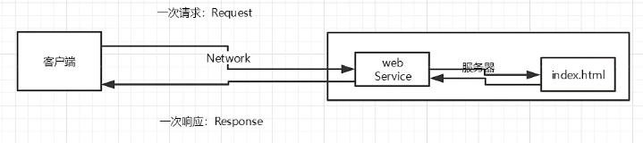

- 静态web存在的缺点
  - web页面无法动态更新，所有用户看到的都是同一个页面
    - 轮播图，点击特效：伪动态
    - JavaScript[实际开发中，它用的最多]
    - VBScript
  - 它无法和数据库交互（数据无法持久化，用户无法交互）

#### 1.4、动态web

页面会动态展示：“web的页面展示的效果因人而异”；

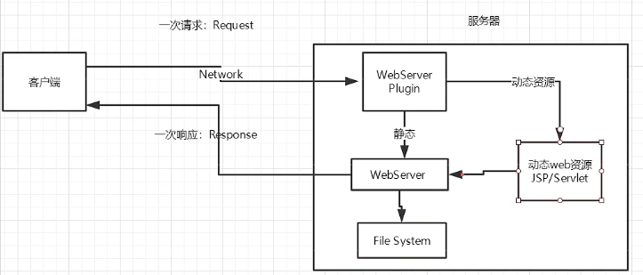

缺点

- 假如服务器的动态web资源出现了错误，我们需要重新编写新的后台程序，重新发布；
  - 停机维护

优点：

- web页面可以动态更新，所有用户看到的都不是同一个页面
- 它可以和数据库交互（数据持久化：注册，商品信息，用户信息......）

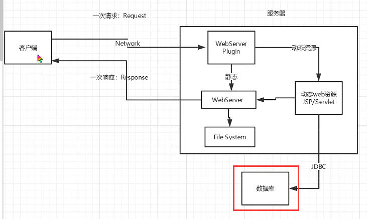


（分析原理，看源码）


### 2、web服务器

#### 2.1、技术讲解

**ASP:**

- 微软：国内最早流行的就是ASP
- 在HTML中嵌入了VB的脚本，ASP+COM;
- 在ASP开发中，基本一个页面都有几千行的业务代码，页面极其混乱
- 维护成本高！
- C#
- IIS服务器


**PHP：**

- php开发速度很快，功能强大，跨平台，代码很简单（70%，WP）
- 无法承载大访问量的情况（局限性）


**JSP/Servlet:**

B/S：浏览器和服务器

C/S:客户端和服务端

- sun公司主推的B/S架构
- 基于java语言的（所有的大公司，或者一些开源的组件，都是用Java写的）
- 可以承载三高(高并发，高可用，高性能)问题带来的影响；
- 语法向ASP,ASP-->JSP,加强市场强度；

.....


#### 2.2、web服务器

服务器是一种被动的操作，用来处理用户的一些请求和给用户的一些响应信息


**IIS**

微软的：ASP...,Windows中自带的

**Tomcat**

面向百度编程；

​	Tomcat是Apache软件基金会（Apache Software Foundation）的Jakarta项目中的一个核心项目，最新的Servlet和ISP规范总是能在Tomcat中得到体现，因为Tomcat技术先进、性能稳定，而且免费，因而深受Java 爱好者的喜爱并得到了部分软件开发商的认可，成为目前比较流行的Web 应用服务器。

​	Tomcat 服务器是一个免费的开放源代码的Web 应用服务器，属于轻量级应用服务器，在中小型系统和并发访问用户不是很多的场合下被普遍使用，是开发和调试ISP 程序的首选。对于一个Java初学web的人来说，它是最佳的选择

​	Tomcat 实际上运行ISP 页面和Servlet。Tomcat最新版本为9.0。

......

**工作3-5年之后，可以尝试手写Tomcat服务器；**

下载tomcat:

1. 安装 or 解压
2. 了解配置文件及目录结构
3. 这个东西的作用


### 3、Tomcat

#### 3.1、安装tomcat

tomcat官网：https://tomcat.apache.org/

#### 3.2、Tomcat启动和配置

文件夹作用：

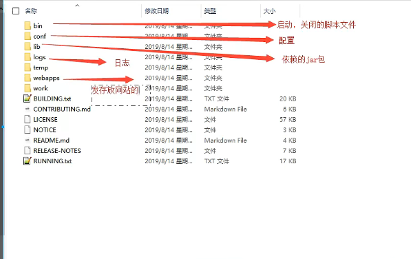

启动、关闭Tomcat

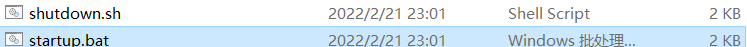

访问测试：http://localhost:8080/

可能遇到的问题：

1. java环境变量没有配置
2. 闪退问题：需要配置兼容性
3. 乱码问题：配置文件中设置

#### 3.3、配置

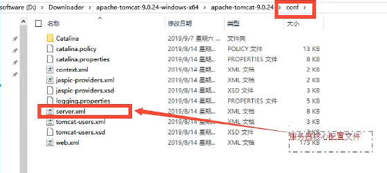


可以配置启动的端口号

- tomcat的默认端口：8080
- MySQL的默认端口：3306
- http的默认端口：80
- https的默认端口:443

```jsp
 <Connector port="8080" protocol="HTTP/1.1"
               connectionTimeout="20000"
               redirectPort="8443" />
```

可以配置主机的名称

- 默认的主机名为：localhost-->127.0.0.1
- 默认网站应用存放的位置为：webapps

```jsp
<Host name="localhost"  appBase="webapps"
            unpackWARs="true" autoDeploy="true">
```

**高难度面试题：**

请你谈一谈网站是如何进行访问的？

1. 输入一个域名，回车

2. 检查本机的C:\Windows\System32\drivers\etc\hosts配置文件下有没有这个域名映射

   1. 有：直接返回对应的ip地址，这个地址中有我们需要访问的web程序，可以直接访问

   ```java
   127.0.0.1  www.pengfei.com
   ```

   2.没有：去DNS服务器上去找，找到的话就返回，找不到的话就返回找不到

   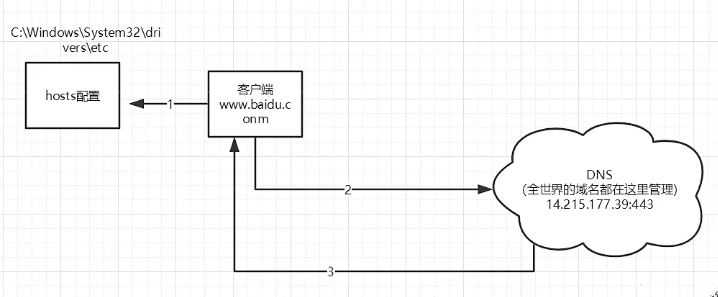


#### 3.4、发布一个web网站

不会就先模仿

- 将自己写的网站，放到服务器（tomcat）中指定的web应用的文件夹（webapps）下，就可以访问了

网站应该有的结构

```java
--webapps:Tomcat服务器的web目录
	-Root
	-pengfei:网站的目录名
		-WEB-INF
			-classes:java程序
			-lib:web应用所依赖的jar包
			-web.xml：网站配置文件
		-index.html 默认的首页
		-static
			-css
				-style.css
			-js
			-img
		-......
```


HTTP协议：面试

Maven:构建工具

- Maven安装包

Servlet入门

- Helloworld!
- Servlet配置
- 原理


### 4、Http

#### 4.1、什么是HTTP

HTTP(超文本传输协议)是一个简单的请求-响应协议，它通常运行在TCP之上。

- 文本：html，字符串，~....
- 超文本：***超文本*是用超链接的方法，将各种不同空间的文字信息组织在一起的网状文本**(图片，音乐，视频,定位，地图.....)
- 80

https:安全的

- 443


#### 4.2、两个时代

- http1.0
  - http/1.0:客户端可以与web服务器连接后，只能获得一个web资源，断开连接
- http2.0
  - http/1.1：客户端可以与web服务器连接后，可以获得多个web资源。

#### 4.3、http请求

- 客户端--发请求(request)--服务器

百度：

```java
Request URL: https://www.baidu.com/sugrec?prod=pc_his&from=pc_web&json=1&sid=31253_26350&hisdata=&_t=1646659996284&csor=0 //请求地址
Request Method: GET //get方法、post方法
Status Code: 200 OK  //状态码
Remote（远程） Address: 110.242.68.3:443
```

```java
Accept: text/plain, */*; q=0.01
Accept-Encoding: gzip, deflate, br
Accept-Language: zh-CN,zh;q=0.9  语言
Connection: keep-alive
```

##### **1、请求行**

- 请求行中的请求方式：get
- 请求方式：Get，Post,head,delete,put,tract...
  - get:请求能够携带的参数比较少，大小有限制，会在浏览器的URL地址栏显示数据内容，不安全，但高效
  - post:请求能够携带的参数没有限制，大小没有限制，不会在浏览器的URL地址栏显示数据内容，安全，但不高效


##### **2、消息头**

```java
Accept: 告诉浏览器，他所支持的数据类型
Accept-Encoding: 支持哪种编码格式 GBK utf-8 GB2312 ISO8859-1
Accept-Language:  告诉浏览器，他的语言环境
Cache-Control:缓存控制
Connection:告诉浏览器，请求完成是断开还是保持连接
HOST:主机...
```


#### 4.4、http响应

- 服务器--响应--客户端

百度：

```java
Cache-Control: private  缓存控制
Connection: keep-alive  连接：保持连接
Content-Encoding: gzip  编码
Content-Type: text/html;charset=utf-8 类型
```

##### 1、响应体

```java
Accept: 告诉浏览器，他所支持的数据类型
Accept-Encoding: 支持哪种编码格式 GBK utf-8 GB2312 ISO8859-1
Accept-Language:  告诉浏览器，他的语言环境
Cache-Control:缓存控制
Connection:告诉浏览器，请求完成是断开还是保持连接
HOST:主机...
Refrush:告诉客户端，多久刷新一次
Location：让网页重新定位；
```

##### 2、响应状态码（重点）

200：请求响应成功 200

3xx：请求重定向

- 重定向：你重新到我给你的新位置去；

4xx：找不到资源 404

- 资源不存在

5xx:服务器代码错误 500  502：网关错误


**常见面试题：**

当你的浏览器中地址栏输入地址并回车的一瞬间到页面能够展示回来，经历了什么？


### 5、Maven

------

**我们为什么要学习这个技术？**

1. 在javaweb开发中，需要使用大量的jar包，这些jar包需要手动导入
2. 如何能够让一个东西自动帮我们导入和配置这个jar包

由此，Maven诞生了！


#### 5.1、Maven项目架构管理工具

我们目前用它来方便导入jar包的！

Maven的核心思想：**约定大于配置**

- 有约束，不要去违反。

Maven会规定好你该如何去编写我们的Java代码，必须要按照这个规范来；


#### 5.2、下载安装Maven

官网：https://maven.apache.org/

自行下载！！！

建议：电脑上的所有环境都放在一个文件夹下，方便管理！


#### 5.3、配置环境变量

在我们的系统环境变量中

配置如下：

- M2_HOME:maven目录下的bin目录
- MAVEN_HOME:maven的目录
- 在系统的path中配置%MAVEN_HOME%\bin

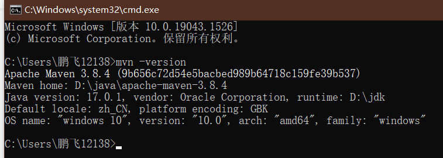

测试Maven是否安装成功，保证必须配置成功！


#### 5.4、阿里云镜像

- 镜像：mirrors
  - 作用：加速我们的下载
- 国内建议使用阿里云的镜像

```xml
  <mirror>
        <id>alimaven</id>
        <mirrorOf>central</mirrorOf>
        <name>aliyun maven</name>
     	 <url>http://maven.aliyun.com/nexus/content/repositories/central/</url>
    </mirror>
```


#### 5.5、本地仓库

在本地的仓库，远程仓库；

**建立一个本地仓库：**localRepository

```xml
<localRepository>D:\java\apache-maven-3.8.4\maven-repo</localRepository>
```


#### 5.6、在IDEA中使用Maven

1. 启动idea
2. 创建一个Maven项目

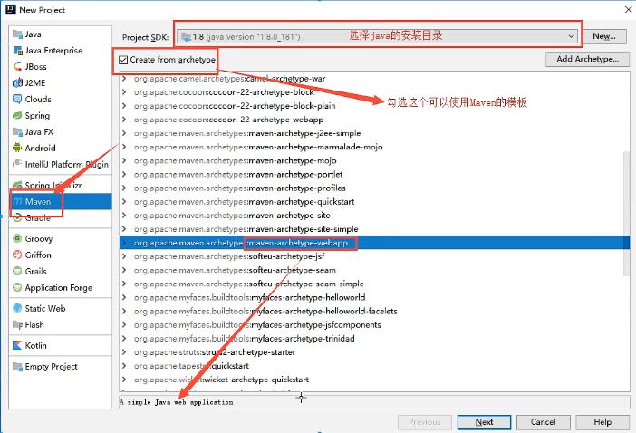

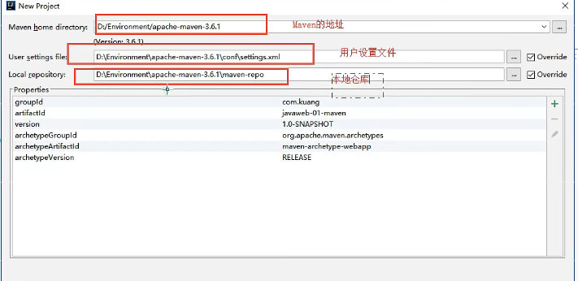

3.等待项目初始化完毕

4.观察maven仓库中多了什么东西？

5.idea中的maven设置

注意：idea项目创建成功后，看一眼maven的配置

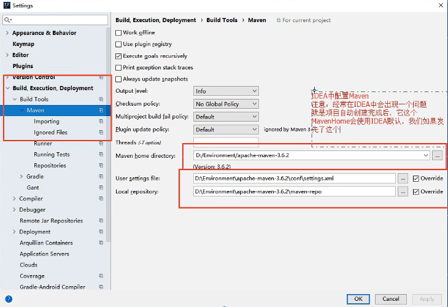

6.到这里，在idea中配置maven就可以使用了！


#### 5.7、创建一个普通的maven项目

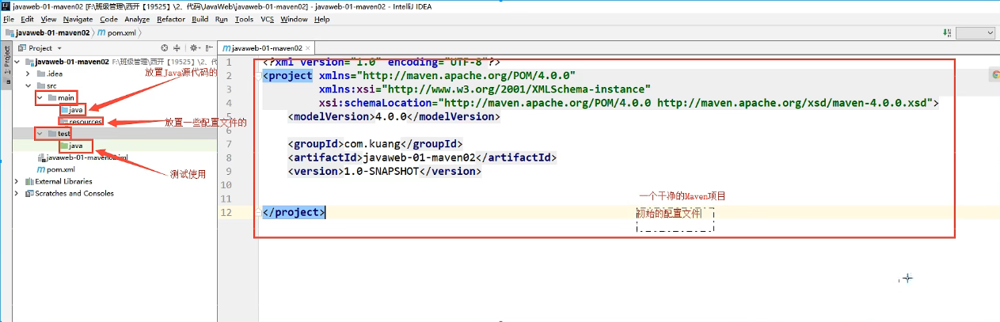

这个只有在web应用下才有

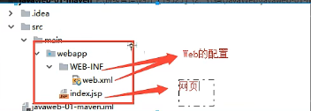


#### 5.8、标记文件夹功能

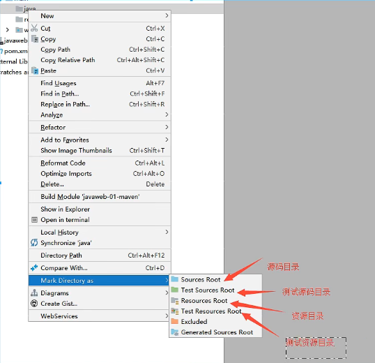

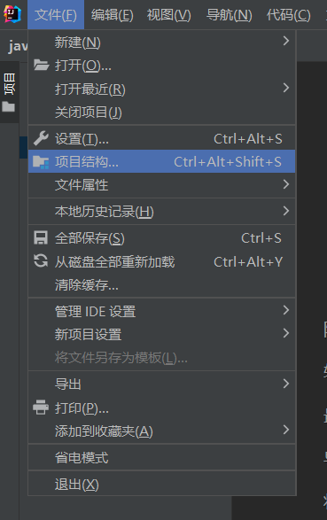

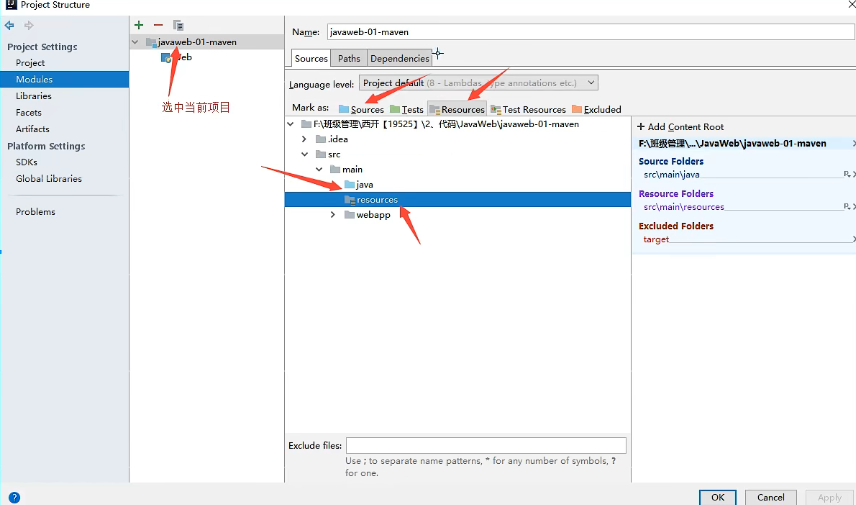


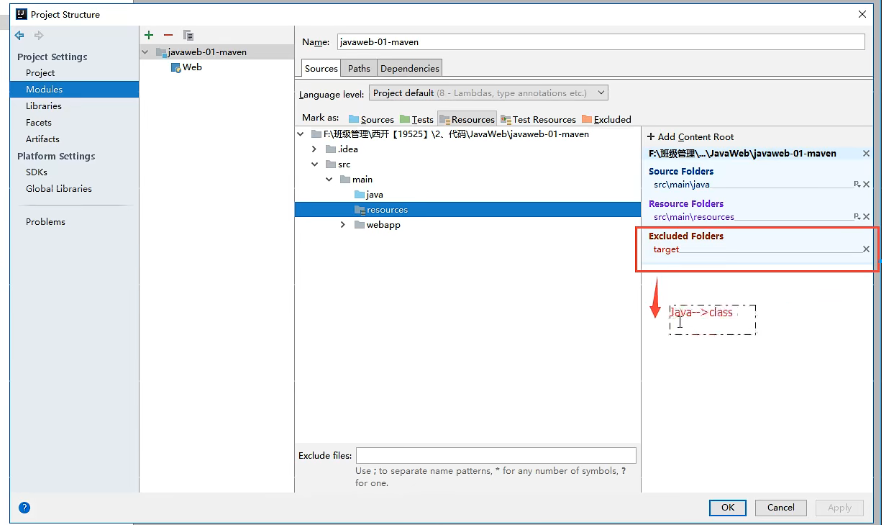


#### 5.9、在idea中配置tomcat

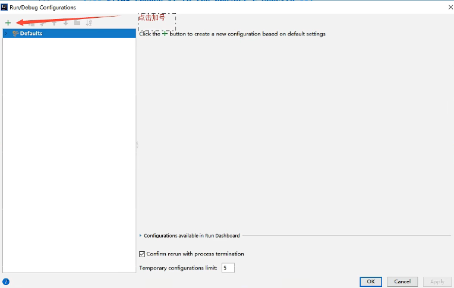

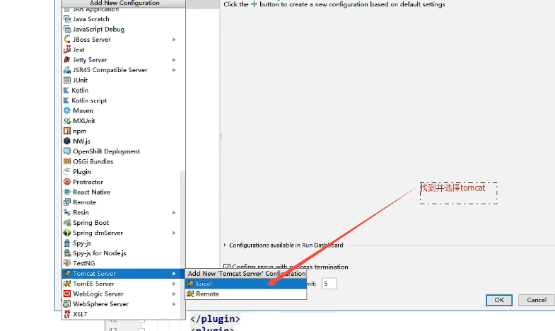

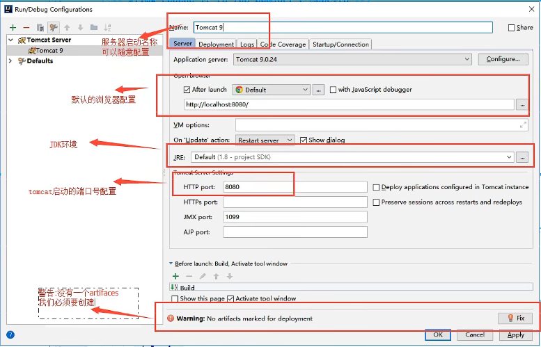

解决警告问题

**为什么会有这个问题：我们访问一个网站，需要指定一个文件夹的名字**

必须！！！

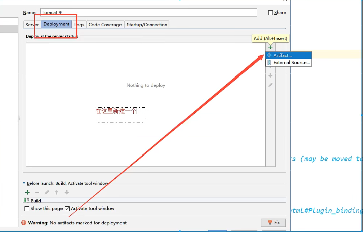

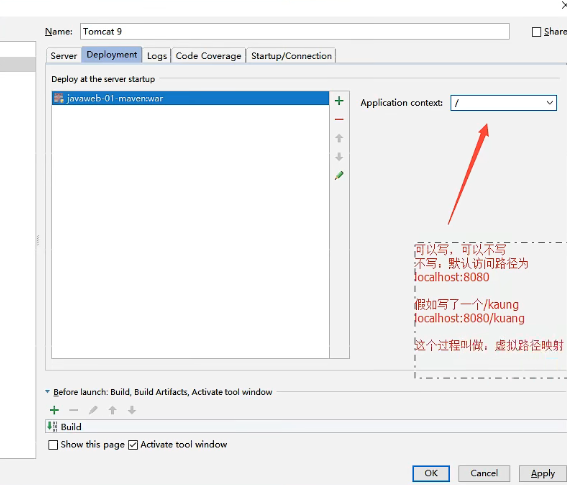

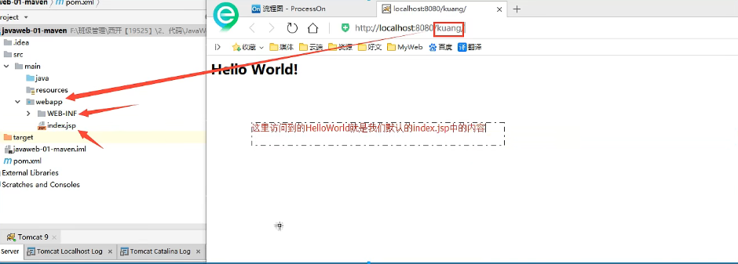

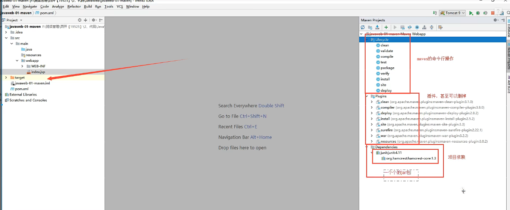


#### 5.10、pom文件

pom.xml是maven的核心配置文件

```xml
<?xml version="1.0" encoding="UTF-8"?>
<!--maven版本的头文件-->
<project xmlns="http://maven.apache.org/POM/4.0.0" xmlns:xsi="http://www.w3.org/2001/XMLSchema-instance"
  xsi:schemaLocation="http://maven.apache.org/POM/4.0.0 http://maven.apache.org/xsd/maven-4.0.0.xsd">
  <modelVersion>4.0.0</modelVersion>
<!--这里是我们刚才配置的GVA-->
  <groupId>com.peng</groupId>
  <artifactId>javaweb_maven</artifactId>
  <version>1.0-SNAPSHOT</version>
<!--package:项目的打包方式
jar:Java应用
war:javaweb应用
-->
  <packaging>war</packaging>

  <name>javaweb_maven Maven Webapp</name>
  <!-- FIXME change it to the project's website -->
  <url>http://www.example.com</url>
<!--配置-->
  <properties>
<!--项目的默认构建编码-->
    <project.build.sourceEncoding>UTF-8</project.build.sourceEncoding>
<!--编译版本-->
    <maven.compiler.source>1.7</maven.compiler.source>
    <maven.compiler.target>1.7</maven.compiler.target>
  </properties>
<!--项目依赖-->
  <dependencies>
<!--具体依赖的jar包-->
    <dependency>
      <groupId>junit</groupId>
      <artifactId>junit</artifactId>
      <version>4.11</version>
    </dependency>
  </dependencies>
<!--项目构建用的东西-->
  <build>
    <finalName>javaweb_maven</finalName>
    <pluginManagement><!-- lock down plugins versions to avoid using Maven defaults (may be moved to parent pom) -->
      <plugins>
        <plugin>
          <artifactId>maven-clean-plugin</artifactId>
          <version>3.1.0</version>
        </plugin>
        <!-- see http://maven.apache.org/ref/current/maven-core/default-bindings.html#Plugin_bindings_for_war_packaging -->
        <plugin>
          <artifactId>maven-resources-plugin</artifactId>
          <version>3.0.2</version>
        </plugin>
        <plugin>
          <artifactId>maven-compiler-plugin</artifactId>
          <version>3.8.0</version>
        </plugin>
        <plugin>
          <artifactId>maven-surefire-plugin</artifactId>
          <version>2.22.1</version>
        </plugin>
        <plugin>
          <artifactId>maven-war-plugin</artifactId>
          <version>3.2.2</version>
        </plugin>
        <plugin>
          <artifactId>maven-install-plugin</artifactId>
          <version>2.5.2</version>
        </plugin>
        <plugin>
          <artifactId>maven-deploy-plugin</artifactId>
          <version>2.8.2</version>
        </plugin>
      </plugins>
    </pluginManagement>
  </build>
</project>

```


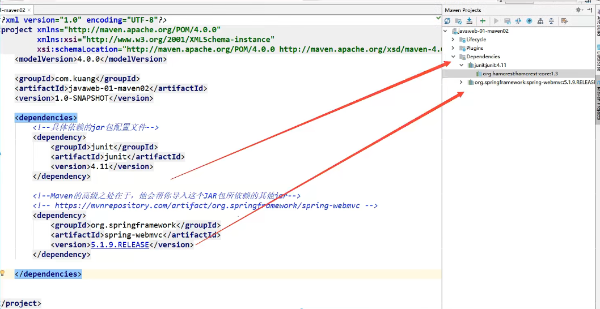

maven由于它的约定大于配置，我们之后可能会遇到我们写的配置问题无法被导出或者生效的问题，解决方案：

```xml
<build>
    <resources>
        <resource>
            <directory>src/main/resources</directory>
            <includes>
                <include>**/*.properties</include>
                <include>**/*.xml</include>
            </includes>
            <filtering>false</filtering>
        </resource>
        <resource>
            <directory>src/main/java</directory>
            <includes>
                <include>**/*.properties</include>
                <include>**/*.xml</include>
            </includes>
            <filtering>false</filtering>
        </resource>
    </resources>
</build>
```


#### 5.11、idea操作

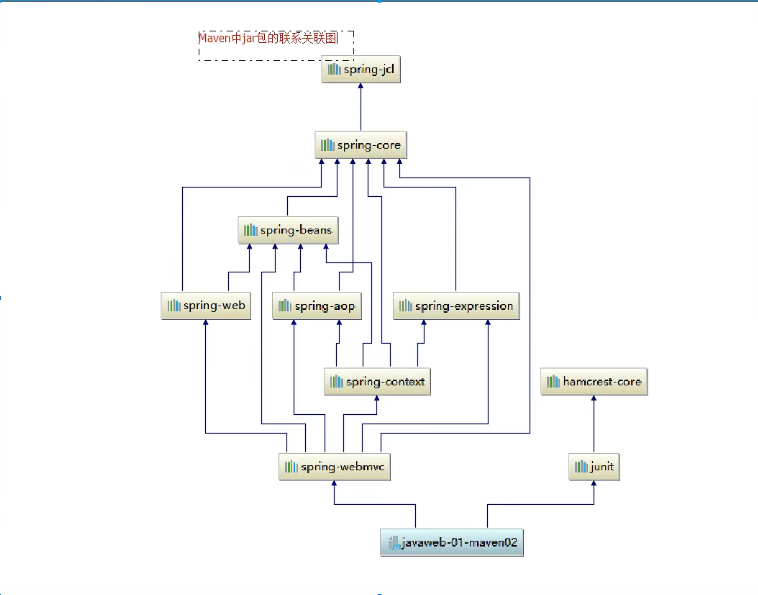


#### 5.12、maven仓库的使用

地址：https://mvnrepository.com/artifact/javax.servlet.jsp/javax.servlet.jsp-api/2.3.3


**测试：**

```java
package com.peng.servlet;

import javax.servlet.ServletException;
import javax.servlet.http.HttpServlet;
import javax.servlet.http.HttpServletRequest;
import javax.servlet.http.HttpServletResponse;
import java.io.IOException;
import java.io.PrintWriter;

public class helloservlet extends HttpServlet {
    @Override
    protected void doGet(HttpServletRequest req, HttpServletResponse resp) throws ServletException, IOException {
        //响应的类型：html
        resp.setContentType("text/html");
        resp.setCharacterEncoding("utf-8");
        //获取响应的输出流
        PrintWriter out = resp.getWriter();
        out.println("<html>");
        out.println("<head>");
        out.println("<title>HelloWorld!</title>");
        out.println("</head>");
        out.println("<body>");
        out.println("<h1>hello,world</h1>");
        out.println("</body>");
        out.println("</html>");
    }

    @Override
    protected void doPost(HttpServletRequest req, HttpServletResponse resp) throws ServletException, IOException {
        super.doPost(req, resp);
    }
}

```

```html
<!DOCTYPE html>
<html lang="en">
<head>
    <meta charset="UTF-8">
    <title>Title</title>
</head>
<body>
<h1>我是导航栏</h1>
</body>
</html>

```

```xml
<!DOCTYPE web-app PUBLIC
 "-//Sun Microsystems, Inc.//DTD Web Application 2.3//EN"
 "http://java.sun.com/dtd/web-app_2_3.dtd" >

<web-app>
  <display-name>Archetype Created Web Application</display-name>
<!--web.xml中是配置我们web的核心应用-->
<!--  注册servlet-->
  <servlet>
    <servlet-name>helloservlet</servlet-name>
    <servlet-class>com.peng.servlet.helloservlet</servlet-class>
  </servlet>
<!-- 一个servlet对应一个Mapping:映射-->
  <servlet-mapping>
    <servlet-name>helloservlet</servlet-name>
    <url-pattern>/peng</url-pattern>
  </servlet-mapping>

</web-app>

```


### 6、Servlet

------

#### 6.1、Servlet简介

- Servlet就是sun公司开发动态web的一门技术
- sun在这些Api中提供一个接口叫做：Servlet,如果你想开发一个Servlet程序，只需要完成两个小步骤：
  - 编写一个类，实现servlet接口
  - 把开发好的Java类部署到web服务器中

**把实现了Servlet接口的java程序叫做，Servlet**


#### 6.2、HelloServlet

Servlet接口Sun公司有两个默认的实现类：HttpServlet,GenericServlet

1.构建一个普通的maven项目，删掉里面的src目录，以后我们的学习就在这个项目里面建立model这个空的工程就是maven的主工程；

2.关于maven父子工程的理解：

父项目中会有

```xml
 <modules>
        <module>servlet_01</module>
    </modules>
```

子项目会有

```xml
<parent>
    <artifactId>javaweb_maven_01</artifactId>
    <groupId>org.example</groupId>
    <version>1.0-SNAPSHOT</version>
  </parent>
```

父项目中的Java子项目可以直接使用

```java
son extends parent
```

3.maven环境优化

1. web.xml需要换最新的
2. 将maven的结构搭建完整

```xml
<?xml version="1.0" encoding="UTF-8"?>
<web-app xmlns="http://xmlns.jcp.org/xml/ns/javaee"
         xmlns:xsi="http://www.w3.org/2001/XMLSchema-instance"
         xsi:schemaLocation="http://xmlns.jcp.org/xml/ns/javaee
                         http://xmlns.jcp.org/xml/ns/javaee/web-app_4_0.xsd"
         version="4.0"
         metadata-complete="true">
</web-app>

```

4.编写一个Servlet程序

- 编写一个普通类
- 实现Servlet接口,这里我们直接继承httpServlet

```java
package com.peng.servlet;

import javax.servlet.ServletException;
import javax.servlet.ServletOutputStream;
import javax.servlet.http.HttpServlet;
import javax.servlet.http.HttpServletRequest;
import javax.servlet.http.HttpServletResponse;
import java.io.IOException;
import java.io.PrintWriter;

public class helloservlet extends HttpServlet {
    //由于get或者post只是请求实现的不同的方式，可以互相调用，业务逻辑都一样
    @Override
    protected void doGet(HttpServletRequest req, HttpServletResponse resp) throws ServletException, IOException {
//        ServletOutputStream outputStream = resp.getOutputStream();
        PrintWriter writer = resp.getWriter();
        writer.print("hello,Servlet");
        
    }

    @Override
    protected void doPost(HttpServletRequest req, HttpServletResponse resp) throws ServletException, IOException {
        super.doPost(req, resp);
    }
}

```


5.编写Servlet的映射

为什么需要映射：我们写的时Java程序，但是要通过浏览器访问，浏览器需要连接web服务器，所以我们需要在web服务中注册我们写的Servlet，还需给他一个浏览器能够访问的路径；

```xml
<!--注册servlet-->
    <servlet>
        <servlet-name>helloservlet</servlet-name>
        <servlet-class>com.peng.servlet.helloservlet</servlet-class>
    </servlet>
<!-- 一个servlet对应一个mapping：映射 servlet的请求路径-->
    <servlet-mapping>
        <servlet-name>helloservlet</servlet-name>
        <url-pattern>/peng</url-pattern>
    </servlet-mapping>
```

6.配置tomcat

注意：配置项目发布的路径就可以了！

7.启动测试 🆗！


#### 6.3、运行原理

Servlet是由web服务器调用，web服务器在收到浏览器请求之后，会：

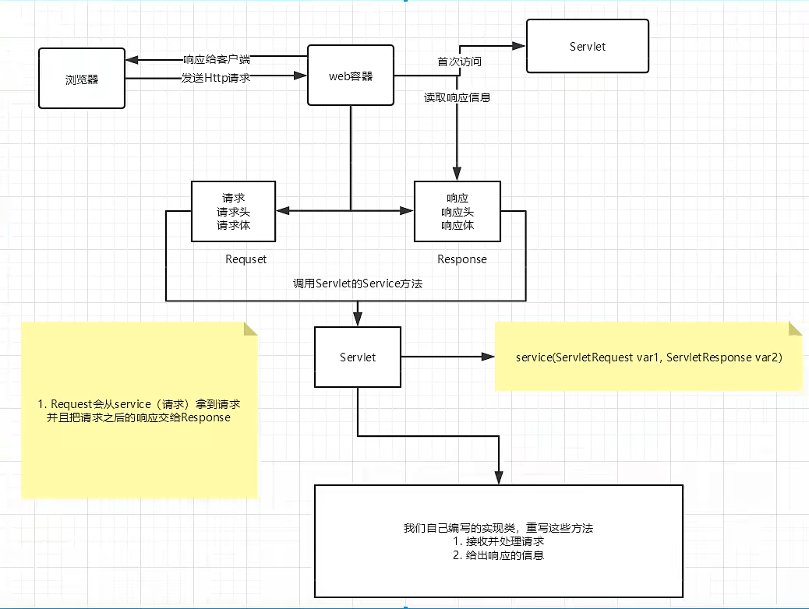

#### 6.4、Mapping问题

1. 一个Servlet可以指定一个映射路径

   ```xml
   <servlet-mapping>
           <servlet-name>helloservlet</servlet-name>
           <url-pattern>/peng</url-pattern>
       </servlet-mapping>
   ```

2. 一个Servlet可以指定多个映射路径

   ```xml
   <servlet-mapping>
           <servlet-name>helloservlet</servlet-name>
           <url-pattern>/peng</url-pattern>
       </servlet-mapping>
   <servlet-mapping>
           <servlet-name>helloservlet</servlet-name>
           <url-pattern>/peng1</url-pattern>
       </servlet-mapping>
   ```

   

3. 一个Servlet可以指定通用映射路径

   ```xml
   <servlet-mapping>
           <servlet-name>helloservlet</servlet-name>
           <url-pattern>/peng/*</url-pattern>
       </servlet-mapping>
   ```

   

4. 默认请求路径

   ```xml
   <servlet-mapping>
           <servlet-name>helloservlet</servlet-name>
           <url-pattern>/*</url-pattern>
       </servlet-mapping>
   ```

   

5. 指定一些后缀或者前缀等待......

   ```xml
   <!--可以自定义后缀实现请求映射
   注意点*前面不能加项目映射的路径
   hello/asds.peng
   -->
   <servlet-mapping>
           <servlet-name>helloservlet</servlet-name>
           <url-pattern>*.peng</url-pattern>
       </servlet-mapping>
   ```

6. 优先级问题

   指定了固有的映射路径优先级最高，如果找不到就会走默认的处理请求；

   ```xml
   <!--404-->
       <servlet>
           <servlet-name>error</servlet-name>
           <servlet-class>com.peng.servlet.errorservlet</servlet-class>
       </servlet>
       <servlet-mapping>
           <servlet-name>error</servlet-name>
           <url-pattern>/*</url-pattern>
       </servlet-mapping>
   ```

   ```java
   package com.peng.servlet;
   
   import javax.servlet.ServletException;
   import javax.servlet.http.HttpServlet;
   import javax.servlet.http.HttpServletRequest;
   import javax.servlet.http.HttpServletResponse;
   import java.io.IOException;
   import java.io.PrintWriter;
   
   public class errorservlet extends HttpServlet {
       @Override
       protected void doGet(HttpServletRequest req, HttpServletResponse resp) throws ServletException, IOException {
           resp.setContentType("text/html");
           resp.setCharacterEncoding("utf-8");
   
           PrintWriter writer = resp.getWriter();
           writer.print("<h1>404</h1>");
       }
   
       @Override
       protected void doPost(HttpServletRequest req, HttpServletResponse resp) throws ServletException, IOException {
           super.doPost(req, resp);
       }
   }
   
   ```


#### 6.5、ServletContext

web容器在启动的时候，它会为每个web程序都创建一个对应的ServletContext对象，它代表了当前的web应用；

##### 1、共享数据

- 我在这个Servlet中保存的数据，可以在另外一个Servlet中获得

  ```java
  public class helloservlet extends HttpServlet {
      @Override
      protected void doGet(HttpServletRequest req, HttpServletResponse resp) throws ServletException, IOException {
  //        this.getInitParameter(); 初始化参数
  //            this.getServletConfig(); servlet配置
  //        this.getServletContext(); servlet上下文
  
          ServletContext context = this.getServletContext();
          String username = "鹏飞"; //数据
          context.setAttribute("username",username);// 将一个数据保存在了ServletContext中  名字为username   值为 username
      }
  }
  ```

  ```java
  public class getServlet extends HttpServlet {
      @Override
      protected void doGet(HttpServletRequest req, HttpServletResponse resp) throws ServletException, IOException {
          ServletContext context = this.getServletContext();
  
          String username = (String) context.getAttribute("username");
  
          resp.setContentType("text/html");
          resp.setCharacterEncoding("utf-8");
          resp.getWriter().print("名字："+username);
      }
  
      @Override
      protected void doPost(HttpServletRequest req, HttpServletResponse resp) throws ServletException, IOException {
          super.doPost(req, resp);
      }
  }
  ```

  ```xml
  <?xml version="1.0" encoding="UTF-8"?>
  <web-app xmlns="http://xmlns.jcp.org/xml/ns/javaee"
           xmlns:xsi="http://www.w3.org/2001/XMLSchema-instance"
           xsi:schemaLocation="http://xmlns.jcp.org/xml/ns/javaee
                           http://xmlns.jcp.org/xml/ns/javaee/web-app_4_0.xsd"
           version="4.0"
           metadata-complete="true">
  
      <servlet>
          <servlet-name>hello</servlet-name>
          <servlet-class>com.peng.servlet.helloservlet</servlet-class>
      </servlet>
      <servlet-mapping>
          <servlet-name>hello</servlet-name>
          <url-pattern>/peng</url-pattern>
      </servlet-mapping>
  
      <servlet>
          <servlet-name>getc</servlet-name>
          <servlet-class>com.peng.servlet.getServlet</servlet-class>
      </servlet>
      <servlet-mapping>
          <servlet-name>getc</servlet-name>
          <url-pattern>/peng1</url-pattern>
      </servlet-mapping>
  </web-app>
  
  ```

  测试访问结果；


##### 2、获取初始化参数

```xml
   <context-param>
        <param-name>url</param-name>
        <param-value>jdbc:mysql://localhost:3306</param-value>
    </context-param>
```

```java
public class servletdemo03 extends HttpServlet {
    @Override
    protected void doGet(HttpServletRequest req, HttpServletResponse resp) throws ServletException, IOException {
        ServletContext context = this.getServletContext();

        String url = context.getInitParameter("url");
        resp.getWriter().print(url);
    }
}
```

##### 3、请求转发

```java
   protected void doGet(HttpServletRequest req, HttpServletResponse resp) throws ServletException, IOException {
        System.out.println("进入了Servletdemo04");
        ServletContext context = this.getServletContext();
//        RequestDispatcher requestDispatcher = context.getRequestDispatcher("/peng2"); // 转发的请求路径
//        requestDispatcher.forward(req,resp); //调用forward实现请求转发
        context.getRequestDispatcher("/peng2").forward(req,resp);
    }
```

```xml
<servlet>
    <servlet-name>s4</servlet-name>
    <servlet-class>com.peng.servlet.Serveltdemo04</servlet-class>
</servlet>
<servlet-mapping>
    <servlet-name>s4</servlet-name>
    <url-pattern>/peng3</url-pattern>
</servlet-mapping>
```

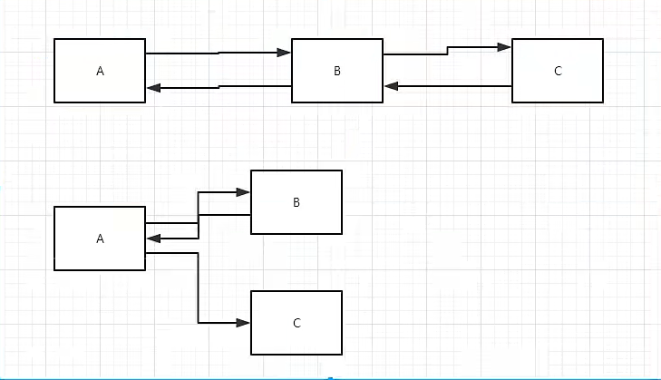


##### 4、读取资源文件

Properties

- 在Java目录下新建Properties
- 在resources目录下新建Properties

发现：都被打包到了同一个路径下：classes,我们俗称这个路径为classpath;

思路：需要一个文件流；

```properties
username=pengfei
password=123456
```

```java
public class servletdemo05 extends HttpServlet {
    @Override
    protected void doGet(HttpServletRequest req, HttpServletResponse resp) throws ServletException, IOException {
        InputStream is = this.getServletContext().getResourceAsStream("/WEB-INF/classes/db.properties");
        Properties prop = new Properties();
        prop.load(is);
        String username = prop.getProperty("username");
        String password = prop.getProperty("password");

        resp.getWriter().print(username+":"+password);
    }
}
```

访问测试🆗即可；


#### 6.6、HttpServletResponse

web服务器接收到客户的http请求，针对这个请求，分别创建一个代表请求的HttpServletRequest对象，代表响应的一个HttpServletResponse;

- 如果要获取客户端请求过来的参数：找HttpServletRequest
- 如果要给客户端响应一些信息：找HttpServletResponse

##### 1、简单分类

负责向浏览器发送数据的方法

```java
ServletOutputStream getOutputStream() throws IOException;

PrintWriter getWriter() throws IOException;
```

负责向浏览器发送响应头的方法

```java
void setCharacterEncoding(String var1);

void setContentLength(int var1);

void setContentLengthLong(long var1);

void setContentType(String var1);

void setDateHeader(String var1, long var2);

void addDateHeader(String var1, long var2);

void setHeader(String var1, String var2);

void addHeader(String var1, String var2);

void setIntHeader(String var1, int var2);

void addIntHeader(String var1, int var2);
```

响应的状态码

```java
 int SC_CONTINUE = 100;
    int SC_SWITCHING_PROTOCOLS = 101;
    int SC_OK = 200;
    int SC_CREATED = 201;
    int SC_ACCEPTED = 202;
    int SC_NON_AUTHORITATIVE_INFORMATION = 203;
    int SC_NO_CONTENT = 204;
    int SC_RESET_CONTENT = 205;
    int SC_PARTIAL_CONTENT = 206;
    int SC_MULTIPLE_CHOICES = 300;
    int SC_MOVED_PERMANENTLY = 301;
    int SC_MOVED_TEMPORARILY = 302;
    int SC_FOUND = 302;
    int SC_SEE_OTHER = 303;
    int SC_NOT_MODIFIED = 304;
    int SC_USE_PROXY = 305;
    int SC_TEMPORARY_REDIRECT = 307;
    int SC_BAD_REQUEST = 400;
    int SC_UNAUTHORIZED = 401;
    int SC_PAYMENT_REQUIRED = 402;
    int SC_FORBIDDEN = 403;
    int SC_NOT_FOUND = 404;
    int SC_METHOD_NOT_ALLOWED = 405;
    int SC_NOT_ACCEPTABLE = 406;
    int SC_PROXY_AUTHENTICATION_REQUIRED = 407;
    int SC_REQUEST_TIMEOUT = 408;
    int SC_CONFLICT = 409;
    int SC_GONE = 410;
    int SC_LENGTH_REQUIRED = 411;
    int SC_PRECONDITION_FAILED = 412;
    int SC_REQUEST_ENTITY_TOO_LARGE = 413;
    int SC_REQUEST_URI_TOO_LONG = 414;
    int SC_UNSUPPORTED_MEDIA_TYPE = 415;
    int SC_REQUESTED_RANGE_NOT_SATISFIABLE = 416;
    int SC_EXPECTATION_FAILED = 417;
    int SC_INTERNAL_SERVER_ERROR = 500;
    int SC_NOT_IMPLEMENTED = 501;
    int SC_BAD_GATEWAY = 502;
    int SC_SERVICE_UNAVAILABLE = 503;
    int SC_GATEWAY_TIMEOUT = 504;
    int SC_HTTP_VERSION_NOT_SUPPORTED = 505;
```

##### 2、下载文件

1. 像浏览器输出消息（一直在讲）
2. 下载文件
   1. 要获取下载文件的路径
   2. 下载的文件名是啥？
   3. 设置想办法让浏览器能够支持下载我们需要的东西
   4. 获取下载文件的输入流
   5. 创建缓冲区
   6. 获取OutputStream对象
   7. 将FileOutputStream流写入到buffer缓冲区
   8. 使用OutputStream将缓冲区中的数据输出到客户端！

```java
package com.peng.servlet;

import javax.servlet.ServletException;
import javax.servlet.ServletOutputStream;
import javax.servlet.http.HttpServlet;
import javax.servlet.http.HttpServletRequest;
import javax.servlet.http.HttpServletResponse;
import java.io.FileInputStream;
import java.io.IOException;
import java.net.URLEncoder;

public class FileServlet extends HttpServlet {
    @Override
    protected void doGet(HttpServletRequest req, HttpServletResponse resp) throws ServletException, IOException {
//        1. 要获取下载文件的路径
            String realPath = "D:\\ideaproject\\javaweb_maven_01\\response\\target\\classes\\鹏飞.png";
            System.out.println("要获取下载文件的路径:"+realPath);
//        2. 下载的文件名是啥？
        String filename = realPath.substring(realPath.lastIndexOf("\\") + 1);
//        3. 设置想办法让浏览器能够(Content-Disposition)支持下载我们需要的东西,让中文文件名URLEncoder.encode编码，否则有可能会乱码
        resp.setHeader("Content-Disposition","attachment;filename="+ URLEncoder.encode(filename,"utf-8"));
//        4. 获取下载文件的输入流
        FileInputStream in = new FileInputStream(realPath);
//        5. 创建缓冲区
        int len = 0;
        byte[] buffer = new byte[1024];
//        6. 获取OutputStream对象
        ServletOutputStream out = resp.getOutputStream();

//        7. 将FileOutputStream流写入到buffer缓冲区
        while ((in.read(buffer))!=-1){
            out.write(buffer,0,len);
        }
        in.close();
        out.close();
        //        8. 使用OutputStream将缓冲区中的数据输出到客户端！
    }
```

##### 3、验证码功能

验证码怎么来的？

- 前端实现
- 后端实现，需要用到Java的图片类，生成一个图片

```java
package com.peng.servlet;

import javax.imageio.ImageIO;
import javax.servlet.ServletException;
import javax.servlet.http.HttpServlet;
import javax.servlet.http.HttpServletRequest;
import javax.servlet.http.HttpServletResponse;
import java.awt.*;
import java.awt.image.BufferedImage;
import java.io.IOException;
import java.util.Random;

public class imageServlet extends HttpServlet {
    @Override
    protected void doGet(HttpServletRequest req, HttpServletResponse resp) throws ServletException, IOException {
        //如何让浏览器3秒自动刷新一次；
        resp.setHeader("refresh","3");
        //在内存中创建一个图片
        BufferedImage image = new BufferedImage(80,100,BufferedImage.TYPE_INT_RGB);
        //得到图片
        Graphics2D g =(Graphics2D) image.getGraphics(); // 笔
        //设置图片的背景颜色
        g.setColor(Color.white);
        g.fillRect(0,0,80,20);
        //给图片写数据
        g.setColor(Color.blue);
        g.setFont(new Font(null,Font.BOLD,20));
        g.drawString(makenum(),0,20);

        //告诉浏览器这个请求用图片的方式打开
        resp.setContentType("image/jpeg");
        //网站存在缓存，不让浏览器缓存
        resp.setDateHeader("expires",-1);
        resp.setHeader("Cache-Control","no-cache");
        resp.setHeader("Pragma","no-cache");

        //把图片写给浏览器
        ImageIO.write(image,"jpg",resp.getOutputStream());
    }
    //生成随机数
    private String makenum(){
        Random random = new Random();
        String num = random.nextInt(99999999) + "";
        StringBuffer sb = new StringBuffer();
        for (int i = 0; i < 7-num.length(); i++) {
            sb.append("0");
        }
        String s = sb.toString() + num;
        return num;
    }

    @Override
    protected void doPost(HttpServletRequest req, HttpServletResponse resp) throws ServletException, IOException {
        super.doPost(req, resp);
    }
}

```

##### 4、实现重定向

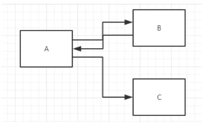

B一个web资源收到客户端A请求后，B他会通知A客户端去访问另外一个web资源C，这个过程叫重定向

常见场景：

- 用户登录

```java
void sendRedirect(String var1) throws IOException;
```

测试：

```java
public class RedirectServlet extends HttpServlet {
    @Override
    protected void doGet(HttpServletRequest req, HttpServletResponse resp) throws ServletException, IOException {
//        resp.setHeader("Location","/red/image");
//        resp.setStatus(HttpServletResponse.SC_FOUND);
        resp.sendRedirect("/red/image");
    }
```

面试题：请你聊一聊重定向和转发的区别？

相同点

- 页面都会实现跳转

不同点

- 请求转发的时候，url不会产生变化
- 重定向的时候，url地址栏会发生变化

```xml
//jsp  
<dependency>
        <groupId>javax.servlet.jsp</groupId>
        <artifactId>javax.servlet.jsp-api</artifactId>
        <version>2.3.3</version>
        <scope>provided</scope>
    </dependency>
```


```java
    protected void doGet(HttpServletRequest req, HttpServletResponse resp) throws ServletException, IOException {
        //处理请求
        String username = req.getParameter("username");
        String password = req.getParameter("password");

        System.out.println(username+" "+password);
        //重定向一定注意路径问题，否则会404
        resp.sendRedirect("/r/success.jsp");
    }

```

```jsp

<%@ page contentType="text/html;charset=UTF-8" language="java" %>
<html>
<head>
    <title>Title</title>
</head>
<body>
<h1>Success</h1>
</body>
</html>
```


#### 6.7、HttpServletRequest

HttpServletRequest代表客户端的请求，用户通过Http协议访问服务器，http请求中的所有信息会被封装到HttpServletRequest，通过这个HttpServletRequest的方法，获得客户端的所有信息

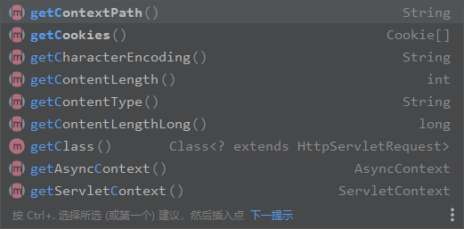


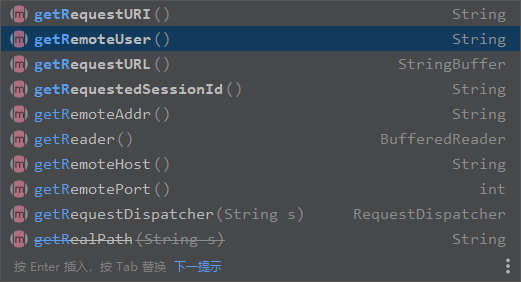


##### 获取参数,请求转发

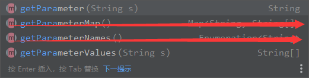

```xml
 <servlet>
        <servlet-name>request</servlet-name>
        <servlet-class>com.peng.servlet.loginservlet</servlet-class>
    </servlet>
    <servlet-mapping>
        <servlet-name>request</servlet-name>
        <url-pattern>/login</url-pattern>
    </servlet-mapping>
```

```jsp
<%@ page contentType="text/html;charset=UTF-8" language="java" %>
<html>
<head>
    <title>登录</title>
</head>
<body>
<h1>登录</h1>
<div>
<%--这里表单表示的意思：以post方式提交表单，提交到我们的login请求--%>
    <form action="${pageContext.request.contextPath}/login" method="post">
        用户名：<input type="text" name="username"> <br>
        密码：<input type="password" name="password"> <br>
        爱好：
        <input type="checkbox" name="hobby" value="女孩">女孩
        <input type="checkbox" name="hobby" value="代码">代码
        <input type="checkbox" name="hobby" value="唱歌">唱歌
        <input type="checkbox" name="hobby" value="电影">电影
        <br>
        <input type="submit">
    </form>

</div>
</body>
</html>

```

```jsp

<%@ page contentType="text/html;charset=UTF-8" language="java" %>
<html>
<head>
    <title>登录成功</title>
</head>
<body>
<p>奖励：</p>

</body>
</html>

```

```java
package com.peng.servlet;

import javax.servlet.ServletException;
import javax.servlet.http.HttpServlet;
import javax.servlet.http.HttpServletRequest;
import javax.servlet.http.HttpServletResponse;
import java.io.IOException;
import java.util.Arrays;

public class loginservlet extends HttpServlet {

    @Override
    protected void doPost(HttpServletRequest req, HttpServletResponse resp) throws ServletException, IOException {
        req.setCharacterEncoding("utf-8");
        resp.setCharacterEncoding("utf-8");
        String username = req.getParameter("username");
        String password = req.getParameter("password");
        String[] hobby = req.getParameterValues("hobby");

        //后台接收乱码问题
        System.out.println("===========================");
        System.out.println(username);
        System.out.println(password);
        System.out.println(Arrays.toString(hobby));
        System.out.println("===========================");

        System.out.println(req.getContextPath());
        //通过请求转发
        // 这里的/ 代表当前的web应用
        req.getRequestDispatcher("/success.jsp").forward(req,resp);
    }
    @Override
    protected void doGet(HttpServletRequest req, HttpServletResponse resp) throws ServletException, IOException {
        doGet(req,resp);
    }
}
```

**面试题：请你聊一聊重定向和转发的区别？**

相同点

- 页面都会实现跳转

不同点

- 请求转发的时候，url不会产生变化  307
- 重定向的时候，url地址栏会发生变化 302


### 7、Cookie、Session

------

#### 7.1、会话

**会话：**用户打开一个浏览器，点击了很多超链接，访问多个web资源，关闭浏览器，这个过程可以称之为会话

**有状态会话：**一个同学来过教室，下次再来教室，我们会知道这位同学，曾经来过，称之为有状态会话

**你能怎么证明你是山东的学生？**

你  山东

1. 学籍    山东学校办的学籍
2. 学校登记  山东标记你在这

**一个网站，怎么证明你来过？**

客户端   服务端

1. 服务端给客户端一个信件，客户端下次访问服务端带上信件就可以了；cookie
2. 服务器登记你来过了，下次你来的时候我来匹配你；


#### 7.2、保存会话的两种技术

**cookie**

- 客户端技术（响应，请求）

**session**

- 服务器技术，利用这个技术，可以保存用户的会话信息？我们可以把信息或者数据放在session中！


常见场景：网站登录之后，你下次不用再登录了，第二次访问就直接上去了！


#### 7.3、Cookie

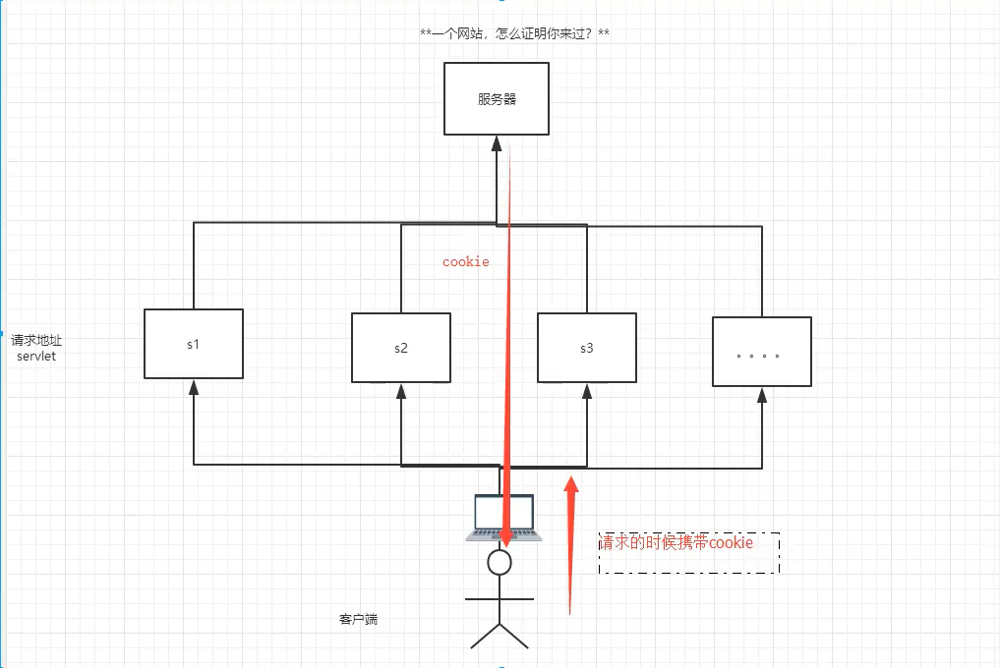

1. 从请求中拿到cookie信息
2. 服务器响应给客户端cookie

```java
Cookie[] cookies = req.getCookies();// 获得cookie

cookie.getName(); //获得cookie中的key

cookie.getValue(); //获得cookie中的值value

new Cookie("lastlogintime", System.currentTimeMillis() + ""); //新建一个cookie

cookie.setMaxAge(24*60*60); //设置cookie的有效时间

 resp.addCookie(cookie); // 响应给客户端一个cookie
```


**cookie:一般会保存在本地的用户目录下appdata;**


一个网站cookie是否存在上限！**聊聊细节问题**

- 一个cookie只能保存一个信息
- 一个web站点可以给浏览器发送多个cookie，最多存放20个cookie
- Cookie大小有限制4kb;
- 300个cookie浏览器上限


删除Cookie:

- 不设置有效期，关闭浏览器，自动失效；
- 设置有效期时间为0；

```java
package com.peng.servlet;

import javax.servlet.ServletException;
import javax.servlet.http.Cookie;
import javax.servlet.http.HttpServlet;
import javax.servlet.http.HttpServletRequest;
import javax.servlet.http.HttpServletResponse;
import java.io.IOException;

public class cookiedemo01 extends HttpServlet {
    @Override
    protected void doGet(HttpServletRequest req, HttpServletResponse resp) throws ServletException, IOException {
        //创建一个cookie 名字必须和要删除的名字一致
        Cookie cookie = new Cookie("lastlogintime", System.currentTimeMillis() + "");
        //将cookie有效时间设置为0
        cookie.setMaxAge(0);
        resp.addCookie(cookie);
    }

    @Override
    protected void doPost(HttpServletRequest req, HttpServletResponse resp) throws ServletException, IOException {
        super.doPost(req, resp);
    }
}

```


```java
//解码
out.write(URLDecoder.decode(cookie.getValue(),"UTF-8"));

//编码
Cookie cookie = new Cookie("name",URLEncoder.encode("鹏飞"，"utf-8"));
```


#### 7.4、Session(重点)

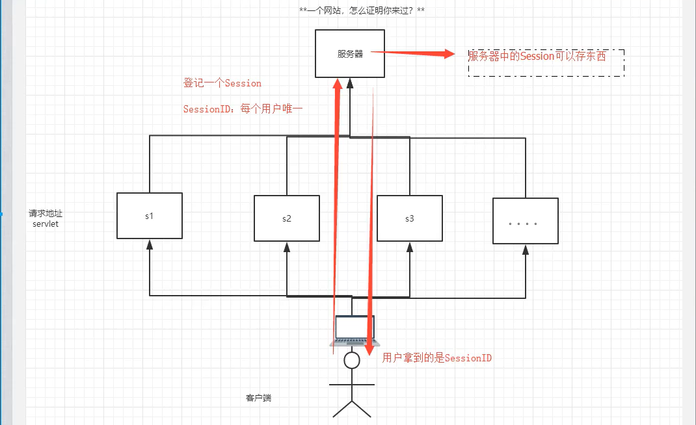

什么是Session:

- 服务器会给每一个用户创建一个Session对象
- 一个session独占一个浏览器，只要浏览器没有关闭，这个Session就存在
- 用户登录之后，整个网站都可以访问！--》保存用户的信息；保存购物车的信息....


Session和Cookie的区别：

- Cookie是把用户的数据写给用户的浏览器，浏览器保存（可以保存多个）
- Session把用户的数据写到用户独占Session中，服务器端保存（保存重要的信息，减少服务器资源的浪费）
- Session对象由服务创建；


使用场景：

- 保存一个登录用户的信息；
- 购物车信息；
- 在整个网站中经常会使用的数据，我们将它保存在Session中


使用Session:

```java
package com.peng.servlet;

import com.peng.pojo.Person;

import javax.servlet.ServletException;
import javax.servlet.http.*;
import java.io.IOException;

public class Sessiondemo extends HttpServlet {
    @Override
    protected void doGet(HttpServletRequest req, HttpServletResponse resp) throws ServletException, IOException {
        //解决乱码问题
        req.setCharacterEncoding("utf-8");
        resp.setCharacterEncoding("utf-8");
        resp.setContentType("text/html;charset=utf-8");
        //得到Session
        HttpSession session = req.getSession();

        //给Session中存东西
        session.setAttribute("name",new Person("鹏飞",23));
        //获取Session的id
        String id = session.getId();

        //判断Session是不是新创建
        if (session.isNew()){
            resp.getWriter().write("session创建成功，id:"+id);
        }else {
            resp.getWriter().write("session已经在服务器中存在了，id:"+id);
        }
        //session创建的时候做了什么事情
//        Cookie cookie = new Cookie("JSESSIONID",id);
//        resp.addCookie(cookie);
    }

    @Override
    protected void doPost(HttpServletRequest req, HttpServletResponse resp) throws ServletException, IOException {
        super.doPost(req, resp);
    }
}

```


```java
package com.peng.servlet;

import com.peng.pojo.Person;

import javax.servlet.ServletException;
import javax.servlet.http.HttpServlet;
import javax.servlet.http.HttpServletRequest;
import javax.servlet.http.HttpServletResponse;
import javax.servlet.http.HttpSession;
import java.io.IOException;

public class Sessiondemo01 extends HttpServlet {
    @Override
    protected void doGet(HttpServletRequest req, HttpServletResponse resp) throws ServletException, IOException {
        //解决乱码问题
        req.setCharacterEncoding("utf-8");
        resp.setCharacterEncoding("utf-8");
        resp.setContentType("text/html;charset=utf-8");
        //得到Session
        HttpSession session = req.getSession();

        Person person = (Person) session.getAttribute("name");
        System.out.println(person.toString());
    }

    @Override
    protected void doPost(HttpServletRequest req, HttpServletResponse resp) throws ServletException, IOException {
        super.doPost(req, resp);
    }
}

```


```java
package com.peng.servlet;

import javax.servlet.ServletException;
import javax.servlet.http.HttpServlet;
import javax.servlet.http.HttpServletRequest;
import javax.servlet.http.HttpServletResponse;
import javax.servlet.http.HttpSession;
import java.io.IOException;

public class sessiondemo02 extends HttpServlet {
    @Override
    protected void doGet(HttpServletRequest req, HttpServletResponse resp) throws ServletException, IOException {
        HttpSession session = req.getSession();
        //手动注销session
        session.removeAttribute("name");
        session.invalidate();
    }

    @Override
    protected void doPost(HttpServletRequest req, HttpServletResponse resp) throws ServletException, IOException {
        super.doPost(req, resp);
    }
}

```

**会话自动过期：web.xml配置**

```xml
<!-- 设置session默认的失效时间-->
<session-config>
    <!--15分钟后Session自动失效，以分钟为单位-->
    <session-timeout>15</session-timeout>
</session-config>
```


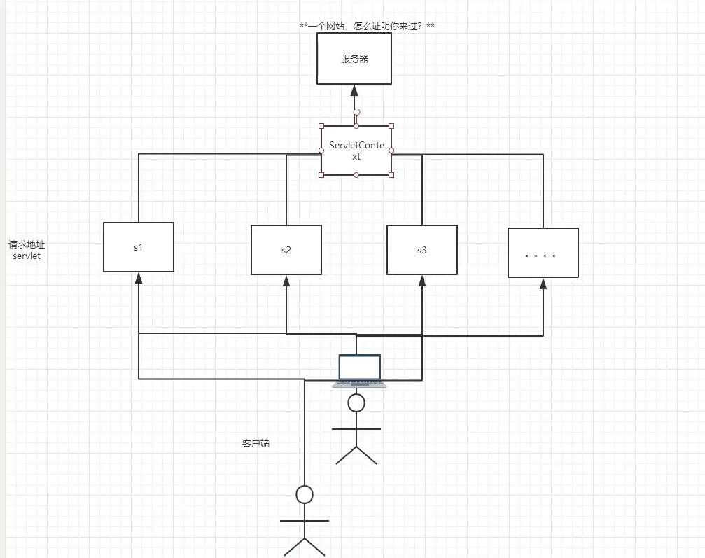


### 8、JSP

------

#### 8.1、什么是JSP

java Server Pages:Java服务器端页面，也和Servlet一样用于开发动态web技术！

最大的特点：

- 写JSP就像在写HTML
- 区别：
  - Html只给用户提供静态的数据
  - JSP页面中可以嵌入java代码，为用户提供动态数据；


#### 8.2、JSP原理

思路：JSP到底怎么执行的！

- 代码层面没有任何问题
- 服务器内部工作
  - tomcat中有一个work目录
  - idea中使用Tomcat的时候会在idea的tomcat中产生一个work目录


**浏览器向服务器发送请求，不管访问什么资源，其实都是在访问Servlet**

JSP最终也会被转换成一个Java类

**JSP本质上就是一个Servlet**

```java
//初始化
	public void _jspInit(){}
//销毁
	public void _jspDestroy(){}
//JSPService
	public void _jspService(.HttpServletRequest request,HttpServletResponse response)
```

1. 判断请求
2. 内置一些对象

```java
final javax.servlet.jsp.PageContext pageContext; //页面上下文
javax.servlet.http.HttpSession session = null;  //session
final javax.servlet.ServletContext application; 
// applicationContext
final javax.servlet.ServletConfig config; //config
javax.servlet.jsp.JspWriter out = null;//out
final java.lang.Object page = this;//page: 当前
HttpServletRequest request //请求
HttpServletResponse response //响应
```

3.输出页面前增加的代码

```java
response.setContentType("text/html"); //设置响应的页面类型
pageContext = _jspxFactory.getPageContext(this, request, response,null, true, 8192, true); 
_jspx_page_context = pageContext;
application = pageContext.getServletContext();
config = pageContext.getServletConfig();
session = pageContext.getSession();
out = pageContext.getOut();
_jspx_out = out;
```

4.以上的这些个对象我们可以在jsp页面中直接使用！

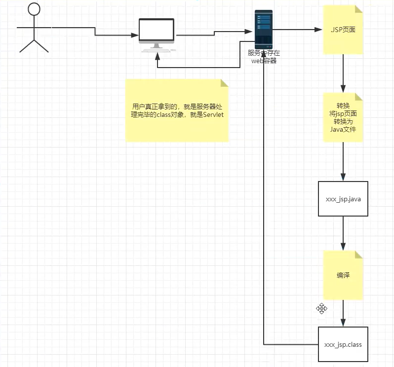

在jsp页面中；

只要是Java代码就会原封不动的输出；

如果是html代码，就会被转换为：

```java
out.write("<html>\r\n");
```

这样的格式，输出到前端；


#### 8.3、JSP基础语法

```xml
    <dependencies>
        <!-- https://mvnrepository.com/artifact/javax.servlet/javax.servlet-api -->
        <dependency>
            <groupId>javax.servlet</groupId>
            <artifactId>javax.servlet-api</artifactId>
            <version>4.0.1</version>
            <scope>provided</scope>
        </dependency>
        <!-- https://mvnrepository.com/artifact/javax.servlet.jsp/javax.servlet.jsp-api -->
        <dependency>
            <groupId>javax.servlet.jsp</groupId>
            <artifactId>javax.servlet.jsp-api</artifactId>
            <version>2.3.3</version>
            <scope>provided</scope>
        </dependency>
        <!-- https://mvnrepository.com/artifact/javax.servlet.jsp.jstl/jstl-api -->
        <dependency>
<!--            jstl表达式的依赖-->
            <groupId>javax.servlet.jsp.jstl</groupId>
            <artifactId>jstl-api</artifactId>
            <version>1.2</version>
        </dependency>
        <!-- https://mvnrepository.com/artifact/taglibs/standard -->
        <dependency>
            <groupId>taglibs</groupId>
            <artifactId>standard</artifactId>
            <version>1.1.2</version>
        </dependency>

    </dependencies>
```

任何语言都有自己的语法，Java中有，JSP作为Java技术的一种应用，它拥有一些自己扩充的语法（了解，知道即可！），Java所有语法都支持！


##### **JSP表达式**

```jsp
<%--jsp表达式
作用：用来将程序的输出，输出到客户端
<%= 变量或者表达式%>
--%>
<%= new java.util.Date()%>
```


##### **jsp脚本片段**

```jsp
<%--jsp脚本片段--%>
<%
  int sum = 0;
  for (int i = 0; i <=100; i++) {
    sum+=i;
  }
  out.println("<h1>Sum="+sum+"</h1>");
%>
```


脚本片段的再实现

```jsp
<%
  int x = 10;
  out.print(x);
%>
<p>这是一个jsp文档</p>
<%
  int y = 2;
  out.println(y);
%>

  <hr>

<%--  在代码中嵌入html元素--%>
  <%
    for (int i = 0; i < 5; i++) {
      %>
<h1>hello,world <%=i%></h1>
<%
    }
  %>
```


##### JSP声明

```jsp
<%!
    static{
        System.out.println("Loadingservlet!");
    }

    private int globaVar = 0;
    public void peng(){
        System.out.println("进入了peng!");
    }
%>
```


JSP声明：会被编译到JSP生成Java的类中！其他的，就会被生成到_jspService方法中！


在JSP,嵌入Java代码即可！

```jsp
<%%>
<%=%>
<%!%>
<%--注释--%>
```

jsp的注释，不会在客户端显示，html的注释可以被看到


#### 8.4、JSP指令

```jsp
<%@ page ...%>

<%@include file=""%>

<%--@include会将两个页面合二为一--%>
    <%@include file="common/header.jsp"%>
    <h1>网页主体</h1>
    <%@include file="common/footer.jsp"%>
<hr>

<%--jsp标签 jsp:include 拼接页面  本质还是三个--%>
<jsp:include page="/common/header.jsp"/>
    <h1>网页主体</h1>
<jsp:include page="/common/footer.jsp"/>
```

错误页面

```xml
<error-page>
    <error-code>404</error-code>
    <location>/error/404.jsp</location>
</error-page>

<error-page>
    <error-code>500</error-code>
    <location>/error/500.jsp</location>
</error-page>
```


#### 8.5、9大内置对象

- PageContext  存东西
- Request  存东西
- Response
- Session  存东西
- Application [ServletContext] 存东西
- config [ServletConfig] 
- out
- page  基本不用了解
- exception

```jsp

<%@ page contentType="text/html;charset=UTF-8" language="java" %>
<html>
<head>
    <title>Title</title>
</head>
<body>
<%--内置对象--%>

<%
    pageContext.setAttribute("name1","鹏飞1"); // 保存的数据只在一个页面中有效
    request.setAttribute("name2","鹏飞2"); //保存的数据只在一次请求中有效，请求转发会携带这个数据
    session.setAttribute("name3","鹏飞3"); //保存的数据只在一次会话中有效，从打开浏览器到关闭浏览器
    application.setAttribute("name4","鹏飞4");//保存的数据只服务器中有效，从打开服务器到关闭服务器
%>
<%--脚本片段中的代码，会原封不动的生成到jsp.java中
要求：这里面的代码；必须保证Java语法的正确性
--%>
<%
//通过pageContext取出我们保存的值,我们通过寻找方式
    //从底层到高层（作用域）page-->request-->session-->application
    String name1 = (String) pageContext.findAttribute("name1");
    String name2 = (String) pageContext.findAttribute("name2");
    String name3 = (String) pageContext.findAttribute("name3");
    String name4 = (String) pageContext.findAttribute("name4");
    String name5 = (String) pageContext.findAttribute("name5");
%>
<%--使用el表达式输出 ${}--%>
<h1>取出的值为：</h1>
<h3>${name1}</h3>
<h3>${name2}</h3>
<h3>${name3}</h3>
<h3>${name4}</h3>
<h3><%=name5%></h3>

</body>
</html>

```

request：客户端向服务器发送请求，产生的数据，用户看完就没用了，比如：新闻，用户看完没用的！

session：客户端向服务器发送请求，产生的数据，用户用完一会还有用，比如：购物车；

application：客户端向服务器发送请求，产生的数据，一个用户用完了，其他用户还可能使用，比如：聊天数据；

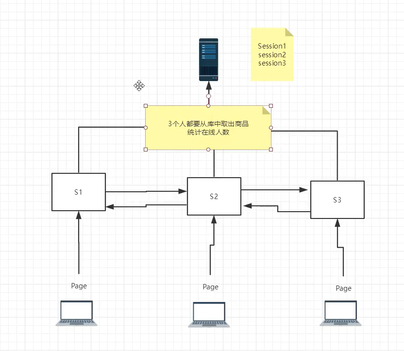


#### 8.6、JSP标签、JSTL标签、EL表达式

```xml
<!-- https://mvnrepository.com/artifact/javax.servlet.jsp.jstl/jstl-api -->
<dependency>
    <!--            jstl表达式的依赖-->
    <groupId>javax.servlet.jsp.jstl</groupId>
    <artifactId>jstl-api</artifactId>
    <version>1.2</version>
</dependency>
<!-- https://mvnrepository.com/artifact/taglibs/standard -->
<dependency>
    <groupId>taglibs</groupId>
    <artifactId>standard</artifactId>
    <version>1.1.2</version>
</dependency>
```


EL表达式：${}

- **获取数据**
- **执行运算**
- **获取web开发的常用对象**


**jsp标签**

```jsp
<%--
http://localhost:8080/jsptag.jsp?name=pengfei&age=23
--%>
    <jsp:forward page="/jsptag1.jsp">
        <jsp:param name="name" value="pengfei"/>
        <jsp:param name="age" value="23"/>
    </jsp:forward>
```

```jsp
<%--取参数--%>
姓名：<%=request.getParameter("name")%>
年龄：<%=request.getParameter("age")%>
```


**JSTL表达式**

jstl标签库的使用就是为了弥补HTML标签的不足；它自定义许多标签，可以供我们使用，标签的功能和Java代码一样！

**核心标签（掌握部分）**

**格式化标签**

**SQL标签**

**XML标签**


**JSTL标签库使用步骤**

- 引入对应的taglib
- 使用其中的方法
- **在tomcat也需要引入jstl的包，否则会报错：jstl解析错误**


```jsp
<%--引入jstl核心标签库，--%>
<%@ taglib prefix="c" uri="http://java.sun.com/jsp/jstl/core" %>
<%@ page contentType="text/html;charset=UTF-8" language="java" %>
<html>
<head>
    <title>Title</title>
</head>
<body>
<h4>if测试</h4>
<hr>
<form action="coreif.jsp" method="get">
<%--
    EL表达式获取表单中的数据
    ${param.参数名}
--%>
    <input type="text" name="username" value="${param.username}">
    <input type="submit" value="登录">
</form>

<%--判断如果提交的用户名是管理员，则登录成功--%>
<c:if test="${param.username=='admin'}" var="isAdmin">
    <c:out value="管理员欢迎您"></c:out>
</c:if>
<%--自闭和标签--%>
<c:out value="${isAdmin}"></c:out>
</body>
</html>

```

```jsp
<%--定义一个变量score,值为85--%>
<c:set var="score" value="85"></c:set>

<c:choose>
    <c:when test="${score>=90}">
        你的成绩为优秀
    </c:when>
    <c:when test="${score>=80}">
        你的成绩为良好
    </c:when>
    <c:when test="${score>=70}">
        你的成绩为一般
    </c:when>
    <c:when test="${score<=60}">
        你的成绩为不及格
    </c:when>
</c:choose>
```

```jsp
<%
    ArrayList<String> people = new ArrayList<String>();
    people.add(0,"张三");
    people.add(1,"李四");
    people.add(2,"王五");
    people.add(3,"张柳");

  request.setAttribute("list",people);
%>
<%--
var,每一次遍历出来的变量
item,要遍历的对象
begin,哪里开始
end,到哪里
step, 步长
--%>
<c:forEach var="people" items="${list}">
    <c:out value="${people}"/> <br>
</c:forEach>
<hr>

<c:forEach var="people" items="${list}" begin="0" end="2" step="1">
    <c:out value="${people}"/> <br>
</c:forEach>
```


### 9、javaBean

------

实体类

JavaBean有特定的写法：

- 必须要有一个无参构造
- 属性必须私有化
- 必须有对应的get\set方法；

一般用来和数据库的字段做映射 ORM；

ORM:对象关系映射

- 表-->类
- 字段-->属性
- 行记录-->对象

**people表**

| id   | name | age  | address |
| ---- | ---- | ---- | ------- |
| 1    | 鹏飞 | 23   | 聊城    |
| 2    | 鹏哥 | 15   | 聊城    |
| 3    | 鹏鹏 | 12   | 聊城    |

```java
class people{
    private int id;
    private String name;
    private int age;
    private String adress;
}

class A{
    new People(1,"鹏飞",3,"聊城")；
}
```

```java
package com.peng.pojo;

// 实体类 我们一般都是和数据库中的表结构一一对应
public class People {
    private int id;
    private String name;
    private int age;
    private String adress;

    public People(){}
    public People(int id, String name, int age, String adress) {
        this.id = id;
        this.name = name;
        this.age = age;
        this.adress = adress;
    }

    public int getId() {
        return id;
    }

    public void setId(int id) {
        this.id = id;
    }

    public String getName() {
        return name;
    }

    public void setName(String name) {
        this.name = name;
    }

    public int getAge() {
        return age;
    }

    public void setAge(int age) {
        this.age = age;
    }

    public String getAdress() {
        return adress;
    }

    public void setAdress(String adress) {
        this.adress = adress;
    }
}

```

```jsp
<%@ page import="com.peng.pojo.People" %>
<%@ page contentType="text/html;charset=UTF-8" language="java" %>
<html>
<head>
    <title>Title</title>
</head>
<body>
<%
//    People people = new People();
//    people.setAdress();
//    people.setId();
//    people.setAge();
//    people.setName();
%>
<%--<%= people.getAdress()%>--%>
<jsp:useBean id="people" class="com.peng.pojo.People" scope="page"/>

<jsp:setProperty name="people" property="id" value="1"/>
<jsp:setProperty name="people" property="name" value="鹏飞"/>
<jsp:setProperty name="people" property="age" value="23"/>
<jsp:setProperty name="people" property="adress" value="聊城"/>

id:<jsp:getProperty name="people" property="id"/>
姓名：<jsp:getProperty name="people" property="name"/>
年龄：<jsp:getProperty name="people" property="age"/>
地址：<jsp:getProperty name="people" property="adress"/>
</body>
</html>

```


### 10、MVC三层架构

------

什么是MVC:Model View Controller 模型、视图、控制器

#### 10.1、早些年

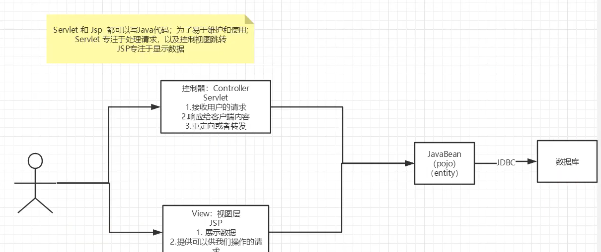

用户直接访问控制层，控制层就可以直接操作数据库；

```java
servlet--CRUD-->数据库
    弊端：程序十分臃肿，不利于维护  servlet的代码中：处理请求、响应、视图跳转、处理JDBC、处理业务代码、处理逻辑代码

    架构：没有什么是加一层解决不了的！
    程序员调用
    |
    JDBC
    |
    MYSQL Oracle SqlServer
```

#### 10.2、MVC三层架构

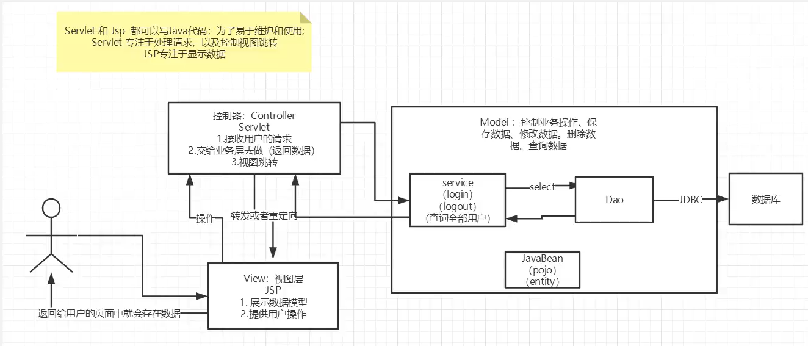


Model

- 业务处理：业务逻辑（Service）
- 数据持久层：CEUD (Dao)

View

- 展示数据
- 提供链接发起Servlet请求（a，from,img...）

Controller （Servlet）

- 接收用户的请求：（request：请求参数、Session信息...）

- 交给业务层处理对应的代码

- 控制视图的跳转

  ```
  登录-->接收用户的登录请求-->处理用户的请求（获取用户登录的参数，username，password）-->交给业务层处理登录业务（判断用户名密码是否正确：事务）-->Dao层查询用户名和密码是否正确-->数据库
  ```


### 11、Filter（重点）

------

Filter:过滤器，用来过滤网站的数据；

- 处理中文乱码
- 登录验证...

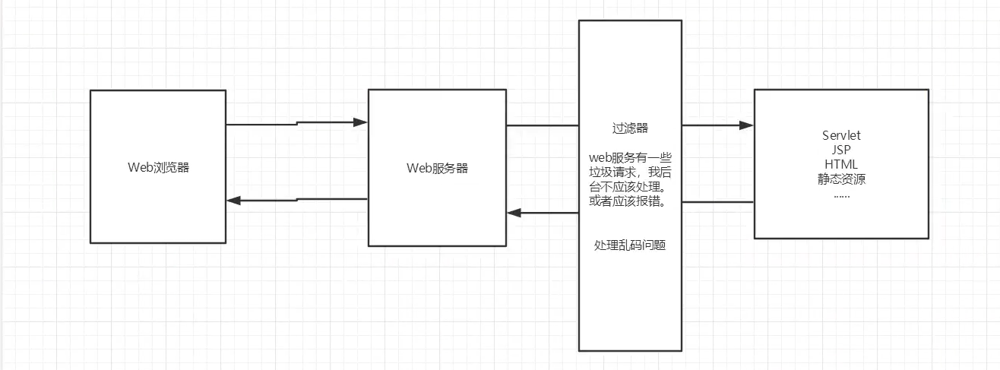

Filter开发步骤：

1. 导包

2. 编写过滤器

   1. 导包不要错
   2. 实现Filter接口，重写对应的方法即可

   ```java
   package com.peng.filter;
   
   import javax.servlet.*;
   import java.io.IOException;
   
   public class CharacterEncodingFilter implements Filter {
       //初始化 web服务器启动，就已经初始化了，随时等待过滤对象启动
       @Override
       public void init(FilterConfig filterConfig) throws ServletException {
           System.out.println("CharacterEncoding已经初始化了");
       }
   
       @Override
       public void doFilter(ServletRequest servletRequest, ServletResponse servletResponse, FilterChain filterChain) throws IOException, ServletException {
           //Chain ：链
   //        过滤器中的所有代码，在过滤特定请求的时候都会执行
   //        必须要让过滤器继续执行 filterChain.doFilter(servletRequest,servletResponse);
   //
           servletRequest.setCharacterEncoding("utf-8");
           servletResponse.setCharacterEncoding("utf-8");
           servletResponse.setContentType("text/html;charset=utf-8");
   
           System.out.println("CharacterEncoding执行前");
           filterChain.doFilter(servletRequest,servletResponse);//让我们的请求继续走，如果不写，程序到这里就被拦截停止了
           System.out.println("CharacterEncoding执行后");
       }
       //销毁 web服务器关闭的时候，过滤被销毁
       @Override
       public void destroy() {
           System.out.println("CharacterEncoding已经销毁了了");
       }
   }
   
   ```

3. 在web.xml中配置Filter

   ```xml
   <filter>
       <filter-name>CharacterEcodingFilter</filter-name>
       <filter-class>com.peng.filter.CharacterEncodingFilter</filter-class>
   </filter>
   <filter-mapping>
       <filter-name>CharacterEcodingFilter</filter-name>
       <!-- 只要是/servlet下的任何请求，都会经过这个过滤器-->
       <url-pattern>/servlet/*</url-pattern>
   </filter-mapping>
   ```


### 12、监听器

------

实现一个监听器的接口；（有N种）

1. 编写一个监听器

​	实现监听器里的接口

```java
package com.peng.listener;

import javax.servlet.ServletContext;
import javax.servlet.http.HttpSessionEvent;
import javax.servlet.http.HttpSessionListener;

//统计网站在线人数：统计session
public class OnlineCountListener implements HttpSessionListener {
    //创建session监听 看你的一举一动
//    一旦创建Session就会触发一次这个事件！
    @Override
    public void sessionCreated(HttpSessionEvent httpSessionEvent) {
        ServletContext ctx = httpSessionEvent.getSession().getServletContext();
        System.out.println(httpSessionEvent.getSession().getId());
        Integer onlineCount = (Integer) ctx.getAttribute("OnlineCount");
        if (onlineCount == null){
            onlineCount = 1;
        }else {
            int count = onlineCount.intValue();
            onlineCount = count+1;
        }
        ctx.setAttribute("OnlineCount",onlineCount);
    }

    //销毁session监听
    //    一旦销毁Session就会触发一次这个事件！
    @Override
    public void sessionDestroyed(HttpSessionEvent httpSessionEvent) {
        ServletContext ctx = httpSessionEvent.getSession().getServletContext();
        Integer onlineCount = (Integer) ctx.getAttribute("OnlineCount");
        if (onlineCount == null){
            onlineCount = 0;
        }else {
            int count = onlineCount.intValue();
            onlineCount = count-1;
        }
        ctx.setAttribute("OnlineCount",onlineCount);
    }
//    Session 销毁：
//    手动销毁 getSession().invalidate();
//    自动销毁
}

```

```jsp
  <h1>当前有<span style="color: aqua"><%=this.getServletConfig().getServletContext().getAttribute("OnlineCount")%></span>人在线</h1>
```


2.在web.xml种注册监听器

```xml
<!--    注册监听器-->
<listener>
    <listener-class>com.peng.listener.OnlineCountListener</listener-class>
</listener>

<session-config>
    <session-timeout>1</session-timeout>
</session-config>
```

3.看情况是否使用！


### 13、过滤器、监听器常见应用

------

**监听器：GUI编程中经常使用；**

```java
package com.peng.listener;

import java.awt.*;
import java.awt.event.WindowAdapter;
import java.awt.event.WindowEvent;

public class test {
    public static void main(String[] args) {
        Frame frame = new Frame("中秋快乐"); //新建一个窗体
        Panel panel = new Panel(null); // 面板

        frame.setLayout(null); //设置窗体的布局

        frame.setBounds(300,300,500,500);
        frame.setBackground(new Color(0,0,255)); // 设置背景颜色

        panel.setBounds(50,50,300,300);
        panel.setBackground(new Color(0,255,0));

        frame.add(panel);

        frame.setVisible(true);

        //监听事件，关闭事件
        frame.addWindowListener(new WindowAdapter() {
            @Override
            public void windowClosing(WindowEvent e) {
                System.out.println("关闭ing");
                System.exit(0);
            }
        });
    }
}

```


用户登录之后才能进入主页！用户注销后就不能进入主页了（拦截器）

1. 用户登录之后，向Session中放入用户的数据
2. 进入主页的时候要判断用户是否已经登录；要求：在过滤器中使用

```java
package com.peng.filter;

import com.peng.util.Constant;

import javax.servlet.*;
import javax.servlet.http.HttpServletRequest;
import javax.servlet.http.HttpServletResponse;
import java.io.IOException;

public class SysFilter implements Filter {
    @Override
    public void init(FilterConfig filterConfig) throws ServletException {

    }

    @Override
    public void doFilter(ServletRequest servletRequest, ServletResponse servletResponse, FilterChain filterChain) throws IOException, ServletException {
        // ServletRequest  HttpServletRequest
        HttpServletRequest request = (HttpServletRequest) servletRequest;
        HttpServletResponse response = (HttpServletResponse) servletResponse;


        if (request.getSession().getAttribute(Constant.USER_SESSION) == null){
            response.sendRedirect("/error.jsp");
        }

        filterChain.doFilter(servletRequest,servletResponse);
    }

    @Override
    public void destroy() {

    }
}
```

```java
package com.peng.util;

public class Constant {
    public final static String USER_SESSION = "USER_SESSION";
}
```

**登录**

```java
package com.peng.servlet;

import com.peng.util.Constant;

import javax.servlet.ServletException;
import javax.servlet.http.HttpServlet;
import javax.servlet.http.HttpServletRequest;
import javax.servlet.http.HttpServletResponse;
import java.io.IOException;

public class LoginServlet extends HttpServlet {
    @Override
    protected void doGet(HttpServletRequest req, HttpServletResponse resp) throws ServletException, IOException {
       //获取前端请求的参数
        String username = req.getParameter("username");
        if (username.equals("admin")){
            //登录成功
            req.getSession().setAttribute(Constant.USER_SESSION,req.getSession().getId());
            resp.sendRedirect("/sys/success.jsp");
        }else {
            //登录失败
            resp.sendRedirect("/error.jsp");
        }    }

    @Override
    protected void doPost(HttpServletRequest req, HttpServletResponse resp) throws ServletException, IOException {
        doGet(req, resp);
    }
}
```

```jsp
<h1>登录</h1>
<form action="/servlet/login" method="post">
    <input type="text" name="username">
    <input type="submit">
</form>
```

**注销**

```java
package com.peng.servlet;

import com.peng.util.Constant;

import javax.servlet.ServletException;
import javax.servlet.http.HttpServlet;
import javax.servlet.http.HttpServletRequest;
import javax.servlet.http.HttpServletResponse;
import java.io.IOException;

public class LogoutServlet extends HttpServlet {
    @Override
    protected void doGet(HttpServletRequest req, HttpServletResponse resp) throws ServletException, IOException {
        Object user_session = req.getSession().getAttribute(Constant.USER_SESSION);

        if (user_session!=null){
            req.getSession().removeAttribute(Constant.USER_SESSION);
            resp.sendRedirect("/login.jsp");
        }else {
            resp.sendRedirect("/login.jsp");
        }
    }

    @Override
    protected void doPost(HttpServletRequest req, HttpServletResponse resp) throws ServletException, IOException {
        doGet(req, resp);
    }
}
```

```jsp
<h1>主页</h1>
<p><a href="/servlet/logout">注销</a></p>
```

**错误**

```jsp
<h1>错误</h1>
<h3>没有权限或密码错误</h3>

<a href="/login.jsp">返回登录页面</a>
```


### 14、JDBC

------

什么是JDBC:java连接数据库！

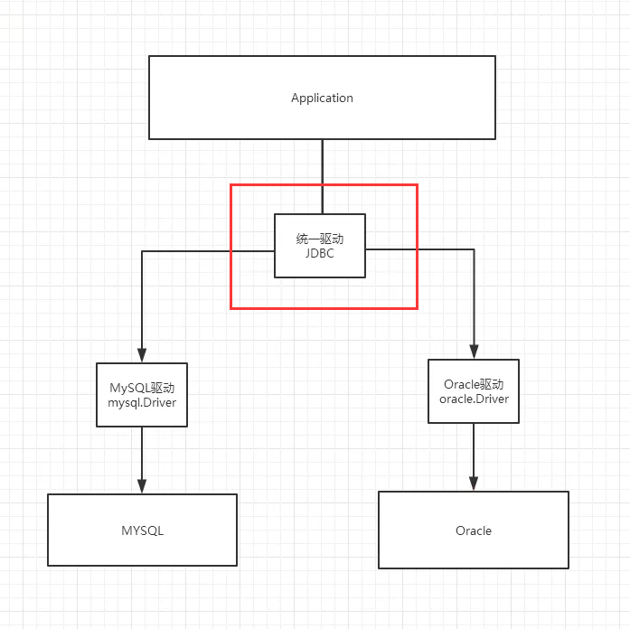

需要jar包的支持：

- java.sql
- javax.sql
- mysql-conneter-java...  连接驱动（必须要导）


**实验环境搭建**

```sql
CREATE TABLE users(
id INT PRIMARY KEY,
`name` VARCHAR(40),
`password` VARCHAR(40),
email VARCHAR(60),
birthday DATE

);

INSERT INTO users(id,`name`,`password`,email,birthday)
VALUES(1,'鹏飞','123456','zsa@qq.com','2000-01-01');

INSERT INTO users(id,`name`,`password`,email,birthday)
VALUES(2,'李四','123456','zs@qq.com','2000-02-01');

INSERT INTO users(id,`name`,`password`,email,birthday)
VALUES(3,'王五','123456','zsas@qq.com','2020-01-01');
```

导入数据库依赖

```xml
<dependencies>
    <dependency>
        <!--mysql的驱动-->
        <groupId>mysql</groupId>
        <artifactId>mysql-connector-java</artifactId>
        <version>8.0.28</version>
    </dependency>
</dependencies>
```

idea中连接数据库


**JDBC固定步骤**

1. 加载驱动
2. 连接数据库
3. 向数据库发送Sql的对象 Statement :CRUD
4. 编写SQL(根据业务，不同的SQL)
5. 执行SQL
6. 关闭连接


```java
package com.peng.test;

import java.sql.*;

public class testjdbc {
    public static void main(String[] args) throws ClassNotFoundException, SQLException {
        //配置说明
        //useUnicode=true&characterEncoding=utf-8解决中文乱码
        String url = "jdbc:mysql://localhost:3306/jdbc1?useUnicode=true&characterEncoding=utf-8";
        String username = "root";
        String password = "";
        //加载驱动
        Class.forName("com.mysql.cj.jdbc.Driver");

        //获取数据库连接 代表数据库
        Connection connection = DriverManager.getConnection(url, username, password);
        //向数据库发送Sql的对象 Statement :CRUD
        Statement statement = connection.createStatement();
        //编写SQL

        String sql = "select * from users";

        //执行查询SQL，返回一个ResultSet 结果集
        ResultSet resultSet = statement.executeQuery(sql);

        while (resultSet.next()){
            System.out.println("id="+resultSet.getObject("id"));
            System.out.println("name="+resultSet.getObject("name"));
            System.out.println("password="+resultSet.getObject("password"));
            System.out.println("email="+resultSet.getObject("email"));
            System.out.println("birthday="+resultSet.getObject("birthday"));
        }
        //关闭连接释放资源 先开后关

        resultSet.close();
        statement.close();
        connection.close();
    }
}
```


预编译SQL

```java
package com.peng.test;

import java.sql.*;

public class testjdbc1 {
    public static void main(String[] args) throws ClassNotFoundException, SQLException {
        //配置说明
        //useUnicode=true&characterEncoding=utf-8解决中文乱码
        String url = "jdbc:mysql://localhost:3306/jdbc1?useUnicode=true&characterEncoding=utf-8";
        String username = "root";
        String password = "";
        //加载驱动
        Class.forName("com.mysql.cj.jdbc.Driver");

        //获取数据库连接 代表数据库
        Connection connection = DriverManager.getConnection(url, username, password);
        //编写SQL
        String sql = "insert into users(id, name, password, email, birthday) values (?,?,?,?,?);";
        //预编译
        PreparedStatement preparedStatement = connection.prepareStatement(sql);

        preparedStatement.setInt(1,4);// 给第一个占位符的值赋值为1
        preparedStatement.setString(2,"鹏飞1");
        preparedStatement.setString(3,"1234567");
        preparedStatement.setString(4,"asd@qq.com");
        preparedStatement.setDate(5,new Date(new java.util.Date().getTime()));

        //执行sql
        int i = preparedStatement.executeUpdate();

        if (i>0){
            System.out.println("插入成功");
        }
        //关闭连接释放资源 先开后关
        preparedStatement.close();
        connection.close();
    }
}

```


**事务**

要么都成功，要么都失败！

ACID原则：保证数据的安全。

```java
开启事务
事务提交  commit()
事务回滚  rollback（）
关闭事务

转账：
A:1000
B:1000

A(900) -- 100--> B(1100)
```


**Junit单元测试**

依赖

```xml
<dependency>
    <!--单元测试-->
    <groupId>junit</groupId>
    <artifactId>junit</artifactId>
    <version>4.13.2</version>
</dependency>
```

简单使用

@Test注解只有在方法上有效，只要加了这个注解的方法，就可以直接运行

```java
@Test
public void test(){
    System.out.println("hello");
}
```

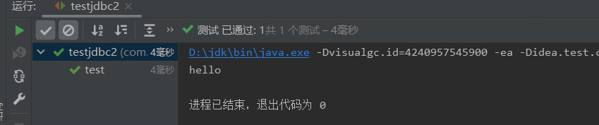

失败的时候

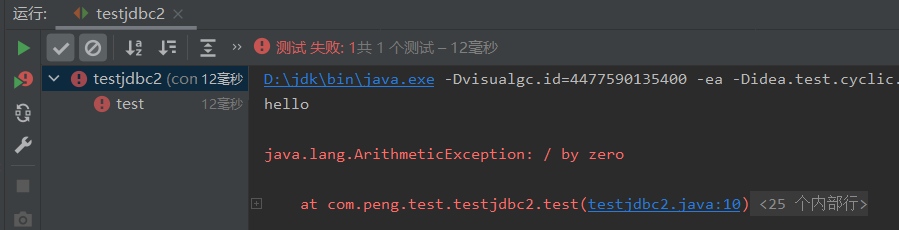


搭建一个环境

```java
package com.peng.test;

import org.junit.Test;

import java.sql.Connection;
import java.sql.DriverManager;
import java.sql.SQLException;

public class testjdbc2 {

    @Test
    public void test() {
        //配置说明
        //useUnicode=true&characterEncoding=utf-8解决中文乱码
        String url = "jdbc:mysql://localhost:3306/jdbc1?useUnicode=true&characterEncoding=utf-8";
        String username = "root";
        String password = "";
        Connection connection =null;
                //加载驱动
        try{
        Class.forName("com.mysql.cj.jdbc.Driver");

        //获取数据库连接 代表数据库
       connection = DriverManager.getConnection(url, username, password);
        //通知数据库开启事务 false:开启
        connection.setAutoCommit(false);
        String sql = "update account set money = money-100 where name='A'";
        connection.prepareStatement(sql).executeUpdate();

        //制造错误
//        int i = 1/0;
        String sql1 = "update account set money = money+100 where name='B'";
        connection.prepareStatement(sql1).executeUpdate();

        connection.commit();//以上两天SQL都执行成功了就提交事务
        System.out.println("执行成功");}
        catch (Exception e){
            try {
                //如果出现异常，就通知数据库回滚事务
                connection.rollback();
            } catch (SQLException ex) {
                ex.printStackTrace();
            }
            e.printStackTrace();
        }finally {
            try {
                connection.close();
            } catch (SQLException e) {
                e.printStackTrace();
            }
        }
    }}

```


### 15、文件上传

------

#### 1.准备工作

对于文件上传，浏览器在上传的过程中是将文件以流的形式提交到服务器端的

一般选择采用apache的开源工具common-fileupload这个文件上传组件

common-fileupload是依赖于common-io这个包的，所以还需要下载这个包


**我们下载最新的jar包**

- https://mvnrepository.com/artifact/commons-fileupload/commons-fileupload
- https://mvnrepository.com/artifact/commons-io/commons-io

**maven:**

```xml
<!-- https://mvnrepository.com/artifact/commons-io/commons-io -->
<dependency>
    <groupId>commons-io</groupId>
    <artifactId>commons-io</artifactId>
    <version>2.11.0</version>
</dependency>

<!-- https://mvnrepository.com/artifact/commons-fileupload/commons-fileupload -->
<dependency>
    <groupId>commons-fileupload</groupId>
    <artifactId>commons-fileupload</artifactId>
    <version>1.4</version>
</dependency>
```


在Javaweb项目中导入jar包

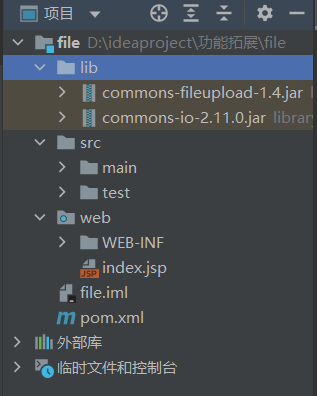

#### 2.实用类介绍

==文件上传的注意事项（面试题）==

1. 为保证服务器安全，上传文件应该放在外界无法直接访问的目录下，比如放于WEB-INF目录下
2. 为防止文件覆盖的现象发生，要为上传文件产生一个唯一的文件名
3. 要限制上传文件的最大值
4. 可以限制上传文件的类型，在收到上传文件名时，判断后缀名是否合法


==需要用到的类详解==

**ServletFileUpload**负责处理上传的文件数据，并将表单中每个输入项装成一个Fileitem对象，在使用**ServletFileUpload**对象解析请求时需要**DiskFileitemFactory**对象。所以，我们需要在进行解析工作前构造好**DiskFileitemFactory**对象，通过**ServletFileUpload**对象的构造方法或**setFileitemFactory**()方法设置**ServletFileUpload**对象的**fileitemFactory**属性


**Fileitem类**

在HTML页面input必须有 name`<input type = "file" name = "filename">`


表单如果包含一个文件上传输入项的话，这个表单的enctype属性就必须设置为multipart/form-data

```jsp
<%@ page contentType="text/html;charset=UTF-8" language="java" %>
<html>
  <head>
    <title>$Title$</title>
  </head>
  <body>
<%--  通过表单上传文件
  get：上传文件大小有限制
  post:上传文件大小没有限制
--%>
<%--${pageContext.request.contextPath}获取服务器路径--%>
  <form action="${pageContext.request.contextPath}/upload.do" method="post" enctype="multipart/form-data">
    上传用户：<input type="text" name="username"> <br>
       <p><input type="file" name="file1"></p>
       <p><input type="file" name="file1"></p>

       <p><input type="submit"> | <input type="reset"></p>
  </form>
  </body>
</html>
```

浏览器表单的类型如果为multipart/form-data，在服务器端想要获取数据就要通过流。


```java
//isFormField方法用于判断FileItem类对象封装的数据是一个普通文本表单
//还是一个文件表单，如果是普通表单字段则返回true,否则返回false
boolean isFormField();

//getFieldName方法用于返回表单标签name属性的值
String getFieldName();
//getString方法用于将FileItem对象中保存的数据流内容以一个字符串返回
String getString();

//getName方法用于获取文件上传字段中的文件名
String getName();

//以流的形式返回上传文件的数据内容
InputStream getInputStream()
    
//delet方法用来清空FileItem类对象中存放的主体内容
//如果主体内容被保存在临时文件中，delete方法将删除该临时文件
 void delete();
```


**ServletFileUpload类**

ServletFileUpload负责处理上传的文件数据，并将表单中每个输入项封装成一个FileItem对象中，使用其parseRequest(HttpServletRequest)方法可以将通过表单中每一个HTML标签提交的数据封装成一个FileItem对象，然后以List列表的形式返回。使用该方法处理上传文件简单易用。


#### 3.代码编写

```java
package com.peng;

import org.apache.commons.fileupload.FileItem;
import org.apache.commons.fileupload.FileUploadException;
import org.apache.commons.fileupload.ProgressListener;
import org.apache.commons.fileupload.disk.DiskFileItemFactory;
import org.apache.commons.fileupload.servlet.ServletFileUpload;

import javax.servlet.ServletException;
import javax.servlet.http.HttpServlet;
import javax.servlet.http.HttpServletRequest;
import javax.servlet.http.HttpServletResponse;
import java.io.File;
import java.io.FileOutputStream;
import java.io.IOException;
import java.io.InputStream;
import java.util.List;
import java.util.UUID;

public class FileServlet extends HttpServlet {

    protected void doPost(HttpServletRequest request, HttpServletResponse response) throws ServletException, IOException {
        //判断上传的表单是普通表单还是带文件的表单，是返回true,否返回false；
        if (!ServletFileUpload.isMultipartContent(request)){
            return;//如果这是一个普通文件我们直接返回
        }//如果通过了这个if，说明我们的表单是带文件上传的

        //创建上传文件的保存目录，为了安全建议在WEB-INF目录下，用户无法访问
        String uploadpath = this.getServletContext().getRealPath("WEB-INF/Upload");//获取上传文件的保存路径
        File uploadfile = new File(uploadpath);
        if (!uploadfile.exists()){
            uploadfile.mkdir();//如果目录不存在就创建这样一个目录
        }

        //临时文件
        //临时路径，如果上传的文件超过预期的大小，我们将它存放到一个临时目录中，过几天自动删除，或者提醒用户转存为永久
        String tmppath = this.getServletContext().getRealPath("WEB-INF/tmp");
        File file = new File(tmppath);
        if (!file.exists()){
            file.mkdir();//如果目录不存在就创建这样临时目录
        }

        //处理上传的文件一般需要通过流来获取，我们可以通过request.getInputstream(),原生态文件上传流获取，十分麻烦
        //但是我们都建议使用Apache的文件上传组件来实现，common-fileupload,它需要依赖于common-io组件；

        try {
            //1、创建DiskFileItemFactory对象，处理文件上传路径或限制文件大小
            DiskFileItemFactory factory = gteDiskFileItemFactory(file);
            //2、获取ServletFileUpload
            ServletFileUpload upload = getServletFileUpload(factory);
            //3、处理上传文件
            String msg = uploadParseRequest(upload,request,uploadpath);
            //Servlet请求转发消息
            request.setAttribute("msg",msg);
            request.getRequestDispatcher("/info.jsp").forward(request,response);
        }catch (FileUploadException e){
            e.printStackTrace();
        }
    }
    public static DiskFileItemFactory gteDiskFileItemFactory(File file){
        //1、创建DiskFileItemFactory对象，处理文件上传路径或限制文件大小
        DiskFileItemFactory factory = new DiskFileItemFactory();
        //通过这个工厂设置一个缓冲区，当上传的文件大小大于缓冲区的时候，将它放到临时文件中；
        factory.setSizeThreshold(1024 * 1024);//缓冲区大小为1M
        factory.setRepository(file);
        return factory;
    }
    public static ServletFileUpload getServletFileUpload(DiskFileItemFactory factory){
        //2、获取ServletFileUpload
        ServletFileUpload upload = new ServletFileUpload(factory);
        //监听文件上传进度
        upload.setProgressListener((pBytesRead, lpContentLenght, i) -> {
            //pBytesRead:已读取到的文件大小
            //pContentLenght：文件大小
            System.out.println("总大小："+lpContentLenght+"已上传："+pBytesRead);
        });

        //处理乱码问题
        upload.setHeaderEncoding("UTF-8");
        //设置单个文件的最大值
        upload.setFileSizeMax(1024 * 1024 * 10);
        //设置总共能够上传文件的大小
        //1024 = 1kb * 1024 = 1M * 10 = 10M
        upload.setSizeMax(1024 * 1024 * 10);
        return upload;
    }
    public static String uploadParseRequest(ServletFileUpload upload,HttpServletRequest request,String uploadpath) throws IOException, FileUploadException {
        String msg = "";
        //3、处理上传文件
        //ServletFileUpload对象把前端的请求解析，封装成一个FileItem对象
        List<FileItem> fileItems = upload.parseRequest(request);
        for (FileItem fileItem : fileItems) {
            if (fileItem.isFormField()){ //判断是普通表单还是带文件的表单
                //getFieldName指的是前端表单控件的name
                String name = fileItem.getFieldName();
                String value = fileItem.getString("UTF-8");//处理乱码
                System.out.println(name+":"+value);
            }else {//判断它是带文件的表单

                //======================处理文件=======================//

                //拿到文件的名字
                String uploadFileName = fileItem.getName();
                System.out.println("上传的文件名："+uploadFileName);
                //返回一个字符串，其值为此字符串，并删除任何前导和尾随空格。
                if (uploadFileName.trim().equals("") || uploadFileName == null){
                    continue;
                }

                //获得上传的文件名，例如/img/girl/ooa.jpg,只需要ooa，其前面的后面的都不需要
                String fileName = uploadFileName.substring(uploadFileName.lastIndexOf("/") + 1);
                System.out.println("fileName："+uploadFileName);
                //获得文件的后缀名
                String fileExtName = uploadFileName.substring(uploadFileName.lastIndexOf(".") + 1);
                      /*
                        如果文件后缀名fileExtName不是我们所需要的
                        就直接return，不处理，告诉用户文件类型不对
                     */

                //可以使用UUID(唯一识别的通用码),保证文件名唯一
                //UUID.randomUUID，随机生一个唯一识别的通用码

                //网络传输中的东西，都需要序列化
                //pojo，实体类，如果想要在多个电脑运行，传输--->需要吧对象都序列化了
                //JNI=java Native Interface
                //implements Serializable ：标记接口，JVM--->java栈 本地方法栈 native-->c++

                System.out.println("文件信息【文件名："+fileName+"文件类型："+fileExtName+"】");

                //可以使用UUID(唯一通用识别码)来保证文件名的统一
                String uuidFileName = UUID.randomUUID().toString();


                //=======================传输文件=========================//
                //获得文件上传的流
                InputStream inputStream = fileItem.getInputStream();

                //创建一个文件输出流
                FileOutputStream fos = new FileOutputStream(uploadpath + "/" + uuidFileName +"."+ fileExtName);

                //创建一个缓冲区
                byte[] buffer = new byte[1024 * 1024];

                //判断是否读取完毕
                int len = 0;

                //如果大于0，说明还存在数据
                while ((len=inputStream.read(buffer))>0){
                    fos.write(buffer,0,len);
                }
                //关闭流
                fos.close();
                inputStream.close();
                msg = "文件上传成功！";
                fileItem.delete();//上传成功，清除临时文件
            }
        }

        return msg;
    }
}
```

```jsp
<%@ page contentType="text/html;charset=UTF-8" language="java" %>
<html>
<head>
    <title>Title</title>
</head>
<body>
${msg}
</body>
</html>
```


### 16、收发邮件

------

#### 1.电子邮件

要在网络上实现邮件功能，必须要有专门的**邮件服务器。**

这些邮件服务器类似于现实生活中的邮局，它主要负责接收用户投递过来的邮件，并把邮件投递到邮件接收者的电子邮箱中。

SMTP服务器地址：一般是 smtp.xxx.com，比如163邮箱是smtp.163.com，qq邮箱是smtp.qq.com。

电子邮箱(E-Mail地址)的获得需要在邮件服务器上进行申请。比如我们要使用QQ邮箱，就需要开通邮箱功能;


#### 2.传输协议

SMTP协议

**发送邮件：**

我们通常把处理用户smtp请求（邮件发送请求）的服务器称之为Smtp服务器（邮件发送服务器）

POP3协议

**接收邮件：**

我们通常把处理用户pop3请求（邮件接收请求）的服务器称之为POP3服务器（邮件接收服务器）


**邮件收发原理：**

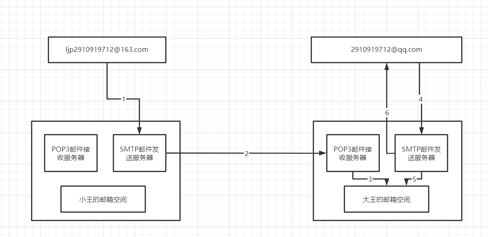


1.小王通过smtp协议连接到Smtp服务器，然后发送一封邮件给网易的邮件服务器

2.网易分析发现需要去QQ的邮件服务器，通过smtp协议将邮件转投给QQ的Smtp服务器

3. QQ将接收到的邮件存储在2910919712@qq.com这个邮件账号的空间中
4. 大王通过Pop3协议连接到Pop3服务器收取邮件
5. 从2910919712@qq.com这个邮件账号的空间中取出邮件
6. Pop3服务器将取出来的邮件送到大王手中


【注意】有可能你收件人地址，发件人地址等信息都正确了，控制台也打印了正确的信息，但是在收件箱就是收不到信息。这是因为可能收件箱服务器拒收了你发的邮件（比如认为你的邮件是广告），这时候可能在垃圾箱里能找到，可能找不到。解决办法是重复的邮件内容不要多次发送，或者更换收件箱试试


#### 3.Java发送邮件

**概述**

我们将用代码完成邮件的发送。这在实际项目中应用的非常广泛，比如注册需要发送邮件进行账号激活，再比如OA项目中利用邮件进行任务提醒等等。

使用Java发送E-mail 十分简单，但是首先你应该准备JavaMail API和Java Activation Framework。

得到两个jar包：

- mail.jar
- activation.jar

```xml
<!-- https://mvnrepository.com/artifact/javax.mail/mail -->
<dependency>
    <groupId>javax.mail</groupId>
    <artifactId>mail</artifactId>
    <version>1.4.7</version>
</dependency>
```

```xml
<!-- https://mvnrepository.com/artifact/javax.activation/activation -->
<dependency>
    <groupId>javax.activation</groupId>
    <artifactId>activation</artifactId>
    <version>1.1.1</version>
</dependency>
```


JavaMail 是sun公司（现以被甲骨文收购）为方便Java开发人员在应用程序中实现邮件发送和接收功能而提供的一套标准开发包，它支持一些常用的邮件协议，如前面所讲的SMTP，POP3，IMAP,还有MIME等。我们在使用JavaMail API编写邮件时，无须考虑邮件的底层实现细节，只要调用JavaMail 开发包中相应的APl类就可以了。

我们可以先尝试发送一封简单的邮件，确保电脑可以连接网络。

- 创建包含邮件服务器的网络连接信息的Session对象。

- 创建代表邮件内容的Message对象

- 创建Transport对象，连接服务器，发送Message，关闭连接

  

主要有四个核心类，我们在编写程序时，记住这四个核心类，就很容易编写出Java邮件处理程序。


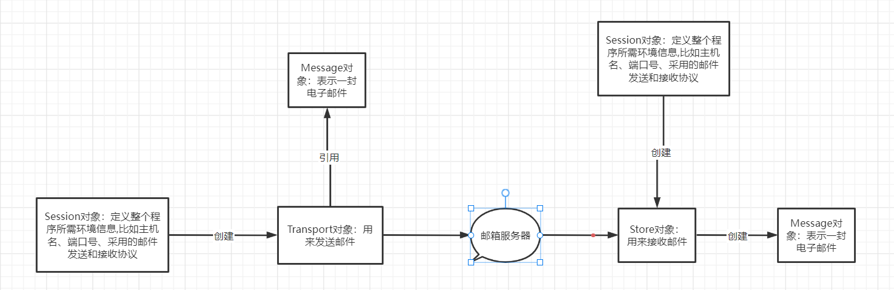

```java
package com.peng;

import com.sun.mail.util.MailSSLSocketFactory;

import javax.mail.*;
import javax.mail.internet.InternetAddress;
import javax.mail.internet.MimeMessage;
import java.security.GeneralSecurityException;
import java.util.Properties;

//发送一封简单的邮件
public class MailDemo {
    public static void main(String[] args) throws GeneralSecurityException, MessagingException {
        Properties prop=new Properties();
        prop.setProperty("mail.host","smtp.qq.com");///设置QQ邮件SMTP服务器
        prop.setProperty("mail.transport.protocol","smtp");//邮件发送协议
        prop.setProperty("mail.smtp.auth","true");//需要验证用户密码 authentication

        //QQ邮箱需要设置SSL加密
        MailSSLSocketFactory sf=new MailSSLSocketFactory();
        sf.setTrustAllHosts(true);
        prop.put("mail.smtp.ssl.enable","true");
        prop.put("mail.smtp.ssl.socketFactory",sf);
        //=========================================使用javaMail发送邮件的5个步骤===========================================
        //1.创建定义整个应用程序所需要的环境信息的session对象
        Session session = Session.getDefaultInstance(prop, new Authenticator() {
            @Override
            protected PasswordAuthentication getPasswordAuthentication() {
                return new PasswordAuthentication("2910919712@qq.com","htthxatnbgvbddii");
            }
        });
        //开启session的debug模式，这样可以查看到程序发送Email的运行状态
        session.setDebug(true);
        //2.通过session得到transport对象
        Transport ts=session.getTransport();
        //3.使用邮箱的用户名和授权码连上邮件服务器 htthxatnbgvbddii
        ts.connect("smtp.qq.com","2910919712@qq.com","htthxatnbgvbddii");
        //4.创建邮件：写文件
        //注意需要传递session
        MimeMessage message=new MimeMessage(session);
        //指明邮件的发件人
        message.setFrom(new InternetAddress("2910919712@qq.com"));
        //指明邮件的收件人
        message.setRecipient(Message.RecipientType.TO,new InternetAddress("2910919712@qq.com"));
        //邮件标题
        message.setSubject("你中奖了");
        //邮件的文本内容
        message.setContent("你妹的！！！","text/html;charset=UTF-8");
        //5.发送邮件
        ts.sendMessage(message,message.getAllRecipients());
        //6.关闭连接
        ts.close();
    }
}
```


#### 4.MIME支持

**多用途互联网邮件扩展**（英语：**M**ultipurpose **I**nternet **M**ail **E**xtensions，缩写：**MIME**）是一个[互联网标准](https://zh.wikipedia.org/wiki/互联网标准)，它扩展了[电子邮件](https://zh.wikipedia.org/wiki/电子邮件)标准，使其能够支持：

- 非[ASCII](https://zh.wikipedia.org/wiki/ASCII)字符文本；
- 非文本格式附件（[二进制](https://zh.wikipedia.org/wiki/二进制)、声音、图像等）；
- 由多部分（multiple parts）组成的消息体；
- 包含非[ASCII](https://zh.wikipedia.org/wiki/ASCII)字符的头信息（Header information）。这个标准被定义在 [RFC 2045](https://tools.ietf.org/html/rfc2045)、[RFC 2046](https://tools.ietf.org/html/rfc2046)、[RFC 2047](https://tools.ietf.org/html/rfc2047)、[RFC 2048](https://tools.ietf.org/html/rfc2048)、[RFC 2049](https://tools.ietf.org/html/rfc2049) 等[RFC](https://zh.wikipedia.org/wiki/RFC)中。

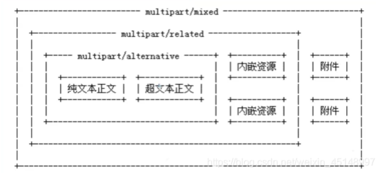


**每一个文本、图片、附件可以分为一个MimeBodyPart，由MimeMultipart完成组装**

```java
        Properties prop = new Properties();
        prop.setProperty("mail.host","smtp.qq.com");///设置QQ邮件服务器
        prop.setProperty("mail.transport.protocol","smtp");///邮件发送协议
        prop.setProperty("mail.smtp.auth","true");//需要验证用户密码
        //QQ邮箱需要设置SSL加密
        MailSSLSocketFactory sf=new MailSSLSocketFactory();
        sf.setTrustAllHosts(true);
        prop.put("mail.smtp.ssl.enable","true");
        prop.put("mail.smtp.ssl.socketFactory",sf);

        //使用javaMail发送邮件的5个步骤
        //1.创建定义整个应用程序所需要的环境信息的session对象
        Session session=Session.getDefaultInstance(prop, new Authenticator() {
            @Override
            protected PasswordAuthentication getPasswordAuthentication() {
                return new PasswordAuthentication("2910919712@qq.com","htthxatnbgvbddii");
            }
        });
        //开启session的debug模式，这样可以查看到程序发送Email的运行状态
        session.setDebug(true);
        //2.通过session得到transport对象
        Transport ts=session.getTransport();
        //3.使用邮箱的用户名和授权码连上邮件服务器
        ts.connect("smtp.qq.com","2910919712@qq.com","htthxatnbgvbddii");
        //4.创建邮件：写文件
        //注意需要传递session
        MimeMessage message=new MimeMessage(session);
        //指明邮件的发件人
        message.setFrom(new InternetAddress("2910919712@qq.com"));
        //指明邮件的收件人
        message.setRecipient(Message.RecipientType.TO,new InternetAddress("2910919712@qq.com"));
        //邮件标题
        message.setSubject("java发出");

        //邮件的文本内容
        //=================================准备图片数据=======================================
        MimeBodyPart image=new MimeBodyPart();
        //图片需要经过数据化的处理
        DataHandler dh=new DataHandler(new FileDataSource("D:\\ForStrong_java\\javaweb\\javaweb-08-sendMail\\src\\20200708003918960.png"));
        //在part中放入这个处理过图片的数据
        image.setDataHandler(dh);
        //给这个part设置一个ID名字
        image.setContentID("bz.jpg");

        //准备正文的数据
        MimeBodyPart text=new MimeBodyPart();
        text.setContent("这是一张正文","text/html;charset=UTF-8");

        //描述数据关系
        MimeMultipart mm=new MimeMultipart();
        mm.addBodyPart(text);
        mm.addBodyPart(image);
        mm.setSubType("related");

        //设置到消息中，保存修改
        message.setContent(mm);
        message.saveChanges();
        //5.发送邮件
        ts.sendMessage(message,message.getAllRecipients());

        //6.关闭连接
        ts.close();

```

