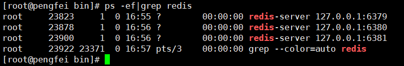

Redis

### 1、NoSql概述

#### 1.1、为什么要用Nosql

> 单机MySQL时代


90年代，一个基本的网站访问量一般不会太大，单个数据库完全足够！

那个时候，更多的去使用静态网页 Html~ 服务器根本没有太大的压力

这种情况下：整个网站的瓶颈是什么？

- 数据量如果太大、一台机器放不下了！
- 数据的索引 （B+Tree）,一个机器内存也放不下
- 访问量（读写混合），一个服务器承受不了

只要开始出现以上三种情况之一，那么就必须要晋级！

> Memcached(缓存)+MySQL+垂直拆分(读写分离)

网站80%的情况都是在读，每次都要去查询数据库的话就十分麻烦！所以说我们要减轻数据库的压力，可以使用缓存来保证效率！

发展过程：优化数据结构和索引 --> 文件缓存（IO）--> Memcached


> 分库分表+水平拆分+MySQL集群

技术和业务在发展的同时，对人的要求也越来越高！

`本质：数据库：(读 写)`

MyISAM:表锁 十分影响效率！高并发下就会出现严重的锁问题

InnoDB：行锁

慢慢的就开始使用分库分表来解决写的压力！Mysql在那个年代推出了表分区！这个并没有多少公司使用！

Mysql集群，很好的满足那个年代的需求


> 如今最近的年代

MySQL等关系型数据库就不够用了！数据量很多，变化很快！

MySQL有的使用它来存储一些较大的文件，博客，图片！数据库表很大，效率就低了！如果有一种数据库来专门处理这种数据，MySQL压力就会变得十分小（研究如何处理这些问题）大数据的IO压力下，表的结构几乎是无法更改的

> 目前一个基本的互联网项目


> 为什么要用NoSQL

用户的个人信息，社交网络，地理位置，用户自己产生的数据，用户日志等等爆发式增长！

这个时候我们就需要使用NoSQL数据库，NoSQL可以很好的处理以上情况！


#### 1.2、什么是NoSQL

NoSQL = Not Only SQL (不仅仅是SQL)

关系型数据库：表格：行，列 （POI）

泛指非关系型数据库，随着web2.0互联网的诞生！传统的关系型数据库很难对付web2.0时代！尤其是超大规模的高并发的社区！暴露出来很多难以克服的问题，NoSQL在当今大数据环境下发展的十分迅速，Redis是发展最快的，而且是我们当下必须要掌握的。

很多的数据类型用户的个人信息，社交网络，地理位置。这些数据类型的存储不需要一个固定的格式！不需要多余的操作就可以横向扩展的！ Map<String,Object> 使用键值对来控制！


> NoSQL特点

解耦！

1. 方便扩展(数据之间没有关系，很好扩展)

2. 大数据量高性能(Redis一秒写8万次，读取11万次，NoSQL的缓存是记录级的，是一种细粒度的缓存，性能会比较高)

3. 数据类型是多样型的！(不需要事先设计数据库！随去随用！如果是数据量十分大的表，很多人就无法设计了)

4. 传统RDBMS和NoSQL

   ```sql
   传统的RDBMS
   - 结构化组织
   - SQL
   - 数据和关系都存在单独的表中
   - 操作，数据定义语言
   - 严格的一致性
   - ...
   ```

   ```sql
   NoSQL
   - 不仅仅是数据
   - 没有固定的查询语言
   - 键值对存储，列存储，文档存储，图形数据库（社交关系）
   - 最终一致性
   - CAP定理 和 BASE  (异地多活)
   - 高性能，高可用，高可扩
   - ....
   ```

   

> 了解：3V+3高

大数据时代的3V：主要是描述问题的

1. 海量（Volume）
2. 多样（Variety）
3. 实时（Velocity）

大数据时代的3高：主要是对程序的要求

1. 高并发
2. 高可扩
3. 高性能


真正在公司中的实践：NoSQL+RDBMS 一起使用才是最强的，阿里巴巴的架构演进


#### 1.3、NoSQL的四大分类

**KV键值对：**

- 新浪：Redis
- 美团：Redis + Tair
- 阿里、百度：Redis + memecache

**文档型数据库（bson格式和json一样）：**

- MongoDB（必须要掌握）
  - MongoDB是一个基于分布式文件存储的数据库，C++编写，主要用来处理大量的文档
  - MongoDB是一个介于关系型数据库和非关系型数据库中间的产品！MongoDB是非关系型数据库中功能最丰富，最像关系型数据库的！
- ConthDB

**列存储数据库：**

- HBase
- 分布式文件系统

**图关系数据库：**

- 他不是存图形，放的是关系，比如：朋友圈社交网络，广告推荐！
- Neo4J、infoGrid


> 四者对比！

| 分类              | Examples举例                                    | 典型应用场景                                                 | 数据模型                                     | 优点                                                         | 缺点                                                         |
| ----------------- | ----------------------------------------------- | ------------------------------------------------------------ | -------------------------------------------- | ------------------------------------------------------------ | ------------------------------------------------------------ |
| 键值对(key-value) | Tokyo Cabinet/Tyrant,Redis,Voldemort,Oracle BDB | 内容缓存，主要用于处理大量数据的高访问负载，也用于一些日志系统等等 | Key指向Value的键值对，通常用hash table来实现 | 查找速度块                                                   | 数据无结构化，通常只被当作字符串或者二进制数据               |
| 列存储数据库      | Cassandra,HBase,Riak                            | 分布式文件系统                                               | 以列簇式存储，将同一列数据存在一起           | 查找速度块，可扩展性强，更容易进行分布式扩展                 | 功能相对局限                                                 |
| 文档型数据库      | CouchDB,MongoDB                                 | Web应用（与Key-Value类似，Value是结构化的，不同的是数据库能够了解Value的内容) | Key-Value对应的键值对Value为结构化数据       | 数据结构要求不严格，表结构可变，不需要像关系型数据库一样需要预先定义表结构 | 查询性能不高，而且缺乏统一的查询语法                         |
| 图形(Graph)数据库 | Neo4J,InfoGrid,Infinite Graph                   | 社交网络，推荐系统等。专注于构建关系图谱                     | 图结构                                       | 利用图结构相关算法。比如最短路径寻址，N度关系查找等          | 很多时候需要对整个图做计算才能得出需要的信息，而且这种结构不太好做分布式的集群方案 |


### 2、Redis入门

#### 2.1、概述

> Redis是什么

Redis(`Re`mote `Di`ctionary `S`erver),即远程字典服务

是一个开源的使用ANSI C语言编写、支持网络、可基于内存亦可持久化的日志型、Key-Value数据库，并提供多种语言的APi.

区别的是redis会周期性的把更新的数据写入磁盘或者把修改操作写入追加的记录文件，并且在此基础上实现了master-slave(主从)同步。

免费和开源！是当下最热门的NoSQL技术之一！也被人们称之为结构化数据库！

> Redis能干嘛？

1、内存存储、持久化（内存中是断电即失）所以说持久化很重要（RDB,aof）

2、效率高，可以用于高速缓存

3、发布订阅系统

4、地图信息分析

5、计时器、计数器（浏览量）

6、......

> 特性

1. 多样的数据类型
2. 持久化
3. 集群
4. 事务

......


> 学习中需要用到的东西

redis官网：https://redis.io/

`Redis推荐都是在Linux服务器上搭建的，我们都是基于Linux学习`


#### 2.2、Window安装

1. 下载安装包：https://github.com/redis/redis

2. 解压到自己的环境目录即可

   

3. 开启Redis 双击服务即可


4.使用reids连接客户端


Window下使用确实简单，但是Redis推荐使用Linux


#### 2.3、Linux安装

1. 下载安装包!

2. 解压Redis的安装包 程序

   

3. 进入解压后的文件，可以看到Redis的配置文件

   

4. 基本的环境安装

   ```bash
   yum install gcc-c++
   
   make
   
   make install
   ```

   

   

5. redis的默认安装路径`usr/local/bin`

   

6. 将redis配置文件复制

   

7. redis默认不是后台启动的，修改配置文件！

   

8. 启动Redis服务！

9. 使用Redis-cli连接

   

   

10. 查看redis的进程是否开启！

    ```bash
    ps -ef|grep
    ```

    

    

    

11. 如何关闭Redis服务？

    

    

12. 再次查看Redis进程

    
    
13. 后面会使用单机多Redis启动集群测试


#### 2.4、测试性能

redis-benchmark是一个压力测试工具

redis-benchmark 命令参数


| 序号 | 选项                      | 描述                                       | 默认值    |
| :--- | :------------------------ | :----------------------------------------- | :-------- |
| 1    | **-h**                    | 指定服务器主机名                           | 127.0.0.1 |
| 2    | **-p**                    | 指定服务器端口                             | 6379      |
| 3    | **-s**                    | 指定服务器 socket                          |           |
| 4    | **-c**                    | 指定并发连接数                             | 50        |
| 5    | **-n**                    | 指定请求数                                 | 10000     |
| 6    | **-d**                    | 以字节的形式指定 SET/GET 值的数据大小      | 2         |
| 7    | **-k**                    | 1=keep alive 0=reconnect                   | 1         |
| 8    | **-r**                    | SET/GET/INCR 使用随机 key, SADD 使用随机值 |           |
| 9    | **-P**                    | 通过管道传输 <numreq> 请求                 | 1         |
| 10   | **-q**                    | 强制退出 redis。仅显示 query/sec 值        |           |
| 11   | **--csv**                 | 以 CSV 格式输出                            |           |
| 12   | ***-l\*（L 的小写字母）** | 生成循环，永久执行测试                     |           |
| 13   | **-t**                    | 仅运行以逗号分隔的测试命令列表。           |           |
| 14   | ***-I\*（i 的大写字母）** | Idle 模式。仅打开 N 个 idle 连接并等待。   |           |

```bash
# 测试：100并发连接  100000请求
redis-benchmark -h localhost -p 6379 -c 100 -n 100000
```


#### 2.5、基础的知识

redis默认有16个数据库


默认使用的是第0个

可以使用select进行切换数据库

```bash
127.0.0.1:6379> select 3 # 切换数据库
OK
127.0.0.1:6379[3]> dbsize  # 查看数据库大小
(integer) 0
```


```bash
127.0.0.1:6379[3]> keys * # 查看数据库所以的key
1) "name"
127.0.0.1:6379[3]> 
```

清除当前数据库`flushdb`

```bash
127.0.0.1:6379[3]> FLUSHDB # 清除当前数据库
OK
127.0.0.1:6379[3]> KEYS *
(empty array)
```

清除全部数据库内容`FLUSHALL`


> Redis是单线程的

明白Redis是很快的，官方表示，Redis是基于内存操作，CPU不是Redis性能瓶颈，Redis的瓶颈是根据机器的内存和网络带宽，既然可以使用单线程来实现，就使用单线程了！所以就使用单线程了！

Redis是C语言写的，官方提供的数据为100000+的QPS,完全不比同样使用key-value的Memecache差！

**Redis为什么单线程还这么块？**

1. 误区1：高性能的服务器一定是多线程的？
2. 误区2：多线程（CPU上下文会切换！）一定比单线程效率高！

先去CPU>内存>硬盘的速度要有所了解

核心：redis是将所有数据全部放在内存中，所有说使用单线程去操作效率就是最高的，多线程（CPU上下文会切换：耗时的操作！！！），对于内存系统来说，如果没有上下文切换效率就是最高的！多次读写都是在一个CPU上的，在内存情况下，这个就是最佳的方案！


### 3、五大数据类型

> 官方文档


Rdis是一个开源(BSD许可)的，内存中的数据结构存储系统，它可以用作**数据库**、**缓存**和**消息中间件MQ**。它支持多种类型的数据结构，如字符串(strings),散列(hashes),列表(lists),集合（sets),有序集合（sorted sets)与范围查询bitmaps,hyperloglogs和地理空间(geospatial)索引半径查询。Redis内置了复制(replication),LUA脚本(Luascripting),LRU驱动事件(LRU eviction),事务（transactions)和不同级别的磁盘持久化(persistence),并通过Redis哨兵(Sentinel)和自动分区(Cluster)提供高可用性(high availability)。

#### 3.1、Redis-Key

```bash
127.0.0.1:6379> set name pengfei
OK
127.0.0.1:6379> KEYS *  # 查看所有的key
1) "name"
127.0.0.1:6379> set age 1  #set key
OK
127.0.0.1:6379> KEYS *
1) "age"
2) "name"
127.0.0.1:6379> EXISTS name  #判断当前的key是否存在
(integer) 1
127.0.0.1:6379> EXISTS name1
(integer) 0
127.0.0.1:6379> move name 1 # 移除当前的key
(integer) 1
127.0.0.1:6379> KEYS *
1) "age"
127.0.0.1:6379> set name pengfei
OK
127.0.0.1:6379> KEYS *
1) "name"
2) "age"
127.0.0.1:6379> 
127.0.0.1:6379> KEYS *
1) "name"
2) "age"
127.0.0.1:6379> get name
"pengfei"
127.0.0.1:6379> EXPIRE name 10 # 设置key的过期时间 单位是秒
(integer) 1
127.0.0.1:6379> ttl name # 查看当前key的剩余时间 单位是秒
(integer) -2
127.0.0.1:6379> get name
(nil)
127.0.0.1:6379> set name pengfei 
OK
127.0.0.1:6379> KEYS *
1) "name"
2) "age"
127.0.0.1:6379> type name # 查看当前key的类型
string
127.0.0.1:6379> type age
string
127.0.0.1:6379> 

```


#### 3.2、String(字符串)

```bash
####################################################
127.0.0.1:6379> set key1 v1 # 设置值
OK
127.0.0.1:6379> get key1 # 获得值
"v1" 
127.0.0.1:6379> keys *  # 获得所有的key
1) "key1"
127.0.0.1:6379> EXISTS key1 #判断某一个key是否存在
(integer) 1
127.0.0.1:6379> append key1 "hello" # 追加字符串，如果当前key不存在，就相当于set key
(integer) 7
127.0.0.1:6379> get key1
"v1hello"
127.0.0.1:6379> STRLEN key1 # 获取字符串的长度
(integer) 7
127.0.0.1:6379> append key1 ",pengfei"
(integer) 15
127.0.0.1:6379> get key1
"v1hello,pengfei"
127.0.0.1:6379> 
#######################################################
# 步长
127.0.0.1:6379> get views 
"0" 
127.0.0.1:6379> incr views # 自增1 浏览量+1
(integer) 1
127.0.0.1:6379> incr views
(integer) 2
127.0.0.1:6379> get views
"2"
127.0.0.1:6379> decr views # 自减1 浏览量-1
(integer) 1
127.0.0.1:6379> decr views
(integer) 0
127.0.0.1:6379> decr views
(integer) -1
127.0.0.1:6379> get views
"-1"
127.0.0.1:6379> INCRBY views 10 # 可以设置步长，指定增量
(integer) 9
127.0.0.1:6379> INCRBY views 10
(integer) 19
127.0.0.1:6379> DECRBY views 5
(integer) 14
127.0.0.1:6379> DECRBY views 5
(integer) 9
####################################################
# 字符串范围 range
127.0.0.1:6379> set key1 "hello,pengfei" # 设置key1值
OK
127.0.0.1:6379> get key1
"hello,pengfei"
127.0.0.1:6379> GETRANGE key1 0 3 #截取字符串 【0，3】
"hell"
127.0.0.1:6379> GETRANGE key1 0 -1 # 获取全部字符串 和get key一样
"hello,pengfei"

# 替换
127.0.0.1:6379> set key2 abcdefg
OK
127.0.0.1:6379> get key2
"abcdefg"
127.0.0.1:6379> SETRANGE key2 1 xx #替换指定位置开始的字符串
(integer) 7
127.0.0.1:6379> get key2
"axxdefg"
####################################################
# setex(set with expire) 设置过期时间
# setnx(set if not exist) 不存在设置（在分布式锁中常常使用）
127.0.0.1:6379> setex key3 30 "hello" # 设置key3值为hello 30 过期
OK
127.0.0.1:6379> ttl key3
(integer) 24
127.0.0.1:6379> get key3
"hello"
127.0.0.1:6379> setnx mykey "redis" # 如果mykey不存在，创建mykey
(integer) 1
127.0.0.1:6379> keys * 
1) "mykey"
127.0.0.1:6379> get key3
(nil)
127.0.0.1:6379> ttl key3
(integer) -2
127.0.0.1:6379> setnx mykey "monggoDB" # 如果mykey存在，创建失败
(integer) 0
127.0.0.1:6379> get mykey
"redis"
####################################################
# mset
# mget
127.0.0.1:6379> mset k1 v1 k2 v2 k3 v3  #同时设置多个值
OK
127.0.0.1:6379> keys *
1) "k3"
2) "k1"
3) "k2"
127.0.0.1:6379> mget k1 k2 k3 # 同时获取多个值
1) "v1"
2) "v2"
3) "v3"
127.0.0.1:6379> msetnx k1 v1 k4 v4  # msetnx 是一个原子性操作，要么一起成功，要么一起失败
(integer) 0
127.0.0.1:6379> get k4
(nil)

# 对象
set user:1{name:zhangsan,age:3} 设置一个user：1 对象 值为json字符串保存一个对象
# 这里的key是一个巧妙的设计：user:{id}:{filed} 
127.0.0.1:6379> mset user:1:name pengfei user:1:age 2
OK
127.0.0.1:6379> mget user:1:name user:1:age
1) "pengfei"
2) "2"
####################################################
getset # 先get然后set
127.0.0.1:6379> getset db redis #如果不存在值，则返回nil
(nil)
127.0.0.1:6379> get db
"redis"
127.0.0.1:6379> getset db mongoDB # 如果存在值，获取原来的值，并设置新的值
"redis"
127.0.0.1:6379> get db
"mongoDB"
```

数据结构是相通的，jedis

String类型的使用场景：value除了是我们的字符串还可以是我们的数字！

- 计数器
- 统计多单位的数量
- 粉丝数
- 对象缓存存储

#### 3.3、List

基本的数据类型，列表

在Redis里面，我们可以把list玩成栈，队列，阻塞队列！

所有的list命令都是`l`开头的，Redis不区分大小写命令

```bash
###################################################
127.0.0.1:6379> lpush list one # 将一个值或者多个值，插入到列表头部（左）
(integer) 1
127.0.0.1:6379> lpush list two
(integer) 2
127.0.0.1:6379> lpush list three
(integer) 3
127.0.0.1:6379> lrange list 0 -1 # 获取list中值
1) "three"
2) "two"
3) "one"
127.0.0.1:6379> lrange list 0 1 # 通过区间获取具体的值
1) "three"
2) "two"
127.0.0.1:6379> rpush list right # 将一个值或者多个值，插入到列表尾部（右）
(integer) 4
127.0.0.1:6379> lrange list 0 -1
1) "three"
2) "two"
3) "one"
4) "right"
###################################################
lpop
Rpop

127.0.0.1:6379> LRANGE list 0 -1
1) "three"
2) "two"
3) "one"
4) "right"
127.0.0.1:6379> LPOP list # 移除list的第一个元素
"three"
127.0.0.1:6379> RPOP list # 移除list的最后一个元素
"right"
127.0.0.1:6379> LRANGE list 0 -1
1) "two"
2) "one"
###################################################
Lindex

127.0.0.1:6379> LRANGE list 0 -1
1) "two"
2) "one"
127.0.0.1:6379> lindex list 0  # 通过下标获得list中的某一个值！
"two"
###################################################
Llen
127.0.0.1:6379> LPUSH list one
(integer) 1
127.0.0.1:6379> LPUSH list two
(integer) 2
127.0.0.1:6379> LPUSH list three
(integer) 3
127.0.0.1:6379> LLEN list # 返回列表的长度
(integer) 3
###################################################
移除指定的值！
lrem

127.0.0.1:6379> LRANGE list 0 -1
1) "three"
2) "three"
3) "two"
4) "one"
127.0.0.1:6379> lrem list 1 one # 移除list集合中指定个数的value ,精确匹配
(integer) 1
127.0.0.1:6379> LRANGE list 0 -1
1) "three"
2) "three"
3) "two"
127.0.0.1:6379> lrem list 1 three
(integer) 1
127.0.0.1:6379> LPUSH list three
(integer) 3
127.0.0.1:6379> lrem list 2 three
(integer) 2
127.0.0.1:6379> LRANGE list 0 -1
1) "two"
###################################################
trim 修剪：list 截断

127.0.0.1:6379> Rpush mylist "hello"
(integer) 1
127.0.0.1:6379> Rpush mylist "hello1"
(integer) 2
127.0.0.1:6379> Rpush mylist "hello2"
(integer) 3
127.0.0.1:6379> Rpush mylist "hello3"
(integer) 4
127.0.0.1:6379> LRANGE mylist 0 -1
1) "hello"
2) "hello1"
3) "hello2"
4) "hello3"
127.0.0.1:6379> ltrim mylist 1 2 # 通过下标截取指定的长度，这个list已经被改变了，截断了只剩下截取的元素
OK
127.0.0.1:6379> LRANGE mylist 0 -1
1) "hello1"
2) "hello2"
###################################################
rpoplpush # 移除列表的最后一个元素 ，并移动到其他的列表中

127.0.0.1:6379> rpush mylist "hello"
(integer) 1
127.0.0.1:6379> rpush mylist "hello1"
(integer) 2
127.0.0.1:6379> rpush mylist "hello2"
(integer) 3
127.0.0.1:6379> rpoplpush mylist myotherlist # 移除列表的最后一个元素 ，并移动到其他的列表中
"hello2"
127.0.0.1:6379> lrange mylist 0 -1 # 查看原来的列表
1) "hello"
2) "hello1"
127.0.0.1:6379> lrange myotherlist 0 -1 # 查看目标列表中，确实存在之前列表中的最后一个元素
1) "hello2"
###################################################
lset 将列表中指定下标的值替换为另外一个值

127.0.0.1:6379> EXISTS list # 判断这个列表是否存在
(integer) 0
127.0.0.1:6379> lset list 0 item # 如果不存在列表我们去更新就会报错
(error) ERR no such key
127.0.0.1:6379> lpush list value1
(integer) 1
127.0.0.1:6379> LRANGE list 0 0
1) "value1"
127.0.0.1:6379> lset list 0 item # 如果存在，更新当前下标的值
OK
127.0.0.1:6379> LRANGE list 0 0
1) "item"
127.0.0.1:6379> LRANGE list 1 other #如果不存在，则会报错
(error) ERR value is not an integer or out of range
###################################################
linsert # 将某个具体的value插入到列表中某个元素的前面或者后面

127.0.0.1:6379> Rpush mylist "hello"
(integer) 1
127.0.0.1:6379> Rpush mylist "world"
(integer) 2
127.0.0.1:6379> linsert mylist before "world" "other"
(integer) 3
127.0.0.1:6379> LRANGE mylist 0 -1
1) "hello"
2) "other"
3) "world"
127.0.0.1:6379> linsert mylist after "world" "new"
(integer) 4
127.0.0.1:6379> LRANGE mylist 0 -1
1) "hello"
2) "other"
3) "world"
4) "new"
```

> 小结

- 它实际上是一个链表，before Node after,left,right都可以插入值
- 如果key不存在，创建新的链表
- 如果key存在，新增内容
- 如果移除了所有的值,空链表，也代表不存在！
- 在两边插入或者改动值，效率最高！中间元素，相对来说效率会低一点

消息排队！消息队列 (Lpush Rpop) ,栈 (Lpush Lpop)

#### 3.4、Set（集合）

set中的值是不能重复的!

```bash
###############################################################
127.0.0.1:6379> sadd myset "hello" # set集合中添加元素
(integer) 1
127.0.0.1:6379> sadd myset "hello,world"
(integer) 1
127.0.0.1:6379> sadd myset "hello,nimei"
(integer) 1
127.0.0.1:6379> SMEMBERS myset # 查看指定set的所有值
1) "hello"
2) "hello,nimei"
3) "hello,world"
127.0.0.1:6379> SISMEMBER myset hello #判断某个值是否在set集合中
(integer) 1
127.0.0.1:6379> SISMEMBER myset world
(integer) 0
###############################################################
127.0.0.1:6379> scard myset # 获取set集合里面元素个数
(integer) 3
127.0.0.1:6379> sadd myset "hello,nime2i"
(integer) 1
127.0.0.1:6379> sadd myset "hello,nime2i"
(integer) 0 #添加重复值返回0，不进入集合
127.0.0.1:6379> scard myset
(integer) 4
###############################################################
127.0.0.1:6379> srem myset hello # 移除set集合中的指定元素
(integer) 1
127.0.0.1:6379> scard myset
(integer) 3
127.0.0.1:6379> SMEMBERS myset
1) "hello,nime2i"
2) "hello,nimei"
3) "hello,world"
###############################################################
set 无序不重复集合，抽随机
127.0.0.1:6379> SMEMBERS myset
1) "hello,nime2i"
2) "hello,nimei"
3) "hello,world"
127.0.0.1:6379> SRANDMEMBER myset  # 随机抽取一个元素
"hello,world"
127.0.0.1:6379> SRANDMEMBER myset
"hello,nimei"
127.0.0.1:6379> SRANDMEMBER myset
"hello,world"
127.0.0.1:6379> SRANDMEMBER myset
"hello,nime2i"
127.0.0.1:6379> SRANDMEMBER myset 2 # 随机抽取指定个元素个数
1) "hello,nimei"
2) "hello,world"
###############################################################
删除指定的key ,随机删除一个key
127.0.0.1:6379> spop myset #随即删除一些set集合中的元素
"hello,nime2i"
127.0.0.1:6379> spop myset
"hello,nimei"
127.0.0.1:6379> spop myset
"hello,world"
127.0.0.1:6379> SMEMBERS myset
(empty array)
###############################################################
将一个指定的值，移动到另一个集合
127.0.0.1:6379> sadd myset "hello"
(integer) 1
127.0.0.1:6379> sadd myset "hello1"
(integer) 1
127.0.0.1:6379> sadd myset "hello2"
(integer) 1
127.0.0.1:6379> sadd myset2 "set2"
(integer) 1
127.0.0.1:6379> smove myset myset2 "hello" # 将一个指定的值，移动到另一个集合
(integer) 1
127.0.0.1:6379> SMEMBERS myset
1) "hello1"
2) "hello2"
127.0.0.1:6379> SMEMBERS myset2
1) "hello"
2) "set2"
###############################################################
微博，B站，共同关注！（并集）
数字集合类：
- 差集
- 交集
- 并集
127.0.0.1:6379> sadd key1 a
(integer) 1
127.0.0.1:6379> sadd key1 b
(integer) 1
127.0.0.1:6379> sadd key1 c
(integer) 1
127.0.0.1:6379> sadd key2 c
(integer) 1
127.0.0.1:6379> sadd key2 d
(integer) 1
127.0.0.1:6379> sadd key2 e
(integer) 1
127.0.0.1:6379> sdiff key1 key2 # 差集
1) "b"
2) "a"
127.0.0.1:6379> SINTER key1 key2 # 交集
1) "c"
127.0.0.1:6379> SUNION key1 key2 # 并集
1) "a"
2) "d"
3) "c"
4) "b"
5) "e"

```

微博，A用户将所有关注的人放在一个set集合中！将它的粉丝也放在一个集合中！

共同关注，共同爱好，二度好友，推荐好友！（六度分隔理论）

#### 3.4、Hash

map集合，key-Map集合！这时候这个值是一个map集合！本质和string类型没有太大区别，还是一个简单的key-value

set myhash field pengfei

```bash
#######################################################
127.0.0.1:6379> hset myhash field1 pengfei #set一个具体 key-value
(integer) 1
127.0.0.1:6379> hget myhash field1 # 获取一个字段值
"pengfei"
127.0.0.1:6379> hmset myhash field1 hello field2 world # set多个key-value
OK
127.0.0.1:6379> hmget myhash field1 field2 # 获取多个字段值
1) "hello"
2) "world"
127.0.0.1:6379> hgetall myhash #获取全部的值
1) "field1"
2) "hello"
3) "field2"
4) "world"
127.0.0.1:6379> hdel myhash field1 # 删除hash指定key字段，对应的value值也就消失了
(integer) 1
127.0.0.1:6379> hgetall myhash
1) "field2"
2) "world"
#######################################################
hlen
127.0.0.1:6379> hmset myhash field1 hello field2 world
OK
127.0.0.1:6379> hgetall myhash
1) "field2"
2) "world"
3) "field1"
4) "hello"
127.0.0.1:6379> hlen myhash # 获取hash表的字段数量
(integer) 2
#######################################################
127.0.0.1:6379> HEXISTS myhash field1 # 判断hash中指定字段是否存在
(integer) 1
127.0.0.1:6379> HEXISTS myhash field3
(integer) 0
#######################################################
# 只获得所有field
# 只获得所有value
127.0.0.1:6379> hkeys myhash # 只获得所有field
1) "field2"
2) "field1"
127.0.0.1:6379> hvals myhash # 只获得所有value
1) "world"
2) "hello"
#######################################################
incr 
decr
127.0.0.1:6379> hset myhash field3 5
(integer) 1
127.0.0.1:6379> HINCRBY myhash field3 1  # 指定增量
(integer) 6
127.0.0.1:6379> HINCRBY myhash field3 -1
(integer) 5
127.0.0.1:6379> HSETnx myhash field4 hello # 如果不存在 则可以设置
(integer) 1
127.0.0.1:6379> HSETnx myhash field4 world# 如果存在 则不可以设置
(integer) 0
127.0.0.1:6379> hset user:1 name pengfei
(integer) 1
127.0.0.1:6379> hget user:1 name
"pengfei"
```

hash变更的数据user name age,尤其是用户信息之类的，经常变动的信息！hash更适合于对象的存储，string更加适合字符串存储


#### 3.5、Zset（有序集合）

在set基础上，增加了一个值，set k1 v1    zset k1 score1 v1

```bash
127.0.0.1:6379> zadd myset 1 one # 添加一个值
(integer) 1
127.0.0.1:6379> zadd myset 1 two 4 four # 添加两个值
(integer) 2
127.0.0.1:6379> zadd myset 2 two
(integer) 0
127.0.0.1:6379> zadd myset 3 three
(integer) 1
127.0.0.1:6379> ZRANge myset 0 -1
1) "one"
2) "two"
3) "three"
############################################################
排序
127.0.0.1:6379> zadd sqlary 2500 xiaohong # 添加三个用户
(integer) 1
127.0.0.1:6379> zadd sqlary 5000 pengfei
(integer) 1
127.0.0.1:6379> zadd sqlary 10000000 ergou
(integer) 1
127.0.0.1:6379> ZRANGEBYSCORE sqlary -inf +inf # 显示全部的用户 按照从小到大排序
1) "xiaohong"
2) "pengfei"
3) "ergou"
127.0.0.1:6379> ZREVRANGE sqlary 0 -1 # 从大到小排序
1) "ergou"
2) "pengfei"
127.0.0.1:6379> ZRANGEBYSCORE sqlary -inf +inf withscores #显示全部的用户和排序依据 按照从小到大排序
1) "xiaohong"
2) "2500"
3) "pengfei"
4) "5000"
5) "ergou"
6) "10000000"
127.0.0.1:6379> ZRANGEBYSCORE sqlary -inf 5000 withscores #显示指定范围的排序 <5000 升序
1) "xiaohong"
2) "2500"
3) "pengfei"
4) "5000"
############################################################
移除rem中的元素
127.0.0.1:6379> zrange sqlary 0 -1
1) "xiaohong"
2) "pengfei"
3) "ergou"
127.0.0.1:6379> zrem sqlary xiaohong # 移除有序集合中的指定元素
(integer) 1
127.0.0.1:6379> zrange sqlary 0 -1
1) "pengfei"
2) "ergou"
127.0.0.1:6379> zcard sqlary # 获取有序集合中的个数
(integer) 2
############################################################
127.0.0.1:6379> zadd myset 1 hello
(integer) 1
127.0.0.1:6379> zadd myset 2 world 3 pengfei
(integer) 2
127.0.0.1:6379> zcount myset 1 3 # 获取指定区间的元素数量
(integer) 3
127.0.0.1:6379> zcount myset 1 2
(integer) 2
```

案例思路：set排序 存储班级成绩表，工资表排序！

普通消息，1，重要消息 2，带权重进行判断

排行榜应用实现，Top N 测试！


### 4、三种特殊数据类型

#### 4.1、geospatial(地理位置)

朋友的定位，附近的人，打车距离计算？

Redis的Geo在Redis3.2版本就推出了！这个功能可以推算地理位置的信息，两地之间的距离，方圆几里的人

可以查询一些测试数据：http://www.jsons.cn/lngcode/

- GEOADD
- GEOHASH
- GEODIST
- GEOPOS
- GEORADIUS
- GEORADIUSBYMEMBER


> geoadd

```bash
# geoadd 添加地理位置
# 规则 两级无法直接添加，我们一般会下载城市数据，直接通过java程序一次性导入
# 参数 ： key 值（经度，维度，名称）
127.0.0.1:6379> geoadd china:city 117.06 36.67 jinan
(integer) 1
127.0.0.1:6379> geoadd china:city 115.97 36.44 liaocheng
(integer) 1
127.0.0.1:6379> geoadd china:city 120.36 36.09 qingdao
(integer) 1
127.0.0.1:6379> geoadd china:city 115.54 34.82 caoxian
(integer) 1
```

> geopos

获得当前定位：一定是个坐标值

```bash
127.0.0.1:6379> geopos china:city jinan # 获取指定城市的经纬度
1) 1) "117.05999940633773804"
   2) "36.66999984888297348"
127.0.0.1:6379> geopos china:city liaocheng
1) 1) "115.96999794244766235"
   2) "36.43999925088456138"
127.0.0.1:6379> geopos china:city liaocheng qingdao
1) 1) "115.96999794244766235"
   2) "36.43999925088456138"
2) 1) "120.36000162363052368"
   2) "36.08999988376071855"
```


> geodist

两个人之间的距离！

单位：

- m表示单位为米

- km表示单位为千米

- mi表示单位为英里

- ft表示单位为英尺

```bash
127.0.0.1:6379> GEODIST china:city jinan liaocheng 
"100691.0657"
127.0.0.1:6379> GEODIST china:city jinan liaocheng km # 聊城东昌府区到济南历城区的距离
"100.6911"
127.0.0.1:6379> GEODIST china:city liaocheng qingdao km # 聊城东昌府区到青岛的距离
"395.5831"
```


> georadius

我附近的人？（获取所有附近的人的地址，定位！）通过半径来查询！

获得指定数量的人，200

所有的数据都应该录入：china:city

```bash
127.0.0.1:6379> GEORADIUS china:city 120.00 38.00 500 km # 以120  38为中心，寻找方圆1000km的城市
1) "liaocheng"
2) "jinan"
3) "qingdao"
127.0.0.1:6379> GEORADIUS china:city 120.00 38.00 500 km withdist # 显示到中心距离的位置
1) 1) "liaocheng"
   2) "396.8311"
2) 1) "jinan"
   2) "299.1176"
3) 1) "qingdao"
   2) "214.8322"
127.0.0.1:6379> GEORADIUS china:city 120.00 38.00 500 km withdist withcoord  # 显示他人的位置信息
1) 1) "liaocheng"
   2) "396.8311"
   3) 1) "115.96999794244766235"
      2) "36.43999925088456138"
2) 1) "jinan"
   2) "299.1176"
   3) 1) "117.05999940633773804"
      2) "36.66999984888297348"
3) 1) "qingdao"
   2) "214.8322"
   3) 1) "120.36000162363052368"
      2) "36.08999988376071855"
127.0.0.1:6379> GEORADIUS china:city 120.00 38.00 500 km withdist withcoord count 1 # 筛选出指定的结果
1) 1) "qingdao"
   2) "214.8322"
   3) 1) "120.36000162363052368"
      2) "36.08999988376071855"
127.0.0.1:6379> GEORADIUS china:city 120.00 38.00 500 km withdist withcoord count 2
1) 1) "qingdao"
   2) "214.8322"
   3) 1) "120.36000162363052368"
      2) "36.08999988376071855"
2) 1) "jinan"
   2) "299.1176"
   3) 1) "117.05999940633773804"
      2) "36.66999984888297348"
```


> GEORADIUSBYMEMBER

```bash
127.0.0.1:6379> GEORADIUSBYMEMBER china:city jinan 1000 km # 找出指定位置周围的城市
1) "caoxian"
2) "liaocheng"
3) "jinan"
4) "qingdao"
127.0.0.1:6379> GEORADIUSBYMEMBER china:city jinan 120 km
1) "liaocheng"
2) "jinan"
```


> geohash 返回一个或多个位置元素的geohash表示

该命令将返回11个字符的geohash字符串

```bash
# 将二维的经纬度转换为一维的字符串，如果两个字符串越接近，两者之间的距离越近
127.0.0.1:6379> geohash china:city jinan liaocheng
1) "wwe0xg86px0"
2) "ww6rqcwy2u0"
```

> GEO 底层的实现原理其实就是Zset! 我们可以使用Zset命令来操作geo

```bash
127.0.0.1:6379> zrange china:city 0 -1 # 查看地图中全部元素
1) "caoxian"
2) "liaocheng"
3) "jinan"
4) "qingdao"
127.0.0.1:6379> zrem china:city qingdao # 移除指定元素
(integer) 1
127.0.0.1:6379> zrange china:city 0 -1 
1) "caoxian"
2) "liaocheng"
3) "jinan"
```


#### 4.2、Hyperloglog

> 什么是基数

A{1,3,5,7,8,3}

B{1,3,5,7,8}

基数（不重复的元素）= 5 可以接受误差

> 简介

Redis 2.8.9版本就更新了Hyperloglog数据结构

Redis Hyperloglog 基数统计的算法！

优点：占用的内存是固定的，2^64 不同的元素的基数，只需要废12kb内存，如果要从内存角度来比较的化 Hyperloglog首选！

**网页的 UV(一个人访问一个网站多次，但是还是算作一个人！)**

传统的方式，set保存用户的id,然后就可以统计set中元素数量作为标准判断！

这个方式如果保存大量的用户id,就会比较麻烦！我们的目的是为了计数，而不是保存用户id;

0.81%错误率！统计UV任务，可以忽略不记！

> 测试使用

```bash
127.0.0.1:6379> Pfadd myset a b c d e f g h i j # 创建第一组元素
(integer) 1
127.0.0.1:6379> PFCOUNT myset # 统计myset元素数量
(integer) 10
127.0.0.1:6379> Pfadd myset2 i j z s w a d m k l # 创建第二组元素
(integer) 1
127.0.0.1:6379> PFCOUNT myset2
(integer) 10
127.0.0.1:6379> PFMERGE myset3 myset myset2 # 合并两组 myset myset2 到 myset3 并集！
OK
127.0.0.1:6379> PFCOUNT myset3 # 查看并集的数量
(integer) 16
```

如果允许容错，那么一定使用Hyperloglog！

如果不容错，就使用set或者自己的数据类型即可！

#### 4.3、Bitmaps

> 位存储

统计用户信息，活跃，不活跃！登录、未登录！打卡！两个状态的，都可以使用Bitmaps

Bitmaps位图，数据结构！都是操作二进制位来进行记录，就只有0和1两个状态！

> 测试

使用bitmap 来记录周一到周日的打卡

周一：1 周二：0 周三：0 周四：1

```bash
127.0.0.1:6379> setbit sign 0 1
(integer) 0
127.0.0.1:6379> setbit sign 1 0
(integer) 0
127.0.0.1:6379> setbit sign 3 0
(integer) 0
127.0.0.1:6379> setbit sign 4 1
(integer) 0
127.0.0.1:6379> setbit sign 5 1
(integer) 0
127.0.0.1:6379> setbit sign 6 1
(integer) 0
127.0.0.1:6379> setbit sign 2 0
(integer) 0
```

查看某天是否打卡！

```bash
127.0.0.1:6379> getbit sign 6
(integer) 1
127.0.0.1:6379> getbit sign 2
(integer) 0
```

统计操作，统计打卡的天数！

```bash
127.0.0.1:6379> bitcount sign # 统计这周的打卡记录，就可以看到是否有全勤
(integer) 4
```


### 5、事务

Redis事务本质：一组命令的集合！一个事务中的所有命令都会被序列化，在事务执行过程中，会按照顺序执行，一次性、顺序性、排他性！执行一系列的命令！

```bash
-------- 队列 set set set 执行 -------
```

`Redis事务没有隔离级别的概念`

所有的命令在事务中，并没有被执行！只有发起执行命令的时候才会执行！Exec

`Redis单条命令是保证原子性的，但是事务不保证原子性！`

redis事务：

- 开启事务(Multi)
- 命令入队(...)
- 执行事务(exec)

> 正常执行事务

```bash
127.0.0.1:6379> MULTI # 开启事务
OK
# 命令入队
127.0.0.1:6379(TX)> set k1 v1
QUEUED
127.0.0.1:6379(TX)> set k2 v2
QUEUED
127.0.0.1:6379(TX)> get k2
QUEUED
127.0.0.1:6379(TX)> set k3 v3
QUEUED
127.0.0.1:6379(TX)> exec # 执行事务
1) OK
2) OK
3) "v2"
4) OK
```


> 放弃事务

```bash
127.0.0.1:6379> MULTI # 开启事务
OK
127.0.0.1:6379(TX)> set k1 v1
QUEUED
127.0.0.1:6379(TX)> set k2 v2
QUEUED
127.0.0.1:6379(TX)> set k4 v4
QUEUED
127.0.0.1:6379(TX)> DISCARD # 取消事务
OK
127.0.0.1:6379> get k4 # 事务队列中的命令都不会被执行
(nil)
```


> 编译型异常（代码有问题！命令有错！），事务中所有的命令都不会被执行！

```bash
127.0.0.1:6379> MULTI
OK
127.0.0.1:6379(TX)> set k1 v1 
QUEUED
127.0.0.1:6379(TX)> set k2 v2
QUEUED
127.0.0.1:6379(TX)> set k3 v3
QUEUED
127.0.0.1:6379(TX)> getset k3 # 错误的命令
(error) ERR wrong number of arguments for 'getset' command
127.0.0.1:6379(TX)> set k4 v4
QUEUED
127.0.0.1:6379(TX)> set k5 v5
QUEUED
127.0.0.1:6379(TX)> exec # 执行事务报错
(error) EXECABORT Transaction discarded because of previous errors.
127.0.0.1:6379> get k1 # 所有的命令都不会被执行
(nil)
```

> 运行异常（1/0）,如果事务队列中存在语法性，那么执行命令的时候，其他命令是可以执行的，错误命令抛出异常

```bash
127.0.0.1:6379> set k1 "v1"
OK
127.0.0.1:6379> MULTI
OK
127.0.0.1:6379(TX)> incr k1 # h
QUEUED
127.0.0.1:6379(TX)> set k2 v2
QUEUED
127.0.0.1:6379(TX)> set k3 v3
QUEUED
127.0.0.1:6379(TX)> get k3
QUEUED
127.0.0.1:6379(TX)> EXEC
1) (error) ERR value is not an integer or out of range # 虽然第一条命令报错了，但是依旧执行成功了
2) OK
3) OK
4) "v3"
127.0.0.1:6379> get k2
"v2"
127.0.0.1:6379> get k3
"v3"
```


> 监控！Watch

**悲观锁：**

- 很悲观，什么时候都会出问题，无论做什么都加锁！

**乐观锁：**

- 很乐观，认为什么时候都不会出问题，所以不会上锁！更新数据的时候去判断一下，在此期间是否有人修改过这个数据, version!
- 获取version
- 更新的时候比较version

> Redis监视测试

正常执行成功！

```bash
127.0.0.1:6379> set money 100
OK
127.0.0.1:6379> set out 0
OK
127.0.0.1:6379> watch money # 监视money对象
OK
127.0.0.1:6379> MULTI  # 事务正常结束，数据期间没有发生变动，这个时候就正常执行成功！
OK
127.0.0.1:6379(TX)> decrby money 20
QUEUED
127.0.0.1:6379(TX)> incrby out 20
QUEUED
127.0.0.1:6379(TX)> exec
1) (integer) 80
2) (integer) 20
```

测试多线程修改值，使用watch充当redis乐观锁操作！

```bash
127.0.0.1:6379> watch money # 监视
OK
127.0.0.1:6379> multi
OK
127.0.0.1:6379(TX)> Decrby money 10
QUEUED
127.0.0.1:6379(TX)> incrby out 10
QUEUED
127.0.0.1:6379(TX)> exec # 执行之前，另外一个线程修改了我们的值，这个时候再执行事务，会执行失败
(nil)
```


如果修改失败获取最新值即可！


### 6、Jedis

> 什么是jedis是Redis官方推荐的java连接开发工具！使用java操作Redis中间件！如果你要使用java操作redis,那么一定要对jedis十分熟悉！

> 测试

1. 导入对应的依赖

   ```xml
   <!-- 导入jedis包-->
   <dependencies>
       <!-- https://mvnrepository.com/artifact/redis.clients/jedis -->
       <dependency>
           <groupId>redis.clients</groupId>
           <artifactId>jedis</artifactId>
           <version>4.2.3</version>
       </dependency>
       <dependency>
           <groupId>com.alibaba</groupId>
           <artifactId>fastjson</artifactId>
           <version>2.0.1</version>
       </dependency>
   </dependencies>
   ```

   

2. 编码测试

   - 连接数据库
   - 操作命令
   - 断开连接！

   ```java
   package com.peng;
   
   import redis.clients.jedis.Jedis;
   
   public class TestPing {
       public static void main(String[] args) {
   //        new Jedis 对象即可
           Jedis jedis = new Jedis("127.0.0.1",6379);
           //jedis所以的命令就是我们之前学习的所有指令
           System.out.println(jedis.ping());
       }
   }
   ```

   输出pong


#### 6.1、常用API

- string

  ```java
  package com.peng;
  
  import redis.clients.jedis.Jedis;
  
  import java.util.Set;
  
  public class TestKey {
      public static void main(String[] args) {
          Jedis jedis = new Jedis("127.0.0.1",6379);
          System.out.println("清空数据："+jedis.flushDB());
          System.out.println("判断某个key是否存在："+jedis.exists("user"));
          System.out.println("新增<‘username’,'pengfei'>的键值对："+jedis.set("username","pengfei"));
          System.out.println("新增<‘password’,'123456'>的键值对："+jedis.set("password","123456"));
          System.out.println("系统中所以的键如下：");
          Set<String> keys = jedis.keys("*");
          System.out.println(keys);
          System.out.println("删除键password:"+jedis.del("password"));
          System.out.println("判断password是否存在："+jedis.exists("password"));
          System.out.println("查看键username所存储的值的类型："+jedis.type("username"));
          System.out.println("随机返回key空间的一个："+jedis.randomKey());
          System.out.println("重命名key:"+jedis.rename("username","name"));
          System.out.println("取出修改后的name:"+jedis.get("name"));
          System.out.println("按索引查询："+jedis.select(0));
          System.out.println("删除当前选择数据库中所有的key:"+jedis.flushDB());
          System.out.println("返回当前数据库中key的数目："+jedis.dbSize());
          System.out.println("删除所有数据库中的所有key:"+jedis.flushAll());
      }
  }
  ```

  

- list

- set

- hash

- zset

所有的api命令就是对应上面学习的指令！

> 事务

```java
package com.peng;

import com.alibaba.fastjson.JSONObject;
import redis.clients.jedis.Jedis;
import redis.clients.jedis.Transaction;

public class TestTX {
    public static void main(String[] args) {
        Jedis jedis = new Jedis("127.0.0.1", 6379);
        jedis.flushDB();
        JSONObject jsonObject = new JSONObject();
        jsonObject.put("hello","world");
        jsonObject.put("name","pengfei");

        //开启事务
        Transaction multi = jedis.multi();
        String result = jsonObject.toJSONString();
        //        jedis.watch("user1");
        try {
            multi.set("user1",result);
            multi.set("user2",result);
            int i = 1/0; //代码抛出异常事务，执行失败
            multi.exec(); //执行事务
        } catch (Exception e) {
            multi.discard(); //放弃事务
            e.printStackTrace();
        } finally {
            System.out.println(jedis.get("user1"));
            System.out.println(jedis.get("user2"));
            jedis.close();
        }


    }
}
```


### 7、SpringBoot整合

SpringBoot操作数据：spring-data jpa jdbc mongodb redis!

SpringData也是和SpringBoot齐名的项目！

说明：在springboot2.x之后，原来使用的jedis被替换为lettuce

jedis:采用的是直连，多个线程操作的话是不安全的，如果要避免不安全的，使用jedis pool连接池！ BIO

lettuce:采用netty,实例可以在多个线程中进行共享，不存在线程不安全的情况！可以减少线程数量！NIO

源码分析：

```java
@Bean
@ConditionalOnMissingBean(
    name = {"redisTemplate"}//我们可以自己定义一个redisTemplate来替换它
)
@ConditionalOnSingleCandidate(RedisConnectionFactory.class)
public RedisTemplate<Object, Object> redisTemplate(RedisConnectionFactory redisConnectionFactory) {
    //默认的redisTemplate没有过多的设置，redis对象都是需要序列化！
    //两个泛型都是Object,的类型，我们后面需要强制转换<String,Object>
    RedisTemplate<Object, Object> template = new RedisTemplate();
    template.setConnectionFactory(redisConnectionFactory);
    return template;
}

@Bean
@ConditionalOnMissingBean //由于String是redis中最常用的类型，所有单独提出了一个bean
@ConditionalOnSingleCandidate(RedisConnectionFactory.class)
public StringRedisTemplate stringRedisTemplate(RedisConnectionFactory redisConnectionFactory) {
    return new StringRedisTemplate(redisConnectionFactory);
}
```


> 整合测试

1. 导入依赖

   ```xml
   <dependencies>
       <dependency>
           <groupId>org.springframework.boot</groupId>
           <artifactId>spring-boot-starter-data-redis</artifactId>
       </dependency>
       <dependency>
           <groupId>org.springframework.boot</groupId>
           <artifactId>spring-boot-starter-web</artifactId>
       </dependency>
   
       <dependency>
           <groupId>org.springframework.boot</groupId>
           <artifactId>spring-boot-devtools</artifactId>
           <scope>runtime</scope>
           <optional>true</optional>
       </dependency>
       <dependency>
           <groupId>org.springframework.boot</groupId>
           <artifactId>spring-boot-configuration-processor</artifactId>
           <optional>true</optional>
       </dependency>
       <dependency>
           <groupId>org.projectlombok</groupId>
           <artifactId>lombok</artifactId>
           <optional>true</optional>
       </dependency>
       <dependency>
           <groupId>org.springframework.boot</groupId>
           <artifactId>spring-boot-starter-test</artifactId>
           <scope>test</scope>
       </dependency>
   </dependencies>
   ```

   

2. 配置连接

   ```properties
   # springboot 所有的配置类，都有一个自动配置类
   # 自动配置类都会绑定一个properties 配置文件
   
   spring.redis.host=127.0.0.1
   spring.redis.port=6379

3. 测试

   ```java
   @SpringBootTest
   class SpringbootRedisApplicationTests {
   
       @Autowired
       private RedisTemplate redisTemplate;
       @Test
       void contextLoads() {
   
           /**
            * RedisTemplate  操作不同的数据类型，api和我们的指令是一样的
            * opsForValue 操作字符串 类似String
            * opsForList 操作List  类似List
            * opsForSet 操作Set  类似set
            * opsForHash 操作hash  类似hash
            * opsForZSet 操作zset 类似zset
            * opsForGeo
            * opsForHyperLogLog
            * */
           /*除了基本的操作，我们常用的方法就可以直接通过redisTemplate操作，比如事务，和基本的crud*/
           //获取redis的连接对象
           //        RedisConnection connection = redisTemplate.getConnectionFactory().getConnection();
           //        connection.flushDb();
   
           redisTemplate.opsForValue().set("mykey","pengfei");
           System.out.println(redisTemplate.opsForValue().get("mykey"));
       }
   }
   ```


序列化配置！


关于对象的保存：


我们编写一个自己的RedisTemplate

```java
package com.peng.config;

import com.fasterxml.jackson.annotation.JsonAutoDetect;
import com.fasterxml.jackson.annotation.PropertyAccessor;
import com.fasterxml.jackson.databind.ObjectMapper;
import org.springframework.context.annotation.Bean;
import org.springframework.context.annotation.Configuration;
import org.springframework.data.redis.connection.RedisConnectionFactory;
import org.springframework.data.redis.core.RedisTemplate;
import org.springframework.data.redis.serializer.Jackson2JsonRedisSerializer;
import org.springframework.data.redis.serializer.StringRedisSerializer;

/**
 * 固定模板，拿来即用
 * */
@Configuration
public class RedisConfig {
    
    //编写我们自己的RedisTemplate
    @Bean
    @SuppressWarnings("all")
    public RedisTemplate<String, Object> redisTemplate(RedisConnectionFactory redisConnectionFactory) {
        //我们为了自己开发方便，一般直接使用<String,Object>
        RedisTemplate<String, Object> template = new RedisTemplate();
        template.setConnectionFactory(redisConnectionFactory);
        //json序列化配置
        Jackson2JsonRedisSerializer<Object> jackson2JsonRedisSerializer = new Jackson2JsonRedisSerializer<Object>(Object.class);
        ObjectMapper om = new ObjectMapper();
        om.setVisibility(PropertyAccessor.ALL, JsonAutoDetect.Visibility.ANY);
        om.enableDefaultTyping(ObjectMapper.DefaultTyping.NON_FINAL);
        jackson2JsonRedisSerializer.setObjectMapper(om);
        //String的序列化
        StringRedisSerializer stringRedisSerializer = new StringRedisSerializer();
        //配置具体的序列化方式
        //key采用string的序列化方式
        template.setKeySerializer(stringRedisSerializer);
        //hash的key也采用string的序列化方式
        template.setHashKeySerializer(stringRedisSerializer);
        //value序列化方式采用jackson
        template.setValueSerializer(jackson2JsonRedisSerializer);
        //hash的value序列化方式采用jackson
        template.setHashKeySerializer(jackson2JsonRedisSerializer);
        template.afterPropertiesSet();
        return template;
    }
}
```

```java
@Test
public void test() throws JsonProcessingException {
    //真实的开发一般都是用json来传递对象
    User user = new User("pengfei", 3);
    //        String jsonuser = new ObjectMapper().writeValueAsString(user);
    redisTemplate.opsForValue().set("user",user);
    System.out.println(redisTemplate.opsForValue().get("user"));
}
```


`Redis工具类：`

```java
package com.peng.utils;

import org.springframework.beans.factory.annotation.Autowired;
import org.springframework.data.redis.core.RedisTemplate;
import org.springframework.stereotype.Component;
import org.springframework.util.CollectionUtils;

import java.util.Collection;
import java.util.List;
import java.util.Map;
import java.util.Set;
import java.util.concurrent.TimeUnit;

//在我们的真实的开发中，获取在你们的公司，一般都可以看到公司封装的工具类

@Component
public final class RedisUtils {

    @Autowired
    private RedisTemplate<String, Object> redisTemplate;

    // =============================common============================
    /**
     * 指定缓存失效时间
     * @param key  键
     * @param time 时间(秒)
     */
    public boolean expire(String key, long time) {
        try {
            if (time > 0) {
                redisTemplate.expire(key, time, TimeUnit.SECONDS);
            }
            return true;
        } catch (Exception e) {
            e.printStackTrace();
            return false;
        }
    }

    /**
     * 根据key 获取过期时间
     * @param key 键 不能为null
     * @return 时间(秒) 返回0代表为永久有效
     */
    public long getExpire(String key) {
        return redisTemplate.getExpire(key, TimeUnit.SECONDS);
    }


    /**
     * 判断key是否存在
     * @param key 键
     * @return true 存在 false不存在
     */
    public boolean hasKey(String key) {
        try {
            return redisTemplate.hasKey(key);
        } catch (Exception e) {
            e.printStackTrace();
            return false;
        }
    }


    /**
     * 删除缓存
     * @param key 可以传一个值 或多个
     */
    @SuppressWarnings("unchecked")
    public void del(String... key) {
        if (key != null && key.length > 0) {
            if (key.length == 1) {
                redisTemplate.delete(key[0]);
            } else {
                redisTemplate.delete((Collection<String>) CollectionUtils.arrayToList(key));
            }
        }
    }


    // ============================String=============================

    /**
     * 普通缓存获取
     * @param key 键
     * @return 值
     */
    public Object get(String key) {
        return key == null ? null : redisTemplate.opsForValue().get(key);
    }

    /**
     * 普通缓存放入
     * @param key   键
     * @param value 值
     * @return true成功 false失败
     */

    public boolean set(String key, Object value) {
        try {
            redisTemplate.opsForValue().set(key, value);
            return true;
        } catch (Exception e) {
            e.printStackTrace();
            return false;
        }
    }


    /**
     * 普通缓存放入并设置时间
     * @param key   键
     * @param value 值
     * @param time  时间(秒) time要大于0 如果time小于等于0 将设置无限期
     * @return true成功 false 失败
     */

    public boolean set(String key, Object value, long time) {
        try {
            if (time > 0) {
                redisTemplate.opsForValue().set(key, value, time, TimeUnit.SECONDS);
            } else {
                set(key, value);
            }
            return true;
        } catch (Exception e) {
            e.printStackTrace();
            return false;
        }
    }


    /**
     * 递增
     * @param key   键
     * @param delta 要增加几(大于0)
     */
    public long incr(String key, long delta) {
        if (delta < 0) {
            throw new RuntimeException("递增因子必须大于0");
        }
        return redisTemplate.opsForValue().increment(key, delta);
    }


    /**
     * 递减
     * @param key   键
     * @param delta 要减少几(小于0)
     */
    public long decr(String key, long delta) {
        if (delta < 0) {
            throw new RuntimeException("递减因子必须大于0");
        }
        return redisTemplate.opsForValue().increment(key, -delta);
    }


    // ================================Map=================================

    /**
     * HashGet
     * @param key  键 不能为null
     * @param item 项 不能为null
     */
    public Object hget(String key, String item) {
        return redisTemplate.opsForHash().get(key, item);
    }

    /**
     * 获取hashKey对应的所有键值
     * @param key 键
     * @return 对应的多个键值
     */
    public Map<Object, Object> hmget(String key) {
        return redisTemplate.opsForHash().entries(key);
    }

    /**
     * HashSet
     * @param key 键
     * @param map 对应多个键值
     */
    public boolean hmset(String key, Map<String, Object> map) {
        try {
            redisTemplate.opsForHash().putAll(key, map);
            return true;
        } catch (Exception e) {
            e.printStackTrace();
            return false;
        }
    }


    /**
     * HashSet 并设置时间
     * @param key  键
     * @param map  对应多个键值
     * @param time 时间(秒)
     * @return true成功 false失败
     */
    public boolean hmset(String key, Map<String, Object> map, long time) {
        try {
            redisTemplate.opsForHash().putAll(key, map);
            if (time > 0) {
                expire(key, time);
            }
            return true;
        } catch (Exception e) {
            e.printStackTrace();
            return false;
        }
    }


    /**
     * 向一张hash表中放入数据,如果不存在将创建
     *
     * @param key   键
     * @param item  项
     * @param value 值
     * @return true 成功 false失败
     */
    public boolean hset(String key, String item, Object value) {
        try {
            redisTemplate.opsForHash().put(key, item, value);
            return true;
        } catch (Exception e) {
            e.printStackTrace();
            return false;
        }
    }

    /**
     * 向一张hash表中放入数据,如果不存在将创建
     *
     * @param key   键
     * @param item  项
     * @param value 值
     * @param time  时间(秒) 注意:如果已存在的hash表有时间,这里将会替换原有的时间
     * @return true 成功 false失败
     */
    public boolean hset(String key, String item, Object value, long time) {
        try {
            redisTemplate.opsForHash().put(key, item, value);
            if (time > 0) {
                expire(key, time);
            }
            return true;
        } catch (Exception e) {
            e.printStackTrace();
            return false;
        }
    }


    /**
     * 删除hash表中的值
     *
     * @param key  键 不能为null
     * @param item 项 可以使多个 不能为null
     */
    public void hdel(String key, Object... item) {
        redisTemplate.opsForHash().delete(key, item);
    }


    /**
     * 判断hash表中是否有该项的值
     *
     * @param key  键 不能为null
     * @param item 项 不能为null
     * @return true 存在 false不存在
     */
    public boolean hHasKey(String key, String item) {
        return redisTemplate.opsForHash().hasKey(key, item);
    }


    /**
     * hash递增 如果不存在,就会创建一个 并把新增后的值返回
     *
     * @param key  键
     * @param item 项
     * @param by   要增加几(大于0)
     */
    public double hincr(String key, String item, double by) {
        return redisTemplate.opsForHash().increment(key, item, by);
    }


    /**
     * hash递减
     *
     * @param key  键
     * @param item 项
     * @param by   要减少记(小于0)
     */
    public double hdecr(String key, String item, double by) {
        return redisTemplate.opsForHash().increment(key, item, -by);
    }


    // ============================set=============================

    /**
     * 根据key获取Set中的所有值
     * @param key 键
     */
    public Set<Object> sGet(String key) {
        try {
            return redisTemplate.opsForSet().members(key);
        } catch (Exception e) {
            e.printStackTrace();
            return null;
        }
    }


    /**
     * 根据value从一个set中查询,是否存在
     *
     * @param key   键
     * @param value 值
     * @return true 存在 false不存在
     */
    public boolean sHasKey(String key, Object value) {
        try {
            return redisTemplate.opsForSet().isMember(key, value);
        } catch (Exception e) {
            e.printStackTrace();
            return false;
        }
    }


    /**
     * 将数据放入set缓存
     *
     * @param key    键
     * @param values 值 可以是多个
     * @return 成功个数
     */
    public long sSet(String key, Object... values) {
        try {
            return redisTemplate.opsForSet().add(key, values);
        } catch (Exception e) {
            e.printStackTrace();
            return 0;
        }
    }


    /**
     * 将set数据放入缓存
     *
     * @param key    键
     * @param time   时间(秒)
     * @param values 值 可以是多个
     * @return 成功个数
     */
    public long sSetAndTime(String key, long time, Object... values) {
        try {
            Long count = redisTemplate.opsForSet().add(key, values);
            if (time > 0){
                expire(key, time);}
            return count;
        } catch (Exception e) {
            e.printStackTrace();
            return 0;
        }
    }


    /**
     * 获取set缓存的长度
     *
     * @param key 键
     */
    public long sGetSetSize(String key) {
        try {
            return redisTemplate.opsForSet().size(key);
        } catch (Exception e) {
            e.printStackTrace();
            return 0;
        }
    }


    /**
     * 移除值为value的
     *
     * @param key    键
     * @param values 值 可以是多个
     * @return 移除的个数
     */

    public long setRemove(String key, Object... values) {
        try {
            Long count = redisTemplate.opsForSet().remove(key, values);
            return count;
        } catch (Exception e) {
            e.printStackTrace();
            return 0;
        }
    }

    // ===============================list=================================

    /**
     * 获取list缓存的内容
     *
     * @param key   键
     * @param start 开始
     * @param end   结束 0 到 -1代表所有值
     */
    public List<Object> lGet(String key, long start, long end) {
        try {
            return redisTemplate.opsForList().range(key, start, end);
        } catch (Exception e) {
            e.printStackTrace();
            return null;
        }
    }


    /**
     * 获取list缓存的长度
     *
     * @param key 键
     */
    public long lGetListSize(String key) {
        try {
            return redisTemplate.opsForList().size(key);
        } catch (Exception e) {
            e.printStackTrace();
            return 0;
        }
    }


    /**
     * 通过索引 获取list中的值
     *
     * @param key   键
     * @param index 索引 index>=0时， 0 表头，1 第二个元素，依次类推；index<0时，-1，表尾，-2倒数第二个元素，依次类推
     */
    public Object lGetIndex(String key, long index) {
        try {
            return redisTemplate.opsForList().index(key, index);
        } catch (Exception e) {
            e.printStackTrace();
            return null;
        }
    }


    /**
     * 将list放入缓存
     *
     * @param key   键
     * @param value 值
     */
    public boolean lSet(String key, Object value) {
        try {
            redisTemplate.opsForList().rightPush(key, value);
            return true;
        } catch (Exception e) {
            e.printStackTrace();
            return false;
        }
    }


    /**
     * 将list放入缓存
     * @param key   键
     * @param value 值
     * @param time  时间(秒)
     */
    public boolean lSet(String key, Object value, long time) {
        try {
            redisTemplate.opsForList().rightPush(key, value);
            if (time > 0){
                expire(key, time);}
            return true;
        } catch (Exception e) {
            e.printStackTrace();
            return false;
        }

    }


    /**
     * 将list放入缓存
     *
     * @param key   键
     * @param value 值
     * @return
     */
    public boolean lSet(String key, List<Object> value) {
        try {
            redisTemplate.opsForList().rightPushAll(key, value);
            return true;
        } catch (Exception e) {
            e.printStackTrace();
            return false;
        }

    }


    /**
     * 将list放入缓存
     *
     * @param key   键
     * @param value 值
     * @param time  时间(秒)
     * @return
     */
    public boolean lSet(String key, List<Object> value, long time) {
        try {
            redisTemplate.opsForList().rightPushAll(key, value);
            if (time > 0){
                expire(key, time);}
            return true;
        } catch (Exception e) {
            e.printStackTrace();
            return false;
        }
    }


    /**
     * 根据索引修改list中的某条数据
     *
     * @param key   键
     * @param index 索引
     * @param value 值
     * @return
     */

    public boolean lUpdateIndex(String key, long index, Object value) {
        try {
            redisTemplate.opsForList().set(key, index, value);
            return true;
        } catch (Exception e) {
            e.printStackTrace();
            return false;
        }
    }


    /**
     * 移除N个值为value
     *
     * @param key   键
     * @param count 移除多少个
     * @param value 值
     * @return 移除的个数
     */

    public long lRemove(String key, long count, Object value) {
        try {
            Long remove = redisTemplate.opsForList().remove(key, count, value);
            return remove;
        } catch (Exception e) {
            e.printStackTrace();
            return 0;
        }
    }
}
```

`测试：`

```java
@Autowired
private RedisUtils redisUtils;

@Test
public void test1(){
    redisUtils.set("name","pengfei");
    System.out.println(redisUtils.get("name"));
}
```

所有的redis操作，其实对于java开发人员来说，十分简单，更重要是要去理解redis的思想和每一种数据结构的用处和作用场景！


### 8、Redis.conf详解

启动的时候就通过配置文件来启动的！

> 单位


1. 配置文件unit单位对大小写不敏感

> 包含


就好比我们学习spring，import,include

> 网络

```bash
bind 127.0.0.1 -::1 # 绑定的ip
protected-mode yes # 保护模式
port 6379 #端口设置
```

> 通用GENERAL

```bash
daemonize yes # 默认是no 以守护进程的方式进行

pidfile /var/run/redis_6379.pid # 如果以后台方式运行，我们就需要指定一个pid文件

#日志
# Specify the server verbosity level.
# This can be one of:
# debug (a lot of information, useful for development/testing)
# verbose (many rarely useful info, but not a mess like the debug level)
# notice (moderately verbose, what you want in production probably)生成环境使用
# warning (only very important / critical messages are logged)
loglevel notice
logfile "" # 日志的文件位置名

databases 16 # 数据库的数量 默认16个
always-show-logo no # 是否显示logo
```


> 快照

持久化，在规定的时间内，执行了多少次操作，则会持久化到文件.rdb .aof

redis是内存数据库，如果没有持久化，那么数据断电即失

```bash
# 如果900s内，如果至少有一个key进行修改，我们及时进行持久化操作
save 900 1
# 如果300s内，如果至少有10个key进行修改，我们及时进行持久化操作
save 300 10
# 如果60s内，如果至少有10000个key进行修改，我们及时进行持久化操作
save 60 10000
# 我们之后学习持久化，会自己定义这个测试
stop-writes-on-bgsave-error yes # 持久化如果出错了，是否还需要继续工作
rdbcompression yes # 是否压缩rdb文件，需要消耗一些cpu资源！
rdbchecksum yes # 保存rdb文件的时候，进行错误的校验检查

dir ./ # rdb 文件保存的目录
```

> REPLICATION复制 主从复制


> SECURITY 安全

可以在这里设置redis的密码，默认没有密码！

```bash
127.0.0.1:6379> config get requirepass # 获取redis的密码
1) "requirepass"
2) ""
127.0.0.1:6379> config set requirepass "123456" # 设置redis密码
OK
127.0.0.1:6379> config get requirepass
1) "requirepass"
2) "123456"
127.0.0.1:6379> ping
PONG
127.0.0.1:6379> auth 123456 # 登录验证
OK
```


> 限制CLIENTS

```bash
maxclients 10000 #设置能连接上redis的最大客户端的数量
maxmemory <bytes> # redis 配置最大内存容量
maxmemory-policy noeviction # 内存到达上限之后的处理策略
	#移除一些过期的key
	#报错
	# 。。。
1、volatile-lru: 只对设置了过期时间的key进行LRU(默认值)

2、allkeys-lru: 删除lru算法的key

3、volatile-random: 随机删除即将过期key

4、allkeys-random: 随机删除

5、valatile-ttl: 删除即将过期的

6、noeviction: 永不过期 ，返回错误
```


> APPEND ONLY MODE 模式 aof配置

```bash
appendonly no # 默认是不开启aof模式的，默认是使用rdb方式持久化的，在大部分所有的情况下，rdb完全够用
appendfilename "appendonly.aof" # 持久化的文件的名字

# appendfsync always # 每次修改都会sync 消耗性能
appendfsync everysec # 每秒执行一次 sync  可能会丢失这一秒的数据
# appendfsync no  # 不执行 sync  这个时候操作系统自己同步数据，速度最快！
```


### 9、Redis持久化

Redis是内存数据库，如果不将内存中的数据库状态保存到磁盘，那么一旦服务器进程退出，服务器中的数据库状态也会消失。所以Redis提供了持久化功能！


#### RDB(Redis DataBase)

> 什么是RDB

在主从复制中，rdb就是备用的！


在指定的时间间隔内将内存中的数据集快照写入磁盘，也就是行话讲的Snapshot快照，它恢复时是将快照文件直接读到内存里Redis会单独创建(fork)一个子进程来进行持久化，会先将数据写入到一个临时文件中，待持久化过程都结束了，再用这个临时文件替换上次持久化好的文件。整个过程中，主进程是不进行任何i○操作的。这就确保了极高的性能。如果需要进行大规模数据的恢复，且对于数据恢复的完整性不是非常敏感，那RDB方式要比AOF方式更加的高效。RDB的缺点是最后一次持久化后的数据可能丢失。我们默认的就是RDB,一般情况下不需要修改这个配置！

==rdb保存的文件是dump.rdb==都是我们的配置文件中快照中进行配置的


> 触发机制

1. save的规则满足的情况下，会自动触发rdb规则
2. 执行flushall命令，也会触发我们的rdb规则
3. 退出redis，也会产生rdb文件！

备份就自动生成一个dump.rdb


> 如何恢复rdb文件

- 只需要将rdb文件放在我们的redis启动目录即可，redis启动的时候就会自动检测dump.db恢复其中的数据
- 查看需要存在的位置

```bash
127.0.0.1:6379> config get dir
1) "dir"
2) "/usr/local/bin" # 如果在这个目录下存在dump.rdb文件 启动就会自动恢复其中的数据
```

**优点：**

- 适合大规模的数据恢复！dump.rdb
- 对数据的完整性要求不高！

**缺点：**

- 需要一定的时间间隔进程操作！如果redis意外宕机了，这个最后一条修改数据就没有了
- fork进程的时候，会占用一定的内容空间！


#### AOF(Append Only File)

将我们的所有命令都记录下来，history,恢复的时候就把这个文件全部再执行一遍


以日志的形式来记录每个写操作，将Redis执行过的所有指令记录下来（读操作不记录），只许追加文件但不可以改写文件，redis启动之初会读取该文件重新构建数据，换言之，Redis重启的话就根据日志文件的内容将写指令从前到后执行一次以完成数据的恢复工作

`Aof保存的是appendonly.aof文件`

> append


默认是不开启的，我们需要手动修改！我们只需要将appendonly改为yes 就开启了aof

重启即可生效！

如果这个aof文件有错误，这个时候redis是启动不起来的，我们需要修复这个aof文件

redis给我们提供了一个工具`redis-check-aof --fix 文件名`


如果文件正常，重启就可以恢复了！


> 重写规则说明

aof默认就是文件的无限追加，文件会越来越大！


如果aof文件大于64m,太大了！fork一个新的进程来讲我们的文件进行重写！

> 优点和缺点

```bash
appendonly no # 默认是不开启aof模式的，默认是使用rdb方式持久化的，在大部分所有的情况下，rdb完全够用
appendfilename "appendonly.aof" # 持久化的文件的名字

# appendfsync always # 每次修改都会sync 消耗性能
appendfsync everysec # 每秒执行一次 sync  可能会丢失这一秒的数据
# appendfsync no  # 不执行 sync  这个时候操作系统自己同步数据，速度最快！

# rewrite 
```

优点：

1. 每一次修改都同步，文件的完整性会更加好
2. 每秒同步一次，可能会丢失一秒的数据
3. 从不同步，效率是最高的！

缺点：

1. 相对于数据文件来说，aof远远大于rdb，修复的速度也比rdb慢
2. aof运行效率也要比rdb慢，所以我们redis默认的配置就是rdb持久化


**扩展：**

1、RDB持久化方式能够在指定的时间间隔内对你的数据进行快照存储

2、AOF持久化方式记录每次对服务器写的操作，当服务器重启的时候会重新执行这些命令来恢复原始的数据，AOF命令以Redis协议追加保存每次写的操作到文件末尾，Redisi还能对AOF文件进行后台重写，使得AOF文件的体积不至于过大。

3、`只做缓存，如果你只希望你的数据在服务器运行的时候存在，你也可以不使用任何持久化`

4、同时开启两种持久化方式

- 在这种情况下，当redis重启的时候会优先载入AOF文件来恢复原始的数据，因为在通常情况下AOF文件保存的数据集要比RDB文件保存的数据集要完整。
- RDB的数据不实时，同时使用两者时服务器重启也只会找AOF文件，那要不要只使用AOF呢？作者建议不要，因为RDB更适合用于备份数据库(AOF在不断变化不好备份)，快速重启，而且不会有AOF可能潜在的Bug,留着作为一个万一的手段。

5、性能建议

- 因为RDB文件只用作后备用途，建议只在Slave.上持久化RDB文件，而且只要15分钟备份一次就够了，只保留save9001这条规则。
- 如果Enable AOF,好处是在最恶劣情况下也只会丢失不超过两秒数据，启动脚本较简单只load自己的AOF文件就可以了，代价一是带来了持续的IO,二是AOF rewrite的最后将rewrite过程中产生的新数据写到新文件造成的阻塞几乎是不可避免的。只要硬盘许可，应该尽量减少AOF rewrite的频率，AOF重写的基础大小默认值64M太小了，可以设到SG以上，默认超过原大小100%大小重写可以改到适当的数值。
- 如果不Enable AOF,仅靠Master-Slave Repllcation实现高可用性也可以，能省掉一大笔IO,也减少了rewrite时带来的系统波动。代价是如果Master/Slave同时倒掉(断电)，会丢失十几分钟的数据，启动脚本也要比较两个Master/Slave中的RDB文件，载入较新的那个，微博就是这种架构。


### 10、Redis发布订阅

Redis发布订阅(pub/sub)是一种消息通信模式：发送者(pub)发送消息，订阅者(sub接收消息。Redis客户端可以订阅任意数量的频道。

订阅/发布消息图：

第一个：消息发送者 第二个：频道  第三个：消息订阅者！


下图展示了频道channel1,以及订阅这个频道的三个客户端一一client2、client5和client1之间的关系：


当有新消息通过PUBLISH命令发送给频道channel1时，这个消息就会被发送给订阅它的三个客户端：


> 命令

这些命令被广泛用于构建即时通信应用，比如网络聊天室(chatroom)和实时广播、实时提醒等。

| 序号 | 命令及描述                                                   |
| :--- | :----------------------------------------------------------- |
| 1    | [PSUBSCRIBE pattern [pattern ...\]](https://www.runoob.com/redis/pub-sub-psubscribe.html) 订阅一个或多个符合给定模式的频道。 |
| 2    | [PUBSUB subcommand [argument [argument ...\]]](https://www.runoob.com/redis/pub-sub-pubsub.html) 查看订阅与发布系统状态。 |
| 3    | [PUBLISH channel message](https://www.runoob.com/redis/pub-sub-publish.html) 将信息发送到指定的频道。 |
| 4    | [PUNSUBSCRIBE [pattern [pattern ...\]]](https://www.runoob.com/redis/pub-sub-punsubscribe.html) 退订所有给定模式的频道。 |
| 5    | [SUBSCRIBE channel [channel ...\]](https://www.runoob.com/redis/pub-sub-subscribe.html) 订阅给定的一个或多个频道的信息。 |
| 6    | [UNSUBSCRIBE [channel [channel ...\]]](https://www.runoob.com/redis/pub-sub-unsubscribe.html) 指退订给定的频道。 |

> 测试

订阅端：

```bash
127.0.0.1:6379> SUBSCRIBE pengfei # 订阅一个频道
Reading messages... (press Ctrl-C to quit)
1) "subscribe"
2) "pengfei"
3) (integer) 1
# 等待读取推送的信息
1) "message" # 消息
2) "pengfei" # 哪个频道的消息
3) "nimeide" # 消息的内容
1) "message"
2) "pengfei"
3) "NB"
```

发送端：

```bash
127.0.0.1:6379> PUBLISH pengfei "nimeide"  # 发布者发布消息到频道
(integer) 1
127.0.0.1:6379> PUBLISH pengfei "NB"
(integer) 1
127.0.0.1:6379> 
```


> 原理

Redis是使用C实现的，通过分析Redis源码里的pubsub.c文件，了解发布和订阅机制的底层实现，籍此加深对Redis的理解。Redis通过PUBLISH、SUBSCRIBE和PSUBSCRIBE等命令实现发布和订阅功能

通过SUBSCRIBE命令订阅某频道后，redis-server里维护了一个字典，字典的键就是一个个频道,而字典的值则是一个链表，链表中保存了所有订阅这个channel的客户端。SUBSCRIBE命令的关键，就是将客户端添加到给定channel的订阅链表中。

通过PUBLISH命令向订阅者发送消息，redis-server会使用给定的频道作为键，在它所维护的channel字典中查找记录了订阅这个频道的所有客户端的链表，遍历这个链表，将消息发布给所有订阅者。

Pub/Sub从字面上理解就是发布(Publish)与订阅(Subscribe),在Redis中，你可以设定对某一个key值进行消息发布及消息订阅，当一个ky值上进行了消息发布后，所有订阅它的客户端都会收到相应的消息。这一功能最明显的用法就是用作实时消息系统，比如普通的即时聊天，群聊等功能。


使用场景：

1. 实时消息系统！
2. 实时聊天（频道当作聊天室，将信息回显给所有人即可）
3. 订阅，关注系统都是可以的！

稍微复杂的场景我们就会使用消息中间件 MQ


### 11、Redis主从复制

#### 概念

主从复制，是指将一台Redis服务器的数据，复制到其他的Redis服务器。前者称为主节点(master/leader),后者称为从节点(slave/follower);数据的复制是单向的，`只能由主节点到从节点`。Masterl以写为主，Slave以读为主。

`默认情况下，每台Rdis服务器都是主节点；`

且一个主节点可以有多个从节点（或没有从节点），但一个从节点只能有一个主节点。

**主从复制的作用主要包括：**

1、数据冗余：主从复制实现了数据的热备份，是持久化，之外的一种数据冗余方式。

2、故障恢复：当主节点出现问题时，可以由从节点提供服务，实现快速的故障恢复；实际上是一种服务的冗余。

3、负载均衡：在主从复制的基础上，配合读写分离，可以由主节点提供写服务，由从节点提供读服务（即写Rdis数据时应用连接主节点，读Rdis数据时应用连接从节点)，分担服务器负载；尤其是在写少读多的场景下，通过多个从节点分担读负载，可以大大提高Redis服务器的并发量。

4、高可用基石（集群）：除了上述作用以外，主从复制还是哨兵和集群能够实施的基础，因此说主从复制是Rds高可用的基础。


一般来说，要将Redis运用于工程项目中，只使用一台Redis,是万万不能的（宕机），原因如下：

1、从结构上，单个Rdis服务器会发生单点故障，并且一台服务器需要处理所有的请求负载，压力较大

2、从容量上，单个Redis服务器内存容量有限，就算一台Redis服务器内存容量为256G,也不能将所有内存用作Redis存储内存，一般来说，==单台Redis最大使用内存不应该超过20G。==

电商网站上的商品，一般都是一次上传，无数次浏览的，说专业点也就是"多读少写”。

对于这种场景，我们可以使如下这种架构：


主从复制，读写分离！80%的情况下都是在进行读操作！减缓服务器的压力！架构中经常使用！一主二从！

只要在公司中，主从复制就是必须要使用的，因为在真实的项目中不可能单机使用Redis!


#### 环境配置

只配置从库，不用配置主库！

```bash
127.0.0.1:6379> info replication # 查看当前库的信息
# Replication 
role:master # 角色 master
connected_slaves:0 # 没有从机
master_failover_state:no-failover
master_replid:c1fdd3edce47dbd04d5a05663e9b15da53561b9d
master_replid2:0000000000000000000000000000000000000000
master_repl_offset:0
second_repl_offset:-1
repl_backlog_active:0
repl_backlog_size:1048576
repl_backlog_first_byte_offset:0
repl_backlog_histlen:0
```

复制三个配置文件，然后修改对应的信息

1. 端口
2. pid名字
3. log文件名字
4. dump.rdb名字

修改完毕之后启动我们的三个redis服务器




#### 一主二从

`默认情况下，每台Rdis服务器都是主节点；`我们一般情况下只用配置从机就好了！

认老大！一主（79）二从（80、81）

```bash
127.0.0.1:6380> SLAVEOF 127.0.0.1 6379 # slaveof host 6379
OK
127.0.0.1:6380> info replication
# Replication
role:slave # 当前角色是从机
master_host:127.0.0.1 #可以看到主机的信息
master_port:6379
master_link_status:down
master_last_io_seconds_ago:-1
master_sync_in_progress:0
slave_read_repl_offset:0
slave_repl_offset:0
master_link_down_since_seconds:-1
slave_priority:100
slave_read_only:1
replica_announced:1
connected_slaves:0
master_failover_state:no-failover
master_replid:e0e0baef3b4a566051eb180651c4dd76a6eeda50
master_replid2:0000000000000000000000000000000000000000
master_repl_offset:0
second_repl_offset:-1
repl_backlog_active:0
repl_backlog_size:1048576
repl_backlog_first_byte_offset:0
repl_backlog_histlen:0
```

在主机中查看

```bash
127.0.0.1:6379> info replication
# Replication
role:master
connected_slaves:1 #多了从机的配置
slave0:ip=127.0.0.1,port=6380,state=online,offset=28,lag=0 
master_failover_state:no-failover
master_replid:9362865c1001b2c98c6e65259d359abb4dd1ddf0
master_replid2:0000000000000000000000000000000000000000
master_repl_offset:28
second_repl_offset:-1
repl_backlog_active:1
repl_backlog_size:1048576
repl_backlog_first_byte_offset:1
repl_backlog_histlen:28
```

如果两个都配置完了，应该有两个从机

```bash
127.0.0.1:6379> info replication
# Replication
role:master
connected_slaves:2
slave0:ip=127.0.0.1,port=6380,state=online,offset=294,lag=1
slave1:ip=127.0.0.1,port=6381,state=online,offset=294,lag=1
master_failover_state:no-failover
master_replid:9362865c1001b2c98c6e65259d359abb4dd1ddf0
master_replid2:0000000000000000000000000000000000000000
master_repl_offset:294
second_repl_offset:-1
repl_backlog_active:1
repl_backlog_size:1048576
repl_backlog_first_byte_offset:1
repl_backlog_histlen:294
```

真实的主从配置应该在配置文件中配置，这样的话是永久的，我们这里使用的是命令，暂时的！

> 细节

主机可以写，从机不能写只能读！主机中的所有信息和数据，都会自动被从机保存！

主机写：


从机只能读不能写：


测试：主机断开连接，从机依旧连接到主机的，但是没有写操作，这个时候，主机如果回来了，从机依旧可以直接获取到主机写的信息！

如果是使用命令行，来配置的主从，这个时候如果重启了，就会变为主机！只要变回从机，立马就可以从主机获取值。

> 复制原理

Slave启动成功连接到master后会发送一个sync命令

Master接到命令，启动后台的存盘进程，同时收集所有接收到的用于修改数据集命令，在后台进程执行完毕之后，`master将传送整个数据文件到slave,并完成一次完全同步`。

`全量复制`：而slve服务在接收到数据库文件数据后，将其存盘并加载到内存中。

`增量复制`：Master继续将新的所有收集到的修改命令依次传给slave,完成同步

但是只要是重新连接master,一次完全同步（全量复制）将被自动执行!我们的数据一定可以在从机中看到！


> 层层链路

上一个M链接下一个S!


这时候也可以完成我们的主从复制！


> 如果没有老大了，这个时候能不能选择一个老大出来呢？手动！

如果主机断开了连接，我们可以使用`SLAVEOF no one`让自己变成主机！其他节点就可以手动连接到最新的主节点（手动）！如果这个时候老大修复了，就要重新连接！


#### 哨兵模式（重点）

==自动选取老大==

> 概述

主从切换技术的方法是：当主服务器宕机后，需要手动把一台从服务器切换为主服务器，这就需要人工干预，费时费力，还会造成一段时间内服务不可用。这不是一种推荐的方式，更多时候，我们优先考虑哨兵模式。Redis从2.8开始正式提供了Sentinel(哨兵)架构来解决这个问题。

谋朝篡位的自动版，能够后台监控主机是否故障，如果故障了根据投票数`自动将从库转换为主库。`

哨兵模式是一种特殊的模式，首先Rdis提供了哨兵的命令，哨兵是一个独立的进程，作为进程，它会独立运行。**其原理是哨兵通过发送命令，等待Redis服务器响应，从而监控运行的多个Redis实例。**


这里的哨兵有两个作用

- 通过发送命令，让Rdis服务器返回监控其运行状态，包括主服务器和从服务器。
- 当哨兵监测到master宕机，会自动将slavet切换成master,然后通过**发布订阅模式**通知其他的从服务器，修改配置文件，让它们切换主机。
- 然而一个哨兵进程对Rdis服务器进行监控，可能会出现问题，为此，我们可以使用多个哨兵进行监控。各个哨兵之间还会进行监控，这样就形成了多哨兵模式。


假设主服务器宕机，哨兵1先检测到这个结果，系统并不会马上进行failoveri过程，仅仅是哨兵1主观的认为主服务器不可用，这个现象成为**主观下线**。当后面的哨兵也检测到主服务器不可用，并且数量达到一定值时，那么哨兵之间就会进行一次投票，投票的结果由一个哨兵发起，进行failover[故障转移]操作。切换成功后，就会通过发布订阅模式，让各个哨兵把自己监控的从服务器实现切换主机，这个过程称为**客观下线**。


> 测试

目前状态一主二从

1. 配置哨兵配置文件sentinel.conf

   ```ba
   # sentinel monitor 被监控的名称 host port 1
   sentinel monitor myredis 127.0.0.1 6379 1
   ```

   后面的这个数字1，代表主机挂了，slave投票看让谁接替成为主机，票数最多的，就会成为主机

2. 启动哨兵！

   ```bash
   [root@pengfei bin]# redis-sentinel pconfig/sentinel.conf 
   4568:X 26 May 2022 20:24:19.327 # oO0OoO0OoO0Oo Redis is starting oO0OoO0OoO0Oo
   4568:X 26 May 2022 20:24:19.327 # Redis version=7.0.0, bits=64, commit=00000000, modified=0, pid=4568, just started
   4568:X 26 May 2022 20:24:19.327 # Configuration loaded
   4568:X 26 May 2022 20:24:19.327 * monotonic clock: POSIX clock_gettime
                   _._                                                  
              _.-``__ ''-._                                             
         _.-``    `.  `_.  ''-._           Redis 7.0.0 (00000000/0) 64 bit
     .-`` .-```.  ```\/    _.,_ ''-._                                  
    (    '      ,       .-`  | `,    )     Running in sentinel mode
    |`-._`-...-` __...-.``-._|'` _.-'|     Port: 26379
    |    `-._   `._    /     _.-'    |     PID: 4568
     `-._    `-._  `-./  _.-'    _.-'                                   
    |`-._`-._    `-.__.-'    _.-'_.-'|                                  
    |    `-._`-._        _.-'_.-'    |           https://redis.io       
     `-._    `-._`-.__.-'_.-'    _.-'                                   
    |`-._`-._    `-.__.-'    _.-'_.-'|                                  
    |    `-._`-._        _.-'_.-'    |                                  
     `-._    `-._`-.__.-'_.-'    _.-'                                   
         `-._    `-.__.-'    _.-'                                       
             `-._        _.-'                                           
                 `-.__.-'                                               
   
   4568:X 26 May 2022 20:24:19.331 * Sentinel new configuration saved on disk
   4568:X 26 May 2022 20:24:19.331 # Sentinel ID is 2931573b676ced8e3605333c1207a719d8bfb3db
   4568:X 26 May 2022 20:24:19.331 # +monitor master myredis 127.0.0.1 6379 quorum 1
   4568:X 26 May 2022 20:24:19.332 * +slave slave 127.0.0.1:6380 127.0.0.1 6380 @ myredis 127.0.0.1 6379
   4568:X 26 May 2022 20:24:19.335 * Sentinel new configuration saved on disk
   4568:X 26 May 2022 20:24:19.335 * +slave slave 127.0.0.1:6381 127.0.0.1 6381 @ myredis 127.0.0.1 6379
   4568:X 26 May 2022 20:24:19.338 * Sentinel new configuration saved on disk
   ```

   

3. 如果Master节点断开了，这个时候就会在从机中随机选择一个服务器（这里有一个投票的算法）

   

   

   

> 哨兵模式

如果主机此时回来了，只能归并到新的主机下，当作从机，这就是哨兵模式的规则！

优点：

1. 哨兵集群，基于主从复制模式，所有的主从配置优点，它全有
2. 主从可以切换，故障可以转移，系统的可用性就会更好
3. 哨兵模式就是主从模式的升级，手动到自动，更加健壮

缺点：

1. Redis不好在线扩容，集群容量一旦到达上限，在线扩容就十分麻烦
2. 实现哨兵模式的配置其实是很麻烦的，里面有很多选择！

> 哨兵模式的全部配置

```bash
# Example sentinel.conf
 
# 哨兵sentinel实例运行的端口 默认26379
port 26379
 
# 哨兵sentinel的工作目录
dir /tmp
 
# 哨兵sentinel监控的redis主节点的 ip port 
# master-name  可以自己命名的主节点名字 只能由字母A-z、数字0-9 、这三个字符".-_"组成。
# quorum 当这些quorum个数sentinel哨兵认为master主节点失联 那么这时 客观上认为主节点失联了
# sentinel monitor <master-name> <ip> <redis-port> <quorum>
sentinel monitor mymaster 127.0.0.1 6379 1
 
# 当在Redis实例中开启了requirepass foobared 授权密码 这样所有连接Redis实例的客户端都要提供密码
# 设置哨兵sentinel 连接主从的密码 注意必须为主从设置一样的验证密码
# sentinel auth-pass <master-name> <password>
sentinel auth-pass mymaster MySUPER--secret-0123passw0rd
 
 
# 指定多少毫秒之后 主节点没有应答哨兵sentinel 此时 哨兵主观上认为主节点下线 默认30秒
# sentinel down-after-milliseconds <master-name> <milliseconds>
sentinel down-after-milliseconds mymaster 30000
 
# 这个配置项指定了在发生failover主备切换时最多可以有多少个slave同时对新的master进行 同步，
这个数字越小，完成failover所需的时间就越长，
但是如果这个数字越大，就意味着越 多的slave因为replication而不可用。
可以通过将这个值设为 1 来保证每次只有一个slave 处于不能处理命令请求的状态。
# sentinel parallel-syncs <master-name> <numslaves>
sentinel parallel-syncs mymaster 1
 
# 故障转移的超时时间 failover-timeout 可以用在以下这些方面： 
#1. 同一个sentinel对同一个master两次failover之间的间隔时间。
#2. 当一个slave从一个错误的master那里同步数据开始计算时间。直到slave被纠正为向正确的master那里同步数据时。
#3.当想要取消一个正在进行的failover所需要的时间。  
#4.当进行failover时，配置所有slaves指向新的master所需的最大时间。不过，即使过了这个超时，slaves依然会被正确配置为指向master，但是就不按parallel-syncs所配置的规则来了
# 默认三分钟
# sentinel failover-timeout <master-name> <milliseconds>
sentinel failover-timeout mymaster 180000
 
# SCRIPTS EXECUTION
 
#配置当某一事件发生时所需要执行的脚本，可以通过脚本来通知管理员，例如当系统运行不正常时发邮件通知相关人员。
#对于脚本的运行结果有以下规则：
#若脚本执行后返回1，那么该脚本稍后将会被再次执行，重复次数目前默认为10
#若脚本执行后返回2，或者比2更高的一个返回值，脚本将不会重复执行。
#如果脚本在执行过程中由于收到系统中断信号被终止了，则同返回值为1时的行为相同。
#一个脚本的最大执行时间为60s，如果超过这个时间，脚本将会被一个SIGKILL信号终止，之后重新执行。
 
#通知型脚本:当sentinel有任何警告级别的事件发生时（比如说redis实例的主观失效和客观失效等等），将会去调用这个脚本，
#这时这个脚本应该通过邮件，SMS等方式去通知系统管理员关于系统不正常运行的信息。调用该脚本时，将传给脚本两个参数，
#一个是事件的类型，
#一个是事件的描述。
#如果sentinel.conf配置文件中配置了这个脚本路径，那么必须保证这个脚本存在于这个路径，并且是可执行的，否则sentinel无法正常启动成功。
#通知脚本
# sentinel notification-script <master-name> <script-path>
  sentinel notification-script mymaster /var/redis/notify.sh
 
# 客户端重新配置主节点参数脚本
# 当一个master由于failover而发生改变时，这个脚本将会被调用，通知相关的客户端关于master地址已经发生改变的信息。
# 以下参数将会在调用脚本时传给脚本:
# <master-name> <role> <state> <from-ip> <from-port> <to-ip> <to-port>
# 目前<state>总是“failover”,
# <role>是“leader”或者“observer”中的一个。 
# 参数 from-ip, from-port, to-ip, to-port是用来和旧的master和新的master(即旧的slave)通信的
# 这个脚本应该是通用的，能被多次调用，不是针对性的。
# sentinel client-reconfig-script <master-name> <script-path>
sentinel client-reconfig-script mymaster /var/redis/reconfig.sh
```


### 12、Redis缓存穿透和雪崩

服务的高可用问题！

Rdis缓存的使用，极大的提升了应用程序的性能和效率，特别是数据查询方面。但同时，它也带来了一些问题。其中，最要害的问题，就是数据的一致性问题，从严格意义上讲，这个问题无解。如果对数据的一致性要求很高，那么就不能使用缓存。

另外的一些典型问题就是，缓存穿透、缓存雪崩和缓存击穿。目前，业界也都有比较流行的解决方案。


#### 缓存穿透（查不到）

> 概念

缓存穿透的概念很简单，用户想要查询一个数据，发现rdis内存数据库没有，也就是缓存没有命中，于是向持久层数据库查询。发现也没有，于是本次查询失败。当用户很多的时候，缓存都没有命中(秒杀！)，于是都去请求了持久层数据库。这会给持久层数据库造成很大的压力，这时候就相当于出现了缓存穿诱。

>  解决方案

**布隆过滤器**

布隆过滤器是一种数据结构，对所有可能查询的参数以hsh形式存储，在控制层先进行校验，不符合则丢弃，从而避免了对底层存储系统的查询压力；


**缓存空对象**

当存储层不命中后，即使返回的空对象也将其缓存起来，同时会设置一个过期时间，之后再访问这个数据将会从缓存中获取，保护了后端数据源；


但是这种方法会存在两个问题：

1、如果空值能够被缓存起来，这就意味着缓存需要更多的空间存储更多的键，因为这当中可能会有很多的空值的键；

2、即使对空值设置了过期时间，还是会存在缓存层和存储层的数据会有一段时间窗口的不一致，这对于需要保持一致性的业务会有影响。

#### 缓存击穿（量太大，数据过期）

> 概述

这里需要注意和缓存击穿的区别，缓存击穿，是指一个key非常热点，在不停的扛着大并发，大并发集中对这一个点进行访问，当这个key在失效的瞬间，持续的大并发就穿破缓存，直接请求数据库，就像在一个屏障上凿开了一个洞。

当某个key在过期的瞬间，有大量的请求并发访问，这类数据一般是热点数据，由于缓存过期，会同时访问数据库来查询最新数据，并且回写缓存，会导使数据库瞬间压力过大。

> 解决方案

**设置热点数据永不过期**

从缓存层面来看，设有设置过期时间，所以不会出现热点ky过期后产生的问题。

**加互斥锁(分布式锁)**
分布式锁：使用分布式锁，保证对于每个ky同时只有一个线程去查询后端服务，其他线程没有获得分布式锁的权限，因此只需要等待即可。这种方式将高并发的压力转移到了分布式锁，因此对分布式锁的考验很大。


#### 缓存雪崩

> 概念

在某一个时间段，缓存集中过期或者Redis宕机

产生雪崩的原因之一，比如在写本文的时候，马上就要到双十二零点，很快就会迎来一波抢购，这波商品时间比较集中的放入了缓存，假设缓存一个小时。那么到了凌晨一点钟的时候，这批商品的缓存就都过期了。而对这批商品的访问查询，都落到了数据库上，对于数据库而言，就会产生周期性的压力波峰。于是所有的请求都会达到存储层，存储层的调用量会暴增，造成存储层也会挂掉的情况。


其实集中过期，倒不是非常致命，比较致命的缓存雪崩，是缓存服务器某个节点宕机或断网。因为自然形成的缓存雪崩，一定是在某个时间段集中创建缓存，这个时候，数据库也是可以顶住压力的。无非就是对数据库产生周期性的压力而已。而缓存服务节点的宕机，对数据库服务器造成的压力是不可预知的，很有可能瞬间就把数据库压垮。

> 解决方案

1. Redis高可用：搭建Redis集群
2. 限流降级：在缓存失效后，通过加锁或者队列来控制读数据库写缓存的线程数量。比如对某个key只允许一个线程查询数据和写缓存，其他线程等待
3. 数据预热：把可能的数据先预先访问一遍，这样部分可能大量访问的数据就会加载到缓存中；在即将发生大并发访问前手动触发加载缓存不同的key，设置不同的过期时间，让缓存失效的时间点尽量均匀
