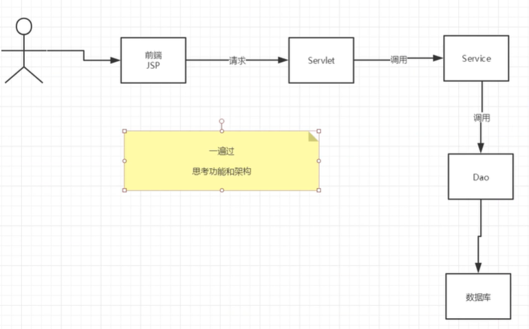

### SMBMS

------


数据库


**项目如何搭建？**

考虑使用不使用Maven?依赖，jar

### 项目搭建准备工作

------

1. 搭建一个maven web项目

2. 配置Tomcat

3. 测试项目是否能够跑起来

4. 导入项目中会遇到的jar包；

   ```xml
      <dependency>
         <groupId>junit</groupId>
         <artifactId>junit</artifactId>
         <version>4.11</version>
         <scope>test</scope>
       </dependency>
       <dependency>
         <groupId>javax.servlet</groupId>
         <artifactId>javax.servlet-api</artifactId>
         <version>4.0.1</version>
       </dependency>
       <dependency>
         <groupId>javax.servlet.jsp</groupId>
         <artifactId>javax.servlet.jsp-api</artifactId>
         <version>2.3.3</version>
       </dependency>
       <dependency>
         <groupId>mysql</groupId>
         <artifactId>mysql-connector-java</artifactId>
         <version>5.1.47</version>
       </dependency>
       <dependency>
         <groupId>javax.servlet.jsp.jstl</groupId>
         <artifactId>jstl-api</artifactId>
         <version>1.2</version>
       </dependency>
       <dependency>
         <groupId>taglibs</groupId>
         <artifactId>standard</artifactId>
         <version>1.1.2</version>
       </dependency>
   ```

   

5. 创建项目包结构

   

6. 编写实体类

   ORM映射：表-类映射

   ```java
   package com.peng.pojo;
   
   import java.math.BigDecimal;
   import java.util.Date;
   
   public class Bill {
       private Integer id; //id
       private String billCode; //账单编码
       private String productName; // 商品名称
       private String productDesc; // 商品描述
       private String productUnit; // 商品单位
       private BigDecimal productCount; // 商品数量
       private BigDecimal totalPrice; // 总金额
       private Integer isPayment; // 是否支付
       private Integer providerID; //供应商id
       private Integer createdBy; // 创建者
       private Date creationDate; // 创建时间
       private Integer modifyBy; // 更新者
       private Date modifyDate; //更新时间
   
       private String providerName; // 供应商名称
   
       public Integer getId() {
           return id;
       }
   
       public void setId(Integer id) {
           this.id = id;
       }
   
       public String getBillCode() {
           return billCode;
       }
   
       public void setBillCode(String billCode) {
           this.billCode = billCode;
       }
   
       public String getProductName() {
           return productName;
       }
   
       public void setProductName(String productName) {
           this.productName = productName;
       }
   
       public String getProductDesc() {
           return productDesc;
       }
   
       public void setProductDesc(String productDesc) {
           this.productDesc = productDesc;
       }
   
       public String getProductUnit() {
           return productUnit;
       }
   
       public void setProductUnit(String productUnit) {
           this.productUnit = productUnit;
       }
   
       public BigDecimal getProductCount() {
           return productCount;
       }
   
       public void setProductCount(BigDecimal productCount) {
           this.productCount = productCount;
       }
   
       public BigDecimal getTotalPrice() {
           return totalPrice;
       }
   
       public void setTotalPrice(BigDecimal totalPrice) {
           this.totalPrice = totalPrice;
       }
   
       public Integer getIsPayment() {
           return isPayment;
       }
   
       public void setIsPayment(Integer isPayment) {
           this.isPayment = isPayment;
       }
   
       public Integer getProviderID() {
           return providerID;
       }
   
       public void setProviderID(Integer providerID) {
           this.providerID = providerID;
       }
   
       public Integer getCreatedBy() {
           return createdBy;
       }
   
       public void setCreatedBy(Integer createdBy) {
           this.createdBy = createdBy;
       }
   
       public Date getCreationDate() {
           return creationDate;
       }
   
       public void setCreationDate(Date creationDate) {
           this.creationDate = creationDate;
       }
   
       public Integer getModifyBy() {
           return modifyBy;
       }
   
       public void setModifyBy(Integer modifyBy) {
           this.modifyBy = modifyBy;
       }
   
       public Date getModifyDate() {
           return modifyDate;
       }
   
       public void setModifyDate(Date modifyDate) {
           this.modifyDate = modifyDate;
       }
   
       public String getProviderName() {
           return providerName;
       }
   
       public void setProviderName(String providerName) {
           this.providerName = providerName;
       }
   }
   
   ```

   ```java
   package com.peng.pojo;
   
   import java.util.Date;
   
   public class Provider {
       private Integer id; //id
       private String proCode; //供应商编码
       private String proName; // 供应商名称
       private String proDesc; // 供应商描述
       private String proContact; //供应商联系人
       private String proPhone; // 供应商电话
       private String proAddress; // 供应商地址
       private String proFax; // 供应商传真
       private Integer createdBy; // 创建者
       private Date creationDate; // 创建时间
       private Integer modifyBy; // 更新者
       private Date modifDate; //更新时间
   
       public Integer getId() {
           return id;
       }
   
       public void setId(Integer id) {
           this.id = id;
       }
   
       public String getProCode() {
           return proCode;
       }
   
       public void setProCode(String proCode) {
           this.proCode = proCode;
       }
   
       public String getProName() {
           return proName;
       }
   
       public void setProName(String proName) {
           this.proName = proName;
       }
   
       public String getProDesc() {
           return proDesc;
       }
   
       public void setProDesc(String proDesc) {
           this.proDesc = proDesc;
       }
   
       public String getProContact() {
           return proContact;
       }
   
       public void setProContact(String proContact) {
           this.proContact = proContact;
       }
   
       public String getProPhone() {
           return proPhone;
       }
   
       public void setProPhone(String proPhone) {
           this.proPhone = proPhone;
       }
   
       public String getProAddress() {
           return proAddress;
       }
   
       public void setProAddress(String proAddress) {
           this.proAddress = proAddress;
       }
   
       public String getProFax() {
           return proFax;
       }
   
       public void setProFax(String proFax) {
           this.proFax = proFax;
       }
   
       public Integer getCreatedBy() {
           return createdBy;
       }
   
       public void setCreatedBy(Integer createdBy) {
           this.createdBy = createdBy;
       }
   
       public Date getCreationDate() {
           return creationDate;
       }
   
       public void setCreationDate(Date creationDate) {
           this.creationDate = creationDate;
       }
   
       public Integer getModifyBy() {
           return modifyBy;
       }
   
       public void setModifyBy(Integer modifyBy) {
           this.modifyBy = modifyBy;
       }
   
       public Date getModifDate() {
           return modifDate;
       }
   
       public void setModifDate(Date modifDate) {
           this.modifDate = modifDate;
       }
   }
   ```

   ```java
   package com.peng.pojo;
   
   import java.util.Date;
   
   public class Role {
       private Integer id; //id
       private String roleCode; // 角色编码
       private String roleName; // 角色名称
       private Integer createdBy; // 创建者
       private Date creationDate; // 创建时间
       private Integer modifyBy;  // 更新者
       private Date modifyDate; //更新时间
   
       public Integer getId() {
           return id;
       }
   
       public void setId(Integer id) {
           this.id = id;
       }
   
       public String getRoleCode() {
           return roleCode;
       }
   
       public void setRoleCode(String roleCode) {
           this.roleCode = roleCode;
       }
   
       public String getRoleName() {
           return roleName;
       }
   
       public void setRoleName(String roleName) {
           this.roleName = roleName;
       }
   
       public Integer getCreatedBy() {
           return createdBy;
       }
   
       public void setCreatedBy(Integer createdBy) {
           this.createdBy = createdBy;
       }
   
       public Date getCreationDate() {
           return creationDate;
       }
   
       public void setCreationDate(Date creationDate) {
           this.creationDate = creationDate;
       }
   
       public Integer getModifyBy() {
           return modifyBy;
       }
   
       public void setModifyBy(Integer modifyBy) {
           this.modifyBy = modifyBy;
       }
   
       public Date getModifyDate() {
           return modifyDate;
       }
   
       public void setModifyDate(Date modifyDate) {
           this.modifyDate = modifyDate;
       }
   }
   ```

   ```java
   package com.peng.pojo;
   
   import java.util.Date;
   
   public class User {
       private Integer id; //id
       private String userCode; //用户编码
       private String userName; //用户名称
       private  String userPassword; // 用户密码
       private  Integer gender; //性别
       private Date birthday; // 出生日期
       private String phone; // 电话
       private String address; // 地址
       private Integer userRole; // 用户角色
       private Integer createdBy; // 创建者
       private Date creationDate; // 创建时间
       private Integer modifyBy; // 更新者
       private Date modifyDate; // 更新时间
   
       private Integer age; //年龄
       private String userRoleName; // 用户角色名称
   
       public Integer getId() {
           return id;
       }
   
       public void setId(Integer id) {
           this.id = id;
       }
   
       public String getUserCode() {
           return userCode;
       }
   
       public void setUserCode(String userCode) {
           this.userCode = userCode;
       }
   
       public String getUserName() {
           return userName;
       }
   
       public void setUserName(String userName) {
           this.userName = userName;
       }
   
       public String getUserPassword() {
           return userPassword;
       }
   
       public void setUserPassword(String userPassword) {
           this.userPassword = userPassword;
       }
   
       public Integer getGender() {
           return gender;
       }
   
       public void setGender(Integer gender) {
           this.gender = gender;
       }
   
       public Date getBirthday() {
           return birthday;
       }
   
       public void setBirthday(Date birthday) {
           this.birthday = birthday;
       }
   
       public String getPhone() {
           return phone;
       }
   
       public void setPhone(String phone) {
           this.phone = phone;
       }
   
       public String getAddress() {
           return address;
       }
   
       public void setAddress(String address) {
           this.address = address;
       }
   
       public Integer getUserRole() {
           return userRole;
       }
   
       public void setUserRole(Integer userRole) {
           this.userRole = userRole;
       }
   
       public Integer getCreatedBy() {
           return createdBy;
       }
   
       public void setCreatedBy(Integer createdBy) {
           this.createdBy = createdBy;
       }
   
       public Date getCreationDate() {
           return creationDate;
       }
   
       public void setCreationDate(Date creationDate) {
           this.creationDate = creationDate;
       }
   
       public Integer getModifyBy() {
           return modifyBy;
       }
   
       public void setModifyBy(Integer modifyBy) {
           this.modifyBy = modifyBy;
       }
   
       public Date getModifyDate() {
           return modifyDate;
       }
   
       public void setModifyDate(Date modifyDate) {
           this.modifyDate = modifyDate;
       }
   
       public Integer getAge() {
           Date date = new Date();
           Integer age = date.getYear() - birthday.getYear();
           return age;
       }
   
       public void setAge(Integer age) {
           this.age = age;
       }
   
       public String getUserRoleName() {
           return userRoleName;
       }
   
       public void setUserRoleName(String userRoleName) {
           this.userRoleName = userRoleName;
       }
   }
   ```

   

7. 编写基础公共类

   1. 数据库配置文件

      ```properties
      driver = com.mysql.jdbc.Driver
      url = jdbc:mysql://localhost:3306?useUnicode=true&characterEncoding=utf-8
      username = root
      password = 
      ```

   2. 编写数据库的公共类

      ```java
      package com.peng.dao;
      
      import java.io.IOException;
      import java.io.InputStream;
      import java.sql.*;
      import java.util.Properties;
      
      //操作数据库的公共类
      public class BaseDao {
          private static String driver;
          private static String url;
          private static String username;
          private static String password;
      
          //静态代码块，类加载的时候就初始化
          static {
              Properties properties = new Properties();
              //通过类加载器读取对应的资源
              InputStream is = BaseDao.class.getClassLoader().getResourceAsStream("db.properties");
              try {
                  properties.load(is);
              } catch (IOException e) {
                  e.printStackTrace();
              }
              driver = properties.getProperty("driver");
              url = properties.getProperty("url");
              username = properties.getProperty("username");
              password = properties.getProperty("password");
          }
          //获取数据库的连接
          public static Connection getConnection(){
              Connection connection = null;
              try {
                  Class.forName(driver);
                  connection = DriverManager.getConnection(url, username, password);
              } catch (Exception e) {
                  e.printStackTrace();
              }
              return connection;
          }
          //编写查询公共类
          public static ResultSet execute(Connection connection,String sql,Object[] params,ResultSet resultSet,PreparedStatement preparedStatement) throws SQLException {
              //预编译的sql，在后面直接执行就可以了
              preparedStatement = connection.prepareStatement(sql);
              for (int i = 0; i < params.length; i++) {
                  //setObject,占位符从1开始，但是我们的数组是从0开始！
                  preparedStatement.setObject(i+1,params[i]);
              }
              resultSet = preparedStatement.executeQuery();
              return resultSet;
          }
      
          //编写增删改公共方法
          public static int execute(Connection connection,String sql,Object[] params,PreparedStatement preparedStatement) throws SQLException {
              preparedStatement = connection.prepareStatement(sql);
              for (int i = 0; i < params.length; i++) {
                  //setObject,占位符从1开始，但是我们的数组是从0开始！
                  preparedStatement.setObject(i+1,params[i]);
              }
              int updateRows = preparedStatement.executeUpdate();
              return updateRows;
          }
          //释放资源
          public static boolean closeResoure(Connection connection,PreparedStatement preparedStatement,ResultSet resultSet){
                  boolean flag = true;
                  if(resultSet!=null){
                      try {
                          resultSet.close();
                          //GC回收
                          resultSet = null;
                      } catch (SQLException e) {
                          e.printStackTrace();
                          flag = false;
                      }
                  }
                  if (preparedStatement!=null){
                      try {
                          preparedStatement.close();
                          //GC回收
                          preparedStatement=null;
                      } catch (SQLException e) {
                          e.printStackTrace();
                          flag = false;
                      }
                  }
                  if (connection!=null){
                      try {
                          connection.close();
                          //GC回收
                          connection=null;
                      } catch (SQLException e) {
                          e.printStackTrace();
                          flag=false;
                      }
      
                  }
                  return flag;
          }
      }
      ```

   3. 编写字符编码过滤器

      ```xml
      <!--字符编码过滤器-->
      <filter>
          <filter-name>CharacterEncodingFilter</filter-name>
          <filter-class>com.peng.filter.CharacterEncodingFilter</filter-class>
      </filter>
      <filter-mapping>
          <filter-name>CharacterEncodingFilter</filter-name>
          <url-pattern>/*</url-pattern>
      </filter-mapping>
      ```

      ```java
      package com.peng.filter;
      
      import javax.servlet.*;
      import java.io.IOException;
      
      public class CharacterEncodingFilter implements Filter {
          @Override
          public void init(FilterConfig filterConfig) throws ServletException {
          }
          @Override
          public void doFilter(ServletRequest servletRequest, ServletResponse servletResponse, FilterChain filterChain) throws IOException, ServletException {
              servletRequest.setCharacterEncoding("utf-8");
              servletResponse.setCharacterEncoding("utf-8");
              filterChain.doFilter(servletRequest,servletResponse);
          }
          @Override
          public void destroy() {
          }
      }
      ```

   8.导入静态资源

   链接: https://pan.baidu.com/s/1Inbn3cusuxxtCQTLqWal9A 提取码: mktu 复制这段内容后打开百度网盘手机App，操作更方便哦

   

   
### 实现登录功能

------


1. 编写前端页面

2. 设置首页

   ```xml
   <!--设置欢迎页面-->
   <welcome-file-list>
       <welcome-file>login.jsp</welcome-file>
   </welcome-file-list>
   ```

3. 编写dao层登录用户登录的接口

   ```java
      //得到要登录的用户
       public User getLoginUser(Connection connection, String userCode) throws SQLException;
   ```

4. 编写dao接口的实现类

   ```java
   package com.peng.dao.user;
   
   import com.peng.dao.BaseDao;
   import com.peng.pojo.User;
   
   import java.sql.Connection;
   import java.sql.PreparedStatement;
   import java.sql.ResultSet;
   import java.sql.SQLException;
   
   public class UserDaoImpl implements UserDao{
       @Override
       public User getLoginUser(Connection connection, String userCode) throws SQLException {
           PreparedStatement pstm = null;
           ResultSet rs = null;
           User user = null;
           if (connection!=null) {
               String sql = "select * from smbms_user where userCode=?";
               Object[] params = {userCode};
   
               rs = BaseDao.execute(connection, pstm, rs, sql, params);
               if (rs.next()){
                   user = new User();
                   user.setId(rs.getInt("id"));
                   user.setUserCode(rs.getString("userCode"));
                   user.setUserName(rs.getString("userName"));
                   user.setUserPassword(rs.getString("userPassword"));
                   user.setGender(rs.getInt("gender"));
                   user.setBirthday(rs.getDate("birthday"));
                   user.setPhone(rs.getString("phone"));
                   user.setAddress(rs.getString("address"));
                   user.setUserRole(rs.getInt("userRole"));
                   user.setCreatedBy(rs.getInt("createdBy"));
                   user.setCreationDate(rs.getTimestamp("creationDate"));
                   user.setModifyBy(rs.getInt("modifyby"));
                   user.setModifyDate(rs.getTimestamp("modifyDate"));
               }
                   BaseDao.closeResoure(null,pstm,rs);
           }
           return user;
       }
   }
   ```

5. 业务层接口

   ```java
       //用户登录
       public User login(String userCode,String password);
   ```

6. 业务层实现类

   ```java
   package com.peng.service.user;
   
   import com.peng.dao.BaseDao;
   import com.peng.dao.user.UserDao;
   import com.peng.dao.user.UserDaoImpl;
   import com.peng.pojo.User;
   import org.junit.Test;
   
   import java.sql.Connection;
   import java.sql.SQLException;
   
   public class UserServiceImpl implements UserService{
       //业务层都会调用dao层，所以我们要引用Dao层
       private UserDao userDao;
       public UserServiceImpl(){
           userDao = new UserDaoImpl();
       }
       @Override
       public User login(String userCode, String password) {
           Connection connection = null;
           User user = null;
           try {
               connection = BaseDao.getConnection();
               //通过业务层调用对应的具体的数据库操作
               user = userDao.getLoginUser(connection,userCode);
           } catch (SQLException e) {
               e.printStackTrace();
           }finally {
               BaseDao.closeResoure(connection,null,null);
           }
           return user;
       }
   
   //    @Test
   //    public void test(){
   //        UserServiceImpl userService = new UserServiceImpl();
   //        User admin = userService.login("admin","123456");
   //        System.out.println(admin.getUserPassword());
   //    }
   }
   ```

7. 编写servlet

   ```java
   package com.peng.servlet.user;
   
   import com.peng.pojo.User;
   import com.peng.service.user.UserServiceImpl;
   import com.peng.util.Constsants;
   
   import javax.servlet.ServletException;
   import javax.servlet.http.HttpServlet;
   import javax.servlet.http.HttpServletRequest;
   import javax.servlet.http.HttpServletResponse;
   import java.io.IOException;
   
   public class LoginServlet extends HttpServlet {
   
       //Servlet:控制层调用业务层代码
   
       @Override
       protected void doGet(HttpServletRequest req, HttpServletResponse resp) throws ServletException, IOException {
   
           System.out.println("LoginServlet--start...");
           //获取用户名和密码
           String userCode = req.getParameter("userCode");
           String userPassword = req.getParameter("userPassword");
   
           //和数据库中的密码进行对比，调用业务层
           UserServiceImpl userService = new UserServiceImpl();
           User user = userService.login(userCode, userPassword);//这里已经把登录的人给查出来了
           if (user!=null){
               //查有此人，可以登录
               //将用户的信息放入Session中
               req.getSession().setAttribute(Constsants.USER_SISSION,user);
               //跳转到内部主页
               resp.sendRedirect("jsp/frame.jsp");
           }else {
               //查无此人，无法登录，转发回登录页面，顺带提示它，用户名或密码错误
               req.setAttribute("error","用户名或密码不正确");
               req.getRequestDispatcher("login.jsp").forward(req,resp);
           }
   
   
       }
   
       @Override
       protected void doPost(HttpServletRequest req, HttpServletResponse resp) throws ServletException, IOException {
           doGet(req, resp);
       }
   }
   ```

8. 注册Servlet

   ```xml
   <!-- Servlet-->
   <servlet>
       <servlet-name>LoginServlet</servlet-name>
       <servlet-class>com.peng.servlet.user.LoginServlet</servlet-class>
   </servlet>
   <servlet-mapping>
       <servlet-name>LoginServlet</servlet-name>
       <url-pattern>/login.do</url-pattern>
   </servlet-mapping>
   ```

9. 测试访问，确保以上功能实现

### 登录功能优化

注销功能：

思路：移除Session,返回登录界面

```java
package com.peng.servlet.user;

import com.peng.util.Constsants;

import javax.servlet.ServletException;
import javax.servlet.http.HttpServlet;
import javax.servlet.http.HttpServletRequest;
import javax.servlet.http.HttpServletResponse;
import java.io.IOException;

public class LogoutServlet extends HttpServlet {
    @Override
    protected void doGet(HttpServletRequest req, HttpServletResponse resp) throws ServletException, IOException {
        //移除用户的Constsants.USER_SISSION Session
        req.getSession().removeAttribute(Constsants.USER_SISSION);
        resp.sendRedirect(req.getContextPath()+"/login.jsp");//返回登录界面
    }

    @Override
    protected void doPost(HttpServletRequest req, HttpServletResponse resp) throws ServletException, IOException {
        doGet(req, resp);
    }
}
```


注册xml

```xml
<servlet>
    <servlet-name>LogoutServlet</servlet-name>
    <servlet-class>com.peng.servlet.user.LogoutServlet</servlet-class>
</servlet>
<servlet-mapping>
    <servlet-name>LogoutServlet</servlet-name>
    <url-pattern>/jsp/logout.do</url-pattern>
</servlet-mapping>
```


**登录拦截优化**

```java
package com.peng.filter;

import com.peng.pojo.User;
import com.peng.util.Constsants;

import javax.servlet.*;
import javax.servlet.http.HttpServletRequest;
import javax.servlet.http.HttpServletResponse;
import java.io.IOException;

public class SysFilter implements Filter {
    @Override
    public void init(FilterConfig filterConfig) throws ServletException {

    }

    @Override
    public void doFilter(ServletRequest servletRequest, ServletResponse servletResponse, FilterChain filterChain) throws IOException, ServletException {
        HttpServletRequest request = (HttpServletRequest) servletRequest;
        HttpServletResponse response = (HttpServletResponse) servletResponse;
        //过滤器，从Session中获取用户
        User user = (User) request.getSession().getAttribute(Constsants.USER_SISSION);
      if (user==null){
          //已经被移除或者注销，或者未登录
          response.sendRedirect("/smbms/error.jsp");
      }else{
          filterChain.doFilter(servletRequest,servletResponse);
      }
    }

    @Override
    public void destroy() {

    }
}
```

注册xml

```xml
<!--用户登录过滤器-->
<filter>
    <filter-name>SysFilter</filter-name>
    <filter-class>com.peng.filter.SysFilter</filter-class>
</filter>
<filter-mapping>
    <filter-name>SysFilter</filter-name>
    <url-pattern>/jsp/*</url-pattern>
</filter-mapping>
```


测试，登录，注销，权限，全部欧克！


### 密码修改

------

1. 导入前端素材

2. 些项目，建议从底层向上写

   

3. UserDao接口

   ```java
   //修改当前用户密码
   public int updatePwd(Connection connection,int id,int password) throws SQLException;
   ```

4. UserDao接口实现类

   ```java
   //修改当前用户密码
   @Override
   public int updatePwd(Connection connection, int id, int password) throws SQLException {
       PreparedStatement preparedStatement = null;
       int execute = 0;
       if (connection!=null){
           String sql = "update smbms_user set userPassword = ? where id = ?";
           Object params[] = {password,id};execute = BaseDao.execute(connection, preparedStatement, sql, params);
           BaseDao.closeResoure(null,preparedStatement,null);
       }
       return execute;
   }
   ```

5. userService

   ```java
   //根据用户id修改密码
   public boolean updatePwd(int id,int pwd);
   ```

6. userService实现类

   ```java
      @Override
       public boolean updatePwd(int id, int pwd) {
           Connection connection = null;
           boolean flag = false;
            //修改密码
           try {
               connection = BaseDao.getConnection();
               if (userDao.updatePwd(connection,id,pwd)>0){
                   flag = true;
               }
           } catch (SQLException e) {
               e.printStackTrace();
           }finally {
               BaseDao.closeResoure(connection,null,null);
           }
           return flag;
       }
   ```

7. 记得实现复用，需要提取出方法！

   ```java
   package com.peng.servlet.user;
   
   import com.mysql.jdbc.StringUtils;
   import com.peng.pojo.User;
   import com.peng.service.user.UserService;
   import com.peng.service.user.UserServiceImpl;
   import com.peng.util.Constsants;
   
   import javax.servlet.ServletException;
   import javax.servlet.http.HttpServlet;
   import javax.servlet.http.HttpServletRequest;
   import javax.servlet.http.HttpServletResponse;
   import java.io.IOException;
   
   //实现servlet复用
   //修改密码
   public class UserServlet extends HttpServlet {
       @Override
       protected void doGet(HttpServletRequest req, HttpServletResponse resp) throws ServletException, IOException {
           String method = req.getParameter("method");
           if (method.equals("savepwd")&&method!=null){
               this.updatePwd(req,resp);
           }
       }
   
       @Override
       protected void doPost(HttpServletRequest req, HttpServletResponse resp) throws ServletException, IOException {
           doGet(req, resp);
       }
       public void updatePwd(HttpServletRequest req, HttpServletResponse resp){
           //从session中拿id
           Object o = req.getSession().getAttribute(Constsants.USER_SISSION);
           String newpassword = req.getParameter("newpassword");
           System.out.println("newpassword"+newpassword);
           boolean flag = false;
           if (o!=null&&newpassword!=null){
               UserService userService = new UserServiceImpl();
               flag = userService.updatePwd(((User) o).getId(), newpassword);
               if (flag){
                   req.setAttribute("message","修改密码成功，请退出使用新密码登录");
                   //密码修改成功，移除当前Session
                   req.getSession().removeAttribute(Constsants.USER_SISSION);
               }else {
                   req.setAttribute("message","修改密码失败");
   
               }
           }else {
               req.setAttribute("message","新密码有问题");
           }
           try {
               req.getRequestDispatcher("pwdmodify.jsp").forward(req,resp);
           } catch (ServletException e) {
               e.printStackTrace();
           } catch (IOException e) {
               e.printStackTrace();
           }
       }
   }
   ```

   **别忘了在web.xml注册**

8. 测试


**优化密码修改使用Ajax;**

1. 阿里巴巴的fastjson

   ```xml
   <!-- https://mvnrepository.com/artifact/com.alibaba/fastjson -->
   <dependency>
       <groupId>com.alibaba</groupId>
       <artifactId>fastjson</artifactId>
       <version>1.2.79</version>
   </dependency>
   ```

2. 后台代码修改

   ```java
   package com.peng.servlet.user;
   
   import com.alibaba.fastjson.JSONArray;
   import com.mysql.jdbc.StringUtils;
   import com.peng.pojo.User;
   import com.peng.service.user.UserService;
   import com.peng.service.user.UserServiceImpl;
   import com.peng.util.Constsants;
   
   import javax.servlet.ServletException;
   import javax.servlet.http.HttpServlet;
   import javax.servlet.http.HttpServletRequest;
   import javax.servlet.http.HttpServletResponse;
   import java.io.IOException;
   import java.io.PrintWriter;
   import java.util.HashMap;
   import java.util.Map;
   
   //实现servlet复用
   //修改密码
   public class UserServlet extends HttpServlet {
       @Override
       protected void doGet(HttpServletRequest req, HttpServletResponse resp) throws ServletException, IOException {
           String method = req.getParameter("method");
           if (method.equals("savepwd")&&method!=null){
               this.updatePwd(req,resp);
           }else if(method.equals("pwdmodify")&&method!=null){
               this.pwdmodify(req,resp);
           }
       }
   
       @Override
       protected void doPost(HttpServletRequest req, HttpServletResponse resp) throws ServletException, IOException {
           doGet(req, resp);
       }
       //修改密码
       public void updatePwd(HttpServletRequest req, HttpServletResponse resp){
           //从session中拿id
           Object o = req.getSession().getAttribute(Constsants.USER_SISSION);
           String newpassword = req.getParameter("newpassword");
           System.out.println("newpassword"+newpassword);
           boolean flag = false;
           if (o!=null&&newpassword!=null){
               UserService userService = new UserServiceImpl();
               flag = userService.updatePwd(((User) o).getId(), newpassword);
               if (flag){
                   req.setAttribute("message","修改密码成功，请退出使用新密码登录");
                   //密码修改成功，移除当前Session
                   req.getSession().removeAttribute(Constsants.USER_SISSION);
               }else {
                   req.setAttribute("message","修改密码失败");
   
               }
           }else {
               req.setAttribute("message","新密码有问题");
           }
           try {
               req.getRequestDispatcher("pwdmodify.jsp").forward(req,resp);
           } catch (ServletException e) {
               e.printStackTrace();
           } catch (IOException e) {
               e.printStackTrace();
           }
       }
   
   //    验证旧密码 session中有用户的密码
       public void pwdmodify(HttpServletRequest req, HttpServletResponse resp){
           Object o = req.getSession().getAttribute(Constsants.USER_SISSION);
           String oldpassword = req.getParameter("oldpassword");
   
           //万能的Map:结果集
           Map<String, String> resultMap = new HashMap<String, String>();
           if (o==null){
               //Session失效了，session过期了
               resultMap.put("result","sessionerror");
           }else if(StringUtils.isNullOrEmpty(oldpassword)){//输入的密码为空
               resultMap.put("result","error");
           }else {
               String userPassword = ((User)o).getUserPassword();//Session中用户的密码
               if (oldpassword.equals(userPassword)){
                   resultMap.put("result","true");
               }else {
                   resultMap.put("result","false");
               }
           }
           try {
               resp.setContentType("application/json");
               PrintWriter writer = resp.getWriter();
               //JSONArray 阿里巴巴json的工具类,转换格式
               //json格式= {key:value}
               writer.write(JSONArray.toJSONString(resultMap));
               writer.flush();
               writer.close();
           } catch (IOException e) {
               e.printStackTrace();
           }
       }
   }
   ```

3. 测试


### 用户管理实现

------

思路：


1. 导入分页的工具类
2. 用户列表页面导入


#### 1、获取用户数量

1. UserDao

   ```java
   //根据用户名或者角色查询用户总数
   public int getUserCount(Connection connection,String username,int userRole) throws SQLException;
   ```

   

2. UserDaoimpl

   ```java
       //查询用户总数
       @Override
       public int getUserCount(Connection connection, String username, int userRole) throws SQLException {
          PreparedStatement pstm = null;
          ResultSet rs = null;
           int count = 0;
          if (connection!=null){
              StringBuffer sql = new StringBuffer();
              sql.append("select count(1) as count from smbms_user u,smbms_role r where u.userRole=r.id");
              ArrayList<Object> list = new ArrayList<Object>();//存放我们的参数
   
              if (!StringUtils.isNullOrEmpty(username)){
                  sql.append(" and u.userName like ?");
                  list.add("%"+username+"%"); // index:0
              }
   
              if (userRole>0){
                  sql.append(" and u.userRole = ?");
                  list.add(userRole); //index :1
              }
               //怎么把list转换为数组
              Object[] params = list.toArray();
   
              System.out.println("UserDaoImpl->getUserCount:"+sql.toString()); //输出最后完整的SQL语句
               rs = BaseDao.execute(connection, pstm, rs, sql.toString(), params);
              if (rs.next()){
                  count = rs.getInt("count");//从结果集中获取最终的数量
              }
              BaseDao.closeResoure(null,pstm,rs);
          }
          return count;
       }
   ```

   

3. UserService

   ```java
   //查询记录数
   public int getUserCount(String username,int userRole);
   ```

   

4. UserServiceImpl

   ```java
   //查询记录数
       @Override
       public int getUserCount(String username, int userRole) {
           Connection connection = null;
           int count=0;
           try {
               connection = BaseDao.getConnection();
               count = userDao.getUserCount(connection, username, userRole);
           } catch (SQLException e) {
               e.printStackTrace();
           }finally {
               BaseDao.closeResoure(connection,null,null);
           }
           return count;
       }
   //    @Test
   //    public void test(){
   //        UserServiceImpl userService = new UserServiceImpl();
   //        int userCount = userService.getUserCount(null,0);
   //        System.out.println(userCount);
   //    }
   ```

   

#### 2、获取用户列表

1. userDao

   ```java
   //通过条件查询-userList
   public List<User> getUserList(Connection connection,String userName,int userRole,int currentPageNo,int pageSize) throws SQLException;
   ```

   

2. userDaoImpl

   ```java
    @Override
       public List<User> getUserList(Connection connection, String userName, int userRole, int currentPageNo, int pageSize) throws SQLException {
           PreparedStatement pstm = null;
           ResultSet rs = null;
           List<User> userList = new ArrayList<User>();
   
           if (connection!=null){
               StringBuffer sql = new StringBuffer();
               sql.append("select u.*,r.roleName as userRoleName from smbms_user u,smbms_role r where u.userRole = r. id");
               List<Object> list = new ArrayList<Object>();
               if (!StringUtils.isNullOrEmpty(userName)){
                   sql.append(" and u.userName like ?");
                   list.add("%"+userName+"%");
               }
               if (userRole > 0){
                   sql.append(" and u.userRole = ?");
                   list.add(userRole);
               }
               //在数据库中分页使用 limit
               sql.append(" order by creationDate DESC limit ?,?");
               currentPageNo = (currentPageNo - 1)*pageSize;
               list.add(currentPageNo);
               list.add(pageSize);
   
               Object[] params = list.toArray();
               System.out.println("sql-->"+sql.toString());
               rs=BaseDao.execute(connection,pstm,rs,sql.toString(),params);
               while (rs.next()){
                   User _user = new User();
                   _user.setId(rs.getInt("id"));
                   _user.setUserCode(rs.getString("userCode"));
                   _user.setUserName(rs.getString("userName"));
                   _user.setGender(rs.getInt("gender"));
                   _user.setBirthday(rs.getDate("birthday"));
                   _user.setPhone(rs.getString("phone"));
                   _user.setUserRole(rs.getInt("userRole"));
                   _user.setUserRoleName(rs.getString("userRoleName"));
                   userList.add(_user);
               }
               BaseDao.closeResoure(null,pstm,rs);
           }
           return userList;
       }
   ```

   

3. userService

   ```java
   //根据条件查询用户列表
   public List<User> getUserList(String queryUserName,int queryUserRole,int currentPageNo,int pageSize);
   ```

   

4. userServiceImpl

   ```java
   //获取用户列表
       @Override
       public List<User> getUserList(String queryUserName, int queryUserRole, int currentPageNo, int pageSize) {
           Connection connection =null;
           List<User> userList =null;
           System.out.println("queryUserName-->" + queryUserName);
           System.out.println("queryUserRole-->" + queryUserRole);
           System.out.println("currentPageNo-->" + currentPageNo);
           System.out.println("pageSize-->" + pageSize);
           try {
               connection = BaseDao.getConnection();
               userList = userDao.getUserList(connection,queryUserName, queryUserRole, currentPageNo, pageSize);
           } catch (SQLException e) {
               e.printStackTrace();
           }finally {
               BaseDao.closeResoure(connection,null,null);
           }
           return userList;
       }
   ```


#### 3、获取角色操作

为了我们职责统一，可以把角色的操作单独拿出来

1. RoleDao

   ```java
   //获取角色列表
   public List<Role> getRoleList(Connection connection) throws SQLException;
   ```

   

2. RoleDaoImpl

   ```java
       //获取角色列表
       @Override
       public List<Role> getRoleList(Connection connection) throws SQLException {
           PreparedStatement pstm = null;
           ResultSet rs = null;
           ArrayList<Role> rolelist = new ArrayList<Role>();
   
           if (connection!=null){
               String sql = "select * from smbms_role";
               Object[] params = {};
               rs = BaseDao.execute(connection,pstm,rs,sql,params);
               while (rs.next()){
                   Role _role = new Role();
                   _role.setId( rs.getInt("id"));
                   _role.setRoleCode(rs.getString("roleCode"));
                   _role.setRoleName(rs.getString("roleName"));
                   rolelist.add(_role);
               }
               BaseDao.closeResoure(null,pstm,rs);
           }
           return rolelist;
       }
   ```

   

3. RoleService

   ```java
   //获取角色列表
   public List<Role> getRoleList();
   ```

   

4. RoleServiceImpl

   ```java
   
   //获取角色列表
   public class RoleServiceImpl implements RoleService{
       //引入Dao
       private RoleDao roleDao;
       public RoleServiceImpl(){
           roleDao = new RoleDaoImpl();
       }
       @Override
       public List<Role> getRoleList() {
           Connection connection = null;
           List<Role> roleList =null;
           try {
               connection = BaseDao.getConnection();
               roleList = roleDao.getRoleList(connection);
           } catch (SQLException e) {
               e.printStackTrace();
           }finally {
               BaseDao.closeResoure(connection,null,null);
           }
           return roleList;
       }
   }
   ```

   

#### 4、用户显示的Servlet

1. 从前端获取数据（查询）

2. 判断请求是否需要执行，看参数的值

3. 为了实现分页，需要计算出当前页面和总页面，页面大小

4. 用户列表展示

5. 返回前端

   ```java
   public void query(HttpServletRequest req, HttpServletResponse resp){
       //查询用户列表
   
       //从前端获取数据
       String queryUserName = req.getParameter("queryname");
       String temp = req.getParameter("queryUserRole");
       String pageIndex = req.getParameter("pageIndex");
       int queryUserRole = 0;
   
       //获取用户列表
       UserServiceImpl userService = new UserServiceImpl();
       List<User> userList =null;
       //第一次走这个请求，一定是第一页，页面大小固定
       int pageSize = 5; //可以把这个写道配置文件里，可以后期修改
       int currentPageNo = 1;
   
       if (queryUserName==null){
           queryUserName = "";
       }
       if (temp!=null && !temp.equals("")){
           queryUserRole = Integer.parseInt(temp);//给查询赋值 0.1，2，3
       }
       if (pageIndex!=null){
           currentPageNo = Integer.parseInt(pageIndex);
       }
   
       //获取用户总数(分页：上一页，下一页的情况)
       int totalCount = userService.getUserCount(queryUserName, queryUserRole);
       //总页数支持
       PageSupport pageSupport = new PageSupport();
       pageSupport.setCurrentPageNo(currentPageNo);
       pageSupport.setPageSize(pageSize);
       pageSupport.setTotalCount(totalCount);
   
       int totalPageCount = ((int)(totalCount/pageSize)) + 1; //总共有几页
       //控制首页和尾页
       //如果页面要小于1了，就显示第一页的东西
       if (totalPageCount<1){
           currentPageNo = 1;
       }else if(currentPageNo>totalPageCount){
           //当前页大于了最后一页
           currentPageNo = totalPageCount;
       }
   
       //获取用户列表展示
       userList = userService.getUserList(queryUserName, queryUserRole, currentPageNo, pageSize);
       req.setAttribute("userList",userList);
   
       //获取角色列表
       RoleServiceImpl roleService = new RoleServiceImpl();
       List<Role> roleList = roleService.getRoleList();
       req.setAttribute("roleList",roleList);
   
       req.setAttribute("totalCount",totalCount);
       req.setAttribute("currentPageNo",currentPageNo);
       req.setAttribute("totalPageCount",totalPageCount);
       req.setAttribute("queryUserName",queryUserName);
       req.setAttribute("queryUserRole",queryUserRole);
   
       //返回前端
       try {
           req.getRequestDispatcher("userlist.jsp").forward(req,resp);
       } catch (ServletException e) {
           e.printStackTrace();
       } catch (IOException e) {
           e.printStackTrace();
       }
   }
   ```

   

小黄鸭调试法：自言自语；


   

   