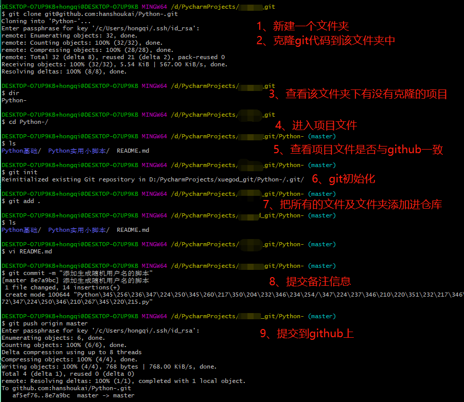

上传本地文件
首先下载并安装好git,在本地新建一个项目，打开项目右击Git Bash Here 打开git命令，接下来就是命令行操作了

git init (初始化本地仓库，项目里面会多一个.git文件，它是隐藏文件，不要修改)

git ssh-keygen(创建一个SSH Key,默认存储地址是c/Users/Administrator/.ssh，打开id_rsa.pub文件复制代码，在你的github账号新增一个SSH key,将代码粘贴进去，生成)

git config --global user.name ZhangSan (设置用户名)

git config --global user.email 123456@qq.com (设置邮箱)

git remote add origin git@github.com:ZhangSan/demo.git(添加远程仓库，复制你github远程仓库地址)

git pull origin master (拉取远端master分支)

git add .(将文件内容添加到索引)

git commit -m 'first' (提交信息)

git push origin master (将本地的 master 分支推送至远端的 master 分支，如果没有就新建一个)

 

git常用命令
git init 初始化git工厂
git add . 添加所有文件到暂存区
git clone url 将项目克隆到本地 
git update-ref 更新文件
git push origin master  将本地主分支推到远程主分支
git pull  拉取所有远程分支到本地
git branch dev 创建一个dev分支
git branch * 查看所有分支
git checkout dev 切换到dev分支
git merge dev 合并dev分支到主分支
git pull 远程拉
git status 查看状态
git commit -m 信息说明 提交文件到本地仓库
git log 查看修改日志
touch 文件名 创建一个文件
echo 内容>文件名 向指定文件添加内容
rm -r 文件名 删除指定文件或文件夹
mkdir 文件夹名 创建一个文件夹
git log -n 2 --stat 查看倒数第2次提交内容
git checkout a 还原a文件内容
git diff a 比较a文件和暂存区的差异
git stash apply 恢复暂存的内容
git stash drop 删除暂存区
clear+ 回车（清屏）
cd 文件名 进入该文件


69cd996bfb3e1e93d1d03bdaf43d30d8


输入git add * ，将更新上传到本地缓存，*--代表更新全部

```
git add *
```

接着同样输入git commit -m "更新说明"

```
git commit -m "更新说明”
```

然后，需要将Github仓库与本地仓库进行同步

```
git pull --rebase origin master
```

最后进行推送即可，此时只需要推送更新内容。

```
git push origin main
```


