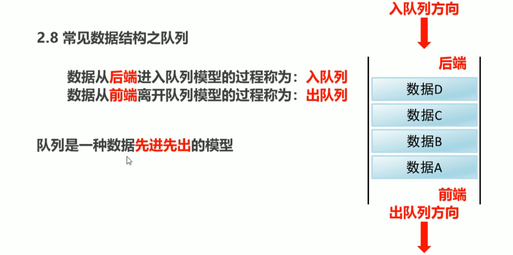

ArrayList

------


| [add()](https://www.runoob.com/java/java-arraylist-add.html) | 将元素插入到指定位置的 arraylist 中           |
| ------------------------------------------------------------ | --------------------------------------------- |
| [addAll()](https://www.runoob.com/java/java-arraylist-addall.html) | 添加集合中的所有元素到 arraylist 中           |
| [clear()](https://www.runoob.com/java/java-arraylist-clear.html) | 删除 arraylist 中的所有元素                   |
| [clone()](https://www.runoob.com/java/java-arraylist-clone.html) | 复制一份 arraylist                            |
| [contains()](https://www.runoob.com/java/java-arraylist-contains.html) | 判断元素是否在 arraylist                      |
| [get()](https://www.runoob.com/java/java-arraylist-get.html) | 通过索引值获取 arraylist 中的元素             |
| [indexOf()](https://www.runoob.com/java/java-arraylist-indexof.html) | 返回 arraylist 中元素的索引值                 |
| [removeAll()](https://www.runoob.com/java/java-arraylist-removeall.html) | 删除存在于指定集合中的 arraylist 里的所有元素 |
| [remove()](https://www.runoob.com/java/java-arraylist-remove.html) | 删除 arraylist 里的单个元素                   |
| [size()](https://www.runoob.com/java/java-arraylist-size.html) | 返回 arraylist 里元素数量                     |
| [isEmpty()](https://www.runoob.com/java/java-arraylist-isempty.html) | 判断 arraylist 是否为空                       |
| [subList()](https://www.runoob.com/java/java-arraylist-sublist.html) | 截取部分 arraylist 的元素                     |
| [set()](https://www.runoob.com/java/java-arraylist-set.html) | 替换 arraylist 中指定索引的元素               |
| [sort()](https://www.runoob.com/java/java-arraylist-sort.html) | 对 arraylist 元素进行排序                     |
| [toArray()](https://www.runoob.com/java/java-arraylist-toarray.html) | 将 arraylist 转换为数组                       |
| [toString()](https://www.runoob.com/java/java-arraylist-tostring.html) | 将 arraylist 转换为字符串                     |
| [ensureCapacity](https://www.runoob.com/java/java-arraylist-surecapacity.html)() | 设置指定容量大小的 arraylist                  |
| [lastIndexOf()](https://www.runoob.com/java/java-arraylist-lastindexof.html) | 返回指定元素在 arraylist 中最后一次出现的位置 |
| [retainAll()](https://www.runoob.com/java/java-arraylist-retainall.html) | 保留 arraylist 中在指定集合中也存在的那些元素 |
| [containsAll()](https://www.runoob.com/java/java-arraylist-containsall.html) | 查看 arraylist 是否包含指定集合中的所有元素   |
| [trimToSize()](https://www.runoob.com/java/java-arraylist-trimtosize.html) | 将 arraylist 中的容量调整为数组中的元素个数   |
| [removeRange()](https://www.runoob.com/java/java-arraylist-removerange.html) | 删除 arraylist 中指定索引之间存在的元素       |
| [replaceAll()](https://www.runoob.com/java/java-arraylist-replaceall.html) | 将给定的操作内容替换掉数组中每一个元素        |
| [removeIf()](https://www.runoob.com/java/java-arraylist-removeif.html) | 删除所有满足特定条件的 arraylist 元素         |
| [forEach()](https://www.runoob.com/java/java-arraylist-foreach.html) | 遍历 arraylist 中每一个元素并执行特定操作     |


```java
package list;

import java.util.ArrayList;

public class Demo {
    public static void main(String[] args) {
        ArrayList<String> arrayList = new ArrayList<String>();
        arrayList.add("hello");
        arrayList.add("world");
        arrayList.add("java");
    //指定位置添加元素
        arrayList.add(1,"javase");
        arrayList.add(3,"javaee");

        //IndexOutOfBoundsException集合的索引越界
//        arrayList.add(4,"jab");
        //输出集合
        System.out.println("Array" + arrayList);

    }
}

```

```java
package list;

import java.util.ArrayList;

public class Demo1 {
    public static void main(String[] args) {
        ArrayList<String> list = new ArrayList<String>();

        list.add("javase");
        list.add("javaee");
        list.add("javass");

        //删除指定元素
//        list.remove("javaee");
        //删除指定索引
//        list.remove(0);
        System.out.println(list.set(1,"java"));//修改指定元素,返回被修改的元素
        System.out.println(list.get(2)); //返回指定索引处的元素
        System.out.println(list.size());//返回集合中元素个数
        System.out.println(list);
    }
}
```


`案例:存储字符串并遍历`

需求:创建一个存储字符串的集合,存储三个字符串元素,使用程序实现控制台遍历该集合

```java
package list;

import java.util.ArrayList;

public class demo3 {
    public static void main(String[] args) {
        //创建集合对象
        ArrayList<String> list = new ArrayList<String>();
        //往集合中添加字符串对象
        list.add("鹏飞");
        list.add("二狗");
        list.add("三虎");
        //遍历集合,首先要能够获取到集合中的每一个元素
//        System.out.println(list.get(0));
//        System.out.println(list.get(1));
//        System.out.println(list.get(2));

        //遍历集合,其次要能够获取到集合的长度,通过size()方法实现
        for (int i = 0; i < list.size(); i++) {
            String s = list.get(i);
            System.out.println(s);
        }
    }
}
```


`案例:存储学生对象并遍历`

需求:

- 创建一个存储学生对象的集合,存储3个学生对象,使用程序实现在控制台遍历该集合

```java
package list;

import java.util.ArrayList;

public class demo2 {
    public static void main(String[] args) {
        //创建集合对象
        ArrayList<Student> list = new ArrayList<Student>();

        //创建学生对象
        Student student = new Student("鹏飞",23);
        Student student1 = new Student("二狗",43);
        Student student2 = new Student("三公",13);

        //添加学生对象到集合中
        list.add(student);
        list.add(student1);
        list.add(student2);

        //遍历集合,采用通用遍历格式实现
        for (int i = 0; i < list.size(); i++) {
            Student s = list.get(i);
            System.out.println(s.getName()+","+s.getAge());
        }
    }
}
//学生类
class Student{
    private String name;
    private int age;

    public Student(){}

    public Student(String name ,int age){
        this.age = age;
        this.name =name;
    }
    public String getName() {
        return name;
    }
    public void setName(String name) {
        this.name = name;
    }
    public int getAge() {
        return age;
    }
    public void setAge(int age) {
        this.age = age;
    }
}
```

- 创建一个存储学生对象的集合,存储三个学生对象,使用程序实现在控制台遍历该集合,学生的姓名和年龄来自于键盘录入

```java
package list;

import java.util.ArrayList;
import java.util.Scanner;

public class demo4 {
    public static void main(String[] args) {
       //创建集合对象
       ArrayList<Student1> list = new ArrayList<Student1>();

        //改用方法
        addStudent(list);
        addStudent(list);
        addStudent(list);

        //遍历集合
        for (int i = 0; i < list.size(); i++) {
           Student1 s = list.get(i);
            System.out.println(s.getName()+","+s.getAge());
        }
    }
//    两个明确
//    返回值类型:void
//    参数:ArrayList<Student1>
    public static void addStudent(ArrayList<Student1> list){
        //键盘录入学生对象多需要的数据
        Scanner scanner = new Scanner(System.in);
        System.out.println("请输入学生姓名:");
        String name = scanner.nextLine();
        System.out.println("请输入学生年龄:");
        String age = scanner.nextLine();

        //创建学生对象,把键盘录入的数据赋值给学生对象的成员变量
        Student1 student1 = new Student1();
        student1.setName(name);
        student1.setAge(age);

        //往集合中添加学生对象
        list.add(student1);
    }
}
//学生类
class Student1{
    private String name;
    private String age;
    public Student1(){}
    public Student1(String name ,String age){
        this.age = age;
        this.name =name;
    }
    public String getName() {
        return name;
    }
    public void setName(String name) {
        this.name = name;
    }
    public String getAge() {
        return age;
    }
    public void setAge(String age) {
        this.age = age;
    }
}

```


### 学生信息管理系统

------

**student.java**

```java
package Students;

public class Student {
    private String xue;
    private String name;
    private String age;
    private String adress;

    public Student(){}

    public Student(String xue,String name,String age,String adress){
        this.xue = xue;
        this.name = name;
        this.age = age;
        this.adress = adress;
    }

    public String getXue() {
        return xue;
    }

    public void setXue(String xue) {
        this.xue = xue;
    }

    public String getName() {
        return name;
    }

    public void setName(String name) {
        this.name = name;
    }

    public String getAge() {
        return age;
    }

    public void setAge(String age) {
        this.age = age;
    }

    public String getAdress() {
        return adress;
    }

    public void setAdress(String adress) {
        this.adress = adress;
    }
}

```


**StudentManager.java**

```java
package Students;

import java.util.ArrayList;
import java.util.Scanner;

//学生管理系统
public class StudentManager {
    public static void main(String[] args) {
        ArrayList<Student> array = new ArrayList<Student>();
        //用循环完成再次回到主界面
        while (true){
        //用输出语句完成主界面的编写
        System.out.println("--------欢迎来到学生管理系统--------");
        System.out.println("1 添加学生");
        System.out.println("2 删除学生");
        System.out.println("3 修改学生");
        System.out.println("4 查看所有学生");
        System.out.println("5 退出");
        System.out.println("请输入您的选择:");
        //用Scanner实现键盘录入数据
        Scanner scanner = new Scanner(System.in);
        String line = scanner.nextLine();

        //用switch语句完成操作的选择
        switch (line){
            case "1":
                addStudent(array);
                break;
            case "2":
                deleteStudent(array);
                break;
            case "3":
                updateStudent(array);
                break;
            case "4":
                findStudent(array);
                break;
            case "5":
                System.out.println("谢谢使用");
                System.exit(0);
            }
        }
    }
    //定义一个方法,用于添加学生信息
    public static void addStudent(ArrayList<Student> array){
        Scanner sc = new Scanner(System.in);
        //为了让程序能够回到这里,用循环
        //为了让xue在while循环外面被访问到,定义在循环外
        String xue;
        while (true) {
            System.out.println("请输入学生学号:");
            xue = sc.nextLine();
            boolean flag = isUsed(array, xue);
            if (flag) {
                System.out.println("你输入的学好已被使用,请重新输入!");
            }
            else {
                break;
            }
        }
        System.out.println("请输入学生姓名:");
        String name = sc.nextLine();
        System.out.println("请输入学生年龄:");
        String age = sc.nextLine();
        System.out.println("请输入学生居住地:");
        String adress = sc.nextLine();

        //创建学生对象,把键盘录入的数据赋值给学生对象的成员变量
        Student student = new Student();
        student.setXue(xue);
        student.setName(name);
        student.setAge(age);
        student.setAdress(adress);

        //将学生添加到集合中
        array.add(student);
        //添加成功
        System.out.println("添加成功");
    }

    //定义一个方法,判断学号是否被使用
    public static boolean isUsed(ArrayList<Student> array,String xue){
        //如果与集合中的某一个学号相同,返回true,如果都不相同,返回false
        boolean flag = false;

        for (int i = 0; i < array.size(); i++) {
            Student s = array.get(i);
            if (s.getXue().equals(xue)){
                flag = true;
                break;
            }
        }
        return flag;
    }

    //定义一个方法,用于查看学生信息
    public static void findStudent(ArrayList<Student> array){
        //判断集合中是否有数据
        if(array.size() == 0){
            System.out.println("无信息,请先添加信息!");
            //为了让程序不再往下执行,给出return
            return;
        }
//        显示表头信息
        System.out.println("学号\t\t姓名\t\t年龄\t\t居住地");

        //将集合中的数据取出按照对应的格式显示学生信息,年龄显示补充岁
        for (int i = 0; i < array.size(); i++) {
            Student s = array.get(i);
            System.out.println(s.getXue() + "\t" + s.getName() + "\t"+s.getAge() + "岁\t" + s.getAdress());
        }
    }

    //定义一个方法,用于删除学生信息
    public static void deleteStudent(ArrayList<Student> array){
        System.out.println("请输入您要删除的学生学号:");

        //键盘输入要删除的学生学号,显示提示信息
        Scanner sc = new Scanner(System.in);
        String xue = sc.nextLine();

        //遍历集合将对应学生对象从集合中删除
        //判断学号是否存在
        int index = -1;
        for (int i = 0; i < array.size(); i++) {
            Student s = array.get(i);
            if(s.getXue().equals(xue)){
                index = i;
                break;
            }
        }
        if (index == -1){
            System.out.println("信息不存在!");
        }
        else {
            array.remove(index);
            //给出删除成功的提示
            System.out.println("删除成功");
        }
    }

    //定义一个方法,用于修改学生信息
    public static void updateStudent(ArrayList<Student> array){
        //键盘键入要修改的学生学号,显示提示信息
        System.out.println("请输入要修改的学生学号");
        Scanner sc = new Scanner(System.in);
        String xue = sc.nextLine();

        int index = -1;
        //遍历集合修改对应的学生信息
        for (int i = 0; i < array.size(); i++) {
            Student student1 = array.get(i);
            if (student1.getXue().equals(xue)){
                index = i;
                break;
            }
        }
        if (index == -1){
            System.out.println("无此信息!");
        }
        else {
            //键盘键入要修改的学生信息
            System.out.println("请输入学生新姓名");
            String name = sc.nextLine();
            System.out.println("请输入学生新年龄");
            String age = sc.nextLine();
            System.out.println("请输入学生新居住地");
            String adress = sc.nextLine();

            //创建学生对象
            Student student = new Student();
            student.setXue(xue);
            student.setName(name);
            student.setAge(age);
            student.setAdress(adress);

            array.set(index,student);
            //给出成功提示
            System.out.println("修改成功");
        }
    }
}

```


### 常用API

------

#### 1、**Math&Number**

| 序号 | 方法与描述                                                   |
| :--- | :----------------------------------------------------------- |
| 1    | [xxxValue()](https://www.runoob.com/java/number-xxxvalue.html) 将 Number 对象转换为xxx数据类型的值并返回。 |
| 2    | [compareTo()](https://www.runoob.com/java/number-compareto.html) 将number对象与参数比较。 |
| 3    | [equals()](https://www.runoob.com/java/number-equals.html) 判断number对象是否与参数相等。 |
| 4    | [valueOf()](https://www.runoob.com/java/number-valueof.html) 返回一个 Number 对象指定的内置数据类型 |
| 5    | [toString()](https://www.runoob.com/java/number-tostring.html) 以字符串形式返回值。 |
| 6    | [parseInt()](https://www.runoob.com/java/number-parseInt.html) 将字符串解析为int类型。 |
| 7    | [abs()](https://www.runoob.com/java/number-abs.html) 返回参数的绝对值。 |
| 8    | [ceil()](https://www.runoob.com/java/number-ceil.html) 返回大于等于( >= )给定参数的的最小整数，类型为双精度浮点型。 |
| 9    | [floor()](https://www.runoob.com/java/number-floor.html) 返回小于等于（<=）给定参数的最大整数 。 |
| 10   | [rint()](https://www.runoob.com/java/number-rint.html) 返回与参数最接近的整数。返回类型为double。 |
| 11   | [round()](https://www.runoob.com/java/number-round.html) 它表示**四舍五入**，算法为 **Math.floor(x+0.5)**，即将原来的数字加上 0.5 后再向下取整，所以，Math.round(11.5) 的结果为12，Math.round(-11.5) 的结果为-11。 |
| 12   | [min()](https://www.runoob.com/java/number-min.html) 返回两个参数中的最小值。 |
| 13   | [max()](https://www.runoob.com/java/number-max.html) 返回两个参数中的最大值。 |
| 14   | [exp()](https://www.runoob.com/java/number-exp.html) 返回自然数底数e的参数次方。 |
| 15   | [log()](https://www.runoob.com/java/number-log.html) 返回参数的自然数底数的对数值。 |
| 16   | [pow()](https://www.runoob.com/java/number-pow.html) 返回第一个参数的第二个参数次方。 |
| 17   | [sqrt()](https://www.runoob.com/java/number-sqrt.html) 求参数的算术平方根。 |
| 18   | [sin()](https://www.runoob.com/java/number-sin.html) 求指定double类型参数的正弦值。 |
| 19   | [cos()](https://www.runoob.com/java/number-cos.html) 求指定double类型参数的余弦值。 |
| 20   | [tan()](https://www.runoob.com/java/number-tan.html) 求指定double类型参数的正切值。 |
| 21   | [asin()](https://www.runoob.com/java/number-asin.html) 求指定double类型参数的反正弦值。 |
| 22   | [acos()](https://www.runoob.com/java/number-acos.html) 求指定double类型参数的反余弦值。 |
| 23   | [atan()](https://www.runoob.com/java/number-atan.html) 求指定double类型参数的反正切值。 |
| 24   | [atan2()](https://www.runoob.com/java/number-atan2.html) 将笛卡尔坐标转换为极坐标，并返回极坐标的角度值。 |
| 25   | [toDegrees()](https://www.runoob.com/java/number-todegrees.html) 将参数转化为角度。 |
| 26   | [toRadians()](https://www.runoob.com/java/number-toradians.html) 将角度转换为弧度。 |
| 27   | [random()](https://www.runoob.com/java/number-random.html) 返回一个随机数。 |


#### 2、**Arrays**

冒泡排序

- 如果有n个数据进行排序,总共需要比较n-1次
- 每一次比较完毕,下一次的比较就会少一个数据参与

```java
package list;

public class maopao {
    public static void main(String[] args) {
        int[] arr = {24,69,80,57,13};
        System.out.println("排序前:" + arrayToString(arr));

        for (int j = 0; j < arr.length-1; j++) {
            for (int i = 0; i < arr.length-1-j; i++) {
                if(arr[i]>arr[i+1]){
                    int temp =arr[i];
                    arr[i] = arr[i+1];
                    arr[i+1] = temp;
                }
            }
            System.out.println(arrayToString(arr));
        }
    }
    //把数组中的元素按照指定的规则组成一个字符串:[元素1,元素2...]
    public static String arrayToString(int[] arr){
        StringBuilder stringBuilder = new StringBuilder();
        stringBuilder.append("[");
        for (int i = 0; i < arr.length; i++) {
            if (i == arr.length-1){
                stringBuilder.append(arr[i]);
            }else {
                stringBuilder.append(arr[i]).append(", ");
            }
        }
        stringBuilder.append("]");
        String s = stringBuilder.toString();
        return s;
    }
}

```


```java
package list;

import java.util.Arrays;

public class ArraysDemo {
    public static void main(String[] args) {
        int[] arr = {24,69,80,57,13};

        System.out.println("排序前:" + Arrays.toString(arr));

        Arrays.sort(arr);

        System.out.println("排序后:" + Arrays.toString(arr));
    }
}

```


工具类的设计思想:

- 构造方法用private修饰
- 成员用public static修饰


#### 3、**基本类型包装类**

将基本数据类型封装成对象的好处在于可以在对象中定义更多的功能方法操作该数据

常用的操作之一:用于基本数据类型与字符串之间的转换

**Integer**

- **Integer valueOf(int i)：**返回一个表示指定的 int 值的 Integer 实例。
- **Integer valueOf(String s):**返回保存指定的 String 的值的 Integer 对象。
- **Integer valueOf(String s, int radix):** 返回一个 Integer 对象，该对象中保存了用第二个参数提供的基数进行解析时从指定的 String 中提取的值。


**int和String的相互转换**

1. int转换为String

   - - ```
       public static String valueOf(int i)
       返回的 int参数的字符串表示形式。
       ```

2.String转换为int

  - - ```
      public static int parseInt(String s)
        将字符串参数作为带符号的十进制整数。
    ```


`案例:字符串中数据排序`

需求:有一个字符串:"91 27 46 38 50",请写程序实现最终输出结果是:"27 38 46 50 91"

```java
package list;

import java.util.Arrays;

public class paixu {
    public static void main(String[] args) {
        //定义一个字符串
        String s = "91 27 46 38 50";
        //把字符串中的数字数据存储到一个int类型的数组中
      String[] strArray =  s.split(" ");
//        for (int i = 0; i < strArray.length; i++) {
//            System.out.println(strArray[i]);
//        }
        //定义一个int数组
        int[] arr = new int[strArray.length];
        for (int i = 0; i < arr.length; i++) {
            arr[i] = Integer.parseInt(strArray[i]);
        }
//        for (int i = 0; i < arr.length; i++) {
//            System.out.println(arr[i]);
//        }
        //对int数组进行排序
        Arrays.sort(arr);
        
        //把排序后的int数组拼接得到一个字符串
        StringBuilder sb = new StringBuilder();
        for (int i = 0; i < arr.length; i++) {
            if (i == args.length-1){
                sb.append(arr[i]);
            }else {
                sb.append(arr[i]).append(" ");
            }
        }
        String result = sb.toString();

        //输出
        System.out.println("result:" + result);
    }
}

```


#### 4、**自动装箱和拆箱**

- 装箱:把基本数据类型转换为对应的包装类型
- 拆箱:把包装类类型转换为对应的基本数据类型

```java
package list;

public class demo5 {
    public static void main(String[] args) {
        //装箱
        Integer i = Integer.valueOf(100);
        Integer i1 = 100; //自动装箱

        //拆箱
        i1+=200;//自动拆箱和自动装箱
//        i1 = i1.intValue() + 200;
        System.out.println(i1);

        Integer a = null;
        if (a!=null){
            a+=300;//NullPointerException
        }

    }
}

```

`注意`:在使用包装类类型的时候,如果做操作,最好先判断是否为null

我们推荐的是,`只要是对象,在使用前就必须进行不为null的判断`


#### 5、**日期类**

##### 5.1、Data

Data代表了一个特定的时间，精确到毫秒

```java
package list;

import java.util.Date;

public class damo {
    public static void main(String[] args) {
        Date date = new Date();
        System.out.println(date);

        long data =1000*60*60;
        Date date1 = new Date(data);
        System.out.println(date1);
    }
}

```

Date类的常用方法

```java
package list;

import java.util.Date;

public class demos {
    public static void main(String[] args) {
        Date d = new Date();

//        System.out.println(d.getTime());//获取1970年1月一日00:00:00到现在的毫秒值
        System.out.println(d.getTime()*1.0/1000/60/60/24/365+"年");

//        long time = 1000*60*60;
        long time = System.currentTimeMillis();
        d.setTime(time);
        System.out.println(d);
    }
}

```

##### **5.2、SimpleDateFormat**

SimpleDateFormat是一个具体的类，用于以区域设置敏感的方式格式化和解析日期。我们重点学习`日期格式化和解析`


日期和时间格式由日期和时间模式字符串指定，在日期和时间模式字符串中，从‘A’到‘Z’以及从‘a’到‘z’引号的字母被解释为表示日期或时间字符串的组件的模式字母。

- y		年
- M        月
- d        日
- H        时
- m        分
- s        秒

==SimpleDateFormat格式化和解析日期==

1. 格式化（从Date到String） public final String format(Date date)将日期格式化成日期/时间字符串
2. 解析（从String到Date） public Date parse(String source):从给定字符串的开始解析文本以生成日期

```java
package list;

import java.text.ParseException;
import java.text.SimpleDateFormat;
import java.util.Date;

public class TestSimpleDate {
    public static void main(String[] args) {
        //格式化
        Date date = new Date();
//        SimpleDateFormat simpleDateFormat = new SimpleDateFormat();
        SimpleDateFormat simpleDateFormat = new SimpleDateFormat("yyyy年MM月dd日 HH:mm:ss");
        String s = simpleDateFormat.format(date);
        System.out.println(s);
        System.out.println("-------");

        //解析
        String ss = "2022-02-17 12:19:48";
        SimpleDateFormat simpleDateFormat1 = new SimpleDateFormat("yyyy-MM-dd HH:mm:ss");
        try {
            Date dd = simpleDateFormat1.parse(ss);
            System.out.println(dd);
        } catch (ParseException e) {
            e.printStackTrace();
        }
    }
}
```


`案例：日期工具类`

需求：定义一个日期工具类（DateUtil）,包含两个方法：把日期转换为指定格式的字符串；把字符串解析为指定格式的日期，然后定义一个测试类（DateDemo）,测试日期工具类的方法

```java
package list;

import java.text.SimpleDateFormat;
import java.util.Date;

public class DateDemo {
    public static void main(String[] args) {
    //创建日期对象
        Date d = new Date();

        String s1 = DateUtils.dateToString(d,"yyyy年MM月dd日 HH:mm:ss");
        System.out.println(s1);

        String s2 = DateUtils.dateToString(d, "yyyy年MM月dd日");
        System.out.println(s2);

        String s3 = DateUtils.dateToString(d, "HH:mm:ss");
        System.out.println(s3);
        System.out.println("--------");

        String ss = "2022-02-17 12:19:48";
        try {
            Date dd = DateUtils.stringToDate(ss, "yyyy-MM-dd HH:mm:ss");
            System.out.println(dd);
        } catch (Exception e) {
            e.printStackTrace();
        }

    }
static class DateUtils{
    private DateUtils(){}
    public static String dateToString(Date date,String format){
        SimpleDateFormat simpleDateFormat = new SimpleDateFormat(format);
        String s = simpleDateFormat.format(date);
        return s;
    }
    public static Date stringToDate(String s,String format) throws Exception{
        SimpleDateFormat simpleDateFormat1 = new SimpleDateFormat(format);
        Date dd = simpleDateFormat1.parse(s);
        return dd;
    }
}
}
```


##### **5.3、Calendar**

Calendar为某一时刻和一组日历字段之间的转换提供了一些方法，并为操作日历字段提供了一些方法

Calendar提供了一个类方法getInstance用于获取Calendar对象，其日历字段已使用当前日期和时间初始化：

Calendar rightNow = Calendar.getInstance();


```java
package list;

import java.util.Calendar;

public class Deno1 {
    public static void main(String[] args) {
        //获取对象
        Calendar c = Calendar.getInstance();//多态的形式
//        System.out.println(c);
        int year = c.get(Calendar.YEAR);
        int month = c.get(Calendar.MONTH)+1;
        int date = c.get(Calendar.DATE);
        System.out.println(year+"年"+month+"月"+date+"日");
    }
}

```

```java
package list;

import java.util.Calendar;

public class Deno1 {
    public static void main(String[] args) {
        //获取对象
        Calendar c = Calendar.getInstance();//多态的形式
//        System.out.println(c);
//        int year = c.get(Calendar.YEAR);
//        int month = c.get(Calendar.MONTH)+1;
//        int date = c.get(Calendar.DATE);
//        System.out.println(year+"年"+month+"月"+date+"日");

        //add 三年前的今天
//        c.add(Calendar.YEAR,-3);
//        int year = c.get(Calendar.YEAR);
//        int month = c.get(Calendar.MONTH)+1;
//        int date = c.get(Calendar.DATE);
//        System.out.println(year+"年"+month+"月"+date+"日");
        //10年后的五天前
//        c.add(Calendar.YEAR,10);
//        c.add(Calendar.DATE,-5);
//        int year = c.get(Calendar.YEAR);
//        int month = c.get(Calendar.MONTH)+1;
//        int date = c.get(Calendar.DATE);
//        System.out.println(year+"年"+month+"月"+date+"日");
        c.set(2022,11,11);//月从0开始
        int year = c.get(Calendar.YEAR);
        int month = c.get(Calendar.MONTH)+1;
        int date = c.get(Calendar.DATE);
        System.out.println(year+"年"+month+"月"+date+"日");
    }
}

```


`案例：二月天`

需求：获取任意一年的二月有多少天

```java
package list;

import java.util.Calendar;
import java.util.Scanner;

public class TWODAY {
    public static void main(String[] args) {
        //键盘录入任意年份
        Scanner sc = new Scanner(System.in);
        System.out.println("请输入年份:");
        int year = sc.nextInt();

        // 设置日历对象的年\月\日
        Calendar c = Calendar.getInstance();
        c.set(year, 2, 1);

        //3月1日往前推一天,就是2月的最后一天
        c.add(Calendar.DATE, -1);

        //获取这一天
        int date = c.get(Calendar.DATE);
        System.out.println(year + "年的2月份有" + date + "天");
    }
}
```


### 集合进阶

------


#### 1、Collection

------


- 是单列集合的顶层接口，它表示一组对象，这些对象也称为Collection的元素
- JDK不提供此接口的任何直接实现，它提供更具体的子接口（如Set和List）实现


创建Collection集合的对象

- 多态的方式
- 具体的实现类ArrayList

```java
package Collection;

import java.util.ArrayList;
import java.util.Collection;

public class Demo {
    public static void main(String[] args) {
        //创建Collection集合的对象
        Collection<String> c = new ArrayList<String>();
        //添加元素
        c.add("hello");
        c.add("world");
        c.add("java");

        //输出
        System.out.println(c);//重写了toString方法
    }
}
```

Collection集合的常用方法


```java
package Collection;

import java.util.ArrayList;
import java.util.Collection;


//Alt+7 打开一个窗口，能够看到类的所有信息
public class Demo2 {
    public static void main(String[] args) {
        //创建集合对象
        Collection<String> c = new ArrayList<String>();

        //添加元素
        c.add("hello");
        c.add("world");

//        c.remove("world");

//        c.clear();
        //查看集合中有没有指定元素
//        System.out.println(c.contains("world"));


        //判断集合是否为空
//        System.out.println(c.isEmpty());
        System.out.println(c.size());

        System.out.println(c);
    }
}

```


Collection集合的遍历

==iterator==:迭代器，集合的专用遍历方式

- iterator<E> iterator():返回此集合中元素的迭代器，通过集合的iterator()方法得到
- 迭代器是通过集合的iterator()方法得到的，所以我们说它是依赖于集合而存在的


iterator中的常用方法

- E next()：返回迭代中的下一个元素
- boolean hasNext():如果迭代具有更多元素，则返回true

```java
package Collection;

import java.util.ArrayList;
import java.util.Collection;
import java.util.Iterator;

public class Demo3 {
    public static void main(String[] args) {
        //创建集合对象
        Collection<String> c = new ArrayList<String>();

        //添加元素
        c.add("hello");
        c.add("world");
        c.add("java");

        Iterator<String> it = c.iterator();
        /*
         public Iterator<E> iterator() {
            return new Itr();
         }
         private class Itr implements Iterator<E> {...}
        */
        //next():返回迭代中的下一个元素
        /*
        System.out.println(it.next());
        System.out.println(it.next());
        System.out.println(it.next());
        System.out.println(it.next());*/ //NoSuchElementException表示被访问的元素不存在

        //hasNext():如果迭代具有更多元素，则返回true

        while(it.hasNext()){
//            System.out.println(it.next());
            String s = it.next();
            System.out.println(s);
        }
    }
}

```

**集合的使用步骤**

- 创建集合对象
- 添加元素
  - 创建元素
  - 添加元素到集合
- 遍历集合
  - 通过集合对象获取迭代器对象
  - 通过迭代器对象的hasNext()方法判断是否还有元素
  - 通过迭代器对象的next()方法获取下一个元素


`案例：Collection集合存储学生对象并遍历`

需求：创建一个存储学生对象的集合，存储三个学生对象，使用程序实现在控制台遍历该集合

```java
package Collection;

import java.util.ArrayList;
import java.util.Collection;
import java.util.Iterator;

public class Demo5 {
    public static void main(String[] args) {
        //创建集合对象
        Collection<Student> c = new ArrayList<Student>();
        //创建学生对象
        Student student = new Student("鹏飞",23);
        Student student1 = new Student("二狗",33);
        Student student2 = new Student("飞的",43);
        //添加数据
        c.add(student);
        c.add(student1);
        c.add(student2);

        Iterator<Student> s = c.iterator();
        while (s.hasNext()){
            Student s1 = s.next();
            System.out.println(s1.getName()+","+s1.getAge());
        }
    }
}
class Student{
    private String name;
    private int age;

    public Student(){}

    public String getName() {
        return name;
    }

    public void setName(String name) {
        this.name = name;
    }

    public int getAge() {
        return age;
    }

    public void setAge(int age) {
        this.age = age;
    }

    public Student(String name, int age){
        this.name = name;
        this.age = age;
    }
}
```


#### 2、List

------


##### 2.1、List集合概述

- 有序集合（也称为序列），用户可以精确控制列表中每个元素的插入位置。用户可以通过整数索引访问元素，并搜索列表中的元素
- 与Set集合不同，列表通常允许重复的元素

##### 2.2、List集合特点

- 有序：存储和取出的元素顺序一致
- 可重复：存储的元素可以重复

```java
package List1;

import java.util.ArrayList;
import java.util.Iterator;
import java.util.List;

public class ListDemo {
    public static void main(String[] args) {
        //创建集合对象
        List<String> list = new ArrayList<String>();

        //添加元素
        list.add("hello");
        list.add("world");
        list.add("java");
        list.add("hello");

        //输出集合对象
        System.out.println(list);
        //迭代器方式遍历
        Iterator<String> it = list.iterator();
        while (it.hasNext()){
            String s = it.next();
            System.out.println(s);
        }
    }
}

```


##### 2.3、List集合特有方法


```java
package List1;

import java.util.ArrayList;
import java.util.List;

public class ListDemo {
    public static void main(String[] args) {
        //创建集合对象
        List<String> list = new ArrayList<String>();

        //添加元素
        list.add("hello");
        list.add("world");
        list.add("java");

        list.add(1,"javaee");
//        list.add(11,"javaee");//IndexOutOfBoundsException
        //输出集合对象

        //移除
//        System.out.println(list.remove(1));
//        System.out.println(list.remove(11));
        //修改特定索引的元素
//        System.out.println(list.set(1, "javass"));
        //返回指定索引处的元素
        System.out.println(list.get(2));
        System.out.println(list);

        //遍历集合for
        for (int i = 0; i < list.size(); i++) {
            String s = list.get(i);
            System.out.println(s);
        }

    }
}

```


`案例：List集合存储学生对象并遍历`

需求：创建一个存储学生对象的集合，存储三个学生对象，使用程序实现在控制台遍历该集合

```java
package List1;

import java.util.ArrayList;
import java.util.Iterator;
import java.util.List;

public class TestList {
    public static void main(String[] args) {
        //创建集合对象
        List<Student> list = new ArrayList<Student>();
        //创建学生对象
        Student s1 = new Student("鹏飞",23);
        Student s2 = new Student("二狗",53);
        Student s3 = new Student("三阿萨",33);
        //添加
        list.add(s1);
        list.add(s2);
        list.add(s3);
        //遍历
        for (int i = 0; i < list.size(); i++) {
            Student s = list.get(i);
            System.out.println(s.getName()+","+s.getAge());
        }
        System.out.println("--------");
        //迭代器
        Iterator<Student> it = list.iterator();
        while (it.hasNext()){
            Student s4 = it.next();
            System.out.println(s4.getName()+","+s4.getAge());
        }
    }
}

class Student{
    private String name;
    private int age;
    public Student(){}
    public Student(String name,int age){
        this.name = name;
        this.age = age;
    }

    public String getName() {
        return name;
    }

    public void setName(String name) {
        this.name = name;
    }

    public int getAge() {
        return age;
    }

    public void setAge(int age) {
        this.age = age;
    }
}
```


##### 2.5、**并发修改异常**

==ConcurrentModificationException==

产生原因

- 迭代器遍历的过程中，通过集合对象修改了集合中元素的长度，造成了迭代器获取元素中判断预期修改值和实际修改值不一致

==源码：==

```java
public interface List<E>{
    Iterator<E> iterator();
    boolean add(E e);
}
public abstract class ArrayList<E>{
    protected transient int modCount = 0;
}
  

public class ArrayList<E> extends AbstractList<E>implements List<E>{
    
    public E get(int index) {
        rangeCheck(index);

        return elementData(index);
    }
    
      private void ensureCapacityInternal(int minCapacity) {
        if (elementData == DEFAULTCAPACITY_EMPTY_ELEMENTDATA) {
            minCapacity = Math.max(DEFAULT_CAPACITY, minCapacity);
        }

        ensureExplicitCapacity(minCapacity);
    }

    private void ensureExplicitCapacity(int minCapacity) {
       		 modCount++;

        // overflow-conscious code
        if (minCapacity - elementData.length > 0)
            grow(minCapacity);
    }
    
    
    public boolean add(E e) {
        ensureCapacityInternal(size + 1);  // Increments modCount!!
        elementData[size++] = e;
        return true;
    }
    
     public Iterator<E> iterator() {
        return new Itr();
    }
    
    private class Itr implements Iterator<E> {
        
         int expectedModCount = modCount;
        
        //modCount:实际修改集合的次数
       //expectedModCount:预期修改集合的次数
        
        public E next() {
            checkForComodification();
            int i = cursor;
            if (i >= size)
                throw new NoSuchElementException();
            Object[] elementData = ArrayList.this.elementData;
            if (i >= elementData.length)
                throw new ConcurrentModificationException();
            cursor = i + 1;
            return (E) elementData[lastRet = i];
        }

       
        final void checkForComodification() {
            if (modCount != expectedModCount)
                throw new ConcurrentModificationException();
        }
    }
}
```

**解决方案**

- 用for循环遍历，然后用集合对象做对应的操作即可

```java
package List1;

import java.util.ArrayList;
import java.util.List;

public class ListDemo {
    public static void main(String[] args) {
        //创建集合对象
        List<String> list = new ArrayList<String>();

        //添加元素
        list.add("hello");
        list.add("world");
        list.add("java");

        //遍历集合:并发修改异常
//        Iterator<String> it = list.iterator();
//        while (it.hasNext()){
//            String s = it.next();
//            if (s.equals("world")){
//                list.add("javaee");
//            }
//        }
        for (int i = 0; i < list.size(); i++) {
            String s = list.get(i);
          if (s.equals("world")){
              list.add("javaee");
         }
        }
        System.out.println(list);
    }
}
```


##### 2.6、**Listiterator**

==列表迭代器==

- 通过List集合的listiterator()方法得到，所以说他是List集合特有的迭代器
- 用于允许程序员沿任一方向遍历列表的列表迭代器，在迭代期间修改列表，并获取列表中迭代器的当前位置

Listiterator中的常用方法

- E next():返回迭代中的下一个元素
- Boolean hasNext():如果迭代具有更多元素，则返回true
- E previous:返回列表中的上一个元素
- boolean hasPrevious():如果此列表迭代器在相反方向遍历列表时具有更多元素，则返回true


```java
package List1;

import java.util.ArrayList;
import java.util.List;
import java.util.ListIterator;

public class ListDemo {
    public static void main(String[] args) {
        //创建集合对象
        List<String> list = new ArrayList<String>();

        //添加元素
        list.add("hello");
        list.add("world");
        list.add("java");

        //ListIterator集合迭代器
//        ListIterator<String> lit = list.listIterator();
//        while (lit.hasNext()){
//            String s = lit.next();
//            System.out.println(s);
//        }
//        System.out.println("-------");
//        //逆向遍历
//        while (lit.hasPrevious()){
//            String s = lit.previous();
//            System.out.println(s);
//        }

        //获取列表迭代器
        ListIterator<String> lit = list.listIterator();
        while (lit.hasNext()){
            String s = lit.next();
            if (s.equals("hello")){
                lit.add("javaee");
            }
        }
        System.out.println(list);
    }
}
```


##### 2.7、**增强for循环**

- 实现iterable接口的类允许其对象成为增强型for语句的目标
- 它是JDK５之后出现的，其内部原理是一个iterator迭代器


增强for的格式：

- 格式：

for(元素数据类型 变量名：数组或者Collection集合){

//在此处使用变量即可，该变量就是元素

}

- 范例：

int[] arr = {1,2,3,4};

for(int i:arr){

​	System.out.println(i);

}

```java
package List1;

import java.util.ArrayList;
import java.util.List;

public class forlist {
    public static void main(String[] args) {
        int[] arr={1,2,3,4,5};
        for (int i:arr){
            System.out.println(i);
        }
        System.out.println("------");

        String[] strArray = {"hello","world"};
        for (String s :strArray){
            System.out.println(s);
        }
        System.out.println("------");

        List<String> list = new ArrayList<String>();
        list.add("hello");
        list.add("heo");
        list.add("hell");

        for (String ss:list){
            System.out.println(ss);
        }
        System.out.println("------");

        //内部原理是一个iterator迭代器
//        for (String s:list){
//            if (s.equals("hello")){
//                list.add("javaee"); //ConcurrentModificationException
//            }
//        }
    }
}

```


`案例：List集合存储学生对象用三种方式遍历`

需求：创建一个存储学生对象的集合，存储三个学生对象，使用程序实现在控制台遍历该集合

```java
package List1;

import java.util.ArrayList;
import java.util.Iterator;
import java.util.List;

public class TestList {
    public static void main(String[] args) {
        //创建集合对象
        List<Student> list = new ArrayList<Student>();
        //创建学生对象
        Student s1 = new Student("鹏飞",23);
        Student s2 = new Student("二狗",53);
        Student s3 = new Student("三阿萨",33);
        //添加
        list.add(s1);
        list.add(s2);
        list.add(s3);
        //遍历
        for (int i = 0; i < list.size(); i++) {
            Student s = list.get(i);
            System.out.println(s.getName()+","+s.getAge());
        }
        System.out.println("--------");
        //迭代器
        Iterator<Student> it = list.iterator();
        while (it.hasNext()){
            Student s4 = it.next();
            System.out.println(s4.getName()+","+s4.getAge());
        }
        System.out.println("--------");
        //增强for
        for (Student s:list){
            System.out.println(s.getName()+","+s.getAge());
        }
    }
}

class Student{
    private String name;
    private int age;
    public Student(){}
    public Student(String name,int age){
        this.name = name;
        this.age = age;
    }

    public String getName() {
        return name;
    }

    public void setName(String name) {
        this.name = name;
    }

    public int getAge() {
        return age;
    }

    public void setAge(int age) {
        this.age = age;
    }
}
```


##### **2.8、数据结构**

数据结构是计算机存储、组织数据的方式。是指相互之间存在一种或多种特定关系的数据元素的集合，通常情况下，精心选择的数据结构可以带来更高的运行或者存储效率





##### 2.9、**List集合子类特点**

List集合常用子类：ArrayList,LinkedList

- ArrayList:底层数据结构是数组，查询快，增删慢
- LinkedList:底层数据结构是链表，查询慢，增删快


练习：

分别使用ArrayList和LinkedList完成存储字符串并遍历

```java
package List1;

import java.util.ArrayList;
import java.util.Iterator;
import java.util.LinkedList;


public class Listaa {
    public static void main(String[] args) {
        //创建集合对象
        ArrayList<String> arrayList = new ArrayList<String>();

        arrayList.add("hello");
        arrayList.add("world");
        arrayList.add("java");

        //遍历增强for
        for (String s:arrayList){
            System.out.println(s);
        }
        System.out.println("------");
        //迭代器
        Iterator<String> it = arrayList.iterator();
        while (it.hasNext()){
            String s = it.next();
            System.out.println(s);
        }
        System.out.println("------");
        //for
        for (int i = 0; i < arrayList.size(); i++) {
            String s = arrayList.get(i);
            System.out.println(s);
        }
        System.out.println("------");
        LinkedList<String> list = new LinkedList<String>();
        list.add("pengfei");
        list.add("ergou");
        list.add("shanpao");

        //增强for
        for (String s:list){
            System.out.println(s);
        }
        System.out.println("------");
        //迭代器
        Iterator<String> it1 = list.iterator();
        while (it1.hasNext()){
            String s = it1.next();
            System.out.println(s);
        }
        System.out.println("------");
        //for
        for (int i = 0; i < list.size(); i++) {
            String s = list.get(i);
            System.out.println(s);
        }
    }
}
```


`案例：ArrayList集合存储学生对象用三种方式遍历`

需求：创建一个存储学生对象的集合，存储三个学生对象，使用程序实现在控制台遍历该集合

```java
//参考前面案例，修改以下代码即可
ArrayList<Student> list = new ArrayList<Student>();

LinkedList<Student> list = new LinkedList<Student>();
```


##### 2.10、LinkedList集合的特有功能


```java
package List1;

import java.util.LinkedList;

public class TestLinkedList {
    public static void main(String[] args) {
        //创建集合对象
        LinkedList<String> list = new LinkedList<String>();

        list.add("hello");
        list.add("world");
        list.add("java");

        list.addFirst("javsss");
        list.addLast("javaee");

        System.out.println(list.getFirst());
        System.out.println(list.getLast());

        System.out.println(list.removeFirst());
        System.out.println(list.removeLast());

        System.out.println(list);
    }
}
```


#### 3、Set

------


##### 3.1、Set集合概述和特点

Set集合特点

- 不包含重复元素的集合
- 没有带索引的方法，所以不能使用普通for循环遍历

Set集合练习

- 存储字符串并遍历

```java
package Set;

import java.util.HashSet;
import java.util.Set;

//HashSet:对集合的迭代顺序不做任何保证
public class SetDemo {
    public static void main(String[] args) {
        //创建集合对象
        Set<String> set = new HashSet<String>();

        set.add("hello");
        set.add("java");
        set.add("world");
        //不包含重复元素
//        set.add("world");

        for (String s :set){
            System.out.println(s);
        }
    }
}
```


##### 3.2、哈希值

哈希值：是JDK根据对象的==地址==或者==字符串==或者数字算出来的int类型的==数值==

Object类中有一个方法可以获取==对象的哈希值==

- public int hashCode():返回对象的哈希值


对象的哈希值特点

- 同一个对象多次调用hashCode()方法返回的哈希值是相同的
- 默认情况下不同对象的哈希值是不相同的，通过方法重写可以实现不同对象的哈希值是相同的

```java
package Set;

import java.util.Objects;

public class HashDemo {
    public static void main(String[] args) {
        //创建学生对象
        Student s1 = new Student("peng",24);

        //同一个对象多次调用hashCode()方法返回的哈希值是一致的
        System.out.println(s1.hashCode());//1163157884
        System.out.println(s1.hashCode());//1163157884
        System.out.println("-------");
        //默认情况下不同对象的哈希值是不相同的
        //通过方法重写可以实现不同对象的哈希值是相同的
        Student s2 = new Student("peng",24);
        System.out.println(s2.hashCode()); //1956725890
        System.out.println("-------");

        System.out.println("hello".hashCode());//99162322
        System.out.println("world".hashCode());//113318802
        System.out.println("java".hashCode());//3254818
        System.out.println("-------");

        System.out.println("种地".hashCode());
        System.out.println("童话".hashCode());
    }
}

class Student{
    private String name;
    private int age;
    public Student(){}
    public Student(String name,int age){
        this.name = name;
        this.age = age;
    }

    public String getName() {
        return name;
    }

    public void setName(String name) {
        this.name = name;
    }

    public int getAge() {
        return age;
    }

    public void setAge(int age) {
        this.age = age;
    }

    @Override
    public int hashCode() {
        return 0;
    }
}
```

##### 3.3、HashSet集合概述和特点

HashSet集合特点

- 底层数据结构是哈希表
- 对集合的迭代顺序不作任何保证，也就是说不保证存储和取出的元素顺序一致
- 没有带索引的方法，所以不能使用普通for循环遍历
- 由于是Set集合，所以是不包含重复元素的集合


HashSet集合练习

- 存储字符串并遍历

```java
package Set;

import java.util.HashSet;

public class HashSetDemo {
    public static void main(String[] args) {
        //创建集合对象
        HashSet<String> hashSet = new HashSet<String>();

        hashSet.add("hello");
        hashSet.add("world");
        hashSet.add("java");

        hashSet.add("java");

        //遍历
        for (String s:hashSet){
            System.out.println(s);
        }
    }
}
```

##### 3.4、HashSet集合保证元素唯一性源码分析

HashSet集合添加一个元素的过程：

HashSet集合存储元素：

- 要保证元素唯一性，需要重写==hashCode()==和==equals()==

```java
//源码分析
//创建集合对象
HashSet<String> hashSet = new HashSet<String>();

hashSet.add("hello");
hashSet.add("world");
hashSet.add("java");
---------------------------------------------------------------

public boolean add(E e) {
    return map.put(e, PRESENT)==null;
}

static final int hash(Object key) {
     int h;
     return (key == null) ? 0 : (h = key.hashCode()) ^ (h >>> 16);
 }

public V put(K key, V value) {
    return putVal(hash(key), key, value, false, true);
}

//hash值是根据元素的hashCode()方法相关
final V putVal(int hash, K key, V value, boolean onlyIfAbsent,
                   boolean evict) {
Node<K,V>[] tab; Node<K,V> p; int n, i;
//如果哈希表未初始化，就对其进行初始化
if ((tab = table) == null || (n = tab.length) == 0)
    n = (tab = resize()).length;
    //根据对象的哈希值计算对象的存储位置，如果该位置没有元素，就存储元素
if ((p = tab[i = (n - 1) & hash]) == null)
    tab[i] = newNode(hash, key, value, null);
else {
    Node<K,V> e; K k;
    /*
        存入的元素和以前的元素比较哈希值
        如果哈希值不同，会继续向下执行，把元素添加到集合
        如果哈希值相同，会调用对象的equals()方法比较
            如果返回false，会继续向下执行，把元素添加到集合
            如果返回true，说明元素重复，不存储
    */
    if (p.hash == hash &&
        ((k = p.key) == key || (key != null && key.equals(k))))
        e = p;
    else if (p instanceof TreeNode)
        e = ((TreeNode<K,V>)p).putTreeVal(this, tab, hash, key, value);
    else {
        for (int binCount = 0; ; ++binCount) {
            if ((e = p.next) == null) {
                p.next = newNode(hash, key, value, null);
                if (binCount >= TREEIFY_THRESHOLD - 1) // -1 for 1st
                    treeifyBin(tab, hash);
                break;
            }
            if (e.hash == hash &&
                ((k = e.key) == key || (key != null && key.equals(k))))
                break;
            p = e;
        }
    }
    if (e != null) { // existing mapping for key
        V oldValue = e.value;
        if (!onlyIfAbsent || oldValue == null)
            e.value = value;
        afterNodeAccess(e);
        return oldValue;
    }
}
++modCount;
if (++size > threshold)
    resize();
afterNodeInsertion(evict);
return null;
}
```


##### 3.5、常见数据结构之哈希表

哈希表

- JDK8之前，底层采用==数组+链表==实现，可以说是一个元素为链表的数组
- JDK8以后，在长度比较长的时候，底层实现了优化


`案例：HashSet集合存储学生对象并遍历`

需求：创建一个存储学生对象的集合，存储多个学生对象，使用程序实现在控制台遍历该集合

​	要求：学生对象的成员变量值相同，我们就认为是同一个对象

```java
package Set;

import java.util.HashSet;
import java.util.Objects;

public class HashDemo {
    public static void main(String[] args) {
        //创建HashSet集合对象
        HashSet<Student> hashSet = new HashSet<Student>();

        Student s1 = new Student("鹏飞",23);
        Student s2 = new Student("二狗",33);
        Student s3 = new Student("阿萨",43);

        Student s4 = new Student("阿萨",43);

        hashSet.add(s1);
        hashSet.add(s2);
        hashSet.add(s3);

        hashSet.add(s4);

        for (Student s :hashSet){
            System.out.println(s.getName()+","+s.getAge());
        }
    }
}

class Student{
    private String name;
    private int age;
    public Student(){}
    public Student(String name,int age){
        this.name = name;
        this.age = age;
    }

    public String getName() {
        return name;
    }

    public void setName(String name) {
        this.name = name;
    }

    public int getAge() {
        return age;
    }

    public void setAge(int age) {
        this.age = age;
    }
    
	//重写equals()和HashCode()方法
    
    @Override
    public boolean equals(Object o) {
        if (this == o) return true;
        if (o == null || getClass() != o.getClass()) return false;
        Student student = (Student) o;
        return age == student.age && Objects.equals(name, student.name);
    }

    @Override
    public int hashCode() {
        return Objects.hash(name, age);
    }
}
```


##### 3.6、LinkedHashSet集合概述和特点

LinkedHashSet集合特点

- 哈希表和链表实现的Set接口，具有可预测的迭代次序
- 由链表保证元素有序，也就是说元素的存储和取出顺序是一致的
- 由哈希表保证元素唯一，也就是说没有重复的元素


LinkedHashSet集合练习

- 存储字符串并遍历

```java
package Set;

import java.util.LinkedHashSet;

public class LinkedHashSetDemo {
    public static void main(String[] args) {
        //创建集合对象
        LinkedHashSet<String> linkedHashSet = new LinkedHashSet<String>();

        linkedHashSet.add("hello");
        linkedHashSet.add("world");
        linkedHashSet.add("java");

        linkedHashSet.add("world");
        
        for (String s:linkedHashSet){
            System.out.println(s);
        }
    }
}

```


##### 3.7、TreeSet集合概述和特点

TreeSet集合特点

- 元素有序，这里的顺序不是指存储和取出的顺序，而是按照一定的规则进行排序，具体排序方式取决于构造方法
  - TreeSet():根据其元素的自然排序进行排序
  - TreeSet(Comparator comparator):根据指定的比较器进行排序
- 没有带索引的方法，所以不能使用普通for循环遍历
- 由于是Set集合，所以不包含重复元素的集合


TreeSet集合练习

- 存储整数并遍历

```java
package Set;

import java.util.TreeSet;

public class TreeSetDEmo {
    public static void main(String[] args) {
        //创建集合对象
        TreeSet<Integer> ts = new TreeSet<Integer>();

        //添加元素
        ts.add(10);
        ts.add(12);
        ts.add(2);
        ts.add(33);
        ts.add(32);

        ts.add(33);

        //遍历
        for(Integer i:ts){
            System.out.println(i);
        }
    }
}

```


##### 3.8、自然排序Comparable的使用

- 存储学生对象并遍历，创建TreeSet集合使用`无参构造方法`
- 要求：按照年龄从小到大排序，年龄相同时，按照姓名的字母顺序排序


结论

- 用TreeSet集合存储自定义对象，无参构造方法使用的是==自然排序==对元素进行排序的
- 自然排序，就是==让元素所属的类实现Comparable接口==，重写compareTo(To)方法
- 重写方法时，一定要注意排序规则必须按照要求的主要条件和次要条件来写


```java
package Set;

import java.util.Objects;
import java.util.TreeSet;

public class HashDemo {
    public static void main(String[] args) {
    //创建集合对象
        TreeSet<Student> ts = new TreeSet<Student>();
        //创建学生对象
        Student s1 = new Student("xishi",23);
        Student s2 = new Student("pengfei",33);
        Student s3 = new Student("ergou",3);
        Student s4 = new Student("nimei",83);

        Student s5 = new Student("hahaha",83);
        Student s6 = new Student("hahaha",83);

        ts.add(s1);
        ts.add(s2);
        ts.add(s3);
        ts.add(s4);
        ts.add(s5);
        ts.add(s6);

        //遍历
        for (Student s:ts){
            System.out.println(s.getName()+","+s.getAge());
        }
    }
}

class Student implements Comparable<Student>{
    private String name;
    private int age;
    public Student(){}
    public Student(String name,int age){
        this.name = name;
        this.age = age;
    }

    public String getName() {
        return name;
    }

    public void setName(String name) {
        this.name = name;
    }

    public int getAge() {
        return age;
    }

    public void setAge(int age) {
        this.age = age;
    }


    @Override
    public int compareTo(Student o) {
//        return 0;
//        return 1;
//        return -1;
        //按照年龄从小到大排序
        int num = this.age - o.age;//升序
//        int num = o.age - this.age;//降序
        //年龄相同时，按照字母顺序排序
       int num2 = num == 0?this.name.compareTo(o.name):num;
        return num2;
    }

}
```

##### 3.9、比较器排序Comparator的使用

- 存储学生对象并遍历，创建TreeSet集合使用`带参构造方法`
- 要求：按照年龄从小到大排序，年龄相同时，按照姓名的字母顺序排序


结论

- 用TreeSet集合存储自定义对象，带参构造方法使用的是`比较器排序`对元素进行排序的
- 比较器排序，就是`让集合构造方法接收Comparator的实现类对象`，重写compare(To1,To2)方法
- 重写方法时，一定要注意排序规则必须按照要求的主要条件和次要条件来写

```java
package Set;

import java.util.Comparator;
import java.util.TreeSet;

public class HashDemo {
    public static void main(String[] args) {
    //创建集合对象
        TreeSet<Student> ts = new TreeSet<Student>(new Comparator<Student>() {
            @Override
            public int compare(Student s1, Student s2) {
                //this.age = s.age
                //s1 ,s2
                int num = s1.getAge() - s2.getAge();
                int num2 = num == 0 ? s1.getName().compareTo(s2.getName()):num;
                return num2;
            }
        });

        //创建学生对象
        Student s1 = new Student("xishi",23);
        Student s2 = new Student("pengfei",33);
        Student s3 = new Student("ergou",3);
        Student s4 = new Student("nimei",83);

        Student s5 = new Student("hahaha",83);
        Student s6 = new Student("hahaha",83);

        ts.add(s1);
        ts.add(s2);
        ts.add(s3);
        ts.add(s4);
        ts.add(s5);
        ts.add(s6);

        //遍历
        for (Student s:ts){
            System.out.println(s.getName()+","+s.getAge());
        }

    }
}

class Student {
    private String name;
    private int age;
    public Student(){}
    public Student(String name,int age){
        this.name = name;
        this.age = age;
    }

    public String getName() {
        return name;
    }

    public void setName(String name) {
        this.name = name;
    }

    public int getAge() {
        return age;
    }

    public void setAge(int age) {
        this.age = age;
    }
}
```


`案例：成绩排序`

需求：用TreeSet集合存储多个学生信息（姓名，语文成绩，数学成绩），并遍历该集合

​	要求：按照总分从高到低出现

```java
package Set;

import java.util.Comparator;
import java.util.TreeSet;

public class HashDemo {
    public static void main(String[] args) {
        //创建集合对象
        TreeSet<Student> ts = new TreeSet<Student>(new Comparator<Student>() {
            @Override
            public int compare(Student s1, Student s2) {
                //this.age = s.age
                //s2 ,s1 从高到低
                //s1 , s2 从低到高
//                int num = (s2.getChinese()+s2.getMath()) - (s1.getChinese()+s1.getMath());
                //主要条件
                int num = s2.getSum() - s1.getSum();
                //次要条件
                int num2 = num == 0 ? s1.getChinese() - s2.getChinese() : num;
                int num3 = num2 == 0 ? s1.getName().compareTo(s2.getName()) : num2;
                return num3;
            }
        });

        //创建学生对象
        Student s1 = new Student("鹏飞", 100, 150);
        Student s2 = new Student("二狗", 102, 86);
        Student s3 = new Student("山河", 110, 88);
        Student s4 = new Student("七二", 120, 87);
        Student s5 = new Student("八三", 56, 45);

        Student s6 = new Student("大神", 54, 47);
        Student s7 = new Student("赏分", 54, 47);

        ts.add(s1);
        ts.add(s2);
        ts.add(s3);
        ts.add(s4);
        ts.add(s5);
        ts.add(s6);
        ts.add(s7);

        //遍历
        for (Student s : ts) {
            System.out.println(s.getName() + "," + s.getChinese() + "," + s.getMath() + "," + s.getSum());
        }
    }
}

class Student {
    private String name;
    private int chinese;
    private int math;

    public Student() {
    }

    public Student(String name, int chinese, int math) {
        this.name = name;
        this.chinese = chinese;
        this.math = math;
    }

    public String getName() {
        return name;
    }

    public void setName(String name) {
        this.name = name;
    }

    public int getChinese() {
        return chinese;
    }

    public void setChinese(int chinese) {
        this.chinese = chinese;
    }

    public int getMath() {
        return math;
    }

    public void setMath(int math) {
        this.math = math;
    }

    public int getSum() {
        return this.chinese + this.math;
    }
}
```


`案例：不重复的随机数`

需求：编写一个程序，获取10个1~20之间的随机数，要求随机数不能重复，并在控制台输出

```java
package Set;

import java.util.HashSet;
import java.util.Random;
import java.util.Set;
import java.util.TreeSet;

public class SetDamo {
    public static void main(String[] args) {
        //创建set集合
//        Set<Integer> set = new HashSet<Integer>();
        //排序
        Set<Integer> set = new TreeSet<Integer>();

        //创建随机数对象
        Random r = new Random();

        //判断集合长度是否小于10
        while (set.size()<10){
            //产生一个随机数，添加到集合
            int number = r.nextInt(20) + 1;
            set.add(number);
        }

        for (Integer i:set){
            System.out.println(i);
        }
    }
}
```


#### 4、泛型

------


##### 4.1、泛型概述

泛型：是JDK5中引入的特性，它提供了编译时类型安全检测机制，该机制允许在编译时检测到非法的类型，它的本质是==参数化类型==，也就是说所操作的数据类型被指定为一个参数

一提到参数，最熟悉的就是定义方法时有形参，然后调用此方法时传递实参。那么参数化类型怎么理解呢？顾名思义，就是`将类型由原来的具体的类型参数化，然后在使用、调用时传入具体的类型`

这种参数类型可以用在类、方法和接口中，分别被称为泛型类、泛型方法、泛型接口


泛型定义格式：

- <类型>：指定一种类型的格式。这里的类型可以看成是形参
- <类型1，类型2...>：指定多种类型的格式，多种类型之间用逗号隔开。这里的类型可以看成是形参
- 将来具体调用时候给定的类型可以看成是实参，并且实参的类型只能时引用数据类型


泛型的好处：

- 把运行时期的问题提前到了编译时间
- 避免了强制类型转换

```java
package fanxing;

import java.util.ArrayList;
import java.util.Collection;
import java.util.Iterator;

public class Demo {
    public static void main(String[] args) {
        Collection<String> c = new ArrayList<String>();

        c.add("hello");
        c.add("world");
        c.add("java");
//        c.add(100);

        Iterator<String> it = c.iterator();
        while (it.hasNext()){
//            Object obj = it.next();
//            System.out.println(obj);
//            String s = (String) it.next();//ClassCastException
            String s = it.next();
            System.out.println(s);
        }
    }
}

```


##### 4.2、泛型类

泛型类的定义格式：

- 格式：修饰符class类名<类型>{}
- 范例：public class Generic<T>{}
  - 此处T可以随便写为任意标识，常见的如==T、E、K、V==等形式的参数常用于表示泛型


```java
package fanxing;

public class Demo2 {
    public static void main(String[] args) {
        Student s = new Student();
        s.setName("鹏飞");
        System.out.println(s.getName());

        teacher t = new teacher();
        t.setAge(23);
        System.out.println(t.getAge());
        System.out.println("-------");

        Generic<String> g1 = new Generic<String>();
        g1.setT("er");
        System.out.println(g1.getT());

        Generic<Integer> g2 = new Generic<Integer>();
        g2.setT(30);
        System.out.println(g2.getT());

        Generic<Boolean> g3 = new Generic<Boolean>();
        g3.setT(true);
        System.out.println(g3.getT());
    }
}
class Student{
    private String name;

    public String getName() {
        return name;
    }

    public void setName(String name) {
        this.name = name;
    }
}
class teacher{
    private Integer age;

    public Integer getAge() {
        return age;
    }

    public void setAge(Integer age) {
        this.age = age;
    }
}
class Generic<T>{
    private T t;

    public T getT() {
        return t;
    }

    public void setT(T t) {
        this.t = t;
    }
}
```


##### 4.3、泛型方法

泛型方法的定义格式：

- 格式：修饰符<类型>返回值类型 方法名（类名 变量名）{}
- 范例：public<T> void Show(T t){}

```java
package fanxing;

public class Demo3 {
    public static void main(String[] args) {
//        Generics<String> g = new Generics<String>();
//        Generics<Integer> g1 = new Generics<Integer>();
//        Generics<Boolean> g2 = new Generics<Boolean>();
//        g.show("鹏飞");
//        g1.show(30);
//        g2.show(true);
//        g.show(12.34);
        Generics s = new Generics();
        s.show("鹏飞");
        s.show(2);
        s.show(true);
        s.show(12.34);
    }
}
//class Generics{
//    public void show(String s){
//        System.out.println(s);
//    }
//    public void show(Integer i){
//        System.out.println(i);
//    }
//    public void show(Boolean b){
//        System.out.println(b);
//    }
//}
//泛型类改进
//class Generics<T>{
//    public void show(T s){
//       System.out.println(s);
//    }
//}
//泛型方法改进
class Generics{
    public<T> void show(T t){
        System.out.println(t);
    }
}
```


##### 4.4、泛型接口

泛型接口的定义格式：

- 格式：修饰符 interface 接口名<类型>{}
- 范例：public interface Generic<T>{}

```java
package fanxing;

public class Demo5 {
    public static void main(String[] args) {
        Grneric2<String> g= new Genericss<String>();
        g.show("鹏飞");

        Grneric2<Integer> g1 = new Genericss<Integer>();
        g1.show(30);
    }
}
interface Grneric2<T>{
    void show(T t);
}
class Genericss<T> implements Grneric2<T>{
    @Override
    public void show(T t) {
        System.out.println(t);
    }
}
```


##### 4.5、类型通配符

为了表示各种泛型List的父类，可以使用类型通配符

- 类型通配符：==<?>==
- List<?>:表示元素类型未知的List，它的元素可以匹配`任何类型`
- 这种带通配符的List仅表示它是各种泛型List的父类，并不能把元素添加到其中


如果我们不希望List<?>是任何泛型List的父类，只希望它代表某一类泛型List的父类，可以使用类型通配符的上限

- 类型通配符上限：==<?extends>==
- List<?extends Number>：它表示的类型是==Number或者其子类型==


除了可以指定类型通配符的上限，我们也可以指定类型通配符的下限

- 类型通配符下限：==<?super 类型>==
- List<?super Number>:它表示的类型是==Number或者其父类型==


```java
package fanxing;

import java.util.ArrayList;
import java.util.List;

public class Demo4 {
    public static void main(String[] args) {
        //类型通配符<?>
        List<?> list = new ArrayList<Object>();
        List<?> list2 = new ArrayList<Number>();
        List<?> list3 = new ArrayList<Integer>();
        System.out.println("------");

        //类型通配符的上限
        List<?extends Number> list1 = new ArrayList<Number>();
        List<?extends Number> list5 = new ArrayList<Integer>();
//        List<?extends Number> list6 = new ArrayList<Object>();
        System.out.println("------");

        //类型通配符下限
        List<?super Number> list4 = new ArrayList<Object>();
        List<?super Number> list7 = new ArrayList<Number>();
//        List<?super Number> list8 = new ArrayList<Integer>();
    }

}

```


##### 4.6、可变参数

可变参数又称参数个数可变，用作方法的形参出现，那么方法参数个数就是可变的了

- 格式：修饰符 返回值类型 方法名 （数据类型...变量名）{}
- 范例：public static int sum(int...a){}


可变参数注意事项

- 这里的变量其实是一个数组
- 如果一个方法有多个参数，包含可变参数，`可变参数要放在最后`

```java
package fanxing;

public class Demo6 {
    public static void main(String[] args) {
        System.out.println(sum(1,2));
        System.out.println(sum(1,2,3));
        System.out.println(sum(1,2,3,4));
    }
//    public static int sum(int b,int...a){
//        return 0;
//    }
    //a其实是个数组
    public static int sum(int...a){
//        System.out.println(a);
//        return 0;
        int sum = 0;
        for (int i:a){
            sum+=i;
        }
        return sum;
    }
//    public static int sum(int a ,int b){
//        return a+b;
//    }
//    public static int sum(int a ,int b,int c){
//        return a+b+c;
//    }
//    public static int sum(int a ,int b,int c,int d){
//        return a+b+c+d;
//    }
}

```


##### 4.7、可变参数的使用

==JDK9==

Arrays工具类中有一个静态方法：

- public static <T> List<T> asList(T...a):返回由指定数组支持的固定大小的列表
- 返回的集合不能做增删操作，可以做修改操作


List接口中有一个静态方法：

- public static <E> List<E> of(E...elements):返回包含任意数量元素的不可变列表
- 返回的集合不能做增删改操作


Set接口中有一个静态方法：

- public static <E> Set<E> of(E...elements):返回一个包含任意数量元素的不可变集合
- 在给元素的时候，不能给重复的元素
- 返回的集合不能做增删操作，没有修改方法

```java
package fanxing;


import java.util.Arrays;
import java.util.List;
import java.util.Set;

public class Demo7 {
    public static void main(String[] args) {
//        List<String> list = Arrays.asList("hello", "world", "java");
////        list.add("world");//UnsupportedOperationException
////        list.remove("world");//UnsupportedOperationException
//        list.set(1,"javaee");
//
//        System.out.println(list);

//       List<String> l = List.of("鹏飞","hello","world");
////       l.add("asd");//UnsupportedOperationException
////       l.remove("hello");//UnsupportedOperationException
////       l.set(1,"hello");//UnsupportedOperationException
//        System.out.println(l);
//        Set<String> set = Set.of("sss","asds","asdas","sss");//IllegalArgumentException
        Set<String> set = Set.of("asds","asdas","sss");
        
//        set.add("asdss");//UnsupportedOperationException
//        set.remove("asds");//UnsupportedOperationException
        

        System.out.println(set);
    }
}

```


#### 5、Map

------

##### 5.1、Map集合概述和使用

Map集合概述

- interface Map<K,V> K:键的类型；V:值的类型
- 将键映射到值的对象；不能包含重复的键；每个键可以映射到最多一个值
- 举例：学生的学号和姓名
  - 001	李二狗
  - 002    山河书
  - 003    王八拳

创建Map集合的对象

- 多态的方式
- 具体的实现类HashMap

```java
package map;

import java.util.HashMap;
import java.util.Map;

public class mapDemo {
    public static void main(String[] args) {
        //创建集合对象
        Map<String,String> map = new HashMap<String,String>();

        //添加元素
        map.put("001","二狗");
        map.put("002","大苏打");
        map.put("003","阿松大");
        map.put("003","大大是");

        //输出
        System.out.println(map);
    }
}

```


##### 5.2、Map集合的基本功能


```java
package map;

import java.util.HashMap;
import java.util.Map;

public class Demo {
    public static void main(String[] args) {
        //创建集合对象
        Map<String,String> map = new HashMap<String,String>();
        //添加
        map.put("我","你");
        map.put("狗","猫");
        map.put("山","水");

        //移除
//        System.out.println(map.remove("我"));
//        System.out.println(map.remove("我和"));//null
//        map.clear();

//        System.out.println(map.containsKey("我"));
//        System.out.println(map.containsKey("我的"));
//        System.out.println(map.containsValue("你"));

        //判断是否为空
        System.out.println(map.isEmpty());

        System.out.println(map.size());


        System.out.println(map);

    }
}

```


##### 5.3、Map集合的获取功能


```java
package map;

import java.util.Collection;
import java.util.HashMap;
import java.util.Map;
import java.util.Set;

public class Demo {
    public static void main(String[] args) {
        //创建集合对象
        Map<String,String> map = new HashMap<String,String>();
        //添加
        map.put("我","你");
        map.put("狗","猫");
        map.put("山","水");

     //get:根据建获取值
        System.out.println(map.get("我"));
        System.out.println(map.get("我a"));//null

        //keySet
        Set<String> keySet = map.keySet();
        for (String key:keySet){
            System.out.println(key);
        }
        //values
        Collection<String> values = map.values();
        for (String s:values){
            System.out.println(s);
        }
    }
}

```


##### 5.4、Map集合的遍历(方式1)

我们刚才存储的元素都是成对出现的，所以我们把Map看成一个夫妻对的集合

遍历思路

- 把所有的丈夫给集中起来
- 遍历丈夫的集合，获取到每一个丈夫
- 根据丈夫去找对应的妻子


转换为Map集合中的操作：

- 获取所有键的集合。用keySet()方法实现
- 遍历键的集合，获取到每一个键。用增强for实现
- 根据键去找值。用get(Object key)方法实现

```java
package map;

import java.util.Collection;
import java.util.HashMap;
import java.util.Map;
import java.util.Set;

public class Demo {
    public static void main(String[] args) {
        //创建集合对象
        Map<String, String> map = new HashMap<String, String>();
        //添加
        map.put("我", "你");
        map.put("狗", "猫");
        map.put("山", "水");

        Set<String> keySet = map.keySet();
        for (String s:keySet){
            String value = map.get(s);
            System.out.println(value+","+s);
        }
    }
}
```


##### 5.4、Map集合的遍历(方式2)

我们刚才存储的元素都是成对出现的，所以我们把Map看成一个夫妻对的集合

遍历思路

- 获取所有结婚证的集合
- 遍历结婚证的集合，得到每一个结婚证
- 根据结婚证获取丈夫和妻子

转换为Map集合中的操作：

- 获取所有键值对对象的集合
  - `Set<Map.Entry<K,V>>entrySet():获取所有键值对对象的集合`
- 遍历键值对对象的集合，得到每一个键值对对象
  - 用增强for实现，得到每一个Map.Entry
- 根据键值对对象获取键和值
  - 用getKey()得到键
  - 用getValue()得到值

```java
package map;

import java.util.Collection;
import java.util.HashMap;
import java.util.Map;
import java.util.Set;

public class Demo {
    public static void main(String[] args) {
        //创建集合对象
        Map<String, String> map = new HashMap<String, String>();
        //添加
        map.put("我", "你");
        map.put("狗", "猫");
        map.put("山", "水");

        //获取所有键值对对象的集合
        Set<Map.Entry<String, String>> entrySet = map.entrySet();
        for ( Map.Entry<String, String> s:entrySet){
            //根据键值对对象获取键和值
            String key = s.getKey();
            String value = s.getValue();
            System.out.println(key+","+value);

        }
    }
}
```


`案例：HashMap集合存储学生对象并遍历`

需求：创建一个HashMap集合，键是学号（String）,值是学生对象（Student）。存储三个键值对元素，并遍历

```java
package map;

import java.util.HashMap;
import java.util.Map;
import java.util.Set;

public class Demo2 {
    public static void main(String[] args) {
        //创建HashMap集合对象
        HashMap<String,Student> map = new HashMap<String,Student>();
        //创建学生对象
        Student s1 = new Student("鹏飞",23);
        Student s2 = new Student("二狗",33);
        Student s3 = new Student("六得花",43);

        //添加到集合
        map.put("001",s1);
        map.put("002",s2);
        map.put("003",s3);

        //方式1：键找值
        Set<String> keySet = map.keySet();
        for (String s :keySet){
            Student student = map.get(s);
            System.out.println(s+","+student.getName()+","+student.getAge());
        }
        System.out.println("-------");
        //方式2：键值对对象找键和值
        Set<Map.Entry<String, Student>> entrySet = map.entrySet();
        for (Map.Entry<String, Student> m:entrySet){
            String key = m.getKey();
            Student value = m.getValue();
            System.out.println(key+","+value.getName()+","+value.getAge());
        }
    }
}
class Student{
    private String name;
    private int age;
    public Student(){}
    public Student(String name,int age){
        this.name = name;
        this.age = age;
    }

    public String getName() {
        return name;
    }

    public void setName(String name) {
        this.name = name;
    }

    public int getAge() {
        return age;
    }

    public void setAge(int age) {
        this.age = age;
    }
}
```


`案例：HashMap集合存储学生对象并遍历`

需求：创建一个HashMap集合，键是学号（String）,值是学生对象（Student）。存储三个键值对元素，并遍历

​	要求保证键的唯一性：`如果学生对象的成员变量值相同，我们就认为是同一个对象`


```java
package map;

import java.util.HashMap;
import java.util.Map;
import java.util.Objects;
import java.util.Set;

public class Demo2 {
    public static void main(String[] args) {
        //创建HashMap集合对象
        HashMap<Student,String> map = new HashMap<Student,String>();
        //创建学生对象
        Student s1 = new Student("鹏飞",23);
        Student s2 = new Student("二狗",33);
        Student s3 = new Student("六得花",43);
        Student s4 = new Student("六得花",43);

        //添加到集合
        map.put(s1,"001");
        map.put(s2,"002");
        map.put(s3,"003");
        map.put(s4,"004");


        //方式1：键找值
        Set<Student> keySet = map.keySet();
        for (Student s :keySet){
            String value = map.get(s);
            System.out.println(value+","+s.getName()+","+s.getAge());
        }
        System.out.println("-------");
        //方式2：键值对对象找键和值
        Set<Map.Entry<Student, String>> entrySet = map.entrySet();
        for (Map.Entry<Student, String> m:entrySet){
            Student key = m.getKey();
            String value = m.getValue();
            System.out.println(value+","+key.getName()+","+key.getAge());
        }
    }
}
class Student{
    private String name;
    private int age;
    public Student(){}
    public Student(String name,int age){
        this.name = name;
        this.age = age;
    }

    public String getName() {
        return name;
    }

    public void setName(String name) {
        this.name = name;
    }

    public int getAge() {
        return age;
    }

    public void setAge(int age) {
        this.age = age;
    }

    @Override
    public boolean equals(Object o) {
        if (this == o) return true;
        if (o == null || getClass() != o.getClass()) return false;
        Student student = (Student) o;
        return age == student.age && Objects.equals(name, student.name);
    }

    @Override
    public int hashCode() {
        return Objects.hash(name, age);
    }
}
```


`案例：ArrayList集合存储HashMap元素并遍历`

需求：创建一个ArrayList集合，存储三个元素，每个元素都是HashMap,每一个HashMap的键和值都是String，并遍历

```java
package map;

import java.util.ArrayList;
import java.util.HashMap;
import java.util.Set;

public class Demo4 {
    public static void main(String[] args) {
        ArrayList<HashMap<String,String>> arrayList =new ArrayList<HashMap<String,String>>();

        HashMap<String,String> map = new HashMap<String,String>();
        map.put("001","鹏飞");
        map.put("002","阿迪斯");
        HashMap<String,String> map1 = new HashMap<String,String>();
        map1.put("003","而奋斗");
        map1.put("004","答案");
        HashMap<String,String> map2 = new HashMap<String,String>();
        map2.put("杨过","小龙女");
        map2.put("杨","龙女");

        arrayList.add(map);
        arrayList.add(map1);
        arrayList.add(map2);

        for (HashMap<String,String> s:arrayList){
            Set<String> keySet = s.keySet();
            for (String Key:keySet){
                String value = s.get(Key);
                System.out.println(Key+","+value);
            }
        }
    }
}
```


`案例：HashMap集合存储ArrayList元素并遍历`

需求：创建一个HashMap集合，存储三个键值对元素，每个键值的键是String，值是ArrayList,每一个ArrayList的元素都是String，并遍历

```java
package map;

import java.util.ArrayList;
import java.util.HashMap;
import java.util.Set;

public class Demo5 {
    public static void main(String[] args) {
        HashMap<String,ArrayList<String>> map = new HashMap<String,ArrayList<String>>();

        ArrayList<String> array1 = new ArrayList<String>();
        array1.add("诸葛亮");
        array1.add("赵云");
        map.put("三国演义",array1);
        ArrayList<String> array2 = new ArrayList<String>();
        array2.add("唐僧");
        array2.add("孙悟空");
        map.put("西游记",array2);
        ArrayList<String> array3 = new ArrayList<String>();
        array3.add("武松");
        array3.add("大浪");
        map.put("水浒传",array3);

        Set<String> keySet = map.keySet();
        for (String key:keySet){
            System.out.println(key);
            ArrayList<String> value = map.get(key);
            for (String s :value){
                System.out.println("\t"+s);
            }
        }
    }
}
```


`案例：统计字符串中每个字符出现的次数`

需求：键盘键入一个字符串，要求统计字符串中每个字符串出现的次数


#### 6、Collections

------

6.1、Collections概述和使用

Collections类的概述

- 是针对集合操作的工具类

Collections类的常用方法

- public static <T extends Comparable<?super T>> void sort(List<T> list)：将指定的列表按升序排序
- public static void reverse(List<?> list):反转指定列表中元素的顺序
- public static void shuffle(List<?> list):使用默认随机源随机排列指定列表

```java
package collections;

import java.util.ArrayList;
import java.util.Collections;
import java.util.List;

public class Demo {
    public static void main(String[] args) {
        List<Integer> list = new ArrayList<Integer>();

        list.add(23);
        list.add(13);
        list.add(43);
        list.add(53);
        list.add(3);

        //排序
//        Collections.sort(list);
         //反转输出
//        Collections.reverse(list);
        //随即置换
        Collections.shuffle(list);
        System.out.println(list);
    }
}

```


`案例：ArrayList存储学生对象并排序`

需求：ArrayList存储学生对象，使用Collections对ArrayList进行排序

​	要求：按照年龄从小到大排序，年龄相同时，按照姓名的字母顺序排序

```java
package collections;

import java.util.ArrayList;
import java.util.Collections;
import java.util.Comparator;

public class demo2 {
    public static void main(String[] args) {
        ArrayList<Student> arrayList = new ArrayList<Student>();

        Student s1 = new Student("鹏飞",23);
        Student s2 = new Student("阿迪斯",13);
        Student s3 = new Student("供奉",43);
        Student s4 = new Student("aaa",43);
        arrayList.add(s1);
        arrayList.add(s2);
        arrayList.add(s3);
        arrayList.add(s4);

        Collections.sort(arrayList, new Comparator<Student>() {
            @Override
            public int compare(Student s1, Student s2) {
                //按年龄
                int num = s1.getAge() - s2.getAge();
                int num2 = num ==0?s1.getName().compareTo(s2.getName()):num;
                return num2;
            }
        });
        for (Student s :arrayList){
            System.out.println(s.getName()+","+s.getAge());
        }
    }
}
class Student {
    private String name;
    private int age;

    public Student() {
    }

    public Student(String name, int age) {
        this.name = name;
        this.age = age;
    }

    public String getName() {
        return name;
    }

    public void setName(String name) {
        this.name = name;
    }

    public int getAge() {
        return age;
    }

    public void setAge(int age) {
        this.age = age;
    }
}
```


`案例：模拟斗地主`

需求：通过程序实现斗地主过程中的洗牌，发牌和看牌

```java
package collections;

import java.util.ArrayList;
import java.util.Collections;

public class demo3 {
    public static void main(String[] args) {
        //创建一个牌盒
        ArrayList<String> array = new ArrayList<String>();

        //往牌盒里装牌
        //定义花色数组
        String[] colors = {"♦","♣","♥","♠"};
        //定义点数数组
        String[] numbers = {"2","3","4","5","6","7","8","9","10","J","Q","K","A"};
        for (String color:colors){
            for (String number:numbers){
                array.add(color+number);
            }
        }
        array.add("小王");
        array.add("大王");
        Collections.shuffle(array);
//        System.out.println(array);
        //发牌,遍历
        ArrayList<String> s1 = new ArrayList<String>();
        ArrayList<String> s2 = new ArrayList<String>();
        ArrayList<String> s3 = new ArrayList<String>();
        ArrayList<String> dipai = new ArrayList<String>();

        for (int i = 0; i < array.size(); i++) {
            String poker = array.get(i);
            if (i>= array.size()-3){
                dipai.add(poker);
            }else if(i%3 == 0){
                s1.add(poker);
            }else if(i%3 == 1){
                s2.add(poker);
            }else if(i%3 == 2){
                s3.add(poker);
            }
        }
        lookpoker("鹏飞",s1);
        lookpoker("你妹",s2);
        lookpoker("二狗",s3);
        lookpoker("底牌",dipai);
    }
    //看牌的方法
    public static void lookpoker(String name,ArrayList<String> array){
        System.out.println(name+"的牌是：");
        for (String poler:array){
            System.out.print(poler+" ");
        }
        System.out.println();
    }
}

```


`案例：模拟斗地主升级版`

需求：通过程序实现斗地主过程中的洗牌，发牌和看牌

​	要求：对牌进行排序

```java
package collections;

import java.util.ArrayList;
import java.util.Collections;
import java.util.HashMap;
import java.util.TreeSet;

public class demo5 {
    public static void main(String[] args) {
        //创建HashMap，键是编号，值是牌
        HashMap<Integer,String> hm = new HashMap<Integer,String>();

        //创建ArrayList,存储编号
        ArrayList<Integer> array = new ArrayList<Integer>();

        //创建花色数组和点数数组
        String[] colors = {"♦","♣","♥","♠"};
        String[] numbers = {"3","4","5","6","7","8","9","10","J","Q","K","A","2"};

        //从0开始往HashMap里存储编号，并存储对应的牌。同时往ArrayList里面存储编号
        int index = 0;

        for (String number:numbers){
            for (String color:colors){
                hm.put(index,color+number);
                array.add(index);
                index++;
            }
        }
        hm.put(index,"小王");
        array.add(index);
        index++;
        hm.put(index,"大王");
        array.add(index);

        //洗牌 洗的是编号
        Collections.shuffle(array);
        //发牌 也是编号，要排序 用TreeSet集合接收
        TreeSet<Integer> pengfei = new TreeSet<Integer>();
        TreeSet<Integer> ergou = new TreeSet<Integer>();
        TreeSet<Integer> nimei = new TreeSet<Integer>();
        TreeSet<Integer> dipai = new TreeSet<Integer>();

        for (int i = 0; i < array.size(); i++) {
            int x = array.get(i);
            if (i>= array.size()-3){
                dipai.add(x);
            }else if (i%3==0){
                pengfei.add(x);
            }else if (i%3==1){
                ergou.add(x);
            }else if (i%3==2){
                nimei.add(x);
            }
        }
        //看牌
        lookpoker("鹏飞",pengfei,hm);
        lookpoker("二狗",ergou,hm);
        lookpoker("你妹",nimei,hm);
        lookpoker("底牌",dipai,hm);
    }
    //定义方法看牌（遍历TreeSet集合，获取编号，到HashMap集合中找到对应的牌）
    public static void lookpoker(String name,TreeSet<Integer> ts,HashMap<Integer,String> hm){
        System.out.println(name+"的牌是：");
        for (Integer key:ts){
            String poker = hm.get(key);
            System.out.print(poker+" ");
        }
        System.out.println();
    }
}

```


### IO流

------

#### 1.File

##### 1.1、File类的概述和构造方法

File:它是文件和目录路径名的抽象表示

- 文件和目录是可以通过File封装成对象的
- 对于File而言，其封装的并不是一个真正存在的文件，仅仅是一个路径名而已。它可以是存在的，也可以是不存在的。将来是要通过具体的操作把这个路径的内容转换为具体存在的


```java
package file;

import java.io.File;

public class DEmo {
    public static void main(String[] args) {
        File f = new File("D:\\java\\ideaio");

        System.out.println(f);

        File f2 = new File("D:\\java","ideaio");
        System.out.println(f2);

        File f3 = new File("D:\\java");
        File f4 = new File(f3,"ideaio");
        System.out.println(f4);
    }
}
```


##### 1.2、File类创建功能


```java
package file;

import java.io.File;
import java.io.IOException;

public class demo1 {
    public static void main(String[] args) throws IOException {
        File file = new File("D:\\java\\java.txt");
        //如果文件不存在就创建文件并返回true ,存在则返回false
        System.out.println(file.createNewFile());
        System.out.println("-------");
        //如果目录不存在就创建目录并返回true ,存在则返回false
        File file1 = new File("D:\\java\\java1");
        System.out.println(file1.mkdir());
        System.out.println("-------");
        //如果目录不存在就创建目录并返回true ,存在则返回false
        File file3 = new File("D:\\java\\java2\\html");
        System.out.println(file3.mkdirs());
        System.out.println("-------");
        //得到的是一个目录，目录和文件不可重名
        File file4 = new File("D:\\java\\java1.txt");
        System.out.println(file4.mkdir());
    }
}
```


##### 1.3、File类的删除功能


绝对路径和相对路径的区别

- 绝对路径：`完整的路径名`，不需要任何其他信息就可以定位它所表示的文件。例如：`E:\\idea\\java.txt`
- 相对路径：必须使用取自其他路径名的信息进行解释。例如：`myFile\\java.txt`


删除目录时的注意事项：

- 如果一个`目录中有内容`（目录，文件），`不能直接删除`。应该先删除目录中的内容，最后才能删除目录

```java
package file;

import java.io.File;
import java.io.IOException;

public class demo3 {
    public static void main(String[] args) throws IOException {

        File f1 = new File("E:\\idea\\java.txt");
//        System.out.println(f1.createNewFile());
        //删除文件
        System.out.println(f1.delete());
        System.out.println("-------");

        File f2 = new File("E:\\idea\\itcast");
//        System.out.println(f2.mkdir());
        //删除目录
        System.out.println(f2.delete());
        System.out.println("-------");

        File f3 = new File("E:\\idea\\java");
//        System.out.println(f3.mkdir());
        File f4 = new File("E:\\idea\\java\\java.txt");
//        System.out.println(f4.createNewFile());
        System.out.println(f4.delete());
        System.out.println(f3.delete());
    }
}

```

##### 1.4、File类判断和获取功能


```java
package file;

import java.io.File;
import java.io.IOException;

public class demo2 {
    public static void main(String[] args) throws IOException {
        File f1 = new File("E:\\idea\\java.txt");
//        public boolean isDirectory() 测试此抽象路径名表示的File是否为目录
//        public boolean isFile() 测试此抽象路径名表示的File是否为文件
//        public boolean exists() 测试此抽象路径名表示的File是否存在
        System.out.println(f1.isDirectory());
        System.out.println(f1.isFile());
        System.out.println(f1.exists());
//        public String getAbsolutePath() 返回此抽象路径名的绝对路径名字符串
//        public String getPath() 将此抽象路径名转换为路径名字符串
//        public String getName() 返回由此抽象路径名表示的文件或目录的名称
        System.out.println(f1.getAbsolutePath());
        System.out.println(f1.getPath());
        System.out.println(f1.getName());
        System.out.println("------");
//        public String[] list() 返回此抽象路径名表示的目录中的文件和目录的名称字符串数组
//        public File[] listFiles() 返回此抽象路径名表示的目录中的文件和目录的File对象
        File f2 = new File("E:\\idea");
        String[] list = f2.list();
        for (String s:list){
            System.out.println(s);
        }
        System.out.println("------");
        File[] files = f2.listFiles();
        for (File file:files){
//            System.out.println(file);
//            System.out.println(file.getName());
            if (file.isFile()){
                System.out.println(file.getName());
            }
        }
    }
}

```


##### 1.5、递归

递归概述：以编程的角度来看，递归指的是方法定义中调用方法本身的现象


递归解决问题的思路：

把一个复杂的问题层层转化为一个`与原问题相似的规模较小`的问题来求解

递归策略只需`少量的程序`就可描述出解题过程所需要的多次重复计算


递归解决问题要找到两个内容

- 递归出口：否则会出现内存溢出
- 递归规则：与原问题相似的规模较小的问题

```java
package file;

public class demo4 {
    public static void main(String[] args) {
        //不死神兔问题，求第20个月兔子的对数
        //每个月兔子的对数：1，1，2，3，5，8
        int[] arr = new int[20];

        arr[0] = 1;
        arr[1] = 1;

        for (int i = 2; i < arr.length; i++) {
            arr[i] = arr[i-1]+arr[i-2];
        }
        System.out.println(arr[19]);
        System.out.println(f(20));//StackOverflowError当堆栈溢出时抛出的一个应用递归太深
    }
    //递归解决问题，首先要定义一个方法f(n)：表示第n个月的兔子对数，那么第n-1个月的对数如何表示呢？f(n-1)
    public static int f(int n){
        if (n==1|n==2){
            return 1;
        }else {
            return f(n-1)+f(n-2);
        }
    }
}

```


`案例：递归求阶乘`

需求：用递归求5的阶乘，并把结果在控制台输出


分析：

阶乘：一个正整数的阶乘是所有小于及等于该数的正整数的积，自然数n的阶乘写作n！
	5! = 5*4*3*2*1
递归出口：1!= 1
递归规则: n!=n*(n-1)!
	5! = 5*4!

```java
package file;
/*
思路:
    ①定义一个方法，用于递归求阶乘，参数为一个int类型的变量
    ② 在方法内部判断该变量的值是否是1
    是：返回1
    不是：返回n*(n-1)!
    调用方法
    输出结果*/
public class demo5 {
    public static void main(String[] args) {
        int jc = jc(5);
        System.out.println("5的阶乘是："+jc);
    }
    //定义一个方法，用于递归求阶乘，参数为一个int类型的变量
    public static int jc(int n){
        //在方法内部判断该变量的值是否是1
        if (n == 1){
            return 1;
        }else {
            return n*jc(n-1);
        }
    }
}

```


`案例:遍历目录`

需求：给定一个路径(E.\\itcast)，请通过递归完成遍历该目录下的所有内容，并把所有文件的绝对路径输出在控制台

思路：

1. 根据给定的路径创建一个File对象
2. 定义一个方法，用于获取给定目录下的所有内容，参数为第一步创建的File对象
3. 获取给定的File目录下所有文件或者目录的File数组
4. 遍历该File对象是否是目录
   1. 是：递归调用
   2. 不是：获取绝对路径输出在控制台
5. 调用方法

```java
package file;

import java.io.File;

public class demo6 {
    public static void main(String[] args) {
        File file = new File("E:\\idea");
        //调用方法
        getAllFile(file);
    }
    //定义一个方法，用于获取给定目录下的所有内容，参数为第一步创建的File对象
    public static void getAllFile(File file){
        //获取给定的File目录下所有文件或者目录的File数组
        File[] filearray = file.listFiles();
        //遍历该File对象是否是目录
        if (filearray!=null){
        for (File file1:filearray){
            if (file1.isDirectory()){
                //是：递归调用
                getAllFile(file1);
            }
            else {
                //不是：获取绝对路径输出在控制台
                System.out.println(file1.getAbsoluteFile());
            }
        }
        }
    }
}
```


#### 2、字节流

##### 2.1、IO 流概述和分类

IO流概述：

- IO:输入、输出（input/Output）
- 流：是一种抽象概念，是对数据传输的总称。也就是说数据在设备间的传输称为流，流的本质是数据传输
- IO流就是用来处理设备间数据传输问题的
  - 常见的应用：文件复制；文件上传：文件下载

IO流分类：

- 按照数据的流向
  - 输入流：读数据
  - 输出流：写数据
- 按照数据类型来分
  - 字节流
    - 字节输入流；字节输出流
  - 字符流
    - 字符输入流；字符输出流

一般来说，我们说IO流的分类是按照==数据类型==来分的

那么这两种流都在什么情况下使用呢？

- 如果通过Window自带的记事本软件打开，我们还可以`读得懂里面的内容`，就使用字符流，否则使用字节流。如果你不知道该使用那种类型的流，就使用字节流


##### 2.2、字节流写数据

字节流抽象基类

- inputStream:这个抽象类是表示字节输入流的所有类的超类
- OutputStream:这个抽象类是表示字节输出流的所有类的超类
- 子类名特点：子类名称都是以其父类名作为子类名的后缀


FileOutputStream:文件输出流用于将数据写入File

- FileOutputStream（String name）:创建文件输出流已指定的名称写入文件


使用字节输出流写数据的步骤

- 创建字节输出流对象（调用系统功能创建了文件，创建字节输出流对象，让字节输出流对象指向文件）
- 调节字节输出流对象的写数据方法
- 释放资源（关闭此文件输出流并释放与此流相关联的任何系统资源）

```java
package Stream;

import java.io.FileNotFoundException;
import java.io.FileOutputStream;
import java.io.IOException;

public class output {
    public static void main(String[] args) throws IOException {
        //做了三件事，调用系统功能创建文件，创建了字节输出流对象，让字节输出流对象指向创建好的文件
        FileOutputStream file = new FileOutputStream("E:\\idea\\file.txt");
        //将指定字节写入到文件输出流
        file.write(97);

        //最后都要释放资源
        file.close();//关闭此文件输出流并释放与此流相关联的任何系统资源。
    }
}
```


##### 2.3、字节流写数据的3种方式


```java
package Stream;

import java.io.File;
import java.io.FileNotFoundException;
import java.io.FileOutputStream;
import java.io.IOException;
import java.nio.charset.StandardCharsets;

//FileOutputStream(String name) 创建文件输出流以指定的名称写入文件。
//FileOutputStream(File file) 创建文件输出流以写入由指定的 File对象表示的文件。
public class demo {
    public static void main(String[] args) throws IOException {
        //FileOutputStream(String name) 创建文件输出流以指定的名称写入文件。
        FileOutputStream fos = new FileOutputStream("E:\\idea\\fos.txt");
        //FileOutputStream(File file) 创建文件输出流以写入由指定的 File对象表示的文件。
//        File file = new File("E:\\idea\\fos.txt");
//        FileOutputStream fos1 = new FileOutputStream(file);
//        FileOutputStream fos1 = new FileOutputStream(new File("E:\\idea\\fos.txt"));

//        fos.write(97);
//        fos.write(98);
//        fos.write(99);
//        fos.write(100);
//        byte[] bys = {97,98,99,100,101};


        //byte[] getByte():返回字符串对应的字节数组
        byte[] bytes = "abcdef".getBytes();
//        fos.write(bytes);

        fos.write(bytes,0, 3);
        fos.close();
    }
}
```


##### 2.4、字节流写数据的两个小问题

1. 字节流写数据如何实现换行呢？

   写完数据后，加换行符

   ​	Windows：\r\n

   ​	linux:\n

   ​	mac:\r

   

2. 字节流写数据如何实现追加写入呢？

   - public FileOutputStream(String name,boolean append)
   - 创建文件输出流以写入由指定的File对象表示的文件
   - 如果第二个参数为true ，则字节将写入文件的末尾而不是开头


##### 2.5、字节流写数据加异常处理

==finally==：在异常处理时提供finally快来执行所有清除操作。比如说IO流中的释放资源

```java
package Stream;

import java.io.FileOutputStream;
import java.io.IOException;


public class demo1 {
    public static void main(String[] args) {
        //创建对象
        FileOutputStream file = null;
        try{
        file = new FileOutputStream("E:\\idea\\fos.txt",true);
        //写数据
        file.write("abc".getBytes());
        //释放资源
        }
        catch (IOException e){
            e.printStackTrace();
        }finally {
            if (file!=null) {
                try {
                    file.close();
                } catch (IOException e) {
                    e.printStackTrace();
                }
            }
        }
    }
}
```


##### 2.6、字节流读数据（一次读一个字节数据）

需求：把文件fos.txt中的内容读取出来在控制台输出

FileInputStream:从文件系统中的文件获取输入字节

- FileInputStream（String name）:通过打开与实际文件的连接来创建一个 `FileInputStream`，该文件由文件系统中的路径名  `name`命名。 

```java
package Stream;

import java.io.FileInputStream;
import java.io.FileNotFoundException;
import java.io.IOException;

public class inputdemo {
    public static void main(String[] args) throws IOException {
        FileInputStream file = new FileInputStream("E:\\idea\\fos.txt");
        //读取数据
//        int read = file.read();
//        System.out.println(read);
//        System.out.println((char)read);
//        //第二次
//        read = file.read();
//        System.out.println(read);
//        System.out.println((char)read);

        //如果到达文件末尾 -1
//        int by = file.read();
//        while (by!=-1){
//            System.out.print((char) by);
//            by = file.read();
//        }
        //优化上方程序
        int by;
        while ((by=file.read())!=-1){
            System.out.print((char) by);
        }
        
        file.close();

    }
}
```


`案例：复制文本文件`

需求：把文件内容复制到其他位置

```java
package Stream;

import java.io.FileInputStream;
import java.io.FileOutputStream;
import java.io.IOException;

public class demo4 {
    public static void main(String[] args) throws IOException {
        //输入流对象
        FileInputStream fa = new FileInputStream("E:\\idea\\fos.txt");
        FileOutputStream fas = new FileOutputStream("E:\\idea\\java.txt");

        //读写数据
        int by;
        while ((by = fa.read())!=-1){
            fas.write(by);
        }
        fas.close();
        fa.close();
    }
}

```

一次读一个字节数组数据

```java
package Stream;

import java.io.FileInputStream;
import java.io.FileNotFoundException;
import java.io.IOException;

public class demo5 {
    public static void main(String[] args) throws IOException {
        FileInputStream fa = new FileInputStream("E:\\idea\\fos.txt");

//        byte[] by = new byte[5];
//
//        int len = fa.read(by);
//        System.out.println(len);
//        System.out.println(new String(by,0,len));
//
//        len = fa.read(by);
//        System.out.println(len);
//        System.out.println(new String(by,0,len));
        byte[] by = new byte[1024];//1024及其整数倍
        int len;
        while ((len= fa.read(by))!=-1){
            System.out.print(new String(by,0,len));
        }

        fa.close();
    }
}
```


`案例：复制图片`

需求：复制图片到其他位置

```java
package Stream;

import java.io.FileInputStream;
import java.io.FileNotFoundException;
import java.io.FileOutputStream;
import java.io.IOException;

public class demo6 {
    public static void main(String[] args) throws IOException {
        FileInputStream file = new FileInputStream("E:\\idea\\123.png");

        FileOutputStream file1 = new FileOutputStream("E:\\idea\\23.png");

        byte[] by = new byte[1024];
        int len;
        while ((len = file.read(by))!=-1){
            file1.write(by,0,len);
        }
        file1.close();
        file.close();
    }
}
```


##### 2.7、字节缓冲流

字节缓冲流：

- BufferedOutputStream：该类实现缓冲输出流。  通过设置这样的输出流，应用程序可以向底层输出流写入字节，而不必为写入的每个字节导致底层系统的调用。 
- BufferedInputStream：创建`BufferedInputStream`将创建一个内部缓冲区数组。  当从流中读取或跳过字节时，内部缓冲区将根据需要从所包含的输入流中重新填充，一次很多字节。

构造方法：

- 字节缓冲输出流：BufferedOutputStream(OutputStream out)
- 字节缓冲输入流：BufferedInputStream(InputStream in)

为什么构造方法需要的是字节流，而不是具体的文件或者路径呢？

- 字节缓冲流`仅仅提供缓冲区`，而真正的读写数据还得依靠基本的字节流对象进行操作

```java
package Stream;

import java.io.*;

public class demo7 {
    public static void main(String[] args) throws IOException {
//        FileOutputStream file = new FileOutputStream("E:\\idea\\fos.txt");
//        BufferedOutputStream fos = new BufferedOutputStream(file);
//        BufferedOutputStream fos = new BufferedOutputStream(new FileOutputStream("E:\\idea\\bos.txt"));
//        //写数据
//        fos.write("hello\r\n".getBytes());
//        fos.write("world".getBytes());
//
//        fos.close();
        BufferedInputStream bis = new BufferedInputStream(new FileInputStream("E:\\\\idea\\\\bos.txt"));
        //一次读取一个字节数据
//        int by;
//        while ((by = bis.read())!=-1){
//            System.out.print((char) by);
//        }
        //一次读取一字节数组数据
        byte[] bytes = new byte[1024];
        int len;
        while ((len = bis.read(bytes))!=-1){
            System.out.println(new String(bytes,0,len));
        }
        bis.close();
    }
}
```


`案例：复制视频`

需求：把视频复制到其他目录下

```java
package Stream;

import java.io.*;

public class demo2 {
    public static void main(String[] args) throws IOException {
        //记录开始时间
        long startTime = System.currentTimeMillis();

        //复制视频
        //基本字节流一次读写一个字节
//        method1();//3668毫秒
        //基本字节流一次读写一个数组
//        method2();//44毫秒
        //字节缓冲流一次读写一个字节
          method3();//34毫秒
          //字节缓冲流一次读写一个数组
//        method4();//120毫秒
        //记录结束时间
        long endTime = System.currentTimeMillis();
        System.out.println("共耗时："+(endTime-startTime)+"毫秒");
    }
    public static void method1() throws IOException {
        FileInputStream fis = new FileInputStream("E:\\idea\\1234.mp4");
        FileOutputStream fis1 = new FileOutputStream("E:\\idea\\字节.mp4");
        int by;
        while ((by = fis.
                read())!=-1){
            fis1.write(by);
        }
        fis.close();
        fis1.close();
    }
    public static void method2() throws IOException {
        FileInputStream fis = new FileInputStream("E:\\idea\\1234.mp4");
        FileOutputStream fis1 = new FileOutputStream("E:\\idea\\数组.mp4");
        byte[] bys = new byte[1024];
        int len;
        while ((len = fis.read(bys)) != -1) {
            fis1.write(bys,0,len);
        }
        fis.close();
        fis1.close();

    }
    public static void method3() throws IOException{
        BufferedInputStream bu = new BufferedInputStream(new FileInputStream("E:\\idea\\1234.mp4"));
        BufferedOutputStream bus = new BufferedOutputStream(new FileOutputStream("E:\\idea\\缓冲.mp4"));
        int by;
        while ((by = bu.read())!=-1){
            bus.write(by);
        }
        bu.close();
        bus.close();
    }
    public static void method4() throws IOException{
        BufferedInputStream bu = new BufferedInputStream(new FileInputStream("E:\\idea\\1234.mp4"));
        BufferedOutputStream bus = new BufferedOutputStream(new FileOutputStream("E:\\idea\\缓冲数组.mp4"));
        byte[] bytes = new byte[1024];
        int by;
        while ((by = bu.read(bytes))!=-1){
            bus.write(bytes,0,by);
        }
        bu.close();
        bus.close();
    }
}

```


#### 3、字符流

##### 3.1、为什么会出现字符流

由于字节流操作中文不是特别的方便，所以Java就提供字符流

- `字符流 = 字节流 + 编码表`

用字节流复制文本文件时，文本文件也会有中文，但是没有问题，原因是最终底层操作会自动进行字节拼接成中文，如何识别是中文呢？

- 汉字在存储的时候，无论选择哪种编码存储，第一个字节都是负数

```java
package zifuliu;

import java.io.FileInputStream;
import java.io.IOException;
import java.nio.charset.StandardCharsets;
import java.util.Arrays;

/*
* 需求：字节流读文本文件数据
* 一个汉字存储：
*   如果是GBK编码，占用2个字节
*   如果是UTF-8编码，占用3个字节
* */
public class zifuliu {
    public static void main(String[] args) throws IOException {
//        FileInputStream file = new FileInputStream("E:\\idea\\fos.txt");
//
//        int by;
//        while ((by = file.read())!=-1){
//            System.out.print((char) by);
//        }
//        file.close();
        String s ="中国";//[-28, -72, -83, -27, -101, -67]
//        byte[] bys = s.getBytes();
//        byte[] bys = s.getBytes(StandardCharsets.UTF_8);
        byte[] bys = s.getBytes("GBK");//[-42, -48, -71, -6]
        System.out.println(Arrays.toString(bys));
    }
}

```


##### 3.2、编码表

基础知识：

- 计算机中储存的信息都是用==二进制==数表示的；我们在屏幕上看到的英文，汉字等字符是二进制数转换之后的结果
- 按照某种规则，将字符存储到计算机中，称为==编码==。反之，将存储在计算机中的二进制数按照某种规则解析显示出来，称为==解码==。这里强调一下：按照A编码存储，必须按照A编码解析，这样才能显示正确的文本符号。否则就会导致乱码现象
  字符编码：就是一套自然语言的字符与二进制数之间的对应规则(A,65)

字符集：

- 是一个系统支持的所有字符的集合，包括各国文字、标点符号、图形符号、数字等
- 计算机要准确的存储和识别各种字符集符号，就需要进行字符编码，一套字符集必然至少有一套字符编码。常见字符集有ASCII字符集、GBXXX字符集、Unicode字符集等


ASCII字符集：

- ==ASCII==(American Standard Code for Information Interchange，美国信息交换标准代码)：是基于拉丁字母的一套电脑编码系统，用于显示现代英语，主要包括控制字符(回车键、退格、换行键等)和可显示字符(英文大小写字符、阿拉伯数字和西文符号)
- 基本的ASCII字符集，使用7位表示一个字符，共128字符。ASCII的扩展字符集使用8位表示一个字符，共256字符，方便支持欧洲常用字符。是一个系统支持的所有字符的集合，包括各国家文字、标点符号、图形符号、数字等


GBXXX字符集：

- GB2312：简体中文码表。一个小于127的字符的意义与原来相同，但两个大于127的字符连在一起时，就表示一个汉字，这样大约可以组合了包含7000多个简体汉字，此外数学符号、罗马希腊的字母、日文的假名等都编进去了，连在ASCII里本来就有的数字、标点、字母都统统重新编了两个字节长的编码，这就是常说的"全角"字符，而原来在127号以下的那些就叫"半角"字符了


- ==GBK==：最常用的中文码表。是在GB2312标准基础上的扩展规范，使用了双字节编码方案，共收录了21003个汉字，完全兼容GB2312标准，同时支持繁体汉字以及日韩汉字等


- GB18030：最新的中文码表。收录汉字70244个，采用多字节编码，每个字可以由1个、2个或4个字节组成。支持中国国内少数民族的文字，同时支持繁体汉字以及日韩汉字等


Unicode字符集：

- 为表达任意语言的任意字符而设计，是业界的一种标准，也称为统一码、标准万国码。它最多使用4个字节的数字来表达每个字母、符号，或者文字。有三种编码方案，UTF-8、UTF-16和UTF32。最为常用的UTF-8编码


- ==UTF-8==编码：可以用来表示Unicode标准中任意字符，它是电子邮件、网页及其他存储或传送文字的应用中，优先采用的编码。互联网工程工作小组（IETF）要求所有互联网协议都必须支持UTF-8编码。它使用至四个字节为每个字符编码
  - 编码规则：
    - 128个US-ASCII字符，只需一个字节编码
      拉丁文等字符,需要二个字节编码
      大部分常用字（含中文）使用三个字节编码
      其他极少使用的Unicode辅助字符，使用四字节编码

`小结：采用何种规则编码，就要采用对应规则解码，否则就会出现乱码`


##### 3.3、字符串中的编码解码问题

编码：

- byte[] getBytes():使用平台的默认字符集将该String编码为一系列字节，将结果存储到新的字节数组中
- byte[] getBytes(String charsetName):使用指定的字符集将该String编码为一系列字节，将结果存储到新的字节数组中


解码：

- String(byte[] bytes):通过使用平台的默认字符集解码指定的字节数组来构造新的String
- String(byte[] bytes,String charsetName):通过指定的字符集解码指定的字节数组来构造新的String

```java
package zifuliu;

import java.io.UnsupportedEncodingException;
import java.nio.charset.StandardCharsets;
import java.util.Arrays;

public class demo {
    public static void main(String[] args) throws UnsupportedEncodingException {
        String s ="中国";
        //编码
        byte[] bys = s.getBytes();//[-28, -72, -83, -27, -101, -67]
//        byte[] bytes = s.getBytes("GBK");//[-42, -48, -71, -6]

        System.out.println(Arrays.toString(bys));
        //解码
//        String ss = new String(bys);
        String ss = new String(bys, StandardCharsets.UTF_8);
        System.out.println(ss);
    }
}
```


##### 3.4、字符流中的编码解码问题

字符流抽象基类

- Reader：字符输入流的抽象类
- Writer：字符输出流的抽象类


字符流中和编码解码问题相关的两个类

- InputStreamReader
- OutputStreamWriter

```java
package zifuliu;

import java.io.*;

public class demo2 {
    public static void main(String[] args) throws IOException {
//        OutputStreamWriter(OutputStream out) 创建一个使用默认字符编码的OutputStreamWriter。
//        OutputStreamWriter(OutputStream out, String charsetName) 创建一个使用命名字符集的OutputStreamWriter。
//        FileOutputStream file = new FileOutputStream("E:\\idea\\abc.txt");
//        OutputStreamWriter out = new OutputStreamWriter(file);
//        OutputStreamWriter out = new OutputStreamWriter(new FileOutputStream("E:\\\\idea\\\\abc.txt"));
//        OutputStreamWriter out = new OutputStreamWriter(new FileOutputStream("E:\\\\idea\\\\abc.txt"),"UTF-8");
        OutputStreamWriter out = new OutputStreamWriter(new FileOutputStream("E:\\\\idea\\\\abc.txt"),"GBK");

        out.write("中国");
        out.close();
//        InputStreamReader(InputStream in) 创建一个使用默认字符集的InputStreamReader。
//        InputStreamReader(InputStream in, String charsetName) 创建一个使用命名字符集的InputStreamReader。
//        InputStreamReader in = new InputStreamReader(new FileInputStream("E:\\\\idea\\\\abc.txt"));
        InputStreamReader in = new InputStreamReader(new FileInputStream("E:\\\\idea\\\\abc.txt"),"GBK");

        //一次读取一个字符数据
        int ch;
        while ((ch = in.read())!=-1){
            System.out.print((char) ch);
        }
        in.close();

    }
}
```


##### 3.5、字符流写数据的五种方法


```java
package zifuliu;

import java.io.FileOutputStream;
import java.io.IOException;
import java.io.OutputStreamWriter;

public class demo1 {
    public static void main(String[] args)throws IOException {
        OutputStreamWriter out = new OutputStreamWriter(new FileOutputStream("E:\\idea\\abc.txt"));

//        out.write(97);
//        //刷新流
//        out.flush();
//        out.write(98);
//        out.flush();
//        out.write(99);
        char[] chars = {'a','b','c'};
//        out.write(chars);
//        out.write(chars,0,1);
//        out.write("鹏飞");
        out.write("abcl",0,3);
        //释放资源
        out.close();
    }
}
```


##### 3.6、字符流读数据的两种方式


```java
package zifuliu;

import java.io.FileInputStream;
import java.io.IOException;
import java.io.InputStreamReader;

public class demo3 {
    public static void main(String[] args) throws IOException {
        InputStreamReader in = new InputStreamReader(new FileInputStream("E:\\\\idea\\\\abc.txt"));

//        //一次读一个字符数据
//        int ch;
//        while ((ch = in.read())!=-1){
//            System.out.print((char) ch);
//        }
        //一次读一个字符数组
        char[] chars = new char[1024];
        int len;
        while ((len = in.read(chars))!=-1){
            System.out.print(new String(chars,0,len));
        }
        in.close();
    }
}

```


`案例：复制Java文件`

需求：把Java文件复制到其他目录

```java
package zifuliu;

import java.io.*;

public class demo4 {
    public static void main(String[] args) throws IOException {
        InputStreamReader in = new InputStreamReader(new FileInputStream("E:\\idea\\demo.java"));

        OutputStreamWriter out = new OutputStreamWriter(new FileOutputStream("E:\\idea\\javaee\\de.java"));

        //读写数据
        //一次读写一个字符数据
//        int ch;
//        while ((ch = in.read())!=-1){
//            out.write(ch);
//        }
        //一次读取一个字符数组
        char[] chars = new char[1024];
        int len;
        while ((len = in.read(chars))!=-1){
            out.write(len);
        }
        //释放资源
        out.close();
        in.close();
    }
}

```

`案例：复制Java文件`(==改进版==)

需求：把Java文件复制到其他目录

```java
package zifuliu;

import java.io.*;

public class demo5 {
    public static void main(String[] args) throws IOException {
        FileReader fileReader = new FileReader("E:\\idea\\demo.java");
        FileWriter fileWriter = new FileWriter("E:\\idea\\javaee\\de.java");
//        int ch;
//        while ((ch = fileReader.read())!=-1){
//            fileWriter.write(ch);
//        }
        //一次读取一个字符数组
        char[] chars = new char[1024];
        int len;
        while ((len = fileReader.read(chars))!=-1){
            fileWriter.write(chars,0,len);
        }

        fileReader.close();
        fileWriter.close();
    }
}

```


##### 3.7、字符缓冲流

字符缓冲流：

- BufferedReader：从字符输入流读取文本，缓冲字符，以提供字符，数组和行的高效读取。

  可以指定缓冲区大小，或者可以使用默认大小。 默认值足够大，可用于大多数用途。

- BufferedWriter：将文本写入字符输出流，缓冲字符，以提供单个字符，数组和字符串的高效写入。可以指定缓冲区大小，或者可以接受默认大小。 默认值足够大，可用于大多数用途。 

构造方法：

- BufferedReader(Writer out)
- BufferedReader(Reader in)

```java
package zifuliu;

import java.io.*;

public class demo4 {
    public static void main(String[] args) throws IOException {
        InputStreamReader in = new InputStreamReader(new FileInputStream("E:\\idea\\demo.java"));

        OutputStreamWriter out = new OutputStreamWriter(new FileOutputStream("E:\\idea\\javaee\\de.java"));

        //读写数据
        //一次读写一个字符数据
//        int ch;
//        while ((ch = in.read())!=-1){
//            out.write(ch);
//        }
        //一次读取一个字符数组
        char[] chars = new char[1024];
        int len;
        while ((len = in.read(chars))!=-1){
            out.write(len);
        }
        //释放资源
        out.close();
        in.close();
    }
}

```


`案例：复制Java文件`(==字符缓冲流改进版==)

需求：把Java文件复制到其他目录

```java
package zifuliu;

import java.io.*;

public class demo8 {
    public static void main(String[] args) throws IOException {
        BufferedReader bufferedReader = new BufferedReader(new FileReader("E:\\idea\\demo.java"));
        BufferedWriter bufferedWriter = new BufferedWriter(new FileWriter("E:\\idea\\javaee\\e.java"));
//        int ch;
//        while ((ch = bufferedReader.read())!=-1){
//            bufferedWriter.write(ch);
//        }
        //一次读取一个字符数组
        char[] chars = new char[1024];
        int len;
        while ((len = bufferedReader.read(chars))!=-1){
            bufferedWriter.write(chars,0,len);
        }

        bufferedReader.close();
        bufferedWriter.close();
    }
}

```


##### 3.8、字符缓冲流特有功能

BufferedWriter：

- void newLine():写一行行分隔符，行分隔符字符串由系统属性定义


BufferedReader：

- public String readLine():读一行文字。结果包含行的内容的字符串，不包括任何终止字符，如果流的结尾已经到达，则为null

```java
package zifuliu;

import java.io.*;

public class demo9 {
    public static void main(String[] args) throws IOException {
//        BufferedWriter bu = new BufferedWriter(new FileWriter("E:\\idea\\id.txt"));
//
//        //写数据
//        for (int i = 0; i < 10; i++) {
//            bu.write("hello"+i);
////            bu.write("\r\n");
//            bu.newLine();
//            bu.flush();
//        }
//        bu.close();
        BufferedReader br = new BufferedReader(new FileReader("E:\\\\idea\\\\id.txt"));

        //第一次读取数据
        String line;
        while ((line = br.readLine())!=null){
            System.out.println(line);
        }
        br.close();
    }
}

```


`案例：复制Java文件`(==字符缓冲流特有功能改进版==)

需求：把Java文件复制到其他目录

```java
package zifuliu;

import java.io.*;

public class demo8 {
    public static void main(String[] args) throws IOException {
        BufferedReader bufferedReader = new BufferedReader(new FileReader("E:\\idea\\demo.java"));
        BufferedWriter bufferedWriter = new BufferedWriter(new FileWriter("E:\\idea\\javaee\\ess.java"));

       String line;
       while ((line = bufferedReader.readLine())!=null){
           bufferedWriter.write(line);
           bufferedWriter.newLine();
           bufferedWriter.flush();
       }

        bufferedReader.close();
        bufferedWriter.close();
    }
}

```


##### 3.9、IO流小结


`小结：字节流可以复制任意文件数据，有四种方式一般采用字节缓冲流一次读写一个字节数组的方式`


`小结：字符流只能复制文本数据，有五种方式，一般采用字符缓冲流的特有功能`


`案例：集合到文件`

需求：把ArrayList集合中的字符串数据写入到文本文件。要求：每一个字符串元素作为文件中的一行数据

```java
package zifuliu;

import java.io.BufferedReader;
import java.io.BufferedWriter;
import java.io.FileWriter;
import java.io.IOException;
import java.util.ArrayList;

public class demo11 {
    public static void main(String[] args) throws IOException {
        //创建集合对象
        ArrayList<String> arrayList = new ArrayList<String>();
        //添加数据
        arrayList.add("hello");
        arrayList.add("world");
        arrayList.add("java");

        BufferedWriter bw = new BufferedWriter(new FileWriter("E:\\\\idea\\\\id.txt"));

        for (String s:arrayList){
            bw.write(s);
            bw.newLine();
            bw.flush();
        }
        bw.close();
    }
}

```


`案例：文件到集合`

需求：把文本文件中的数据读取到集合中，并遍历集合。要求：文件中每一行数据是一个集合元素

```java
package zifuliu;

import java.io.*;
import java.util.ArrayList;

public class demo11 {
    public static void main(String[] args) throws IOException {
        //创建集合对象
        ArrayList<String> arrayList = new ArrayList<String>();

        BufferedReader br = new BufferedReader(new FileReader("E:\\\\idea\\\\id.txt"));
        String line;
        while ((line = br.readLine())!=null){
            arrayList.add(line);
        }
        br.close();
        for (String s:arrayList){
            System.out.println(s);
        }
    }
}
```


`案例：点名器`

需求：我有一个文件里面存储了班级同学的姓名，每一个姓名占一行，要求通过程序实现随机点名器

```java
package zifuliu;

import java.io.*;
import java.util.ArrayList;
import java.util.Random;

public class demo11 {
    public static void main(String[] args) throws IOException {
        //创建集合对象
        ArrayList<String> arrayList = new ArrayList<String>();
        BufferedReader br = new BufferedReader(new FileReader("E:\\\\idea\\\\id.txt"));

        String line;
        while ((line = br.readLine())!=null){
            arrayList.add(line);
        }
        br.close();
        Random ra = new Random();
        int i = ra.nextInt(arrayList.size());
        String s = arrayList.get(i);
        System.out.println("你被点名了："+s);
    }
}

```


`案例：集合到文件(改进版)`

需求：把ArrayList集合中的字符串数据写入到文本文件。要求：每一个字符串元素作为文件中的一行数据

格式：学生，姓名，年龄，居住地

```java
package zifuliu;

import java.io.*;
import java.util.ArrayList;
import java.util.Random;

public class demo11 {
    public static void main(String[] args) throws IOException {
        //创建集合对象

        ArrayList<Student> arrayList = new ArrayList<Student>();
        Student s1 = new Student("it1","鹏飞",23,"聊城");
        Student s2 = new Student("it2","你妹",13,"北京");
        Student s3 = new Student("it3","我哥",33,"聊城");
        arrayList.add(s1);
        arrayList.add(s2);
        arrayList.add(s3);
        BufferedWriter br = new BufferedWriter(new FileWriter("E:\\\\idea\\\\id.txt"));
        for (Student s :arrayList){
            StringBuilder stringBuilder = new StringBuilder();
            stringBuilder.append(s.getId()).append(",").append(s.getName()).append(",").append(s.getAge()).append(",").append(s.getAdress());
            br.write(stringBuilder.toString());
            br.newLine();
            br.flush();
        }
        br.close();
    }
}
class Student{
    private String id;
    private String name;
    private int age;
    private String adress;

    public Student(){}

    public Student(String id,String name,int age,String adress){
        this.id =id;
        this.name =name;
        this.age = age;
        this.adress =adress;
    }

    public String getId() {
        return id;
    }

    public void setId(String id) {
        this.id = id;
    }

    public String getName() {
        return name;
    }

    public void setName(String name) {
        this.name = name;
    }

    public int getAge() {
        return age;
    }

    public void setAge(int age) {
        this.age = age;
    }

    public String getAdress() {
        return adress;
    }

    public void setAdress(String adress) {
        this.adress = adress;
    }
}
```


`案例：文件到集合`

需求：把文本文件中的数据读取到集合中，并遍历集合。要求：文件中每一行数据是一个学生对象的成员变量值

```java
package zifuliu;

import java.io.*;
import java.util.ArrayList;

public class demo11 {
    public static void main(String[] args) throws IOException {
        BufferedReader br = new BufferedReader(new FileReader("E:\\\\idea\\\\id.txt"));

        ArrayList<Student> arrayList = new ArrayList<Student>();
        
        String line;
        while ((line = br.readLine())!=null){
            String[] array = line.split(",");//创建字符串数组 获取文件中的数据 以”，“分割
            
            Student student = new Student();
            student.setId(array[0]);
            student.setName(array[1]);
            student.setAge(Integer.parseInt(array[2]));
            student.setAdress(array[3]);

            arrayList.add(student);
        }
        for (Student s:arrayList){
            System.out.println(s.getId()+","+s.getName()+","+s.getAge()+","+s.getAdress());
        }

    }
}
class Student{
    private String id;
    private String name;
    private int age;
    private String adress;

    public Student(){}

    public Student(String id,String name,int age,String adress){
        this.id =id;
        this.name =name;
        this.age = age;
        this.adress =adress;
    }

    public String getId() {
        return id;
    }

    public void setId(String id) {
        this.id = id;
    }

    public String getName() {
        return name;
    }

    public void setName(String name) {
        this.name = name;
    }

    public int getAge() {
        return age;
    }

    public void setAge(int age) {
        this.age = age;
    }

    public String getAdress() {
        return adress;
    }

    public void setAdress(String adress) {
        this.adress = adress;
    }
}
```


`案例：集合到文件(数据排序改进版)`

需求：键盘录入5个学生信息（姓名，语文成绩，数学成绩，英语成绩）。要求按照成绩总分从高到低写入文本文件

格式：姓名，语文成绩，数学成绩，英语成绩

```java

import java.io.*;
import java.util.Comparator;
import java.util.Scanner;
import java.util.TreeSet;

public class demo {
    public static void main(String[] args) throws IOException {
        TreeSet<Student> treeSet = new TreeSet<Student>(new Comparator<Student>() {
            @Override
            public int compare(Student s1, Student s2) {
                int num = s2.getsum()-s1.getsum();
                int num2 = num==0?s1.getChina() - s2.getChina():num;
                int num3 = num2==0?s1.getMath() - s2.getMath():num2;
                int num4 = num3 ==0?s1.getName().compareTo(s2.getName()):num3;

                return num4;
            }
        });

       //键盘录入学生信息
        for (int i = 0; i < 5; i++) {
            Scanner sc = new Scanner(System.in);
            System.out.println("请录入第"+(i+1)+"个学生信息");
            System.out.println("姓名：");
            String name = sc.nextLine();
            System.out.println("语文成绩：");
            int china = sc.nextInt();
            System.out.println("数学成绩：");
            int math = sc.nextInt();
            System.out.println("英语成绩：");
            int english = sc.nextInt();
            Student s = new Student();
            s.setName(name);
            s.setChina(china);
            s.setMath(math);
            s.setEnglish(english);

            treeSet.add(s);
        }

        BufferedWriter bw = new BufferedWriter(new FileWriter("E:\\\\idea\\\\id.txt"));

        for (Student ss:treeSet){
            StringBuilder str = new StringBuilder();
            str.append(ss.getName()).append(",").append(ss.getChina()).append(",").append(ss.getMath()).append(",").append(ss.getEnglish()).append(",").append(ss.getsum());
            bw.write(str.toString());
            bw.newLine();
            bw.flush();
        }
        bw.close();
    }
}
class Student{

    private String name;
    private int china;
    private int math;
    private int english;


    public Student(){}

    public Student(String name,int china,int math,int english){
        this.name =name;
        this.china = china;
        this.math =math;
        this.english =english;
    }

    public String getName() {
        return name;
    }

    public void setName(String name) {
        this.name = name;
    }

    public int getChina() {
        return china;
    }

    public void setChina(int china) {
        this.china = china;
    }

    public int getMath() {
        return math;
    }

    public void setMath(int math) {
        this.math = math;
    }

    public int getEnglish() {
        return english;
    }

    public void setEnglish(int english) {
        this.english = english;
    }
    public int getsum(){
        return this.china+this.math+this.english;
    }
}
```


`案例：复制单级文件夹`

需求：复制单级文件夹到其他位置

```java
package zifuliu;

import java.io.*;

public class demo11 {
    public static void main(String[] args) throws IOException {
        //创建数据源目录File对象
    File src = new File("D:\\io");
        //获取数据源目录File对象的名称
        String srcName = src.getName();
        //创建目的地目录File对象
        File dest = new File("D:\\java\\idea\\IO",srcName);
        //判断目的地目录对应的File是否存在如果不存在就创建
        if (!dest.exists()){
            dest.mkdir();
        }
        //获取数据源目录下所有文件的File数组
        File[] files = src.listFiles();

        //遍历
        for (File srcfile:files){
            //获取数据源文件File对象的名称
            String srcFiles = srcfile.getName();
            //创建目的地文件File对象
            File destFile = new File(dest,srcFiles);

            //复制文件
            copyFile(srcfile,destFile);
        }

    }

    private static void copyFile(File srcfile, File destFile) throws IOException {
        BufferedInputStream bis = new BufferedInputStream(new FileInputStream(srcfile));
        BufferedOutputStream bos = new BufferedOutputStream(new FileOutputStream(destFile));

       byte[] bytes = new byte[1024];
       int len;
       while ((len = bis.read(bytes))!=-1){
           bos.write(len);
       }
       bis.close();
       bos.close();
    }
}
```


`案例：复制多级文件夹`

需求：复制多级文件夹到其他盘符

```java
package file;

import java.io.*;

public class demo7 {
    public static void main(String[] args) throws IOException {
        //创建数据源File对象
        File srcFile = new File("E:\\idea");
        //创建目的地File对象
        File destFile = new File("D:\\");
        //写方法实现文件夹的复制，参数为数据源File对象和目的地File对象
        copyfolder(srcFile,destFile);
    }
    //复制文件夹
    private static void copyfolder(File srcFile, File destFile) throws IOException {
        //判断数据源File是否为目录
        //是：
        if (srcFile.isDirectory()){
            //在目的地下创建和数据源File名称一样的目录
            String srcFileName = srcFile.getName();
            File newFolder = new File(destFile,srcFileName);//D:\\idea
            if (!newFolder.exists()){
                newFolder.mkdir();
            }
            //获取数据源File下所有文件或者目录的File数组
            File[] filearray = srcFile.listFiles();
            //遍历File数组，得到每一个File对象
            for (File file:filearray){
                //把该File作为数据源File对象，递归调用复制文件夹的方法
                copyfolder(file,newFolder);
            }
        }else {
            //不是：说明是文件，直接复制，用字节流
            File newFile = new File(destFile,srcFile.getName());
            copy(srcFile,newFile);
        }
    }

    public static void copy(File srcFile,File destFile) throws IOException {
        BufferedInputStream bi = new BufferedInputStream(new FileInputStream(srcFile));
        BufferedOutputStream bo = new BufferedOutputStream(new FileOutputStream(destFile));

        byte[] bytes = new byte[1024];
        int len;
        while ((len = bi.read(bytes))!=-1){
            bo.write(bytes,0,len);
        }
    }

}
```


##### 3.10、复制文件的异常处理

try...catch...finally的做法：


JDK7改进方案：


JDK9改进方案：


```java
package zifuliu;

import java.io.*;

public class demo5 {
    public static void main(String[] args) throws IOException {

    }
    //JDK9的改进方案
    public static void paochu4() throws IOException {
        FileReader fileReader = new FileReader("E:\\idea\\demo.java");
        FileWriter fileWriter = new FileWriter("E:\\idea\\javaee\\de.java");
        try(fileReader;fileWriter){
//        int ch;
//        while ((ch = fileReader.read())!=-1){
//            fileWriter.write(ch);
//        }
            //一次读取一个字符数组
            char[] chars = new char[1024];
            int len;
            while ((len = fileReader.read(chars))!=-1){
                fileWriter.write(chars,0,len);
            }
        }catch (IOException e){
            e.printStackTrace();
        }
    }
    //JDK7的改进方案
    //自动释放资源
    public static void paochu2(){
        try(FileReader fileReader = new FileReader("E:\\idea\\demo.java");
            FileWriter fileWriter = new FileWriter("E:\\idea\\javaee\\de.java");){
//        int ch;
//        while ((ch = fileReader.read())!=-1){
//            fileWriter.write(ch);
//        }
            //一次读取一个字符数组
            char[] chars = new char[1024];
            int len;
            while ((len = fileReader.read(chars))!=-1){
                fileWriter.write(chars,0,len);
            }
        }catch (IOException e){
            e.printStackTrace();
        }
    }
    //try...catch...finally
    public static void paochu1() {
        FileReader fileReader = null;
        FileWriter fileWriter = null;
        try {
             fileReader = new FileReader("E:\\idea\\demo.java");
             fileWriter = new FileWriter("E:\\idea\\javaee\\de.java");
//        int ch;
//        while ((ch = fileReader.read())!=-1){
//            fileWriter.write(ch);
//        }
            //一次读取一个字符数组
            char[] chars = new char[1024];
            int len;
            while ((len = fileReader.read(chars))!=-1){
                fileWriter.write(chars,0,len);
            }
        }catch (IOException e){
            e.printStackTrace();
        }finally {
            if (fileReader!=null){
                try {
                    fileReader.close();
                } catch (IOException e) {
                    e.printStackTrace();
                }
            }
            if (fileWriter!=null){
                try {
                    fileWriter.close();
                } catch (IOException e) {
                    e.printStackTrace();
                }
            }
        }
    }
    //抛出处理
    public static void paochu() throws IOException{
        FileReader fileReader = new FileReader("E:\\idea\\demo.java");
        FileWriter fileWriter = new FileWriter("E:\\idea\\javaee\\de.java");
//        int ch;
//        while ((ch = fileReader.read())!=-1){
//            fileWriter.write(ch);
//        }
        //一次读取一个字符数组
        char[] chars = new char[1024];
        int len;
        while ((len = fileReader.read(chars))!=-1){
            fileWriter.write(chars,0,len);
        }

        fileReader.close();
        fileWriter.close();
    }
}
```


#### 4、特殊操作流

##### 4.1、标准输入输出流

System类中有两个静态的成员变量：

- public static final InputStream in：标准输入流，通常，该流对应于键盘输入或由主机环境或用户指定的另一个输入源。 
- public static final PrintStream out：标准输出流：通常，此流对应于显示输出或由主机环境或用户指定的另一个输出目标。 


自己实现键盘录入数据：

- BufferedReader br = new BufferedReader(new InputStreamReader(System.in));

写起来太麻烦，Java就提供了一个类来实现键盘录入：

- Scanner sc = new Scanner(System.in);

```java
package teshuliu;

import java.io.BufferedReader;
import java.io.IOException;
import java.io.InputStreamReader;
import java.util.Scanner;

public class demo {
    public static void main(String[] args) throws IOException {
//        InputStream is = System.in;

        //一次都一个字节
//        int by;
//        while ((by = is.read())!=-1){
//            System.out.print((char) by);
//        }
        //如何把字节流转换成字符流
//        InputStreamReader inputStreamReader = new InputStreamReader(is);
        //使用字符流能不能一次读取一行数据？
        //但是，一次读取一行数据的方法是字符缓冲流的特有方法
//        BufferedReader br = new BufferedReader(inputStreamReader);
        BufferedReader br = new BufferedReader(new InputStreamReader(System.in));

        System.out.println("请输入一个字符串：");
        String line = br.readLine();
        System.out.println("字符串："+line);
        System.out.println("请输入一个整数：");

        int i = Integer.parseInt(br.readLine());
        System.out.println("整数："+i);

        //自己实现键盘录入太麻烦
        Scanner sc = new Scanner(System.in);
    }
}
```


输出语句的本质：是一个标准的输出流

- PrintStream ps = System.out;
- PrintStream类有的方法，System.out都可以使用

```java
package teshuliu;

import java.io.PrintStream;

public class demo1 {
    public static void main(String[] args) {
        PrintStream out = System.out;
        //能够把各种数据的值打印出来
//        out.println("hello");
//        out.println(100);

        //System.out的本质是一个字节输出流
        System.out.println("hello");
        System.out.println(100);
    }
}
```


##### 4.2、打印流

打印流分类：

- 字节打印流：PrintStream
- 字符打印流：PrintWriter

打印流的特点：

- 只负责输出数据，不负责读取数据
- 有自己的特有方法

字节打印流

- PrintStream(String fileName):使用指定的文件名创建新的打印流
- 使用继承父类的方法写数据，查看的时候会转码；使用自己的特有方法写数据，查看的数据原样输出

```java
package teshuliu;

import java.io.IOException;
import java.io.PrintStream;

public class demo3 {
    public static void main(String[] args) throws IOException {
        PrintStream ps = new PrintStream("E:\\idea\\java.txt");

        //写数据
        //字节输出流有的方法
//        ps.write(97);

        //使用特有方法写数据
        ps.println(97);
        ps.println(98);


        //释放资源
        ps.close();
    }
}
```


字符打印流PrintWriter的构造方法：


```java
package teshuliu;

import java.io.FileWriter;
import java.io.IOException;
import java.io.PrintWriter;

public class demo4 {
    public static void main(String[] args) throws IOException {
//        PrintWriter pw = new PrintWriter("E:\\idea\\java.txt");

//        pw.write("hello");
//        pw.flush();
//        pw.write("world");
//        pw.flush();
//        pw.println("hello");
//        //自动换行
//        pw.flush();
//        pw.println("world");
//        pw.flush();
        PrintWriter pw2 = new PrintWriter(new FileWriter("E:\\idea\\java.txt"),true);
        pw2.println("hello");
        pw2.println("world");
    }
}

```


`案例：复制Java文件(打印流改进版)`

需求：把Java文件复制到其他目录

```java
package teshuliu;

import java.io.*;

public class demo5 {
    public static void main(String[] args) throws IOException {
//        //创建输入流对象
//        BufferedWriter bw = new BufferedWriter(new FileWriter("E:\\idea\\javaee\\a.java"));
//        BufferedReader br = new BufferedReader(new FileReader("E:\\idea\\demo.java"));
//        //创建输出流对象
//        BufferedWriter bw = new BufferedWriter(new FileWriter("E:\\idea\\javaee\\a.java"));
//
//        String line;
//        while ((line = br.readLine())!=null){
//            bw.write(line);
//            bw.newLine();
//            bw.flush();
//        }
//        bw.close();
//        br.close();

        BufferedReader br = new BufferedReader(new FileReader("E:\\idea\\demo.java"));
        PrintWriter pw = new PrintWriter(new FileWriter("E:\\\\idea\\\\javaee\\\\a.java"),true);
        String line;
        while ((line = br.readLine())!=null){
            pw.println(line);
        }
        br.close();
        pw.close();
    }
}
```


##### 4.3、对象序列化流

对象序列化：就是将对象保存到磁盘中，或者在网络中传输对象
这种机制就是使用一个字节序列表示一个对象，该字节序列包含：对象的类型、对象的数据和对象中存储的属性等信息
字节序列写到文件之后，相当于文件中持久保存了一个对象的信息
反之，该字节序列还可以从文件中读取回来，重构对象，对它进行反序列化


要实现序列化和反序列化就要使用对象序列化流和对象反序列化流：

- 对象序列化流：ObjectOutputStream
- 对象反序列化流：ObjectInputStream


对象序列化流:ObjectOutputStream

- 将Java对象的原始数据类型和图形写入OutputStream。可以使用ObjectInputStream读取（重构）对象。可以通过使用流的文件来实现对象的持久存储。如果流是网络套接字流，则可以在另一个主机上或另一个进程中重构对象

构造方法：

- ObjectOutputStream(OutputStream out):创建一个写入指定的OutputStream的ObjectOutputStream

序列化对象的方法：

- void writeObject(Object ob):将指定的对象写入ObjectOutputStream


`注意：`

- 一个对象想要被序列化，该对象所属的类必须实现==Serializable==接口
- Serializable是一个`标记接口`，实现该接口，不需要重写任何方法

```java
package teshuliu;

import java.io.FileOutputStream;
import java.io.IOException;
import java.io.ObjectOutputStream;
import java.io.Serializable;
//NotSerializableException:抛出一个实例需要一个Serializable接口。 序列化运行时或实例的类可能会抛出此异常。 参数应该是类的名称。
//类的序列化由实现java.io.Serializable接口的类启用。 不实现此接口的类将不会使任何状态序列化或反序列化。
public class demo6 {
    public static void main(String[] args)  throws IOException {
//        FileOutputStream fo = new FileOutputStream("E:\\idea");
        ObjectOutputStream oos = new ObjectOutputStream(new FileOutputStream("E:\\\\idea\\java.txt"));

        Student s = new Student("鹏飞d",23);

        oos.writeObject(s);
        oos.close();
    }
}
class Student implements Serializable {
    private String name;
    private int age;

    public Student(){}
    public Student(String name,int age){
        this.name = name;
        this.age = age;
    }

    public String getName() {
        return name;
    }

    public void setName(String name) {
        this.name = name;
    }

    public int getAge() {
        return age;
    }

    public void setAge(int age) {
        this.age = age;
    }
}

```


对象反序列化流：ObjectInputStream

- ObjectInputStream反序列化先前使用ObjectOutputStream编写的原始数据和对象。


构造方法：

- `ObjectInputStream(InputStream in)` ：创建从指定的InputStream读取的ObjectInputStream。 


反序列化对象的方法：

- Object readObject():从ObjectInputStream读取一个对象

```java
package teshuliu;

import java.io.FileInputStream;
import java.io.IOException;
import java.io.ObjectInputStream;
import java.io.Serializable;
//NotSerializableException:抛出一个实例需要一个Serializable接口。 序列化运行时或实例的类可能会抛出此异常。 参数应该是类的名称。
//类的序列化由实现java.io.Serializable接口的类启用。 不实现此接口的类将不会使任何状态序列化或反序列化。
public class demo6 {
    public static void main(String[] args) throws IOException, ClassNotFoundException {
        ObjectInputStream ois = new ObjectInputStream(new FileInputStream("E:\\\\\\\\idea\\\\java.txt"));

        Object readObject = ois.readObject();

        Student s = (Student) readObject;
        System.out.println(s.getName()+","+s.getAge());

        ois.close();
    }
}
class Student implements Serializable {
    private String name;
    private int age;

    public Student(){}
    public Student(String name,int age){
        this.name = name;
        this.age = age;
    }

    public String getName() {
        return name;
    }

    public void setName(String name) {
        this.name = name;
    }

    public int getAge() {
        return age;
    }

    public void setAge(int age) {
        this.age = age;
    }
}
```


用对象序列化流序列化了一个对象后，假如我们修改了对象所属的类文件，读取数据会不会出问题呢？

- 会出问题，抛出InvalidClassException异常


如果出问题了，如何解决呢？

- 给对象所属的类加一个==serialVersionUID==
- private static final long serialVersionUID = 42L;


如果一个对象中的某个成员变量的值不想被序列化，又该如何实现呢？

- 给该成员变量加==transient==关键字修饰，该关键字标记的成员变量不参与序列化过程

```java
package teshuliu;

import java.io.*;


//用对象序列化流序列化了一个对象后，假如我们修改了对象所属的类文件，读取数据会不会出问题呢？
//java.io.InvalidClassException:teshuliu.Student; local class incompatible: stream classdesc serialVersionUID = -6780027657728717785, local class serialVersionUID = 7204618803552067497
// 当序列化运行时检测到类中的以下问题之一时抛出。
//类的串行版本与从流中读取的类描述符的类型不匹配
//该类包含未知的数据类型
//该类没有可访问的无参数构造函数

//        如果出问题了，如何解决呢？
//给对象所属的类加一个值：private static final long serialVersionUID = 42L;

//        如果一个对象中的某个成员变量的值不想被序列化，又该如何实现呢？
//private transient int age;

public class demo6 {
    public static void main(String[] args) throws IOException, ClassNotFoundException {
//       write();
        read();
    }
    //反序列化
    public static void read() throws IOException, ClassNotFoundException {
        ObjectInputStream ois = new ObjectInputStream(new FileInputStream("E:\\\\\\\\idea\\\\java.txt"));

        Object readObject = ois.readObject();

        Student s = (Student) readObject;
        System.out.println(s.getName()+","+s.getAge());

        ois.close();
    }
    //序列化
    public static void write() throws IOException {
        ObjectOutputStream oos = new ObjectOutputStream(new FileOutputStream("E:\\\\idea\\java.txt"));

        Student s = new Student("鹏飞d",23);

        oos.writeObject(s);
        oos.close();
    }
}
class Student implements Serializable {
    private static final long serialVersionUID = 42L;
    private String name;
//    private int age;
    private transient int age;

    public Student(){}
    public Student(String name,int age){
        this.name = name;
        this.age = age;
    }

    public String getName() {
        return name;
    }

    public void setName(String name) {
        this.name = name;
    }

    public int getAge() {
        return age;
    }

    public void setAge(int age) {
        this.age = age;
    }

//    @Override
//    public String toString() {
//        return "Student{" +
//                "name='" + name + '\'' +
//                ", age=" + age +
//                '}';
//    }
}

```


##### 4.4、Properties

- 是一个Map体系的集合类
- Properties可以保存到流中或从流中加载


练习:Properties作为Map集合的使用

```java
package teshuliu;

import java.util.Properties;
import java.util.Set;

public class demo7 {
    public static void main(String[] args) {
        Properties prop = new Properties();

        //存储元素
        prop.put("it1","鹏飞");
        prop.put("it2","你妹");
        prop.put("it3","阿达");
        //遍历集合
        Set<Object> objects = prop.keySet();
        for (Object key:objects){
            Object value = prop.get(key);
            System.out.println(key+","+value);
        }
    }
}
```


Properties作为集合的特有方法：


```java
package teshuliu;

import java.util.Properties;
import java.util.Set;

public class demo7 {
    public static void main(String[] args) {
        Properties prop = new Properties();

        prop.setProperty("io001","爬到");
        prop.setProperty("io002","打赏");
        prop.setProperty("io003","阿松大");
        /*
        * Object setProperty(String key, String value) {
        return put(key, value);
    }
    * Object put(Object key, Object value) {
        return map.put(key, value);
    }
        * */
//        System.out.println(prop);

//        System.out.println(prop.getProperty("io001"));
        Set<String> names = prop.stringPropertyNames();
        for (String key:names){
            String value = prop.getProperty(key);
            System.out.println(key+","+value);
        }
    }
}
```


Properties和IO结合的方法：


```java
package teshuliu;

import java.io.FileReader;
import java.io.FileWriter;
import java.io.IOException;
import java.util.Properties;

public class demo8 {
    public static void main(String[] args) throws IOException {
        //把集合中的数据保存到文件
//        myStore();
        //把文件中的数据加载到集合
        myLoad();
    }

    private static void myLoad() throws IOException {
        Properties prop = new Properties();

        FileReader fr = new FileReader("E:\\\\idea\\java.txt");
        prop.load(fr);
        fr.close();

        System.out.println(prop);
    }

    private static void myStore() throws IOException {
        Properties prop = new Properties();

        prop.setProperty("001","鹏飞");
        prop.setProperty("002","浮动");
        prop.setProperty("003","额迭代");

        FileWriter fw = new FileWriter("E:\\\\idea\\java.txt");
        prop.store(fw,null);
        fw.close();
    }
}
```


`案例：游戏次数`

需求：请写程序实现猜数字小游戏只能试玩三次，如果还想玩，提示：游戏试玩已结束，想玩请充值（www.pengfei.cn）

```java
package teshuliu;

import java.io.FileReader;
import java.io.FileWriter;
import java.io.IOException;
import java.util.Properties;
import java.util.Random;
import java.util.Scanner;

public class demo9 {
    public static void main(String[] args) throws IOException {
    //从文件中读取数据到集合
        Properties prop = new Properties();

        FileReader fr = new FileReader("E:\\idea\\game.txt");
        prop.load(fr);
        fr.close();

        //通过集合获取到玩游戏的次数
        String count = prop.getProperty("count");
        int number = Integer.parseInt(count);

        //判断次数是否到达3了
        if (number>=3){
            System.out.println("游戏试玩已结束，想玩请充值（www.pengfei.cn）");
        }else {
//            玩游戏
            GuessNumber.start();
            //次数+1，重新写回文件
            number++;
            prop.setProperty("count",String.valueOf(number));
            FileWriter fw = new FileWriter("E:\\idea\\game.txt");
            prop.store(fw,null);
            fw.close();
        }
    }
}
//游戏类
class GuessNumber{
    private  GuessNumber(){}
    public  static  void start(){
        //要完成猜数字的游戏，首先要有一个要猜的数字，使用随机数生成该数字，范围1到100
        Random r = new Random();
        int number = r.nextInt(100)+1;

        while (true){
            //使用程序实现猜数字，每次均要输入猜测的数字
            Scanner sc = new Scanner(System.in);

            System.out.println("请输入你要猜的数字：");
            int guessNumber = sc.nextInt();

            //比较输入的数字和系统产生的数据，需要使用分支语句
            if (guessNumber>number){
                System.out.println("你猜的数字"+guessNumber+"大了");
            }else if(guessNumber<number){
                System.out.println("你猜的数字"+guessNumber+"小了");
            }else {
                System.out.println("你猜对了！");
                break;
            }
        }
    }
}
```

