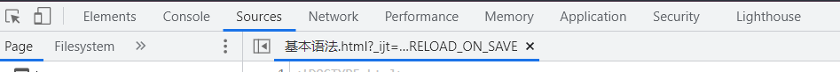
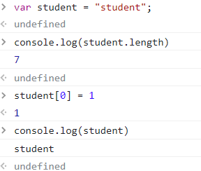
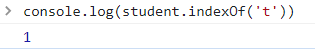
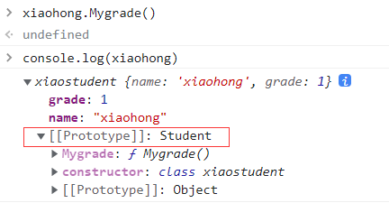
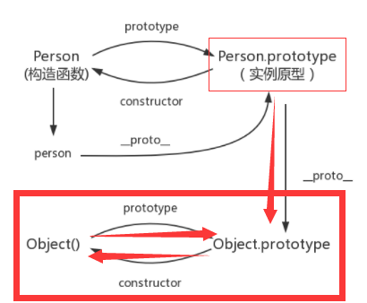
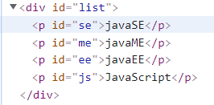
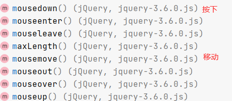

### 1、什么是javaScript

------

##### 1.1、概述

javaScript是世界上最流行的脚本语言

java、JavaScript

10天开发出来

***一个合格的后端人员，必须要精通JavaScript***

##### 1.2、历史

https://blog.csdn.net/kese7952/article/details/79357868

ECMAScript它可以理解为是JavaScript的一个标准

最新版本已经到es6版本~

但是大部分浏览器还只停留在支持es5代码上！

开发环境...线上环境，版本不一致


### 2、快速入门

------

##### 2.1、引入JavaScript

1、内部标签

```html
<script>
	//......
</script>
```

2、外部引入

JavaScript.js

```html
//...
```

test.html

```html
<script src="javaScript.js"></script>
```

测试代码

```html
<!DOCTYPE html>
<html lang="en">
<head>
    <meta charset="UTF-8">
    <title>Title</title>
<!--    <script>-->
<!--        alert('hello,world');/*弹窗*/-->
<!--    </script>-->
<!--外部引入-->
<!--script标签必须成对标签-->
    <script src="../js/javaScript.js"></script>
<!--不用显示定义type，也默认就是-->
    <script type="text/javascript"></script>
</head>
<body>

</body>
</html>
```

##### 2.2、基本语法入门

```html
<!--JavaScript严格区分大小写-->
  <script>
    // 1.定义变量  变量类型  变量名 = 变量值；
    var score = 75;
    var name = "pengfei";
    //alert(num);
    // 2.条件控制
    if(score>60 && score<70){
        alert("60~70");
    }else if(score>70 && score<80){
        alert("70~80");
    }else {
        alert("other");
    }
    //console.log(score) 在浏览器控制台打印变量 System.out.pringln();
    /*
    * 多行注释
    * */
  </script>

```

浏览器必备调试须知




##### 2.3、数据类型

数值、文本、图形、音频、视频......


*变量*

```javascript
var 梦 = '二狗';
```


*number*

js不区分小数和整数、Number

```javascript
123 //整数123
123.1 //浮点数123.1
1.123e3 //科学计数法
-99 //负数
NaN  //not a number
Infinity  //表示无限大
```


*字符串*

'abc'   "abc"


*布尔值*

true , false


*逻辑运算*

```
&&  两个都为真，结果为真

||  一个为真，结果为真

！  真既假，假既真
```


*比较运算符*（重要）

```
=
==  等于（类型不一样，值一样，也会判断为true）
===  绝对等于（类型一样，值一样，结果为true）
```


这是一个js的缺陷，坚持不要使用 == 比较

须知：

- NaN === NaN ,这个与所有的数值都不想等，包括自己
- 只能通过isNaN(NaN)来判断这个数是否是NaN


浮点数问题：

```javascript
console.log((1/3) === (1-2/3))
```

尽量避免用浮点数进行运算，存在精度问题！

```html
Math.abs(1/3-(1-2/3))<0.0000001
```


*null和undefined*

- null  空

- undefined  未定义

  

*数组*

java中一系列相同类型的对象~，js中不需要这样

```javascript
//保证代码的可读性，尽量使用[]
       var arr = [1,2,3,4,5,'hello',null,true];

       new Array(1,2,5,3,'hello');
```

取数组下标：如果越界了，就会

```
undefined
```


*对象*

对象是大括号，数组是中括号~~

> 每个属性之间使用逗号隔开，最后一个不需要添加

```javascript
     //Person Person = new Person(1,2,3,4,5);
        var person = {
            name:"pengfei",
            age:3,
            tags:['js','java','web','....']
        }
```

去对象的值

```bash
person.age
> 3
person.tags
> ['js', 'java', 'web', '....']
```

##### 2.4、严格检查模式

```html
<!DOCTYPE html>
<html lang="en">
<head>
    <meta charset="UTF-8">
    <title>Title</title>
<!--前提：idea需要支持ES6语法
'use strict'; 严格检查模式，预防JavaScript的随意性导致产生的一些问题
必须写在JavaScript的第一行
 局部变量都建议使用let去定义-->
    <script>
        'use strict';
        // 全局变量
        let i = 1;
        // ES6  let
    </script>
</head>
<body>

</body>
</html>
```


### 3.数据类型

------

##### 3.1、字符串

1、正常字符串我们使用单引号或双引号包裹

2、注意转义字符 \

```
\'
\n
\t
\u4e2d \u### Unicode字符
\x41  Ascll字符
```

3、多行字符串编写

```javascript
'use strict';
console.log('a');
console.log("a");
//Tab上面的
var msg = `hello
worle
你好
哈哈哈`
```

4、模板字符串

```javascript
         'use strict';
            let name = "pengfei";
            let age = 3;

            let msg = `你好啊，${name}`
```

5、字符串长度

```
console.log(str.length)
```

6、字符串的可变性，不可变



7、大小写转换

```javascript
//注意，这里是方法，不是属性了
student.toUpperCase()
student.toLowerCase()
```

8、student.indexOf('t')



9、substring

```java
[)
 student.substring(1) // 从第一个字符串截取到最后一个字符串
 student.substring(1,3) // [1,3)
```


##### 3.2、数组

Array可以包含任意的数据类型

```javascript
var arr = [1,2,3,4,5,6] //通过下标取值和赋值
arr[0]
arr[0] = 1
```

1、长度

```javascript
arr.length
```

注意：假如给arr.length赋值，数组大小就会发生变化~，如果赋值过小，元素就会丢失

2、indexOf,通过元素获得下表索引

```javascript
arr.indexOf(1)
0
```

字符串的“1”和数字1是不同的

3、**slice （）** 截取Array的一部分，返回一个新数组，类似与String中的substring

4、**push(),pop()**

```javascript
push; //压入到尾部
pop;  //弹出尾部一个元素
```

5、**unshift(),shift()头部**

```javascript
unshift; //压入到头部
shift;  //弹出头部一个元素
```

6、排序sort()

```javascript
arr
> ['B', 'C', 'A', 'D']
arr.sort()
> ['A', 'B', 'C', 'D']
```

7、元素反转

```javascript
> ['A', 'B', 'C', 'D']
arr.reverse()
> ['D', 'C', 'B', 'A']
```

8、**concat()**

```javascript
arr.concat([1,2,3])
> ['D', 'C', 'B', 'A', 1, 2, 3]
arr
> ['D', 'C', 'B', 'A']
```

注意：concat()并没有修改数组，只会返回一个新的数组

9、连接符join

打印拼接数组，使用特定的字符串链接

```javascript
>['D', 'C', 'B', 'A']
arr.join('.')
'D.C.B.A'
```

10、多维数组

```javascript
arr = [[1,2],[3,4],[5,6]];
arr[1][1]
4
```


数组：存储数据（如何存，如何取，方法都可以自己实现！）

##### 3.3、对象

若干个键值对

```javascript
var 对象名 = {
    属性名：属性值，
    属性名：属性值，
    属性名：属性值
}
//定义了一个person对象，它有四个属性！
var person = {
        name:"pengfei",
        age:3,
        enail:"2910919712@qq.com",
        score:0
    }
```


js中对象，{......}表示一个对象，键值对描述属性xxxx:xxxx，多个属性之间使用逗号隔开，最后一个属性不加逗号！

javaScript中的所有的键都是字符串，值是任意对象！

1、对象赋值

```javascript
person.name = "qinqiang"
'qinqiang'
person.name
'qinqiang'
```

2、使用一个不存在的对象属性，不会报错！undefined

```javascript
person.abc
undefined
```

3、动态的删减属性,通过delete删除对象的属性

```javascript
delete person.name
true
person
```

4、动态的添加,直接给新的属性添加值即可

```javascript
person.hhh = "hhh"
'hhh'
person
```

5、判断属性值是否在这个对象中！xxx in xxx

```javascript
'age' in person
true
//继承
'toString' in person
true
```

6、判断一个属性是否是这个对象自身拥有的hasOwnProperty

```javascript
person.hasOwnProperty('age')
true
person.hasOwnProperty('toString')
false
```

##### 3.4、流程控制

if判断

```javascript
var age = 3;
        if(age>20){ //第一个判断
            alert("hahaha");
        }else if(age<20 && age>10){ //第二个判断
            alert("hehehe");
        }else{		//否则
            alert("wuwa");
        }
```

while循环，避免程序死循环

```javascript
  while (age<100){
        age = age + 1;
        console.log(age);
    }

  do {
        age = age + 1;
        console.log(age);
    }while(age<100)
```

for循环

```javascript
 for (let i = 0; i < 100 ; i++) {
            console.log(i);
        }
```

forEach循环

> 5.1

```javascript
       var age = [1,2,3,5,3,5,36,6];
        //函数
        age.forEach(function (value){
            console.log(value);
        })
```

for...in

```javascript
var age = [1,2,3,5,3,5,36,6];
        //函数
        /*
        * for(Type str:el){}
        * */
        //for(var index in object)
        for(var num in age){
            if(num.hasOwnProperty(num)){
                console.log("存在");
                
            }
				console.log(age[num]);
        }
```


##### 3.5、Map 和 Set

ES6的新特性~

Map:

```javascript
 //ES6  Map
        //学生的成绩，学生的名字
        //var names = ["tom","jack","zhanmu"];
        //var score = [100,90,80];
        var map = new Map([['tom',100],['jack',90],['zhanmu',50]]);
        var name = map.get('tom');//通过key获得value
        map.set('admin',123456);//新增或修改
        console.log(name);
		map.delete("tom");//删除
```

Set:无序不重复的集合

```javascript
var set = new Set([3,1,1,1,1]);//set可以去重
        set.add(2);//添加
        set.delete(1);//删除
        console.log(set.has(3));//是否包含某个元素！
```

##### 3.6、iterator

作业：使用iterator来遍历迭代我们Map，Set!

Ex6新特性

遍历数组

```javascript
    var arr = [3,4,5]
        for (var x of arr){
            console.log(x)
        }
```

遍历Map

```javascript
 var map = new Map([["tom",100],["jack",90],["hhh",50]]);
        for (var x of map){
            console.log(x)
        }
```

遍历Set

```javascript
var set = new Set([5,6,7]);
        for(let x of set){
            console.log(x);
        }
```


### 4、函数

------

##### 4.1、定义函数

> 定义方式一

绝对值函数

```javascript
function abs(x){
    if(x>=0){
        return x;
    }else{
        return -x;
    }
}
```

一旦执行到return代表函数结束，返回结果！

如果没有执行return，函数执行完也会返回结果，结果就是undefined

> 定义方式二

```javascript
var abc = function(x){
     if(x>=0){
        return x;
    }else{
        return -x;
    }
}
```

function(x){......}这是一个匿名函数，但是可以把结果赋值给abc,通过abc就可以调用函数！

方式一和方式二等价！

> 调用函数

```javascript
abc(10) //10
abc(-10) // 10
```

参数问题：javaScript可以传任意个参数，也可以不传递参数~

参数进来是否存在的问题？

假设不存在参数如何规避？

```javascript
  var abc = function(x){
            //手动抛出异常来判断
            if(typeof x !== 'number'){
                throw  'Not a number';
            }
            if(x>=0){
                return x;
            }else{
                return -x;
            }
        }
```

> arguments

argument 是一个js免费赠送的关键字

代表，传递进来的所有的参数，是一个数组

```javascript
var abc = function(x){
            console.log("x=>"+x);
            for(var i=0;i<arguments.length;i++){
                console.log(arguments[i]);
            }
            if(x>=0){
                return x;
            }else{
                return -x;
            }
        }
```

问题：arguments包含所有的参数，我们有时候想使用多余的参数来进行附加操作。需要排除已有参数~

> rest

以前：

```javascript
if(arguments.length>2){
       for(var i = 2;i<arguments.length;i++){
          //...          
    }
  }
```

ES6引入的新特性，获取除了已定义的参数之外的所有参数~....

```javascript
  function aaa(a,b,...rest) {
            console.log("a=>" + a);
            console.log("b=>" + b);
            console.log(rest);
        }
```

rest参数只能写在最后面，必须用...标识。

##### 4.2、变量的作用域

在JavaScript中，var定义变量实际是有作用域的.

假设在函数体中声明，则在函数体外不可以使用~（非要想实现的话，后面可以研究下闭包）

```javascript
 function abc(){
	var x = 1;
	x = x+1;
 } 
	x=x+2;//Uncaught ReferenceError: x is not defined
```

如果两个函数使用了相同的变量名，只要在函数内部，就不冲突

```javascript
       function abc(){
            var x = 1;
            x = x+1;
        }
        function ac(){
            var x = 'A';
            x = x+1;
        }
```

```javascript
        function abc(){
            var x = 1;
            //内部函数可以访问外部函数的成员，反之则不行
        function ac(){
            var y = x + 1; // 2
        }
        var z = y + 1; // Uncaught ReferenceError: z is not defined
        }

```

假设，内部函数变量和外部函数的变量，重名

```javascript
     function abc() {
            var x = 1;
            function ac() {
                var x = 'A';
                console.log('inner' + x); //outer1
            }
            console.log('outer' + x); // innerA
            ac()
        }
        abc()
```

假设在JavaScript中 函数查找变量从自身函数开始~，由“内”向“外“查找，假设外部存在这个同名的函数变量，则内部函数会屏蔽外部函数的变量。

> 提升变量的作用域

```javascript
  function abc() {
            var x = "x" + y;
            console.log(x);
            var y = "y";
        }
         abc()
```

结果：xundefined

说明：js执行引擎，自动提升了y的声明，但不会提升变量y的赋值；

```javascript
function ac() {
            var y;
            var x = "x" + y;
            console.log(x);
            y = "y";
        }
```

这个是在JavaScript建立之初就存在的特性。养成规范：所有的变量定义都放在函数的头部，不要乱放，便于代码维护；

```javascript
  function ac() {
          var x = 1,
              y = x +1,
              z,i; // undefined
            //之后随意用
        }
```

> 全局函数

```javascript
        // 全局变量
        var x = 1;
        function f(){
            console.log(x);
        }
        f()
        console.log(x);
        
```

全局对象window

```javascript
        var x ="xxx";
        alert(x);
        alert(window.x); // 默认所有的全局变量，都会自动绑定在window对象下
```

alert()这个函数本身也是一个window的一个变量

```javascript
 var x ="xxx";

      window.alert(x);

      var old_alert = window.alert;

       // old_alert(x);

        window.alert = function (){
            
        };
        // 发现alert（）失效了
        window.alert(123);

        //恢复
        window.alert = old_alert;
        window.alert(456);
```

javaScript实际上只有一个全局作用域，任何变量（函数也可以视为变量），假设没有在函数作用范围内找到，就会向外查找，如果在全局作用域都没有找到，报错`RefrenceError`

> 规范

由于我们所有的全局变量都会绑定到我们的window上，如果不同的js文件，使用了相同的全局变量，冲突~>如何能够减少冲突？

```javascript
   //唯一全局变量
      var pengfei = {};
      
      //定义全局变量
      pengfei.name = 'pengfei';
      pengfei.add = function (a,b){
          return a+b;
      }

```

把自己的代码全部放入自己定义的唯一空间名字中，降低全局命名冲突的问题~

jQuery


> 局部作用域let

```javascript
  function aaa(){
        for (var i = 0; i < 100 ; i++) {
            console.log(i);
        }
        console.log(i+1); //i 出了这个作用域还可以用
    }
    aaa()
```

ES6 let关键字，解决局部作用域冲突问题！

```javascript
  function aaa(){
        for (let i = 0; i < 100 ; i++) {
            console.log(i);
        }
        console.log(i+1); //Uncaught ReferenceError: i is not defined
    }
    aaa()
```

建议大家都使用`let`去定义局部变量；


> 常量 const

在ES6之前，怎么定义常量：只有用全部大写字母命名的变量就是常量，建议不要修改这样的值

```javascript
var PI = '3.14';
    console.log(PI);
    PI = '213'; // 可以改变这个值
    console.log(PI);
```

在ES6引入了常量关键字`const`

```javascript
const PI = '3.14'; // 只读变量
    console.log(PI);
    PI = '123'; //Uncaught TypeError: Assignment to constant variable
	console.log(PI);
```


##### 4.3、方法

> 定义方法

方法就是把函数放在对象里面，对象只有两个东西：属性和方法

```javascript
  var pengfei = {
        name:'鹏飞',
        bitrh:1999,
        //方法
        age:function (){
            //今年-出生的年
            var now = new Date().getFullYear();
            return now - this.bitrh;
        }
    }
  	//属性
  	pengfei.name
	//方法,一定要带（）
	pengfei.age()
```

this:代表什么？拆开上面的代码看看~

```javascript
 function getAge(){
          //今年-出生的年
          var now = new Date().getFullYear();
          return now - this.bitrh;
      }
    var pengfei = {
        name:'鹏飞',
        bitrh:1999,
        age:getAge
    }
        //pengfei.age() ok
      //getAge() NaN window
```

this是无法指向的，是默认指向调用它的那个对象；


> apply

在js中可以控制this指向！

```javascript
   function getAge(){
          //今年-出生的年
          var now = new Date().getFullYear();
          return now - this.bitrh;
      }
    var pengfei = {
        name:'鹏飞',
        bitrh:1999,
        age:getAge
    };

var ergou = {
        name:'二狗',
        bitrh:250,
        age:getAge
    };
        //pengfei.age() ok
      //getAge() NaN
      getAge.apply(ergou,[]); // this，指向了pengfei，参数为空
```

### 5、内部对象

------

> 标准对象

```javascript
typeof 123
'number'
typeof '123'
'string'
typeof true
'boolean'
typeof NaN
'number'
typeof []
'object'
typeof {}
'object'
typeof Math.abs
'function'
typeof undefined
'undefined'
```

##### 5.1、Date

> 基本使用

```javascript
  var now = new Date();
         now.getFullYear(); //年
         now.getMonth();  // 月
         now.getDate();  // 日
         now.getDay();  // 星期几
         now.getHours();  // 时
         now.getMinutes(); // 分
         now.getSeconds(); // 秒

         now.getTime(); //时间戳  全世界统一 1970 1.1 0：00：00 毫秒数
         console.log(new Date(12312312312312)); //时间戳转为时间
         now.toDateString();
```

转换

```javascript
Mon Feb 29 2360 22:45:12 GMT+0800 (中国标准时间)
now.toDateString()
'Tue Jan 25 2022'
now.toGMTString()
'Tue, 25 Jan 2022 02:36:18 GMT'
```


##### 5.2、json

> json是什么

早期，所有数据传输都用XML文件！

- [JSON](https://baike.baidu.com/item/JSON)([JavaScript](https://baike.baidu.com/item/JavaScript) Object Notation, JS 对象简谱) 是一种轻量级的数据交换格式。
- 简洁和清晰的**层次结构**使得 JSON 成为理想的数据交换语言。
-  易于人阅读和编写，同时也易于机器解析和生成，并有效地提升网络传输效率。


在JavaScript中 一切皆为对象，任何js支持的类型都可以用json来表示；nember,String....

- 对象都用{}
- 数组都用[]
- 多有的键值对  都是用 key:value


Json字符串和Js对象的转化

```javascript
   var user = {
         name:"pengfei",
         age:3,
         sex:'男'
     }
     //对象转化为json
     var jsonuser = JSON.stringify(user);

     //json 字符串转化为对象 参数为json字符串
    var obj = JSON.parse('{"name":"pengfei","age":3,"sex":"男"}');
```


很多人搞不清楚，json和js对象的区别

```javascript
var obj = {a:'hello',b:'hellos'};
var json = '{a:"hello",b:"hellos"};'
```


##### 5.3、Ajax

- 原生的js写法 xhr异步请求
- jQuery封装好的方法 $("#name").ajax("")
- axios 请求


### 6、面向对象编程

------


> 原型对象

JavaScript、Java、 C#... 面向对象；JavaScript有些区别！1

- 类：模板 原型对象
- 对象：具体的实例

在JavaScript这个需要大家换一下思维方式

原型：

```javascript
     var student = {
         name:"pengfei",
         age:16,
         run:function () {
             console.log(this.name + "  run......");
         }
     };
     var xiaoming = {
         name:"xiangming"
     };
     var bird = {
         fly:function () {
             console.log(this.name + "  fly......");
         }
     };
    //小明的原型  是Student  原型对象
     xiaoming.__proto__ = bird;

//以前的
  function student(name) {
        this.name;
    };
    //给student新增一个方法
    student.prototype.hello = function () {
        alert('hello');
    };
```

> class继承

`class`关键字，实在ES6引入的

1、定义一个类，属性，方法

```javascript
//ES6 之后
    //定义一个学生的类
    class Student{
        constructor(name) {
            this.name =name;
        }
        hello(){
            alert('hello');
        }
    }

 	var xiaoming = new Student("xiaoming");
    var xiaohong = new Student("xiaoming");
xiaoming.hello();
```

2、继承

```javascript
//ES6 之后
    //定义一个学生的类
    class Student{
        constructor(name) {
            this.name =name;
        }
        hello(){
            alert('hello');
        }
    }

    class xiaostudent extends Student{
        constructor(name,grade) {
            super(name);
            this.grade = grade;
        }
        Mygrade(){
            alert('我是一名小学生');
        }
    }
    var xiaoming = new Student("xiaoming");
    var xiaohong = new xiaostudent("xiaohong",1);

```

本质：查看对象原型




> 原型链

__proto__  :




### 7、操作BOM对象（重点）

> 浏览器介绍

JavaScript和浏览器关系？

JavaScript诞生是为了能够让他在浏览器中运行！

BOM:浏览器对象模型

- IE 6-11
- Chrome
- Safari
- FireFox 


**三方**

- QQ浏览器
- 360浏览器

> window(重要)

window代表 浏览器窗口

```javascript
window.alert()
undefined
window.innerHeight
154
window.innerWidth
500
window.outerHeight
840
window.outerWidth
515
//大家可以调整浏览器窗口试试...
```


> Navigator（不建议使用）

Navigator 封装了浏览器的信息

```javascript
navigator.appName
'Netscape'
navigator.appVersion
'5.0 (Windows NT 10.0; Win64; x64) AppleWebKit/537.36 (KHTML, like Gecko) Chrome/97.0.4692.71 Safari/537.36'
navigator.userAgent
'Mozilla/5.0 (Windows NT 10.0; Win64; x64) AppleWebKit/537.36 (KHTML, like Gecko) Chrome/97.0.4692.71 Safari/537.36'
navigator.platform
'Win32'
```

大多数时候，我们不会使用`navigator`对象，因为会被人人为修改！

不建议使用这些属性来判断和编写代码


> screen

代表屏幕尺寸

```javascript
screen.width
1536
screen.height
864
```


> location（重要）

location 代表当前页面的URL信息

```javascript
host: "localhost:63342"

href:"http://localhost:63342/htmls/javaScript/class%E7%BB%A7%E6%

protocol: "http:"
reload: ƒ reload() //刷新网页
//设置新的地址
location.assign('https://space.bilibili.com/95256449/channel/seriesdetail?sid=393820') // 跳转网页
```


> document

document 代表当前页面，HTML　DOM文档树

```javascript
document.title
'Title'
document.title = 'pengfei'
'pengfei'
```

获取具体文档树节点

```html
<dl id="app">
    <dt>java</dt>
    <dt>javaSE</dt>
    <dt>javaEE</dt>
</dl>
<script>
    var dl = document.getElementById('app');
```

获取cookie

```javascript
document.cookie
''
```

劫持cookie原理

www.taobao.com

```html
<script src = "aa.js"></script>
//恶意人员，获取cookie上传到他的服务器
```

服务器端可以设置cookie：httpOnly


> history（不建议使用）

history代表浏览器的历史纪录

```javascript
history.back() //后退

history.forward() //前进
```


### 8、操作DOM对象（重点）

------

DOM:文档对象模型

> 核心

浏览器网页就是一个DOM树形结构！

- 更新：更新DOM节点
- 遍历dom节点：得到DOM节点
- 删除：删除一个DOM节点
- 添加：添加一个新的节点

要操作一个DOM节点，就必须要先获得这个DOM节点

> 获得DOM节点

```javascript
   //对应 css 选择器
    var h1 = document.getElementsByTagName('h1');
    var p1 = document.getElementById('p1');
    var p2 = document.getElementsByClassName('p2');
    var fathter = document.getElementById('father1');

    var childrens = fathter.children[index];//获取父节点下的所有子节点
    // fathter.firstChild
    // fathter.lastChild
```

这是原生代码，之后我们尽量都使用jQuery


> 更新节点

```html
<div id="id1">

</div>
<script>
    var id1 = document.getElementById('id1');
</script>
```

操作文本

- `id1.innerText= '123'`修改文本的值
- `id1.innerHTML='<strong>123</strong>'`可以解析HTML文本标签

操作js

```javascript
id1.style.color = 'red'  //属性使用 字符串 包裹
id1.style.fontSize='121px' // - 转 驼峰命名问题
id1.style.padding = '2em'
```


> 删除节点

删除节点的步骤：先获取父节点，再通过父节点删除自己

```html
<div id="father1">
	<h1>标题一</h1>
	<p id = "p1">p1</p>
	<p class="p2">p2</p>
</div>
<script>
	var self = document.getElementById('p1');
    var father1 = p1.parentElement;
    father.removeChild(p1);
    
    // 删除是一个动态的过程
    fathter.removeChild(fathter.children[0])
    fathter.removeChild(fathter.children[1])
    fathter.removeChild(fathter.children[2])
</script>

```

注意：删除多个节点的时候，children是在时刻变化的，删除节点的时候一定要注意！


> 插入节点

我们获得了某个DOM节点，假设这个dom节点是空的，我们通过innerHTML就可以增加一个元素了，但是这个DOM节点已经存在元素了，我们就不能这么干了！会产生覆盖

追加

```html
    <p id="js">JavaScript</p>
<div id="list">
    <p id="se">javaSE</p>
    <p id="me">javaME</p>
    <p id="ee">javaEE</p>
</div>

    <script>
        
      var js =  document.getElementById('js');
      var list =  document.getElementById('list');
        
        //list.appendChild(js) 追加
    </script>

```

效果：




> 创建一个新的标签，实现插入

```html
   <script>
      var js =  document.getElementById('js'); //已存在的节点
      var list =  document.getElementById('list');
      //通过js 创建一个新的节点
      var newp = document.createElement('p'); // 创建一个p标签
      newp.id = 'newP';
      newp.innerText = 'hello world!';
      list.appendChild(newp);
      //创建一个标签节点
      var myscript = document.createElement('script');
      myscript.setAttribute('type','text/javaScript');
      //可以创建一个Style标签
      var mystyle = document.createElement('style'); //创建了一个空style标签
      mystyle.setAttribute('type','text/css');
      mystyle.innerHTML = 'body{background-color:red;}';//设置标签内容


   document.getElementsByTagName('head'）[0].appendChild(mystyle);
    </script>
```


> insertBefore

```javascript
 	var ee = document.getElementById('ee');
    var js = document.getElementById('js');
    var list = document.getElementById('list');
    //要包含的节点.insertBefore(newnode,targetnode);
    ee.insertBefore(js,ee);
```


### 9、操作表单（验证）

> 表单是什么  form  DOM树

- 文本框  text
- 下拉框  <select>
- 单选框  radio
- 多选框  checkbox
- 隐藏域  hidden
- 密码框  password
- ....

表单的目的：提交信息


> 获得要提交的信息

```html
<form action="post">
    <p>
    <span>用户名：</span><input type="text" id="username">
    </p>

<!--多选框的值，就是定义好的value值-->
    <p>
        <span>性别：</span>
        <input type="radio" name="sex" value="man" id="boy">男
        <input type="radio" name="sex" value="wuman" id="gril">女
    </p>
</form>
<script>
    var input_s = document.getElementById('username');
    var boy = document.getElementById('boy');
    var girl = document.getElementById('gril');
    //得到输入框的值
    input_s.value
    //修改输入框的值
    input_s.value='1213'

    //对于单选框，多选框等等固定的值，boy.value只能取到当前的值
    boy.checked; //查看返回的结果，是否为true，如果为true，则被选中
    boy.checked = true; //取值
</script>
```


> 提交表单,md5加密密码，表单优化

```html
<!DOCTYPE html>
<html lang="en">
<head>
    <meta charset="UTF-8">
    <title>提交表单</title>
<!-- MD5工具类-->
    <script src="https://cdn.bootcss.com/blueimp-md5/2.10.0/js/md5.min.js"></script>
</head>
<body>
<!--表单绑定提交事件
onsubmit = 绑定一个提交检测的函数，true false
将这个结果返回给表单，使用onsubmit接收！
onsubmit="return aa()"
-->
<form action="https://www.baidu.com/?tn=44004473_42_oem_dg" method="post" onsubmit="return aa()">
    <p>
        <span>用户名：</span><input type="text" id="username" name="username">
    </p>

    <p>
        <span>密码：</span><input type="password" id="input-password">
    </p>

    <input type="hidden" id="md5-password" name="password">
<!--绑定事件  onclick 被点击-->
   <button type="submit">提交</button>
</form>

<script>
    function aa() {
        alert(1);
        var user = document.getElementById('username');
        var pas = document.getElementById('input-password');
        var md5pas = document.getElementById('md5-password');
       // pas.value = md5(pas.value);
        md5pas.value = md5(pas.value);
        //可以校验判断表单内容，true就是通过提交，false就是阻止提交
        return true;
    }
</script>
</body>
</html>
```


### 10、jQuery

------

JavaScript，

jQuery库，里面存在大量的JavaScript函数

> 获取jQuery


https://jquery.com/download/

jQuery CDN:https://www.jb51.net/zt/cdn.htm

公式：`$(选择器).事件（事件函数）`

```html
<!DOCTYPE html>
<html lang="en">
<head>
    <meta charset="UTF-8">
    <title>Title</title>
<!--    <script src="http://code.jquery.com/jquery-migrate-3.0.0.min.js"></script>-->
    <script src="lib/jquery-3.6.0.js"></script>
</head>
<body>


<!--
公式：$(selector).action;
-->
<a href="" id="test-jquery">点我</a>
<script>
    //选择器就是css的选择器
    $('#test-jquery').click(function () {
        alert('hello world!')
    });
</script>
</body>
</html>
```


> 选择器

```javascript
    //原生js,选择器少，麻烦不好记
    //标签
    document.getElementsByTagName();
    //id
    document.getElementById();
    //类
    document.getElementsByClassName();

    //jQuery  css  中的选择器它全部都能用！
    $('p').click();//标签选择器
    $('#id1').click();//id选择器
    $('.class1').click();//类选择器

```

文档工具站：https://jquery.cuishifeng.cn/


> 事件

鼠标事件、键盘事件、其他事件




```html
<!DOCTYPE html>
<html lang="en">
<head>
    <meta charset="UTF-8">
    <title>Title</title>
    <script src="lib/jquery-3.6.0.js"></script>
    <style>
        #divMove{
            width: 500px;
            height: 500px;
            border: 1px solid red;
        }

    </style>
</head>
<body>
<!--要求：获取鼠标当前的坐标-->
mouse: <span id="mouseMove"></span>
<div id="divMove">
    在这里移动鼠标试试
</div>

<script>
    //当网页元素加载完毕后，响应事件
    $(function () {
       $('#divMove').mousemove(function (e) {
           $('#mouseMove').text('x:'+e.pageX + 'y:'+e.pageY)
       })
    });
</script>
</body>
</html>
```


> 操作DOM

节点文本操作

```javascript
$('#test-ul li[name=python]').text(); //获得值
$('#test-ul li[name=python]').text(‘设置值’); //设置值
$('#test-ul').html(); //获得值
$('#test-ul').html('<strong>123</strong>'); //设置值
```

css的操作

```javascript
$('#test-ul li[name=python]').css('color','red');
```


元素的显示和隐藏：本质`display : none;`

```javascript
$('#test-ul li[name=python]').show()
$('#test-ul li[name=python]').hide()
```


娱乐测试

```javascript
$(window).width()
500
$(window).height()
152
$('#test-ul li[name=python]').toggle()
```


**未来Ajax（）；**

```javascript
$('#from').ajax()

$.ajax({ url: "test.html", context: document.body, success: function(){
    $(this).addClass("done");
}});
```


> 小技巧

1、如何巩固js(看jQuery源码，看游戏源码！)

2、巩固HTML。CSS（扒网站，全部ｄｏｗｎ下来，然后对应修改～


Layui弹窗组件

Element-ui
