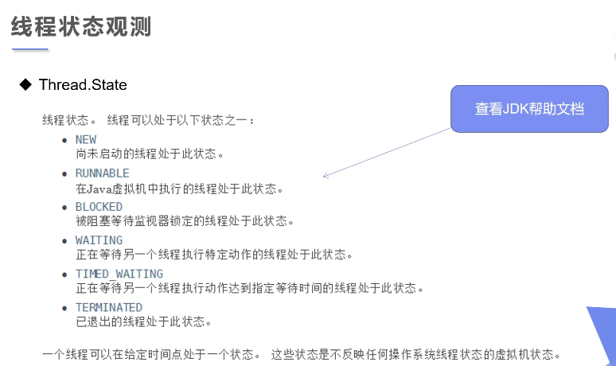
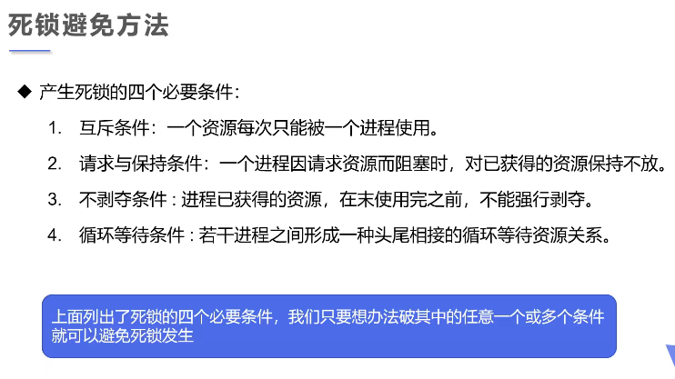

### java多线程

------

Java 给多线程编程提供了内置的支持。 一条线程指的是进程中一个单一顺序的控制流，一个进程中可以并发多个线程，每条线程并行执行不同的任务。

多线程是多任务的一种特别的形式，但多线程使用了更小的资源开销。

这里定义和线程相关的另一个术语 - 进程：一个进程包括由操作系统分配的内存空间，包含一个或多个线程。一个线程不能独立的存在，它必须是进程的一部分。一个进程一直运行，直到所有的非守护线程都结束运行后才能结束。

多线程能满足程序员编写高效率的程序来达到充分利用 CPU 的目的。


### **继承Thread类**

------


```java
package Thread;

//创建线程方式：继承Thread类，重写run()方法
//总结：线程开启不一定立即执行，由CPU调度执行
public class TestThread1 extends Thread{
    @Override
    public void run() {
        //run方法线程体
        for (int i = 0; i < 200; i++) {
            System.out.println("我在看代码~~~"+i);
        }
    }

    public static void main(String[] args) {
        //main线程，主线程

        //创建一个线程对象
        TestThread1 testThread1 = new TestThread1();

        //调用start()方法开启线程
        testThread1.start();
        for (int i = 0; i < 2000; i++) {
            System.out.println("我在学习多线程~~~"+i);
        }
    }
}
```


### **下载图片**

------


```java
package Thread;

import org.apache.commons.io.FileUtils;

import javax.naming.Name;
import java.io.File;
import java.io.IOException;
import java.net.URL;

//练习Thread， 实现多线程同步下载图片
public class TestThread2 implements Runnable{
    private String url; //网络图片地址
    private String name; //保存到文件名

    public TestThread2(String url,String name){
        this.name=name;
        this.url=url;
    }
    //下载图片线程的执行体
    @Override
    public void run() {
        WebDownloader webDownloader = new WebDownloader();
        webDownloader.downloader(url,name);
        System.out.println("下载的文件名为："+name);
    }

    public static void main(String[] args) {
        TestThread2 t1 = new TestThread2("https://10.idqqimg.com/eth/ajNVdqHZLLCfF7qhcIKukrZlYXZYha8ibB2Hj52sbdE3N2iaYLBea8SKyngjJibVNItUnyu0CBibQgw/","1.jpg");
        TestThread2 t2 = new TestThread2("https://10.idqqimg.com/eth/ajNVdqHZLLBmNRhvQgPL2fpghSmayk5sZGy8A2JhowSDYvBWbuEOVCaltAaFIpv10ibX09GEvNM8/","2.jpg");
        TestThread2 t3 = new TestThread2("https://10.idqqimg.com/eth/ajNVdqHZLLBM1sIpyeWHxgUhYkrRWthQC1WcRMlgMXErJCfDVYwHEwh8RgvjGfBYat5Cq10d40k/","3.jpg");
        //其实按大小
        new Thread(t1).start();
        new Thread(t2).start();
        new Thread(t3).start();
    }
}
//下载器
class WebDownloader{
    //下载方法
    public void downloader(String url,String name){
        try {
            FileUtils.copyURLToFile(new URL(url),new File(name));
        } catch (IOException e) {
            e.printStackTrace();
            System.out.println("io异常，downloader方法出现问题");
        }
    }

}

```


### 实现Runnable**接口**

------


```java
package Thread;

//创建线程方式2：实现runnable接口，重写run方法，执行线程需要丢入runnable接口实现类。调用start方法。
public class TestThread3 implements Runnable{
    @Override
    public void run() {
        //run方法线程体
        for (int i = 0; i < 200; i++) {
            System.out.println("我在看代码~~~"+i);
        }
    }

    public static void main(String[] args) {
        //创建runnable接口的实现类对象
        TestThread3 testThread3 = new TestThread3();

        //创建线程对象，通过线程对象来开启我们的线程，代理
        new Thread(testThread3).start();

        for (int i = 0; i < 2000; i++) {
            System.out.println("我在学习多线程~~~"+i);
        }
    }
}
```

**小结：**

- 继承Thread类
  - 子类继承Thread类具备多线程能力
  - 启动线程：子类对象.start()
  - `不建议使用：避免OOP单继承局限性`
- 实现Runnable接口
  - 实现接口Runnable具有多线程能力
  - 启动线程：传入目标对象+Thread对象.start()
  - `推荐使用：避免单继承局限性，灵活方便，方便同一个对象被多个线程使用`


### 初识并发问题

------


```java
package Thread;

//多个线程同时操作同一个对象
//买火车票的例子

//发现问题：多个线程操作同一个资源的情况下，线程不安全，资源紊乱
public class TestThread4 implements Runnable{
    //票数
    private int ticketNums = 10;
    @Override
    public void run() {
        while(true){
            if (ticketNums<=0){
                break;
            }
            //模拟延时
            try {
                Thread.sleep(200);
            } catch (InterruptedException e) {
                e.printStackTrace();
            }
            System.out.println(Thread.currentThread().getName()+"-->拿到了第"+ticketNums--+"票");
        }
    }

    public static void main(String[] args) {
        TestThread4 testThread4 = new TestThread4();

        new Thread(testThread4,"二狗").start();
        new Thread(testThread4,"三德").start();
        new Thread(testThread4,"大黄").start();
    }
}

```


### 龟兔赛跑

------


```java
package Thread;

//模拟龟兔赛跑
public class Race implements Runnable{
    //胜利者
    private static String winner;

    @Override
    public void run() {
        for (int i = 0; i <=100; i++) {
            //模拟兔子休息
            if (Thread.currentThread().getName().equals("兔子") && i%10==0){
                try {
                    Thread.sleep(1);
                } catch (InterruptedException e) {
                    e.printStackTrace();
                }
            }
            //判断比赛是否结束
            boolean flag = gameover(i);
            //如果比赛结束了，就停止程序
            if (flag){
                break;
            }
            System.out.println(Thread.currentThread().getName()+"-->跑了"+i+"步");
        }
    }
    //判断是否完成比赛
    private boolean gameover(int steps){
        //判断是否有胜利者
        if (winner!=null){
            //已经存在胜利者了
            return true;
        }{
            if (steps >= 100){
                winner = Thread.currentThread().getName();
                System.out.println("winner is "+winner);
                return true;
            }
        }
        return false;
    }

    public static void main(String[] args) {
        Race race = new Race();

        new Thread(race,"兔子").start();
        new Thread(race,"乌龟").start();
    }
}

```


### 实现Callable接口

------


```java 
package Thread;

import org.apache.commons.io.FileUtils;

import java.io.File;
import java.io.IOException;
import java.net.URL;
import java.util.concurrent.*;

//线程创建方式三：实现callable接口
/*
callable的好处
1.可以定义返回值
2.可以抛出异常
 */
public class TestCallable implements Callable<Boolean> {
    private String url; //网络图片地址
    private String name; //保存到文件名

    public TestCallable(String url,String name){
        this.name=name;
        this.url=url;
    }
    //下载图片线程的执行体
    @Override
    public Boolean call() {
        WebDownloader1 webDownloader = new WebDownloader1();
        webDownloader.downloader(url,name);
        System.out.println("下载的文件名为："+name);
        return true;
    }

    public static void main(String[] args) {
        TestCallable t1 = new TestCallable("https://10.idqqimg.com/eth/ajNVdqHZLLCfF7qhcIKukrZlYXZYha8ibB2Hj52sbdE3N2iaYLBea8SKyngjJibVNItUnyu0CBibQgw/","1.jpg");
        TestCallable t2 = new TestCallable("https://10.idqqimg.com/eth/ajNVdqHZLLBmNRhvQgPL2fpghSmayk5sZGy8A2JhowSDYvBWbuEOVCaltAaFIpv10ibX09GEvNM8/","2.jpg");
        TestCallable t3 = new TestCallable("https://10.idqqimg.com/eth/ajNVdqHZLLBM1sIpyeWHxgUhYkrRWthQC1WcRMlgMXErJCfDVYwHEwh8RgvjGfBYat5Cq10d40k/","3.jpg");
        //创建执行服务
        ExecutorService ser = Executors.newFixedThreadPool(1);
        //提交执行
        Future<Boolean> resuit1 = ser.submit(t1);
        Future<Boolean> resuit2 = ser.submit(t2);
        Future<Boolean> resuit3 = ser.submit(t3);

        //获取结果
        try {
            boolean rs1 = resuit1.get();
            System.out.println(rs1);
        } catch (InterruptedException e) {
            e.printStackTrace();
        } catch (ExecutionException e) {
            e.printStackTrace();
        }
        try {
            boolean rs2 = resuit2.get();
            System.out.println(rs2);
        } catch (InterruptedException e) {
            e.printStackTrace();
        } catch (ExecutionException e) {
            e.printStackTrace();
        }
        try {
            boolean rs3 = resuit3.get();
            System.out.println(rs3);
        } catch (InterruptedException e) {
            e.printStackTrace();
        } catch (ExecutionException e) {
            e.printStackTrace();
        }
        //关闭服务
        ser.shutdownNow();
    }
}
//下载器
class WebDownloader1{
    //下载方法
    public void downloader(String url,String name){
        try {
            FileUtils.copyURLToFile(new URL(url),new File(name));
        } catch (IOException e) {
            e.printStackTrace();
            System.out.println("io异常，downloader方法出现问题");
        }
    }
}
```


### 静态代理模式

------


```java
package Thread;

//静态代理模式总结：
//真实对象和代理对象都要实现同一个接口
//代理对象必须要代理真实角色
//好处：
    //代理对象可以做很多真实对象做不了的事情
    //真实对象专注去做自己的事情
public class StacticProxy {
    public static void main(String[] args) {
        You you = new You();//你要结婚
        
        new Thread(()-> System.out.println("我喜欢你！")).start();

        new WebdingCompany(new You()).HappyMarry();

    }
}
interface Marry{
    //人间四大喜事
        //久旱逢甘霖
        //他乡遇故知
        //洞房花烛夜
        //金榜题名时

    void HappyMarry();
}
//真实角色，你去结婚
class You implements Marry{

    @Override
    public void HappyMarry() {
        System.out.println("恭喜结婚！");
    }
}
//代理角色，帮你结婚 婚庆公司
class WebdingCompany implements Marry{
    //代理谁--》真实目标角色
    private Marry target;

    public WebdingCompany(Marry target){
        this.target=target;
    }
    @Override
    public void HappyMarry() {
        before();
        this.target.HappyMarry();//这就是真实对象
        after();
    }

    private void after() {
        System.out.println("结婚之后，收尾款！");
    }

    private void before() {
        System.out.println("结婚之前，布置现场！");
    }
}
```


### Lamda表达式

------


```java
package Thread;

//推到Lamda表达式

public class testLamda {
    //3.静态内部类
    static class Like1 implements ILike{
        @Override
        public void lamda() {
            System.out.println("i am 静态内部类!");
        }
    }

    public static void main(String[] args) {
        ILike like = new Like();
        like.lamda();

        like = new Like1();
        like.lamda();

        //4.局部内部类
        class Like2 implements ILike{
            @Override
            public void lamda() {
                System.out.println("i am 局部内部类!");
            }
        }
        like = new Like2();
        like.lamda();


        //5.匿名内部类,没有类的名称，必须借助接口或者父类
        like = new ILike() {
            @Override
            public void lamda() {
                System.out.println("i am 匿名内部类!");
            }
        };
        like.lamda();

        //6.用lamda简化
        like = () ->{
            System.out.println("i am lamda!");
        };
        like.lamda();
    }
}

//1.定义一个函数式接口
interface ILike{
    void lamda();
}

//2.实现类
class Like implements ILike{
    @Override
    public void lamda() {
        System.out.println("i am 实现类!");
    }
}
```

**lamda简化**

```java
package Thread;

public class TestLamda1 {
    public static void main(String[] args) {
        Ilove love = null;
        //1.lamda表示简化
//        Ilove love = (int a)->{
//                System.out.println("i love you-->"+a);
//        };
        //简化1:参数类型
//        love = (a) ->{
//            System.out.println("i love you-->"+a);
//        };
        //简化2:简化括号
//        love = a ->{
//            System.out.println("i love you-->"+a);
//        };
        //简化3:简化大括号
        love = a -> System.out.println("i love you-->"+a);
        //总结:
            //lamda表达式只能有一行代码的情况下才能简化成一行,如果有多行,就用代码块(大括号)
            //前提是接口是函数式接口
            //多个参数也可以去掉参数类型.要去就都去掉,必须加括号

        love.love(1314);
    }
}
interface Ilove{
    void love(int a);
}

```


### 线程状态

------


#### 1、线程停止


```java
package Thread;

//测试stop
//1.建议线程正常停止-->利用次数,不建议死循环
//2.建议使用标志位-->设置一个标志位
//3.不要使用stop或者destroy等过时或者JDK不建议使用的方法
public class TestStop implements Runnable{
    //1.设置一个标志位
    private boolean flag = true;
    @Override
    public void run() {
        int i = 0;
        while(flag){
            System.out.println("run...Thread"+i++);
        }
    }
    //2.设置一个公开的方法停止线程,转换标志位

    public void stop(){
        this.flag=false;
    }

    public static void main(String[] args) {
        TestStop testStop = new TestStop();
        new Thread(testStop).start();
        for (int i = 0; i < 1000; i++) {
            System.out.println("main"+i);
            if (i == 900){
                //调用stop方法切换标志位,让线程停止
                testStop.stop();
                System.out.println("线程该停止了");
            }
        }
    }
}
```


#### 2、线程休眠


**模拟网络延时**

```java
package Thread;


//模拟网络延时:放大问题的发生性
public class TestSleep implements Runnable{
    //票数
    private int ticketNums = 10;
    @Override
    public void run() {
        while(true){
            if (ticketNums<=0){
                break;
            }
            //模拟延时
            try {
                Thread.sleep(100);
            } catch (InterruptedException e) {
                e.printStackTrace();
            }
            System.out.println(Thread.currentThread().getName()+"-->拿到了第"+ticketNums--+"票");
        }
    }

    public static void main(String[] args) {
        TestSleep testSleep = new TestSleep();

        new Thread(testSleep,"二狗").start();
        new Thread(testSleep,"三德").start();
        new Thread(testSleep,"大黄").start();
    }
}

```


**模拟倒计时**

```java
package Thread;


import java.text.SimpleDateFormat;
import java.util.Date;

//模拟倒计时,,,
public class TestSleep2 {
    public static void main(String[] args) {
//        try {
//            tendown();
//        } catch (InterruptedException e) {
//            e.printStackTrace();
//        }
        //打印当前系统时间
        Date startTime = new Date(System.currentTimeMillis());//获取当前系统时间
        while (true){
            try {
                Thread.sleep(1000);
                System.out.println(new SimpleDateFormat("hh:mm:ss").format(startTime));
                startTime = new Date(System.currentTimeMillis());//更新当前系统时间
            } catch (InterruptedException e) {
                e.printStackTrace();
            }
        }
    }
    //模拟倒计时
    public static void tendown() throws InterruptedException{
        int num = 10;

        while(true){
            Thread.sleep(1000);
            System.out.println(num--);
            if (num<=0){
                break;
            }
        }
    }
}
```


#### 3、线程礼让


```java
package Thread;

//测试礼让线程
//礼让不一定成功,看CPU心情
public class TestYield {
    public static void main(String[] args) {
        MyYield myYield = new MyYield();

        new Thread(myYield,"a").start();
        new Thread(myYield,"b").start();
    }

}

class MyYield implements Runnable{

    @Override
    public void run() {
        System.out.println(Thread.currentThread().getName()+"线程开始执行");
        Thread.yield();
        System.out.println(Thread.currentThread().getName()+"线程停止执行");
    }
}
```


#### 4、Join强制执行


**插队**

```java
package Thread;

//测试join方法  想象为插队
public class TestJoin implements Runnable{
    @Override
    public void run() {
        for (int i = 0; i < 1000; i++) {
            System.out.println("线程Vip来了"+i);
        }
    }
    public static void main(String[] args) throws InterruptedException{
        //启动我们的线程
        TestJoin testJoin = new TestJoin();
        Thread thread = new Thread(testJoin);
        thread.start();

        //主线程
        for (int i = 0; i < 500; i++) {
            if (i==200){
                thread.join();//插队
            }
            System.out.println("main"+i);
        }
    }

}

```


### 观测线程状态

------




```java
package Thread;

//观察测试线程的状态
public class TestState {
    public static void main(String[] args) throws InterruptedException{
        Thread thread = new Thread(()->{
            for (int i = 0; i < 5; i++) {
                try {
                    Thread.sleep(1000);
                } catch (InterruptedException e) {
                    e.printStackTrace();
                }
            }
            System.out.println("/////");
        });

        //观测状态
        Thread.State state = thread.getState();
        System.out.println(state); //NEW

        //观察启动后
        thread.start();//启动线程
        state = thread.getState();
        System.out.println(state);//Run

        while (state!=Thread.State.TERMINATED){//只要线程不终止,就一直输出状态
            Thread.sleep(100);
            state =thread.getState();//更新线程状态
            System.out.println(state);//输出状态
        }
    }
}
```

### 线程优先级

------


```java
package Thread;

//测试线程的优先级
public class TestPriority {
    public static void main(String[] args) {
        //主线程默认优先级
        System.out.println(Thread.currentThread().getName()+"-->"+Thread.currentThread().getPriority());

        MyPriority myPriority = new MyPriority();

        Thread t1 = new Thread(myPriority);
        Thread t2 = new Thread(myPriority);
        Thread t3 = new Thread(myPriority);
        Thread t4 = new Thread(myPriority);
        Thread t5 = new Thread(myPriority);
        Thread t6 = new Thread(myPriority);

        //先设置优先级，在启动
        t1.start();

        t2.setPriority(1);
        t2.start();

        t3.setPriority(4);
        t3.start();

        t4.setPriority(Thread.MAX_PRIORITY); //MAX_PRIORITY = 10
        t4.start();

        t5.setPriority(8);
        t5.start();

        t6.setPriority(7);
        t6.start();
    }
}
class MyPriority implements Runnable{

    @Override
    public void run() {
        System.out.println(Thread.currentThread().getName()+"-->"+Thread.currentThread().getPriority());
    }
}
```


### 守护(daemon)线程

------


```java
package Thread;

//测试守护进程
//上帝守护你
public class TestDaemon {
    public static void main(String[] args) {
        God god = new God();
        You1 you1 =new You1();

        Thread thread = new Thread(god);
        thread.setDaemon(true);//默认是false表示用户线程，正常的线程都是用户线程

        thread.start();//上帝守护线程启动

        new Thread(you1).start();
    }
}

//上帝
class God implements Runnable{
    @Override
    public void run() {
        while (true){
            System.out.println("上帝保佑着你！");
        }
    }
}

//你
class You1 implements Runnable{
    @Override
    public void run() {
        for (int i = 0; i < 36500; i++) {
            System.out.println("你的一生都开心的活着！");
        }
        System.out.println("====goodbye world====");//Hello World!
    }
}
```


### 线程同步

------


> 多个线程操作同一个资源

- 并发：同一个对象被多个线程同时操作


**不安全的买票**

```java
package syn;

//不安全的买票
//存在重复的 或者负数
public class UnsafeBuyTicket {
    public static void main(String[] args) {
        BuyTicket buyTicket = new BuyTicket();

        new Thread(buyTicket,"苦逼的我").start();
        new Thread(buyTicket,"幸运的你们").start();
        new Thread(buyTicket,"可恶的黄牛").start();
    }
}

class BuyTicket implements Runnable{
    //票
    private int ticketNums = 10;
    boolean flag = true;//外部停止方式
    @Override
    public void run() {
        //买票
        while (flag){
            try {
                buy();
            } catch (InterruptedException e) {
                e.printStackTrace();
            }
        }
    }
    private void buy() throws InterruptedException{
        //判断是否有票
        if (ticketNums <= 0){
            flag = false;
            return;
        }
            Thread.sleep(100);
        //买票
        System.out.println(Thread.currentThread().getName()+"拿到"+ticketNums--);
    }
}
```


**不安全的取钱**

```java
package syn;

//不安全的取钱
//两个人去银行取钱，账户
public class UnsafeBank {
    public static void main(String[] args) {
        //账户
        Account account = new Account(100,"基金");

        Drawing you = new Drawing(account,50,"you");
        Drawing Girl = new Drawing(account,100,"Gril");

        you.start();
        Girl.start();
    }
}

//账户
class Account{
    int money; //余额
    String name;//卡名
    public Account(int money,String name){
        this.money=money;
        this.name=name;
    }
}

//银行：模拟取款
class Drawing extends Thread{
    Account account;//账户
    //取了多少钱
    int drawingMoney;
    //现在手里有多少钱
    int nomoney;

    public Drawing(Account account,int drawingMoney,String name){
        super(name);
        this.account = account;
        this.drawingMoney=drawingMoney;
    }
    //取钱
    @Override
    public void run() {
        //判断有没有钱
        if (account.money-drawingMoney<0){
            System.out.println(Thread.currentThread().getName()+"钱不够，取不了");
            return;
        }
        //sleep可以放大问题的发生性
        try {
            Thread.sleep(1000);
        } catch (InterruptedException e) {
            e.printStackTrace();
        }
        //卡内余额=余额 - 你取的钱
        account.money = account.money -drawingMoney;
        //你手里的钱
        nomoney = nomoney + drawingMoney;

        System.out.println(account.name+"余额为："+account.money);
        //Thread.currentThread().getName() = this.getName()
        System.out.println(this.getName()+"手里的钱："+nomoney);
    }
}
```


**不安全集合**

```java
package syn;

import java.util.ArrayList;
import java.util.List;

public class UnsafeList {
    public static void main(String[] args) {
        List<String> list = new ArrayList<String>();
        for (int i = 0; i < 10000; i++) {
            new Thread(()->{
                list.add(Thread.currentThread().getName());
            }).start();
        }
        try {
            Thread.sleep(3000);
        } catch (InterruptedException e) {
            e.printStackTrace();
        }
        System.out.println(list.size());
    }
}

```


`锁的对象就是变化的量，需要增删改的对象`


**安全的取钱**

```java
package syn;

//安全的取钱
//两个人去银行取钱，账户
public class UnsafeBank {
    public static void main(String[] args) {
        //账户
        Account account = new Account(1000,"基金");

        Drawing you = new Drawing(account,50,"you");
        Drawing Girl = new Drawing(account,100,"Gril");

        you.start();
        Girl.start();
    }
}

//账户
class Account{
    int money; //余额
    String name;//卡名
    public Account(int money,String name){
        this.money=money;
        this.name=name;
    }
}

//银行：模拟取款
class Drawing extends Thread{
    Account account;//账户
    //取了多少钱
    int drawingMoney;
    //现在手里有多少钱
    int nomoney;

    public Drawing(Account account,int drawingMoney,String name){
        super(name);
        this.account = account;
        this.drawingMoney=drawingMoney;
    }
    //取钱
    //synchronized默认锁this
    @Override
    public void run() {
        //锁的对象就是变化的量，需要增删改的对象
        synchronized (account){
            //判断有没有钱
            if (account.money-drawingMoney<0){
                System.out.println(Thread.currentThread().getName()+"钱不够，取不了");
                return;
            }
            //sleep可以放大问题的发生性
            try {
                Thread.sleep(1000);
            } catch (InterruptedException e) {
                e.printStackTrace();
            }
            //卡内余额=余额 - 你取的钱
            account.money = account.money -drawingMoney;
            //你手里的钱
            nomoney = nomoney + drawingMoney;

            System.out.println(account.name+"余额为："+account.money);
            //Thread.currentThread().getName() = this.getName()
            System.out.println(this.getName()+"手里的钱："+nomoney);
        }
        }

}
```


**安全的取票**

```java
package syn;

//安全的买票
//存在重复的 或者负数
public class UnsafeBuyTicket {
    public static void main(String[] args) {
        BuyTicket buyTicket = new BuyTicket();

        new Thread(buyTicket,"苦逼的我").start();
        new Thread(buyTicket,"幸运的你们").start();
        new Thread(buyTicket,"可恶的黄牛").start();
    }
}

class BuyTicket implements Runnable{
    //票
    private int ticketNums = 10;
    boolean flag = true;//外部停止方式
    @Override
    public void run() {
        //买票
        while (flag){
            try {
                buy();
            } catch (InterruptedException e) {
                e.printStackTrace();
            }
        }
    }
    //synchronized同步方法，锁的是this
    private synchronized void buy() throws InterruptedException{
        //判断是否有票
        if (ticketNums <= 0){
            flag = false;
            return;
        }
            Thread.sleep(100);
        //买票
        System.out.println(Thread.currentThread().getName()+"拿到"+ticketNums--);
    }
}
```


**安全的集合**

```java
package syn;

import java.util.ArrayList;
import java.util.List;

public class UnsafeList {
    public static void main(String[] args) {
        List<String> list = new ArrayList<String>();
        for (int i = 0; i < 10000; i++) {
            new Thread(()->{
                synchronized (list){
                    list.add(Thread.currentThread().getName());
                }
            }).start();
        }
        try {
            Thread.sleep(3000);
        } catch (InterruptedException e) {
            e.printStackTrace();
        }
        System.out.println(list.size());
    }
}

```


**CopyOnWriteArrayList**

```java

package syn;

import java.util.concurrent.CopyOnWriteArrayList;

//测试JUC安全类型的集合
public class TestJUC {
    public static void main(String[] args) {
        CopyOnWriteArrayList<String> list = new CopyOnWriteArrayList<String>();

        for (int i = 0; i < 10000; i++) {
            new Thread(()->{
                list.add(Thread.currentThread().getName());
            }).start();
        }
        try {
            Thread.sleep(1000);
        } catch (InterruptedException e) {
            e.printStackTrace();
        }
        System.out.println(list.size());
    }
}

```


### 死锁

------




**死锁**

```java
package sisuo;

import java.awt.*;

//死锁：多个线程互相拥抱着对方需要的资源，然后形成僵持
public class DeadLock {
    public static void main(String[] args) {
        Makeup g1 = new Makeup(0,"灰姑娘");
        Makeup g2 = new Makeup(1,"白雪公主");

        g1.start();
        g2.start();
    }
}

//口红
class Lipstick{

}
//镜子
class Mirror{

}
//化妆
class Makeup extends Thread{
    static Lipstick lipstick = new Lipstick();
    static Mirror mirror = new Mirror();

    int choise;//选择
    String girlName;//使用化妆品的人

    Makeup(int choise,String girlName){
        this.choise = choise;
        this.girlName = girlName;
    }

    @Override
    public void run() {
        //化妆
        try {
            makeup();
        } catch (InterruptedException e) {
            e.printStackTrace();
        }
    }
    //化妆，互相持有对方的锁，就是需要拿到对方的资源
    private void makeup() throws InterruptedException{
        if (choise == 0){
            synchronized (lipstick){
                //获得口红的锁
                System.out.println(this.girlName+"获得口红的锁");
                Thread.sleep(1000);

                synchronized (mirror){
                    //一秒钟后想获得镜子的锁
                    System.out.println(this.girlName+"获得镜子的锁");
                    //拿出来可以避免死锁
                }
            }

        }else {
            synchronized (mirror){
                //获得口红的锁
                System.out.println(this.girlName+"获得镜子的锁");
                Thread.sleep(2000);

                synchronized (lipstick){
                    //一秒钟后想获得镜子的锁
                    System.out.println(this.girlName+"获得口红的锁");
                }
        }
    }
}
}
```


### Lock锁

------


```java
package sisuo;

import java.util.concurrent.locks.ReentrantLock;

//测试Lock锁
public class TestKLock {
    public static void main(String[] args) {
        Testlock2 testlock2 = new Testlock2();

        new Thread(testlock2).start();
        new Thread(testlock2).start();
        new Thread(testlock2).start();
    }
}

class Testlock2 implements Runnable{
    int ticketNums = 10;
    //定义lock锁
    private  final ReentrantLock lock = new ReentrantLock();
    @Override
    public void run() {
        while (true){

            try{
                lock.lock();//加锁
                if (ticketNums>0){
                    try {
                        Thread.sleep(1000);
                    } catch (InterruptedException e) {
                        e.printStackTrace();
                    }
                    System.out.println(ticketNums--);
                }else {
                    break;
                }
            }finally {
                //解锁
                lock.unlock();
                //如果同步代码有异常，要将unlock()写入finally语句块
            }

        }
    }
}
```


### 线程协作：生产者消费者问题

------


#### 1、管程法

```java
package sisuo;

//测试：生产者消费者模型--》利用缓冲区解决：管程法

//生产者，消费者，产品，缓冲区
public class TestPC {
    public static void main(String[] args) {
        SynContainer container = new SynContainer();

        new Productor(container).start();
        new Consumer(container).start();
    }
}

//生产者
class Productor extends Thread{
    SynContainer container;
    public Productor(SynContainer container){
        this.container=container;
    }
    //生产
    @Override
    public void run() {
        for (int i = 0; i < 100; i++) {
            container.push(new Chicken(i));
            System.out.println("生产了"+i+"只鸡");
        }
    }
}

//消费者
class Consumer extends Thread{
    SynContainer container;
    public Consumer(SynContainer container){
        this.container=container;
    }
    //消费
    @Override
    public void run() {
        for (int i = 0; i < 100; i++) {
            System.out.println("消费了-->"+container.pop().id+"只鸡");
        }
    }
}

//产品
class Chicken{
    int id; //产品编号
    public Chicken(int id){
        this.id = id;
    }
}

//缓冲区
class SynContainer{
    //需要一个容器大小
    Chicken[] chickens =new Chicken[10];
    //容器计数器
    int count = 0;
    //生产者放入产品
    public  synchronized void push(Chicken chicken){
        //如果容器满了，就需要等待消费者消费
        if (count==chickens.length){
            //通知消费者消费，生产等待
            try {
                this.wait();
            } catch (InterruptedException e) {
                e.printStackTrace();
            }
        }
        //如果没有满，我们就需要丢入产品
        chickens[count]=chicken;
        count++;

        //可以通知消费者消费了，
        this.notifyAll();
    }
    //消费者消费产品
    public synchronized Chicken pop(){
        //判断能否消费
        if (count == 0){
            //等待生产者生产，消费者等待
            try {
                this.wait();
            } catch (InterruptedException e) {
                e.printStackTrace();
            }
        }
        //如果可以消费
        count--;
        Chicken chicken = chickens[count];

        //吃完了，通知生产者生产
        this.notifyAll();
        return chicken;
    }
}
```


#### 2、信号灯法

```java
package sisuo;


//测试生产者消费者问题2：信号灯法，标志位解决
public class TestPC2 {
    public static void main(String[] args) {
        TV tv = new TV();

        new Player(tv).start();
        new Watcher(tv).start();
    }
}

//生产者--》演员
class Player extends Thread{
    TV tv;
    public Player(TV tv){
        this.tv=tv;
    }

    @Override
    public void run() {
        for (int i = 0; i < 20; i++) {
            if (i%2==0){
                this.tv.play("快乐大本营");
            }else {
                this.tv.play("抖音");
            }
        }
    }
}

//消费者--》观众
class Watcher extends Thread{
    TV tv;
    public Watcher(TV tv){
        this.tv=tv;
    }

    @Override
    public void run() {
        for (int i = 0; i < 20; i++) {
            tv.watch();
        }
    }
}
//产品--》节目
class TV{
    //演员表演，观众等待 T
//    观众观看，演员等待 F
    String voice; //表演的节目
    boolean flag = true;
//    表演
    public synchronized void play(String voice){
        if (!flag){
            try {
                this.wait();
            } catch (InterruptedException e) {
                e.printStackTrace();
            }
        }
        System.out.println("演员表演了"+voice);
        //通知观众观看
        this.notifyAll();
        this.voice=voice;
        this.flag = !this.flag;
    }
//    观看
    public synchronized void watch(){
        if (flag){
            try {
                this.wait();
            } catch (InterruptedException e) {
                e.printStackTrace();
            }
        }
        System.out.println("观众观看了"+voice);
        //通知演员表演
        this.notifyAll();
        this.flag = !this.flag;
    }
}
```


### 线程池

------


```java
package sisuo;

import java.util.concurrent.ExecutorService;
import java.util.concurrent.Executors;

//测试线程池
public class TestPool {
    public static void main(String[] args) {
        //1.创建服务，创建线程池
        //newFixedThreadPool 参数为：线程池大小
        ExecutorService service = Executors.newFixedThreadPool(10);
        //执行
        service.execute(new MyThread());
        service.execute(new MyThread());
        service.execute(new MyThread());
        service.execute(new MyThread());

        //2.关闭连接
        service.shutdown();
    }
}

class  MyThread implements Runnable{
    @Override
    public void run() {
            System.out.println(Thread.currentThread().getName());
    }
}

```


### 总结

```java
package sisuo;

import java.util.concurrent.Callable;
import java.util.concurrent.ExecutionException;
import java.util.concurrent.FutureTask;

//回顾线程的创建
public class Threadnew {
    public static void main(String[] args) {
        new MyThread1().start();

        new Thread(new MyRunnable()).start();

        FutureTask<Integer> futureTask = new FutureTask<Integer>(new MyCallable());
        new Thread(futureTask).start();

        Integer integer = null;
        try {
            integer = futureTask.get();
            System.out.println(integer);
        } catch (InterruptedException e) {
            e.printStackTrace();
        } catch (ExecutionException e) {
            e.printStackTrace();
        }

    }
}

//1.继承Thread类
class MyThread1 extends Thread{
    @Override
    public void run() {
        System.out.println("MyThread1");
    }
}


//2.实现Runnable接口
class MyRunnable implements Runnable{
    @Override
    public void run() {
        System.out.println("MyRunnable");
    }
}

//3.实现Callable接口
class MyCallable implements Callable<Integer>{
    @Override
    public Integer call() throws Exception {
        System.out.println("MyCallable");
        return 100;
    }
}
```

