### 1、初始MySql

------

javaEE:企业级Java开发 Web

前端(页面：展示，数据！) 

后台(连接点：连接数据库JDBC，连接前端(控制，控制视图跳转，和给前端传递数据))

数据库(存数据，txt，Excel，Word)

> 只会写代码，学好数据库，基本混饭吃；
>
> 操作系统，数据结构与算法！当一个不错的程序员
>
> 离散数学，数字电路，体系结构，编译原理。+实战经验，高级程序员


#### 1.1、为什么学习数据库

1. 岗位需求
2. 现在的世界，大数据时代~，得数据者得天下
3. 被迫需求：存数据 去IOE
4. ==数据库是所有软件体系中最核心的存在==  DBA


#### 1.2、什么是数据库

数据库（DB,DataBase）

概念：数据仓库，软件，安装在操作系统（window，Linux,Mac...）之上！SQL，可以存储大量的数据。500万

作用：存储数据，管理数据


#### 1.3、数据库分类

关系型数据库：（SQL）

- MySql，Oracle，Sql Server，DB2，SqlLlite
- 通过表和表之间，行和列之间的关系进行数据的存储， 学员信息表，考勤表，...


非关系型数据库：（NoSQL） not only

- Redis,MongDB
- 非关系型数据库，对象存储，通过对象自身的属性来决定


==DBMS(数据库管理系统)==

- 数据库的管理软件，科学有效的管理我们的数据。维护和获取数据；
- MySQL，数据库管理系统！


#### 1.4、MySQL

MySQL是一个关系型数据库管理系统

前世：瑞典MySql AB公司

今世:属于Oracle旗下产品

MySQL是最好的RDBMS(Relational Database Management System,关系数据库管理系统)应用软件之一。

开源的数据库软件~

体积小、速度快、总体拥有成本低，招成本比较低，所有人必须会~

中小型网站、或者大型网站，集群

官网：https://www.mysql.com/


安装建议：

1. 尽量不要使用exe,注册表
2. 尽可能使用压缩包安装~


### 2、操作数据库

------

操作数据库>操作数据库中的表>操作数据库中表的数据

#### 2.1、操作数据库（了解）

1、创建数据库

```sql
CREATE DATABASE IF not EXISTS school
```

2、删除数据库

```sql
Drop DATABASE IF EXISTS school
```

3、使用数据库

```sql
-- tab 键的上面，如果你的表名或者字段名是一个特殊字符，就需要带‘’
use 'school'
```

4、查看数据库

```sql
show DATABASES -- 查看所有的数据库
```


对比：SQL可视化操作

学习思路：

- 对照历史记录查看SQL
- 固定的语法或关键字必须强行记住！


#### 2.2、数据库的列类型

> 数值

- tinyint  十分小的数据  一个字节
- smallint  较小的数据   两个字节
- mediumint  中等大小的数据 三个字节
- **int       标准的整数  四个字节**  ==常用==
- bigint    较大的数据  八个字节
- float     浮点数      四个字节
- double    浮点数      八个字节 （精度问题）
- decimal   字符串形式的浮点数   金融计算的时候，一般是使用decimal


> 字符串

- char   字符串固定大小的  0~255
- **varchar  可变字符串     0~65535**  ==常用==   String
- tinytext  微型文本    2^8-1
- text      文本串      2^16-1   保存大文本


> 时间日期

java.util.Date

- date  YYYY-MM-DD,日期格式
- time  HH:mm:ss  时间格式
- **datetime   YYYY-MM-DD HH:mm:ss 最常用的时间格式**
- **timestamp  时间戳   1970.1.1到现在的毫秒数！** 也较为常用
- year  年份表示


> null

- 没有值，未知
- `注意，不要使用null进行运算，结果为null`


#### 2.3、数据库的字段属性(重点)

`Unsigned:`

- 无符号的整数
- 声明了该列不能声明为负数


`zerofill:`

- 0填充的
- 不足的位数，使用0来填充， int(3), 5 --- 005


`自增：`

-  通常理解为自增，自动在上一条记录的基础上+1（默认）
- 通常用来设计唯一的主键~index，必须是整数类型
- 可以自定义设计主键自增的起始值和步长


`非空` Null not null

- 假设设置为 not null，如果不给它赋值，就会报错！
- Null  如果不填值，默认就是null


`默认：`

- 设置默认的值
- sex,默认值为男，如果不指定该列的值，则会默认的值！


`拓展：`

```sql
/* 每一个表，都必须存在以下五个字段！未来做项目用的，表示一个记录存在意义！

id 主键
‘version’  乐观锁
is_delete  伪删除
gmt_create  创建时间
gmt_update  修改时间
*/
```


#### 2.4、创建数据库表(重点)

```sql
-- 目标  ： 创建一个school数据库
-- 学号int 登录密码varchar(20) 姓名，性别varchar(2),出生日期（datatime）,家庭住址，Email

-- 注意点，使用英文()，表的名称 和字段 尽量使用 `` 括起来
-- AUTO_INCREMENT 自增
-- 字符串使用 单引号括起来！
-- 所有的语句后面加 , (英文的)最后一个不用加
-- PRIMARY KEY 主键 ，一般一张表只有一个主键！

CREATE TABLE IF NOT EXISTS `student`(
    `id` INT(4) NOT NULL AUTO_INCREMENT COMMENT '学号',
    `name` VARCHAR(30) NOT NULL DEFAULT '匿名' COMMENT '姓名',
    `pwd` VARCHAR(20) NOT NULL DEFAULT '123456' COMMENT '密码',
    `sex` VARCHAR(2) NOT NULL DEFAULT '女' COMMENT '性别',
    `birthday` DATETIME DEFAULT NULL COMMENT '出生日期',
    `address` VARCHAR(100) DEFAULT NULL COMMENT '家庭住址',
    `email` VARCHAR(50) DEFAULT NULL COMMENT '电子邮箱',
    PRIMARY KEY (`id`)
)ENGINE = INNODB DEFAULT CHARSET=utf8
```


格式

```sql
CREATE TABLE [IF NOT EXISTS] `表名`(
	`字段名` 列类型 [属性] [索引] [注释],
    `字段名` 列类型 [属性] [索引] [注释],
    ......
    `字段名` 列类型 [属性] [索引] [注释]
)[表类型][字符集设置][注释]
```


常用命令

```sql
SHOW CREATE DATABASE school  -- 查看创建数据库的语句
SHOW CREATE TABLE student  -- 查看student数据表的定义语句
DESC student -- 显示表结构
```


#### 2.5、数据表的类型

```sql
-- 关于数据库引擎
/*
INNODB 默认使用~
MYISAM 早些年使用的
*/
```


|              | MYISAM | INNODB        |
| ------------ | ------ | ------------- |
| 事务支持     | 不支持 | 支持          |
| 数据行锁定   | 不支持 | 支持          |
| 外键约束     | 不支持 | 支持          |
| 全文索引     | 支持   | 不支持        |
| 表空间的大小 | 较小   | 较大  约为2倍 |

常规使用操作：

- MYISAM  节约空间 ，速度较快
- INNODB  安全性高，事务的处理，夺标多用户操作


> 在物理空间存在的位置

所有的数据库文件都存在data目录下,一个文件夹就对应一个数据库

本质还是文件的存储！

MySQL引擎的物理文件上的区别

- INNODB  在数据库表中只有一个*.frm文件，以及上级目录下的ibdata1文件
- MYISAM 对应文件
  - *.frm -表结构的定义文件
  - *.MYD 数据文件(data)
  - *.MYI 索引文件(index)


> 设置数据库表的字符集编码

```sql
CHARSET=utf8
```

不设置的话，会是MySQL默认的字符集编码 ~ （不支持中文）

MySQL默认编码是Latin1，不支持中文

在my.ini中配置默认的编码

```sql
character-set-server=utf8
```


#### 2.6、修改删除表

> 修改

```sql
-- 修改表 ALTER TABLE 旧表名 RENAME AS 新表名
ALTER TABLE teacher RENAME AS teacher1;
-- 增加表的字段 ALTER TABLE 表名 ADD 字段名 列属性
ALTER TABLE teacher1 ADD age INT(11);
-- 修改表的字段（重命名，修改约束！）
-- ALTER TABLE 表名 MODIFY 字段名 列属性
ALTER TABLE teacher1 MODIFY age VARCHAR(11); -- 修改约束 ALTER TABLE 表名 CHANGE 旧名字 新名字 列属性
ALTER TABLE teacher1 CHANGE age  age1 INT(11); -- 字段重命名

-- 删除表的字段 ALTER TABLE 表名 DROP 字段名
ALTER TABLE teacher1 DROP age1
```


> 删除

```sql
-- 删除表 （如果表存在再删除）
DROP TABLE IF EXISTS teacher1
```

`所有的创建和删除操作尽量加上判断，以免报错~`


注意点：

- `` 字段名，使用这个包裹！
- 注释 -- /**/
- sql关键字大小写不敏感，建议大家写小写
- 所有的符号全部用英文


### 3、MySQL数据管理

------

#### 3.1、外键(了解即可)

> 方式一、在创建表的时候，增加约束（麻烦，比较复杂）

```sql
CREATE TABLE `grade`(
    `gradeid` INT(10) NOT NULL AUTO_INCREMENT COMMENT '年级id',
    `gradename` VARCHAR(50) NOT NULL COMMENT '年级名称',
    PRIMARY KEY (`gradeid`)
) ENGINE = INNODB DEFAULT CHARSET=utf8;

-- 学生表的 gradeid 字段 要去引用年级表的 gradeid
-- 定义外键key
-- 给这个外键添加约束（执行引用） references 引用

CREATE TABLE IF NOT EXISTS `student`(
    `id` INT(4) NOT NULL AUTO_INCREMENT COMMENT '学号',
    `name` VARCHAR(30) NOT NULL DEFAULT '匿名' COMMENT '姓名',
    `pwd` VARCHAR(20) NOT NULL DEFAULT '123456' COMMENT '密码',
    `sex` VARCHAR(2) NOT NULL DEFAULT '女' COMMENT '性别',
    `birthday` DATETIME DEFAULT NULL COMMENT '出生日期',
    `gradeid` INT(10) NOT NULL COMMENT '学生的年级',
    `address` VARCHAR(100) DEFAULT NULL COMMENT '家庭住址',
    `email` VARCHAR(50) DEFAULT NULL COMMENT '电子邮箱',
    PRIMARY KEY (`id`),
    KEY `FK_gradeid` (`gradeid`),
    CONSTRAINT  `FK_gradeid` FOREIGN KEY (`gradeid`) REFERENCES `grade` (`gradeid`)
)ENGINE = INNODB DEFAULT CHARSET=utf8 
```


删除有外键关系的表的时候，必须要先删除引用别人的表（从表），再删除被引用的表（主表）


> 方式二：创建表成功后，添加外键约束

```sql
CREATE TABLE `grade`(
    `gradeid` INT(10) NOT NULL AUTO_INCREMENT COMMENT '年级id',
    `gradename` VARCHAR(50) NOT NULL COMMENT '年级名称',
    PRIMARY KEY (`gradeid`)
) ENGINE = INNODB DEFAULT CHARSET=utf8;

-- 学生表的 gradeid 字段 要去引用年级表的 gradeid
-- 定义外键key
-- 给这个外键添加约束（执行引用） references 引用

CREATE TABLE IF NOT EXISTS `student`(
    `id` INT(4) NOT NULL AUTO_INCREMENT COMMENT '学号',
    `name` VARCHAR(30) NOT NULL DEFAULT '匿名' COMMENT '姓名',
    `pwd` VARCHAR(20) NOT NULL DEFAULT '123456' COMMENT '密码',
    `sex` VARCHAR(2) NOT NULL DEFAULT '女' COMMENT '性别',
    `birthday` DATETIME DEFAULT NULL COMMENT '出生日期',
    `gradeid` INT(10) NOT NULL COMMENT '学生的年级',
    `address` VARCHAR(100) DEFAULT NULL COMMENT '家庭住址',
    `email` VARCHAR(50) DEFAULT NULL COMMENT '电子邮箱',
    PRIMARY KEY (`id`)
)ENGINE = INNODB DEFAULT CHARSET=utf8 

-- 创建表的时候没有外键关系
ALTER TABLE `student`
ADD CONSTRAINT `FK_gradeid` FOREIGN KEY(`gradeid`) REFERENCES `grade` (`gradeid`);

-- ALTER TABLE 表 ADD CONSTRAINT 约束名 FOREIGN KEY（作为外键的列） REFERENCES 那个表（哪个字段）
```


以上的操作都是物理外键，数据库级别的外键，我们不建议使用。（避免数据库过多造成困扰，这里了解即可！）

==最佳实践==

- 数据库就是单纯的表，只用来存数据，只有行（数据）和列（字段）
- 我们想使用多张表的数据，想使用外键（程序去实现）

#### 3.2、DNL语言(全部记住)

**数据库意义：**数据存储，数据管理

DML语言：数据操作语言

- insert
- update
- delete

#### 3.3、添加

> insert

```sql
-- 插入语句（添加）
-- insert into 表名（[字段名1，字段2，...]）values('值1')，('值2')，('值3')...)

INSERT INTO `grade`(`gradename`) VALUES('大四');

-- 由于主键自增我们可以省略（如果不写表的字段，它就会一一匹配）

-- 一般写插入语句，我们一定要数据和字段一一对应

-- 插入多个字段
INSERT INTO `grade`(`gradename`) VALUES('大二'),('大一');

INSERT INTO `student`(`name`,`pwd`,`sex`) VALUES ('张三','aaaaa','男');

INSERT INTO `student`(`name`,`pwd`,`sex`) VALUES('李四','aaaass','男'),('王五','123123','男')

INSERT INTO `student`VALUES (5,'五阿达','aaaaa','男','2000-01-01',1,'西安','email');
```


语法：==insert into 表名（[字段名1，字段2，...]）values('值1')，('值2')，('值3')...)==

注意事项：

1. 字段和字段之间使用英文逗号隔开
2. 字段是可以省略的，但后面的值必须一一对应，不能少
3. 可以同时插入多条数据，values后面的值，需要使用，隔开即可==values(''),('')......==

#### 3.4、修改

> update 修改谁 （条件）  set原来的值 = 新值

```sql
-- 修改学员名字,带了条件
UPDATE `student` SET `name`='鹏飞' WHERE id=1;

-- 不指定条件的情况下，会改动所有表！
UPDATE `student` SET `name`='鹏飞12';

-- 修改多个属性
UPDATE `student` SET `name`='鹏飞',`email` = '29@qq.com' WHERE id=1;

-- 语法：
-- update 表名 set colnum_name = value,[colnum_name = value,......] where [条件]
```

条件：where字句 运算符 id等于某个值，大于某个值，在某个区间内修改...

操作符会返回 布尔值

| 操作符           | 含义         | 范围        | 结果  |
| ---------------- | ------------ | ----------- | ----- |
| =                | 等于         | 5=6         | false |
| <> 或 !=         | 不等于       | 5<>6        | true  |
| >                | 大于         | 5>6         | false |
| <                | 小于         | 5<6         | true  |
| <=               | 小于等于     | 5<=6        | true  |
| >=               | 大于等于     | 5>=6        | false |
| between...and... | 在某个范围内 | [2,5]       |       |
| and              | 我和你&&     | 5>1 and 1>2 | false |
| or               | 我或你\|\|   | 5>1 or 1>2  | true  |

```sql
-- 通过多个条件定位数据 无上限
UPDATE `student` SET `name`='鹏飞123' WHERE `name`='d大苏打' AND sex = '女';
```

语法：`update 表名 set colnum_name = value,[colnum_name = value,......] where [条件]`

注意：

- colnum_name 四数据库的列，尽量带上``
- 条件，筛选的条件，如果没有指定，则会修改所有的列
- value，是一个具体的值，也可以是一个变量
- 多个设置的属性之间，使用英文逗号隔开

```sql
UPDATE `student` SET `birthday`=CURRENT_TIME WHERE `name`='鹏飞' AND sex = '男';
```

#### 3.5、删除

> delete 命令

语法：`delete from 表名[where 条件]`

```sql
 -- 删除数据（避免这样写，会全部删除）
 DELETE FROM `student`
 
 -- 删除指定数据
 DELETE FROM `student` WHERE id = 1;
```


> TRUNCATE 命令

作用：完全清空一个数据库表，表的结构和索引约束不会变！

```sql
 -- 清空student表
 TRUNCATE `student`
```


> delete 和 TRUNCATE 的区别

- 相同点：都能删除数据，都不会删除表结构
- 不同：
  - TRUNCATE 重新设置 自增列 计数器会归零
  - TRUNCATE 不会影响事务

```sql
-- 测试delete和TRUNCATE 区别
 CREATE TABLE `test`(
`id` INT(4) NOT NULL AUTO_INCREMENT,
`coll` VARCHAR(20) NOT NULL,
PRIMARY KEY(`id`)
 )ENGINE=INNODB DEFAULT CHARSET=utf8;
 
 INSERT INTO `test`(`coll`) VALUES('1'),('3'),('2');
 
 DELETE FROM `test`; -- 不会影响自增
 
 TRUNCATE TABLE `test` -- 自增会归零
 

```

了解即可：==delete==删除的问题。重启数据库，现象

- innoDB 自增列会重1开始（存在内存当中的，断电即失）
- MyISAM 继续从上一个自增量开始（存在文件中的，不会丢失）


### 4、DQL查询数据(最重点)

------

```sql
CREATE DATABASE IF NOT EXISTS `school`;
-- 创建一个school数据库
USE `school`;-- 创建学生表
DROP TABLE IF EXISTS `student`;
CREATE TABLE `student`(
	`studentno` INT(4) NOT NULL COMMENT '学号',
    `loginpwd` VARCHAR(20) DEFAULT NULL,
    `studentname` VARCHAR(20) DEFAULT NULL COMMENT '学生姓名',
    `sex` TINYINT(1) DEFAULT NULL COMMENT '性别，0或1',
    `gradeid` INT(11) DEFAULT NULL COMMENT '年级编号',
    `phone` VARCHAR(50) NOT NULL COMMENT '联系电话，允许为空',
    `address` VARCHAR(255) NOT NULL COMMENT '地址，允许为空',
    `borndate` DATETIME DEFAULT NULL COMMENT '出生时间',
    `email` VARCHAR (50) NOT NULL COMMENT '邮箱账号允许为空',
    `identitycard` VARCHAR(18) DEFAULT NULL COMMENT '身份证号',
    PRIMARY KEY (`studentno`),
    UNIQUE KEY `identitycard`(`identitycard`),
    KEY `email` (`email`)
)ENGINE=MYISAM DEFAULT CHARSET=utf8;

-- 创建年级表
DROP TABLE IF EXISTS `grade`;
CREATE TABLE `grade`(
`gradeid` INT(11) NOT NULL AUTO_INCREMENT COMMENT '年级编号',
  `gradename` VARCHAR(50) NOT NULL COMMENT '年级名称',
    PRIMARY KEY (`gradeid`)
) ENGINE=INNODB AUTO_INCREMENT = 6 DEFAULT CHARSET = utf8;

-- 创建科目表
DROP TABLE IF EXISTS `subject`;
CREATE TABLE `subject`(
	`subjectno`INT(11) NOT NULL AUTO_INCREMENT COMMENT '课程编号',
    `subjectname` VARCHAR(50) DEFAULT NULL COMMENT '课程名称',
    `classhour` INT(4) DEFAULT NULL COMMENT '学时',
    `gradeid` INT(4) DEFAULT NULL COMMENT '年级编号',
    PRIMARY KEY (`subjectno`)
)ENGINE = INNODB AUTO_INCREMENT = 19 DEFAULT CHARSET = utf8;

-- 创建成绩表
DROP TABLE IF EXISTS `result`;
CREATE TABLE `result`(
	`studentno` INT(4) NOT NULL COMMENT '学号',
    `subjectno` INT(4) NOT NULL COMMENT '课程编号',
    `examdate` DATETIME NOT NULL COMMENT '考试日期',
    `studentresult` INT (4) NOT NULL COMMENT '考试成绩',
    KEY `subjectno` (`subjectno`)
)ENGINE = INNODB DEFAULT CHARSET = utf8;


-- 插入学生数据 其余自行添加 这里只添加了2行
INSERT INTO `student` (`studentno`,`loginpwd`,`studentname`,`sex`,`gradeid`,`phone`,`address`,`borndate`,`email`,`identitycard`)
VALUES
(1000,'123456','张伟',0,2,'13800001234','北京朝阳','1980-1-1','text123@qq.com','123456198001011234'),
(1001,'123456','赵强',1,3,'13800002222','广东深圳','1990-1-1','text111@qq.com','123456199001011233');

-- 插入成绩数据  这里仅插入了一组，其余自行添加
INSERT INTO `result`(`studentno`,`subjectno`,`examdate`,`studentresult`)
VALUES
(1000,1,'2013-11-11 16:00:00',85),
(1000,2,'2013-11-12 16:00:00',70),
(1000,3,'2013-11-11 09:00:00',68),
(1000,4,'2013-11-13 16:00:00',98),
(1000,5,'2013-11-14 16:00:00',58);

-- 插入年级数据
INSERT INTO `grade` (`gradeid`,`gradename`) VALUES(1,'大一'),(2,'大二'),(3,'大三'),(4,'大四'),(5,'预科班');

-- 插入科目数据
INSERT INTO `subject`(`subjectno`,`subjectname`,`classhour`,`gradeid`)VALUES
(1,'高等数学-1',110,1),
(2,'高等数学-2',110,2),
(3,'高等数学-3',100,3),
(4,'高等数学-4',130,4),
(5,'C语言-1',110,1),
(6,'C语言-2',110,2),
(7,'C语言-3',100,3),
(8,'C语言-4',130,4),
(9,'Java程序设计-1',110,1),
(10,'Java程序设计-2',110,2),
(11,'Java程序设计-3',100,3),
(12,'Java程序设计-4',130,4),
(13,'数据库结构-1',110,1),
(14,'数据库结构-2',110,2),
(15,'数据库结构-3',100,3),
(16,'数据库结构-4',130,4),
(17,'C#基础',130,1);
```


#### 4.1、DQL

（Data Query LANGUAGE:数据查询语言）

- 所有的查询操作都用它 Select
- 简单的查询，复杂的查询它都能做~
- ==数据库中最核心的语言==，最重要的语句
- 使用频率最高的语句

> select语法

```sql
SELECT[ALL|DISTINCT|DISTINCTROW|TOP]
{*|talbe.*|[table.]field1[AS alias1][,[table.]field2[AS alias2][,…]]}
[left | right |inner join table_name2] -- 联合查询
[WHERE…] -- 指定结果需满足的条件
[GROUP BY…] -- 指定结果按照哪几个字段来分组
[HAVING…] -- 过滤分组的记录必须满足的次要条件
[ORDER BY…] -- 指定查询记录按一个或多个条件排序
[LIMIT{[offset,]row_count | row_countoFFSET offset}]; -- 指定查询的记录从哪条至哪条

注意：[]括号代表可选的，{}括号代表必选的
```


#### 4.2、指定查询字段

```sql
-- 查询全部的学生  select 字段 from 表名
SELECT * FROM student;

-- 查询指定字段
SELECT `studentno`,`studentname` FROM student;

-- 别名，给结果起一个名字 AS 可以给字段起别名，也可以给表起别名
SELECT `studentno` AS 学号,`studentname` AS 学生姓名 FROM student;

-- 函数 Concat (a,b)
SELECT CONCAT('姓名：',`studentname`) AS 新名字 FROM student
```

语法：`select 字段，...from 表`


> 有点时候，列名字不是那么的见名知意。我们起别名 AS  字段名 as 别名  表名 as 别名


> 去重复 distinct

作用：去除select查询出来的结果中重复的数据，重复的数据只显示一条

```sql
-- 查询一下有哪些同学参加了考试，成绩
SELECT * FROM result -- 查询全部的考试成绩
SELECT `studentno` FROM result -- 查询有哪些同学参加了考试
SELECT DISTINCT `studentno` FROM result-- 发现重复数据，去重
```


> 数据库的列（表达式）

```sql
SELECT VERSION() -- 查询系统版本（函数）
SELECT 100*3-1 AS 计算结果 -- 用来计算（表达式）
SELECT @@auto_increment_increment -- 查询自增的步长（变量）

-- 学员考试成绩 +1 分查看
SELECT `studentno`,`studentresult`+1 AS '提分后' FROM `result`
```

`数据库中的表达式：文本值，列，null，函数，计算表达式，系统变量`

select ==表达式== from 表


#### 4.3、where条件子句

作用：检索数据中==符合条件==的值

搜索的条件由一个或者多个表达式组成！结果 布尔值

> 逻辑运算符

| 运算符  | 语法           | 描述                             |
| ------- | -------------- | -------------------------------- |
| and &&  | a and b  a&&b  | 逻辑与，两个都为真，结果为真     |
| or \|\| | a or b  a\|\|b | 逻辑或，其中一个为真，则结果为真 |
| not !   | not a   !a     | 逻辑非，真为假，假为真！         |

==尽量使用英文字母==


```sql
-- ==================where====================--

SELECT `studentno`,`studentresult` FROM result
-- 查询考试成绩在 95~100分之间的
WHERE `studentresult`>=95 AND `studentresult`<=100

-- 模糊查询（区间）
SELECT `studentno`,`studentresult` FROM result
WHERE `studentresult` BETWEEN 95 AND 100

-- 除了1000号之外的同学
SELECT `studentno`,`studentresult` FROM result
WHERE `studentno`!=1000;

-- != not
SELECT `studentno`,`studentresult` FROM result
WHERE NOT `studentno`=1000;
```


> 模糊查询：比较运算符

| 运算符      | 语法               | 描述                                           |
| ----------- | ------------------ | ---------------------------------------------- |
| is null     | a is null          | 如果操作符为null，结果为真                     |
| is not null | a is not null      | 如果操作符为not null ,结果为真                 |
| between     | a between b and c  | 若a在b和c之间，则结果为真                      |
| **like**    | a like b           | SQL匹配，如果a匹配b，则结果为真                |
| **in**      | a in (a1,a2,a3...) | 假设a在a1，或者a2...其中的某一个值中，结果为真 |


```sql
-- ============模糊查询========== --

-- 查询姓赵的同学
-- like 结合 %（代表0到任意个字符） _(一个字符)
SELECT `studentno`,`studentname` FROM student
WHERE `studentname` LIKE '赵%'

-- 查询姓赵的同学 ，名字后面只有一个字
SELECT `studentno`,`studentname` FROM student
WHERE `studentname` LIKE '赵_'

-- 查询姓赵的同学 ，名字后面只有两个字
SELECT `studentno`,`studentname` FROM student
WHERE `studentname` LIKE '赵__'

-- 查询名字中带有志的
SELECT `studentno`,`studentname` FROM student
WHERE `studentname` LIKE '%志%'

-- ================ in（具体的一个或多个值） =========== --
-- 查询1001，1002号学员
 SELECT `studentno`,`studentname` FROM student
 WHERE `studentno` IN (1001,1002)
 
 -- 查询在北京的学生
  SELECT `studentno`,`studentname` FROM student
 WHERE `address` IN ('北京朝阳','广东')
 
 -- =============null  not null ========= --
 -- 查询地址为空的学生 null ''
 SELECT `studentno`,`studentname` FROM student
 WHERE `address` = '' OR address IS NULL
 
 -- 查询没有出生日期的同学  不为空
 SELECT `studentno`,`studentname` FROM student
 WHERE `borndate` IS NOT NULL
```


#### 4.4、联表查询

> JOIN 对比


| 操作       | 描述                                       |
| ---------- | ------------------------------------------ |
| inner join | 如果表中至少有一个匹配，就返回行           |
| left join  | 会从左表中返回所有的值，即使右表中没有匹配 |
| right join | 会从右表中返回所有的值，即使左表中没有匹配 |

```sql
--  ==============联表查询join ============
-- 查询参加了考试的同学（学号，姓名，科目，分数）
/*
思路
1.分许需求，分析查询的字段来自哪些表，（连接查询）
2.确定使用哪种连接查询？ 7种
确定交叉点（这两个表中哪个数据是相同的）
判断的条件：学生表中的studentno =  成绩表中的studentno
*/

-- join（连接的表） on（判断的条件） 连接查询
-- where   等值查询

SELECT s.`studentno`,`studentname`,`subjectno`,`studentresult`
FROM student AS s
INNER JOIN `result` AS r
WHERE s.`studentno` = r.`studentno`

-- right join
SELECT s.`studentno`,`studentname`,`subjectno`,`studentresult`
FROM student  s
RIGHT JOIN result  r
ON s.`studentno` = r.`studentno`

-- left join
SELECT s.`studentno`,`studentname`,`subjectno`,`studentresult`
FROM student  s
LEFT JOIN result  r
ON s.`studentno` = r.`studentno`

-- 查询缺考的同学
SELECT s.`studentno`,`studentname`,`subjectno`,`studentresult`
FROM student  s
LEFT JOIN result  r
ON s.`studentno` = r.`studentno`
WHERE `studentresult` IS NULL

-- 思考题（查询参加了考试的同学信息：学号，学生姓名，科目名，分数）

SELECT s.studentno,studentname,`subjectname`,`studentresult`
FROM student s
RIGHT JOIN `result` r
ON r.`studentno` = s.`studentno`
INNER JOIN `subject`
ON r.`subjectno` = `subject`.`subjectno`


-- 我要查询哪些数据 select ...
-- 从哪几个表中查 from 表  xxx join 连接的表 on 交叉条件
-- 假设存在一种多张表查询，慢慢来，先查询两张表然后再慢慢增加
-- from a left join b
-- from a right join b
```


> 自连接（了解）

自己的表和自己的表连接，核心：**一张表拆为两张一样的表即可**

父类

| categoryid | categoryname |
| ---------- | ------------ |
| 2          | 信息技术     |
| 3          | 软件开发     |
| 5          | 美术设计     |
|            |              |

子类

| pid  | categoryid | categoryname |
| ---- | ---------- | ------------ |
| 3    | 4          | 数据库       |
| 2    | 8          | 办公信息     |
| 3    | 6          | web开发      |
| 5    | 7          | ps技术       |

操作：查询父类对应的子类关系

| 父类     | 子类     |
| -------- | -------- |
| 信息技术 | 办公信息 |
| 软件开发 | 数据库   |
| 软件开发 | web开发  |
| 美术设计 | ps技术   |

```sql
-- ========== 自连接 ============ --

CREATE TABLE `category`(
 `categoryid` INT(10) UNSIGNED NOT NULL AUTO_INCREMENT COMMENT '主题id',
 `pid` INT(10) NOT NULL COMMENT '父id',
 `categoryname` VARCHAR(50) NOT NULL COMMENT '主题名字',
PRIMARY KEY (`categoryid`) 
 ) ENGINE=INNODB  AUTO_INCREMENT=9 DEFAULT CHARSET=utf8; 

INSERT INTO `category` (`categoryid`, `pid`, `categoryname`) 
VALUES ('2','1','信息技术'),
('3','1','软件开发'),
('5','1','美术设计'),
('4','3','数据库'),
('8','2','办公信息'),
('6','3','web开发'),
('7','5','ps技术');

-- 查询父子信息 ：把一张表拆成两张一模一样的表

SELECT a.`categoryname` AS '父栏目',b.`categoryname` AS '子栏目'
FROM `category` AS a,`category` AS b
WHERE a.`categoryid` = b.`pid`

-- 查询学员所属的年级（学号，学生的姓名，年级名称）

SELECT `studentno`,`studentname`,`gradename`
FROM student AS s
INNER JOIN `grade` AS g
ON s.gradeid = g.gradeid

-- 查询科目所属的年级（科目名称，年级名称）

SELECT `subjectname`,`gradename`
FROM `subject` sub
INNER JOIN `grade` g
ON sub.gradeid = g.gradeid

-- -- 查询参加了数据库结构-4 考试的同学（学号，姓名，科目，分数）
SELECT s.studentno,studentname,`subjectname`,`studentresult`
FROM student s
INNER JOIN `result` r
ON s.studentno = r.studentno
INNER JOIN `subject` sub
ON r.subjectno = sub.subjectno
WHERE subjectname = 'C语言-4'
```


#### 4.5、分页和排序

> 排序

```sql
-- ========= 分页 limit 和排序 order by ============
-- 排序：升序 ASC  降序 DESC  
-- order by 通过哪个字段排序 怎么排
-- 查询的结果根据 成绩降序 排序
SELECT s.studentno,studentname,`subjectname`,`studentresult`
FROM student s
RIGHT JOIN `result` r
ON r.`studentno` = s.`studentno`
INNER JOIN `subject`
ON r.`subjectno` = `subject`.`subjectno`
ORDER BY `studentresult` ASC
```


> 分页

```sql
-- 为什么要分页？
-- 缓解数据库压力，给人的体验更好 ，瀑布流
-- 分页，每页只显示3条数据
-- 语法：limit 起始值，页面的大小 
-- 网页应用：当前，总的页数，页面的大小
-- LIMIT 0,3 1~3
-- LIMIT 1,3 2~4
-- limit 4,3
SELECT s.studentno,studentname,`subjectname`,`studentresult`
FROM student s
RIGHT JOIN `result` r
ON r.`studentno` = s.`studentno`
INNER JOIN `subject`
ON r.`subjectno` = `subject`.`subjectno`
ORDER BY `studentresult` ASC
LIMIT 1,3


-- 第一页 limit o,5   (1-1)*5
-- 第二页 limit 5,5    (2-1)*5
-- 第三页 limit 10,5    (3-1)*5
-- 第N页 limit o,5     (n-1)*pageSize,pageSize

-- [pageSize:页面大小，（n-1）*pageSize起始值，n当前页]
-- [（n-1）*pageSize起始值]
-- [n:当前页]
-- [数据总数/页面大小 = 总页数]
```

语法：==limit(查询起始下标，pageSize)==

```sql
-- 查询 java第一学年 课程排名前十的学生，并且分数要大于80的学生信息（学号，姓名，课程名称，分数）
SELECT s.studentno,studentname,`subjectname`,`studentresult`
FROM student s
INNER JOIN `result` r
ON s.studentno = r.studentno
INNER JOIN `subject` sub
ON r.subjectno = sub.subjectno
WHERE subjectname = '高等数学-1' AND studentresult > 80
ORDER BY `studentresult` DESC
LIMIT 0,10
```


#### 4.6、子查询

where(这个值是计算出来的)

本质：==在where语句中嵌套一个子查询语句==

where（select * from）

```sql
-- ==================== where =====================

-- 查询高等数学-1的所有考试结果（学号，科目，成绩）降序排序
-- 方式一：使用连接查询
SELECT `studentno`,r.`subjectno`,`studentresult`
FROM `result` r
INNER JOIN `subject` sub
ON r.subjectno = sub.subjectno
WHERE `subjectname` = '高等数学-1'
ORDER BY `studentresult` DESC

-- 方式二：使用子查询(由里及外)
-- 查询高等数学-1的学生学号
SELECT `studentno`,`subjectno`,`studentresult`
FROM `result`
WHERE subjectno = (
	SELECT subjectno 
	FROM `subject` 
	WHERE `subjectname` = '数据库结构-1'
)
ORDER BY `studentresult` DESC


-- 分数不小于80分的学生学号和姓名
SELECT DISTINCT s.`studentno`,`studentname`
FROM student s
INNER JOIN result r
ON r.studentno = s.studentno
WHERE `studentresult`>=80

-- 在这个基础上增加一个科目  
-- 查询 高等数学-1 的编号
SELECT DISTINCT s.`studentno`,`studentname`
FROM student s
INNER JOIN result r
ON r.studentno = s.studentno
WHERE `studentresult`>=80 AND `subjectno` =(
SELECT subjectno FROM `subject`
WHERE subjectname = '高等数学-2'
)

-- 查询课程为 高等数学-2 且分数不小于80分的同学
SELECT s.`studentno`,`studentname`
FROM student s 
INNER JOIN `result` r
ON s.studentno = r.studentno
INNER JOIN `subject` sub
ON r.subjectno = sub.`subjectno`
WHERE subjectname = '高等数学-2' AND `studentresult`>=80

-- 在改造(由里及外)
SELECT `studentno`,`studentname`
FROM student
WHERE `studentno` IN(
	SELECT studentno FROM result WHERE `studentresult`>80 AND subjectno = (
		SELECT subjectno FROM `subject` WHERE subjectname = '高等数学-2'
	)
)

-- 练习：查询C语言-1 前五名同学的成绩的信息（学号，姓名，分数）
-- 连表查询
SELECT s.studentno,studentname,`studentresult`
FROM student s
INNER JOIN result r
ON s.studentno = r.studentno
INNER JOIN `subject` sub
ON r.subjectno = sub.subjectno
WHERE subjectname = 'C语言-1'
LIMIT 0,5

-- 子查询
SELECT s.studentno,studentname,`studentresult`
FROM student s 
INNER JOIN result r 
ON s.studentno = r.studentno
WHERE subjectno = (
	SELECT subjectno
	FROM `subject`
	WHERE subjectname = 'C语言-1'
)LIMIT 0,5
```


#### 4.7、分组和过滤

```sql
-- 查询不同课程的平均分，最高分，最低分，平均分大于80
-- 核心：（根据不同的课程分组）
SELECT `subjectname`,AVG(`studentresult`) AS 平均分,MAX(`studentresult`) AS 最大值,MIN(`studentresult`) AS 最小值
FROM `result` r
INNER JOIN `subject` sub
ON r.subjectno = sub.subjectno
GROUP BY r.subjectno  -- 通过什么字段来分组
HAVING AVG(`studentresult`)>80

```

#### 4.8、Select小结


### 5、MySQL函数

------

官网：https://dev.mysql.com/doc/refman/8.0/en/cast-functions.html

#### 5.1、常用函数

```sql

-- ==========================常用函数=================== 

-- 数学运算
select round(参数，保留几位)
SELECT ABS(-8) -- 绝对值
SELECT CEILING(9.4)  -- 向上取整
SELECT FLOOR(9.4) -- 向下取整
SELECT RAND() -- 返回一个0~1之间的随机数
SELECT SIGN(-10) -- 判断一个数的符号 0-0  负数返回-1 正数返回1


-- 字符串函数
SELECT CHAR_LENGTH('带丢花花大力') -- 字符串长度
SELECT CONCAT('我','爱','ni') -- 拼接字符串
SELECT INSERT('我爱编程helloworld',1,2,'超级') -- 查询，从某个位置开始替换某个长度
SELECT LOWER('ASDAS') -- 转换成小写
SELECT UPPER('asdasd') -- 转换成大写
SELECT INSTR('peng','e') -- 返回第一次出现的字符串的索引
SELECT REPLACE('pengfei','fei','hhh') -- 替换出现的指定字符串
SELECT SUBSTR('pengfei',4,6) -- 返回指定的子字符串 （源字符串，截取的位置，截取的长度）
SELECT REVERSE('你妹的') -- 反转


-- 查询姓赵的同学，名字 李
SELECT REPLACE(studentname,'赵','李')  FROM student
WHERE `studentname` LIKE '赵%'

-- 时间和日期函数（记住）
SELECT CURRENT_DATE() -- 获取当前日期
SELECT CURDATE() -- 获取当前日期
SELECT NOW() -- 获取当前时间
SELECT LOCALTIME() -- 本地时间
SELECT SYSDATE() -- 系统时间

SELECT YEAR(NOW()) -- 年
SELECT MONTH(NOW())-- 月
SELECT DAY(NOW()) -- 日
SELECT HOUR(NOW())-- 时
SELECT MINUTE(NOW()) -- 分
SELECT SECOND(NOW()) -- 秒

-- 系统
SELECT SYSTEM_USER()
SELECT USER()
SELECT VERSION()
```

#### 5.2、聚合函数(常用)

| 函数名称    | 描述   |
| ----------- | ------ |
| **COUNT()** | 计数   |
| SUM()       | 求和   |
| AVG()       | 平均值 |
| MAX()       | 最大值 |
| MIN()       | 最小值 |
| ......      |        |


```sql
-- =========== 聚合函数 ===============
-- 都能够统计 表中的数据(先查询一个表中有多少个记录，就使用这个count（）)
SELECT COUNT(studentname) FROM student; -- count(指定列) 会忽略所有的null值
SELECT COUNT(*) FROM student; -- count(*)  不会忽略null值 本质 计算行数
SELECT COUNT(1) FROM student; -- count(1)  不会忽略null值  本质 计算行数

SELECT SUM(`studentresult`) AS 总和 FROM `result`
SELECT AVG(`studentresult`) AS 平均分 FROM `result`
SELECT MAX(`studentresult`) AS 最高分 FROM `result`
SELECT MIN(`studentresult`) AS 最低分 FROM `result`

-- 查询不同课程的平均分，最高分，最低分，平均分大于80
-- 核心：（根据不同的课程分组）
SELECT `subjectname`,AVG(`studentresult`) AS 平均分,MAX(`studentresult`) AS 最大值,MIN(`studentresult`) AS 最小值
FROM `result` r
INNER JOIN `subject` sub
ON r.subjectno = sub.subjectno
GROUP BY r.subjectno  -- 通过什么字段来分组
HAVING AVG(`studentresult`)>80

```


#### 5.3、数据库级别的MD5加密(扩展)

什么时MD5?

主要增强算法复杂度和不可逆性

MD5不可逆，具体的值的MD5是一样的

MD5破解网站的原理，背后有一个字典，MD5加密后的值，加密的前值

```sql
-- ============== 测试MD5 加密=========
CREATE TABLE `testmd5`(
`id` INT(5) NOT NULL,
`name` VARCHAR(20) NOT NULL,
`pwd` VARCHAR(50) NOT NULL,
PRIMARY KEY(`id`) 
)ENGINE = INNODB DEFAULT CHARSET=utf8

-- 明文密码
INSERT INTO `testmd5` VALUES(1,'pengfei','123456'),(2,'qweqwe','12345q6'),(3,'pengfei12','1231456')


-- 加密
UPDATE testmd5 SET pwd = MD5(pwd) WHERE id = 1

UPDATE testmd5 SET pwd = MD5(pwd) -- 加密全部的密码

-- 插入的时候加密
INSERT INTO `testmd5` VALUES(4,'pengfei11',MD5('123456'))

-- 如何校验：将用户传递进来的密码，进行MD5加密，然后对比加密后的值

SELECT * FROM `testmd5` WHERE `name` = 'pengfei' AND pwd = MD5('123456')

```


### 6、事务

------

#### 6.1、什么是事务

`要么都成功，要么都失败`


1. SQL执行  A给B 转账  A 1000 --> 200 B 200
2. SQL执行  B收到A的钱 A 800 --> B 400


将一组SQL放在一个批次中去执行~

> 事务原则：ACID原则 原子性，一致性，隔离性，持久性 （脏读，不可重复读，幻读）

参考博客链接：https://blog.csdn.net/dengjili/article/details/82468576

**原子性(Atomicity)**

要么都成功，要么都失败

**一致性（Consistency）**
事务前后数据的完整性必须保持一致。

**隔离性（Isolation）**

事务的隔离性是多个用户[并发](https://so.csdn.net/so/search?q=并发&spm=1001.2101.3001.7020)访问数据库时，数据库为每一个用户开启的事务，不能被其他事务的操作数据所干扰，多个并发事务之间要相互隔离。

**持久性（Durability）**

事务一旦提交则不可逆，被持久化到数据库中！


> 隔离所导致的一些问题


**脏读：**

指一个事务读取了另外一个事务未提交的数据。

**不可重复读：**

在一个事务内读取表中的某一行数据，多次读取结果不同。（这个不一定是错误，只是某些场合不对）

**虚读(幻读)**

是指在一个事务内读取到了别的事务插入的数据，导致前后读取数量总量不一致。


> 执行事务


```sql
-- =============== 事务 =============

-- mysql 是默认开启事务自动提交的
SET autocommit = 0 /* 关闭 */
SET autocommit = 1 /* 开启（默认的） */

-- 手动处理事务
SET autocommit = 0  -- 关闭自动提交

-- 事务开启
START TRANSACTION -- 标记一个事务的开启，从这个之后的sql都在同一个事务内

INSERT xx
INSERT xx

-- 提交：持久化(成功)
COMMIT

-- 回滚：回到原来的样子(失败)
ROLLBACK


-- 事务结束
SET autocommit = 1  -- 开启自动提交

-- 了解
SAVEPOINT 保存点名 -- 设置一个保存点
ROLLBACK TO SAVEPOINT 保存点名 -- 回滚到保存点
RELEASE SAVEPOINT 保存点名 -- 撤销保存点

```


> 模拟场景

```sql
-- 转账
CREATE DATABASE shop CHARACTER SET utf8 COLLATE utf8_general_ci

USE shop


CREATE TABLE `account` (
`id` INT(5) NOT NULL AUTO_INCREMENT,
`name` VARCHAR(50) NOT NULL,
`money` DECIMAL(9,2) NOT NULL,
PRIMARY KEY (`id`)
)ENGINE = INNODB DEFAULT CHARSET=utf8

INSERT INTO `account`(`name`,`money`)
VALUES ('A',2000.00),('B',10000.00)


-- 模拟转账：事务
SET autocommit = 0; -- 关闭自动提交
START TRANSACTION -- 开启一个事务 （一组事务）
UPDATE `account` SET money = money - 500 WHERE `name` = 'A'  -- A减500
UPDATE `account` SET money = money + 500 WHERE `name` = 'B'  -- B加500

COMMIT; -- 提交事务
ROLLBACK; -- 回滚

SET autocommit = 1; -- 恢复默认值
```

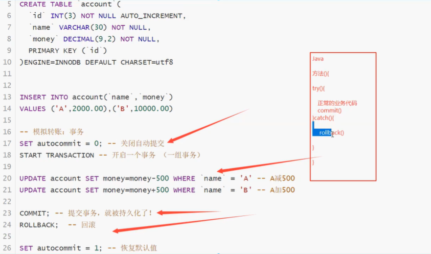

### 7、索引

------

> MySQL官方对索引的定义为：**索引（index）是帮助MySQL高效获取数据的数据结构。**提取句子主干，就可以得到索引的本质：索引就是数据结构。

#### 7.1、索引的分类

> 在一个表中，主键索引只能有一个，唯一索引可以有多个

- 主键索引  (PRIMARY KEY)
  - 唯一的标识，主键不可重复，只能有一个列作为主键
- 唯一索引  (UNIQUE KEY)
  - 避免重复的列出现，唯一索引可以重复，多个列都可以标识为唯一索引
- 常规索引  (KEY　　INDEX)
  - 默认的，index key 关键字来设置
- 全文索引   (FullText)
  - 在特定的数据库引擎下才有，MyISAM
  - 快速定位数据


基础语法：

```sql

-- 索引的使用
-- 在创建表的时候给字段增加索引
-- 创建完毕后，增加索引

-- 显示所有的索引信息
SHOW INDEX FROM student

-- 增加一个索引 (索引名) 列名
ALTER TABLE school.student ADD FULLTEXT INDEX `studentname`(`studentname`);

-- EXPLAIN 分析sql执行的状况
EXPLAIN SELECT * FROM student; -- 非全文索引

EXPLAIN SELECT * FROM student WHERE MATCH(studentname) AGAINST('李');
```


#### 7.2、测试索引

```sql

CREATE TABLE `app_user` (
`id` BIGINT(20) UNSIGNED NOT NULL AUTO_INCREMENT,
`name` VARCHAR(50) DEFAULT'' COMMENT'用户昵称',
`email` VARCHAR(50) NOT NULL COMMENT'用户邮箱',
`phone` VARCHAR(20) DEFAULT'' COMMENT'手机号',
`gender` TINYINT(4) UNSIGNED DEFAULT '0'COMMENT '性别（0：男;1:女）',
`password` VARCHAR(100) NOT NULL COMMENT '密码',
`age` TINYINT(4) DEFAULT'0'  COMMENT '年龄',
`create_time` DATETIME DEFAULT CURRENT_TIMESTAMP,
`update_time` TIMESTAMP NOT NULL DEFAULT CURRENT_TIMESTAMP ON UPDATE CURRENT_TIMESTAMP,
PRIMARY KEY (`id`)
) ENGINE=INNODB DEFAULT CHARSET=utf8 COMMENT = 'app用户表'


-- 插入100万数据
DELIMITER $$ -- 写函数之前必写，标志

CREATE FUNCTION mock_data()
RETURNS INT
BEGIN
	DECLARE num INT DEFAULT 1000000;
	DECLARE i INT DEFAULT 0;
	WHILE i<num DO
		-- 插入语句
		INSERT INTO app_user(`name`,`email`,`phone`,`gender`,`password`,`age`)
		VALUES(CONCAT('用户',i),'2910919712@qq.com',CONCAT('18',FLOOR(RAND()*((999999999 - 100000000)+10000000))),FLOOR(RAND()*2),UUID(),FLOOR(RAND()*100));
		SET i = i+1;
	END WHILE;
	RETURN i;
END;
SELECT `mock_data`();


SELECT * FROM `app_user` WHERE `name` = '用户9999'; -- 0.926 sec 

EXPLAIN SELECT * FROM `app_user` WHERE `name` = '用户9999'; 

SELECT * FROM student 

-- id__表名_字段名
-- create index 索引名 on 表名（字段名）
CREATE INDEX id_app_user_name ON `app_user`(`name`);
SELECT * FROM `app_user` WHERE `name` = '用户9999'; -- 0.003 sec
EXPLAIN SELECT * FROM `app_user` WHERE `name` = '用户9999'; 
```


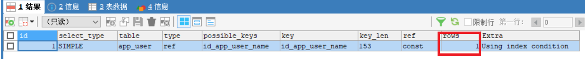

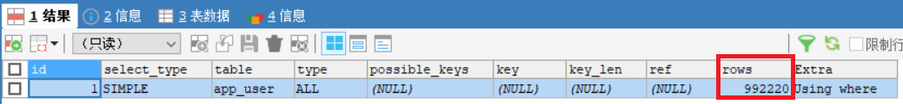


`索引在小数据量的时候，用处不大，但是在大数据的时候，区别十分明显~`


#### 7.3、索引原则

- 索引不是越多越好
- 不要对进程变动数据加索引
- 小数据量的表不需要加索引
- 索引一般加在常用来查询的字段上！

> 索引的数据结构

Hash类型的索引

Btree:innoDB的默认数据结构


阅读：http://blog.codinglabs.org/articles/theory-of-mysql-index.html


### 8、权限管理和备份

------

#### ８.1、用户管理

> SQLyog可视化管理

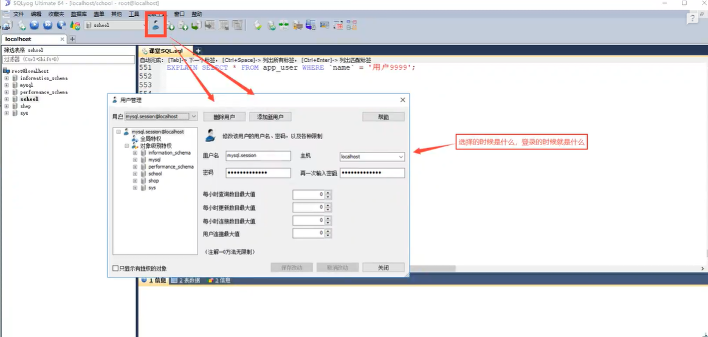


> SQL命令操作

用户表：mysql.user

本质：对这张表进行增删改查

```sql
-- 创建用户 CREATE USER 用户名 IDENTIFIED BY '密码'
CREATE USER pengfei IDENTIFIED BY '123456'


-- 修改密码（修改当前用户密码）
SET PASSWORD = PASSWORD('')

-- 修改密码（修改指定用户密码）
SET PASSWORD FOR pengfei = PASSWORD('123666')

-- 重命名 RENAME USER 原名字 TO 新名字
RENAME USER pengfei TO pengfei1


-- 用户授权 ALL PRIVILEGES 全部的权限，库.表
-- ALL PRIVILEGES 除了给别人授权 ，其他都能干
GRANT ALL PRIVILEGES ON *.* TO pengfei1


-- 查询权限
SHOW GRANTS FOR pengfei1  -- 查看指定用户的权限
SHOW GRANTS FOR root@localhost 
-- ROOT用户权限：GRANT ALL PRIVILEGES ON *.* TO 'root'@'localhost' WITH GRANT OPTION

-- 撤销权限 REVOKE 哪些权限，在那个库撤销，给谁撤销
REVOKE ALL PRIVILEGES ON *.* FROM pengfei1

-- 删除用户
DROP USER pengfei1
```


#### 8.2、MySQL备份

为什么要备份：

- 保证重要的数据不丢失
- 数据转移  A-->B

MySQL数据库备份的方式

- 直接拷贝物理文件

- 在Sqlyog这种可视化工具中手动导出

  - 在想要导出的表或库中，右键，选择备份或导出

  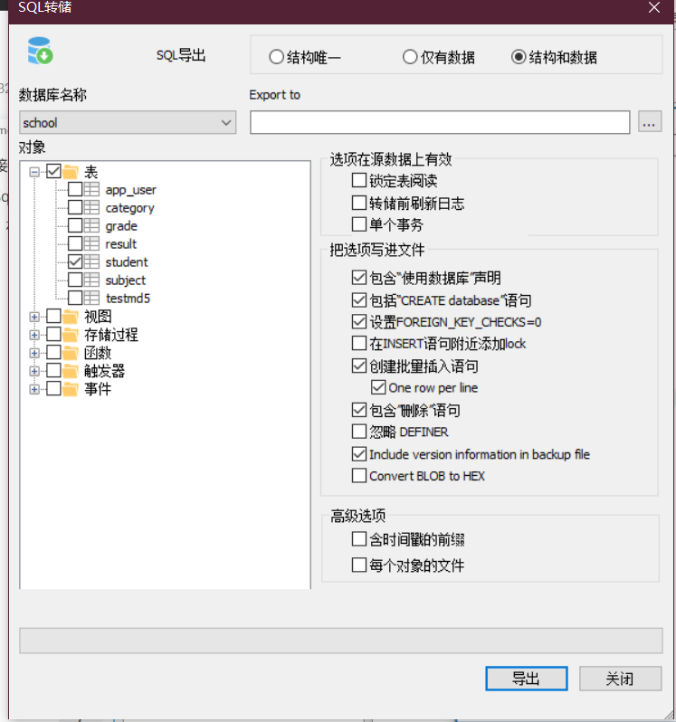

- 使用命令行 mysqldump  命令行使用

```bash
# mysqldump -h 主机 -u 用户名 -p 密码 数据库 表名 > 物理磁盘位置/文件名

# mysqldump -h 主机 -u 用户名 -p 密码 数据库 表1 表2 表3 > 物理磁盘位置/文件名

# mysqldump -h 主机 -u 用户名 -p 密码 数据库 > 物理磁盘位置/文件名

#导入
#登录的情况下，切换到指定的数据库
#source 备份文件

mysql -u用户名 -p密码 库名< 备份文件
```


假设你要备份数据库，防止数据丢失。

把数据库给朋友！sql文件给别人即可！

### 9、规范数据库设计

------

#### 9.1、为什么需要设计

==当数据库比较复杂的时候，我们就需要设计了==

**糟糕的数据库设计：**

- 数据冗余，浪费空间
- 数据库插入和删除都会麻烦，异常【屏蔽使用物理外键】
- 程序的性能差


**良好的数据库设计：**

- 节省内存空间
- 保证数据库的完整性
- 方便我们开发系统

**软件开发中，关于数据库的设计**

- 分析需求：分析业务和需要处理的数据库需求
- 概要设计：设计关系图E-R图


**设计数据库的步骤（个人博客）**

- 收集信息，分析需求
  - 用户表（用户登录注销，用户的个人信息，写博客，创建分类）
  - 分类表（文章分类，谁创建的）
  - 文章表（文章的信息）
  - 友链表（友链信息）
  - 自定义表（系统信息，某个关键的字，或者一些主字段） key:value
  - 说说表（发表心情..id .. content .. create_time）
- 标识实体类（把需求落地到每个字段）
- 标识实体之间的关系
  - 写博客：user-->blog
  - 创建分类：user-->category
  - 关注：user-->user
  - 友链：links
  - 评论：user-user-blog

#### 9.2、三大范式

**为什么需要数据规范化？**

- 信息重复
- 更新异常
- 插入异常
  - 无法正常显示信息
- 删除异常
  - 丢失有效的信息

> 三大范式（了解）

**第一范式（1NF）**

原子性：保证每一列不可再分

**第二范式（2NF）**

前提：满足第一范式的前提下

每张表只描述一件事情

**第三范式（3NF）**

前提：满足第二范式的前提下

**第三范式需要确保数据表中的每一列数据都和主键直接相关，而不能间接相关。**

参考：https://www.cnblogs.com/wsg25/p/9615100.html


==规范数据库的设计==

**规范性和性能的问题**

关联查询的表不得超过三张表

- 考虑商业化的需求和目标，（成本，用户体验！）数据库的性能更加重要
- 在规范性能的问题的时候，需要适当的考虑下规范性！
- 故意给某些表增加一些冗余的字段（从多表查询中变为单表查询）
- 故意增加一些计算列（从大数据量降低为小数据量的查询：增加索引）


### 10、JDBC（重点）

------

#### 10.1、数据库驱动

驱动：声卡，显卡，数据库

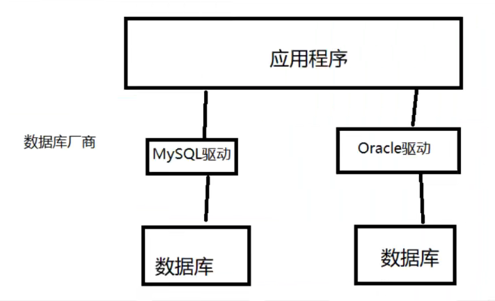

我们的程序会通过数据库驱动，和数据库打交道！


#### 10.2、JDBC

SUN公司为了简化开发人员的（对数据库的统一操作）操作，提供了一个（Java操作数据库的）规范，俗称JDBC

这些规范的实现由具体的厂商去做

对于开发人员来说，我们只需要掌握ＪＤＢＣ接口的操作即可！

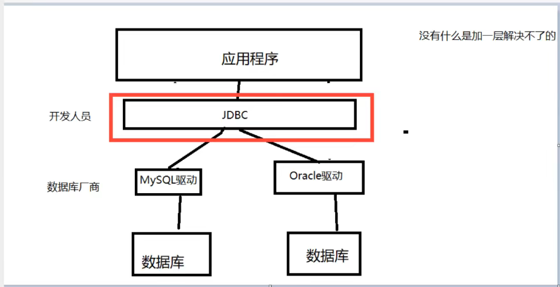


java.sql

javax.sql

还需要导入一个数据库驱动包 mysql-connector-java-8.0.28.jar

下载地址：https://mvnrepository.com/artifact/mysql/mysql-connector-java/8.0.28


#### 10.3、第一个JDBC程序

> 创建测试数据库

```sql
CREATE DATABASE `jdbcStudy` CHARACTER SET utf8 COLLATE utf8_general_ci;

USE `jdbcStudy`;

CREATE TABLE `users`(
 `id` INT PRIMARY KEY,
 `NAME` VARCHAR(40),
 `PASSWORD` VARCHAR(40),
 `email` VARCHAR(60),
 birthday DATE
);

 INSERT INTO `users`(`id`,`NAME`,`PASSWORD`,`email`,`birthday`)
VALUES('1','zhangsan','123456','zs@sina.com','1980-12-04'),
('2','lisi','123456','lisi@sina.com','1981-12-04'),
('3','wangwu','123456','wangwu@sina.com','1979-12-04')
```


1、创建一个普通项目

2、导入数据库驱动

3、编写测试代码

```java
package jdbc;

import java.sql.*;

//我的第一个jdbc程序
public class jdbctest {
    public static void main(String[] args) throws ClassNotFoundException, SQLException {
        //加载驱动
        Class.forName("com.mysql.cj.jdbc.Driver");// 固定写法，加载驱动
        //用户信息和url
        String url = "jdbc:mysql://localhost:3306/jdbcstudy?useUnicode=true&characterEncoding=utf8&useSSL=true";
        String username= "root";
        String password = "";
        //连接成功，数据库对象 Connection代表数据库
        Connection connection = DriverManager.getConnection(url, username, password);
        //执行SQL的对象 Statement 执行sql对象
        Statement statement = connection.createStatement();
        //执行SQL的对象 去 执行SQL  可能存在结果 查看返回结果
        String sql = "select * from users";
        ResultSet resultSet = statement.executeQuery(sql);//返回的结果集,结果集中封装了我们全部的查询出来的结果

        while (resultSet.next()){
            System.out.println("id=" + resultSet.getObject("id"));
            System.out.println("name=" + resultSet.getObject("NAME"));
            System.out.println("pwd=" + resultSet.getObject("PASSWORD"));
            System.out.println("email=" + resultSet.getObject("email"));
            System.out.println("birth=" + resultSet.getObject("birthday"));
            System.out.println("=========================");
        }
        //释放连接
        resultSet.close();
        statement.close();
        connection.close();

    }
}

```

步骤总结：

1. 加载驱动
2. 连接数据库 DriverManager
3. 获得执行sql的对象 Statement
4. 获得返回的结果集
5. 释放连接


> DriverManager

```java
  //DriverManager.registerDriver(new com.mysql.cj.jdbc.Driver());
        Class.forName("com.mysql.cj.jdbc.Driver");// 固定写法，加载驱动

  Connection connection = DriverManager.getConnection(url, username, password);

// connection 代表数据库
//数据库设置自动提交
//事务提交
//事务回滚
		 connection.rollback();
        connection.commit();
        connection.setAutoCommit();
```


> URL

```java
  String url = "jdbc:mysql://localhost:3306/jdbcstudy?useUnicode=true&characterEncoding=utf8&useSSL=true";

// mysql -- 3306
//协议://主机地址:端口号/数据库名?参数1&参数2&参数3
//oralce -- 1521
//jdbc:oralce:think:@localhost:1521:sid
```


> Statement 执行SQL的对象 PrepareStatement  执行SQL的对象

```java
String sql = "select * from users"; //编写sql

statement.executeQuery(); //查询操作返回ResultSet
statement.execute();//执行任何sql
statement.executeUpdate(); // 更新、插入、删除、都是用这个，返回一个受影响的行数
```


> ResultSet 查询的结果集 ： 封装了所有的查询结果

获得指定的数据类型

```java
resultSet.getObject(); //在不知道列类型的情况下使用
//如果知道列的类型就使用指定的类型
resultSet.getString();
resultSet.getDouble();
resultSet.getInt();
resultSet.getFloat();
resultSet.getDate();
......
```

遍历，指针

```java
 resultSet.beforeFirst(); // 移动到最前面
       resultSet.afterLast(); //移动到最后面
       resultSet.next(); //移动到下一个数据
        resultSet.previous(); //移动到前一行
        resultSet.absolute(row);//移动到指定行
```


> 释放资源

```java
//释放连接
resultSet.close();
statement.close();
connection.close(); //耗资源，用完关掉！
```


#### 10.4、statement对象

`Jdbc中的statement对象用于向数据库发送SQL语句，想完成对数据库的增删改查，只需要通过这个对象向数据库发送增删改查语句即可。`

Statement对象的executeUpdate方法，用于向数据库发送增、删、改的sql语句，executeUpdate执行完后，将会返回一个整数（即增删改语句导致了数据库几行数据发生了变化）。

Statement.executeQuery方法用于向数据库发送查询语句，executeQuery方法返回代表查询结果的ResultSet对象。


> CRUD操作-create

使用executeUpdate(String sql)方法完成数据添加操作，示例操作：

```java
Statement st = conn.createStatement();
String sql = "insert into user(...) values(...)";
int num = st.executeUpdate(sql);
if(num>0){
    System.out.println("插入成功！！！");
}
```


> CRUD操作-delete

使用executeUpdate(String sql)方法完成数据删除操作，示例操作：

```java
Statement st = conn.createStatement();
String sql = "delete from user where id = 1";
int num = st.executeUpdate(sql);
if(num>0){
    System.out.println("删除成功！！！");
}
```


> CRUD操作-update

使用executeUpdate(String sql)方法完成数据修改操作，示例操作：

```java
Statement st = conn.createStatement();
String sql = "update user set name='' where name=''";
int num = st.executeUpdate(sql);
if(num>0){
    System.out.println("修改成功！！！");
}
```


> CRUD操作-read

使用executeUpdate(String sql)方法完成数据查询操作，示例操作：

```java
Statement st = conn.createStatement();
String sql = "select * from user where id = 1";
ResultSet rs = st.executeQuery(sql);
while(rs.next()){
    //根据获取列的数据类型，分别调用rs的相应方法映射到Java对象中
}
```


> 代码实现

1、提取工具类

```java
package jdbc.utlis;

import java.io.IOException;
import java.io.InputStream;
import java.sql.*;
import java.util.Properties;

public class jdbcutils {
    private static String driver = null;
    private static String url = null;
    private static String username = null;
    private static String password = null;
    static {
        try {
            InputStream input = jdbcutils.class.getClassLoader().getResourceAsStream("db.properties");
            Properties properties = new Properties();
            properties.load(input);
           driver = properties.getProperty("driver");
           url = properties.getProperty("url");
           username = properties.getProperty("username");
           password = properties.getProperty("password");

           //驱动只用加载一次
            Class.forName(driver);
        }catch (Exception e){
            e.printStackTrace();
        }
    }
    //获取连接
    public static Connection getConnection() throws SQLException {
       return DriverManager.getConnection(url,username,password);
    }
    //释放连接资源
    public static void release(Connection conn, Statement st, ResultSet rs){
        if (rs!=null){
            try {
                rs.close();
            } catch (SQLException e) {
                e.printStackTrace();
            }
        }
        if (st!=null){
            try {
                st.close();
            } catch (SQLException e) {
                e.printStackTrace();
            }

        }
        if (conn!=null){
            try {
                conn.close();
            } catch (SQLException e) {
                e.printStackTrace();
            }

        }
    }
}

```

```db.properties
driver = com.mysql.cj.jdbc.Driver
url=jdbc:mysql://localhost:3306/jdbcstudy?useUnicode=true&characterEncoding=utf8&useSSL=true
username=root
password=
```


2、编写实现增删改的方法，==execuUpdate==

```java
package jdbc.utlis;

import java.sql.Connection;
import java.sql.ResultSet;
import java.sql.SQLException;
import java.sql.Statement;

public class testInsert {
    public static void main(String[] args) {
        Connection conn = null;
        Statement st = null;
        ResultSet rs = null;
        try {
           conn = jdbcutils.getConnection();//获取数据库连接
           st=conn.createStatement();//获得SQL的执行对象
            String sql = "INSERT INTO users(id,`NAME`,`PASSWORD`,email,birthday) VALUES(4,'pengfei','123456','2910919712@qq.com','2020-01-02')";
            int i = st.executeUpdate(sql);
            if (i>0){
                System.out.println("插入成功！");

            }        } catch (SQLException e) {
            e.printStackTrace();
        }finally {
            jdbcutils.release(conn,st,rs);
        }
    }
}

```

```java
package jdbc.utlis;

import java.sql.Connection;
import java.sql.ResultSet;
import java.sql.SQLException;
import java.sql.Statement;

public class testDelete {
    public static void main(String[] args) {
        Connection conn = null;
        Statement st = null;
        ResultSet rs = null;
        try {
            conn = jdbcutils.getConnection();//获取数据库连接
            st=conn.createStatement();//获得SQL的执行对象
            String sql = "DELETE FROM users WHERE id = 4";
            int i = st.executeUpdate(sql);
            if (i>0){
                System.out.println("删除成功！");

            }        } catch (SQLException e) {
            e.printStackTrace();
        }finally {
            jdbcutils.release(conn,st,rs);
        }
    }
}

```

```java
package jdbc.utlis;

import java.sql.Connection;
import java.sql.ResultSet;
import java.sql.SQLException;
import java.sql.Statement;

public class testupdete {
    public static void main(String[] args) {
        Connection conn = null;
        Statement st = null;
        ResultSet rs = null;
        try {
            conn = jdbcutils.getConnection();//获取数据库连接
            st=conn.createStatement();//获得SQL的执行对象
            String sql = "UPDATE users SET `Name`='鹏飞' WHERE id = 1";
            int i = st.executeUpdate(sql);
            if (i>0){
                System.out.println("更新成功！");

            }        } catch (SQLException e) {
            e.printStackTrace();
        }finally {
            jdbcutils.release(conn,st,rs);
        }
    }
}

```


3、查询==executeQuery==

```java
package jdbc.utlis;

import java.sql.Connection;
import java.sql.ResultSet;
import java.sql.Statement;

public class testread {
    public static void main(String[] args) {
        Connection conn = null;
        Statement st = null;
        ResultSet rs = null;

        try{
            conn = jdbcutils.getConnection();
            st=conn.createStatement();

            //SQL
            String sql = "select * from users where id = 1";
           rs = st.executeQuery(sql); // 查询完毕会返回一个结果集
            while(rs.next()){
                System.out.println(rs.getString("NAME"));
            }
        }catch (Exception e){
            e.printStackTrace();
        }finally {
            jdbcutils.release(conn,st,rs);
        }
    }
}
```


> SQL注入的问题

sql存在漏洞，会被攻击导致数据泄露，`SQL会被拼接 or`

```java
package jdbc.utlis;

import java.sql.Connection;
import java.sql.ResultSet;
import java.sql.Statement;

public class sqlzhuru {
    public static void main(String[] args) {
        //login("鹏飞","123456");正常登录
        login("'or '1=1","'or '1=1"); // 技巧
    }
    //登录业务
    public static void login(String username,String password){
        Connection conn = null;
        Statement st = null;
        ResultSet rs = null;

        try{
            conn = jdbcutils.getConnection();
            st=conn.createStatement();

            //SQL SELECT * FROM users WHERE `NAME` = '鹏飞' AND `PASSWORD` = '123456';
            //SQL SELECT * FROM users WHERE `NAME` = '' or '1=1' AND `PASSWORD` ='' or '1=1';
            String sql = "select * from users where `NAME` ='"+username+"' and `password`='"+password+"'";
            rs = st.executeQuery(sql); // 查询完毕会返回一个结果集
            while(rs.next()){
                System.out.println(rs.getString("NAME"));
                System.out.println(rs.getString("PASSWORD"));
                System.out.println("=================");
            }
        }catch (Exception e){
            e.printStackTrace();
        }finally {
            jdbcutils.release(conn,st,rs);
        }

    }}

```


#### 10.5、PreparedStatement对象

PreparedStatement可以防止SQL注入。效率更好！


1、新增

```java
package jdbc.utlis;

import java.sql.Connection;
import java.sql.PreparedStatement;
import java.sql.ResultSet;
import java.sql.SQLException;
import java.util.Date;

public class testinsert1 {
    public static void main(String[] args) {
        Connection conn = null;
        PreparedStatement pst = null;
        ResultSet rs = null;
        try {
            conn = jdbcutils.getConnection();
            //区别
            //使用？占位符代替参数
            String sql = "insert into users(`id`,`NAME`,`PASSWORD`,`email`,`birthday`) values(?,?,?,?,?)";
            pst=conn.prepareStatement(sql);//预编译SQL,先写sql,然后不执行

            //手动给参数赋值
            pst.setInt(1,4); //id
            pst.setString(2,"鹏飞1");
            pst.setString(3,"123456");
            pst.setString(4,"2910919712@qq.com");
            //注意点：sql.Date 数据库
            //      util.Date  java.util new Date().getTime() 获得时间戳
            pst.setDate(5,new java.sql.Date(new Date().getTime()));

            //执行
            int i = pst.executeUpdate();
            if (i>0){
                System.out.println("插入成功");
            }
        } catch (SQLException e) {
            e.printStackTrace();
        }finally {
            jdbcutils.release(conn,pst,null);
        }

    }
}

```

2、删除

```java
package jdbc.utlis;

import java.sql.Connection;
import java.sql.PreparedStatement;
import java.sql.ResultSet;
import java.sql.SQLException;
import java.util.Date;

public class testdelete1 {
    public static void main(String[] args) {
        Connection conn = null;
        PreparedStatement pst = null;
        ResultSet rs = null;
        try {
            conn = jdbcutils.getConnection();
            //区别
            //使用？占位符代替参数
            String sql = "delete from users where id = ?";
            pst=conn.prepareStatement(sql);//预编译SQL,先写sql,然后不执行

            //手动给参数赋值
            pst.setInt(1,4);
            //执行
            int i = pst.executeUpdate();
            if (i>0){
                System.out.println("删除成功");
            }
        } catch (SQLException e) {
            e.printStackTrace();
        }finally {
            jdbcutils.release(conn,pst,null);
        }

    }
}

```

3、更新

```java
package jdbc.utlis;

import java.sql.Connection;
import java.sql.PreparedStatement;
import java.sql.ResultSet;
import java.sql.SQLException;

public class testupdate {
    public static void main(String[] args) {
        Connection conn = null;
        PreparedStatement pst = null;
        ResultSet rs = null;
        try {
            conn = jdbcutils.getConnection();
            //区别
            //使用？占位符代替参数
            String sql = "update users set `NAME` = ? where id=?";
            pst=conn.prepareStatement(sql);//预编译SQL,先写sql,然后不执行

            //手动给参数赋值
            pst.setString(1,"peng");
            pst.setInt(2,1);
            //执行
            int i = pst.executeUpdate();
            if (i>0){
                System.out.println("修改成功");
            }
        } catch (SQLException e) {
            e.printStackTrace();
        }finally {
            jdbcutils.release(conn,pst,null);
        }

    }
}

```

4、查询

```java
package jdbc.utlis;

import java.sql.Connection;
import java.sql.PreparedStatement;
import java.sql.ResultSet;
import java.sql.SQLException;

public class testread1 {
    public static void main(String[] args) {
        Connection conn = null;
        PreparedStatement pst = null;
        ResultSet rs = null;
        try {
          conn= jdbcutils.getConnection();
          String sql = "select * from users where id=?"; //编写sql

            pst=conn.prepareStatement(sql);

            pst.setInt(1,1); //传递参数

            //执行
            rs = pst.executeQuery();
            if (rs.next()){
                System.out.println(rs.getString("NAME"));
            }
        } catch (SQLException e) {
            e.printStackTrace();
        }finally {
            jdbcutils.release(conn,pst,rs);
        }
    }
}

```

5、防止SQL注入

```java
package jdbc.utlis;

import java.sql.Connection;
import java.sql.PreparedStatement;
import java.sql.ResultSet;


public class sqlzhuru {
    public static void main(String[] args) {
        login("peng","123456");//正常登录
//        login("''or 1=1","123456"); // 技巧
    }
    //登录业务
    public static void login(String username,String password){
        Connection conn = null;
        PreparedStatement st = null;
        ResultSet rs = null;

        try{
            conn = jdbcutils.getConnection();
            //prepareStatement防止SQL注入的本质，把传递进来的参数当作字符
            // 假设其中存在转移字符，比如说 ' 会被直接转义
            String sql = "select * from users where `NAME` = ? and `password`=?";
            st=conn.prepareStatement(sql);

            st.setString(1,username);
            st.setString(2,password);


            rs = st.executeQuery(); // 查询完毕会返回一个结果集
            while(rs.next()){
                System.out.println(rs.getString("NAME"));
                System.out.println(rs.getString("PASSWORD"));
                System.out.println("=================");
            }
        }catch (Exception e){
            e.printStackTrace();
        }finally {
            jdbcutils.release(conn,st,rs);
        }

    }
}

```


#### 10.6、使用IDEA连接数据库

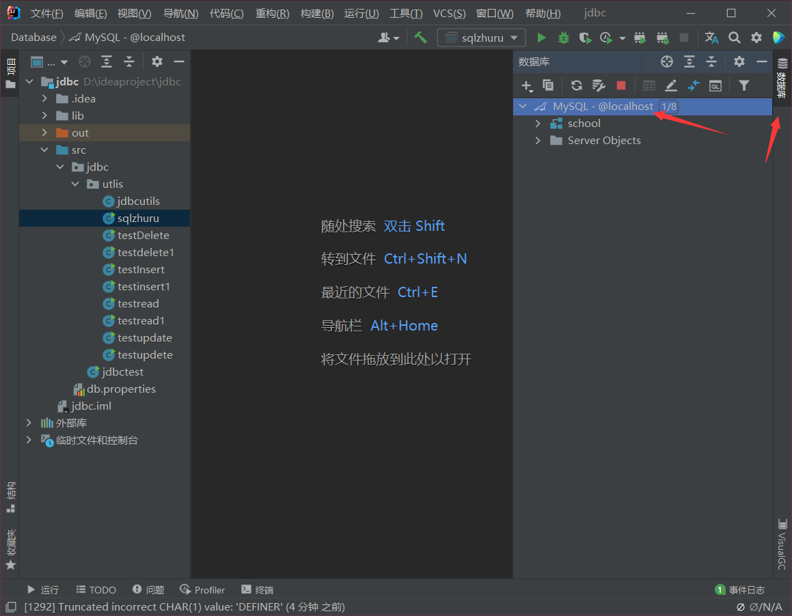

连接数据库

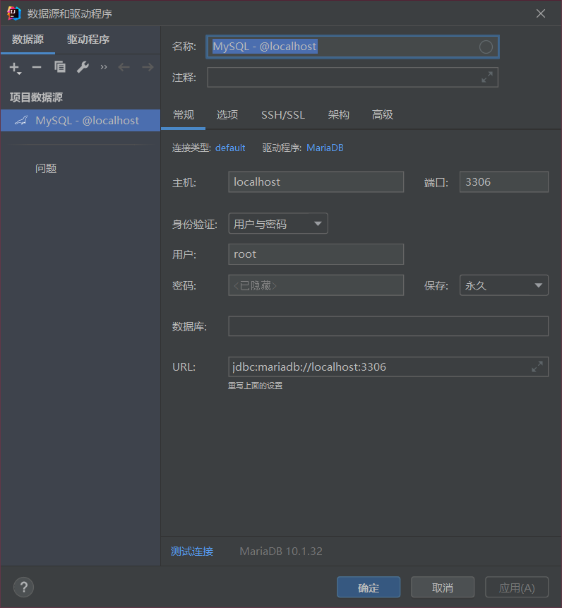

选择数据库

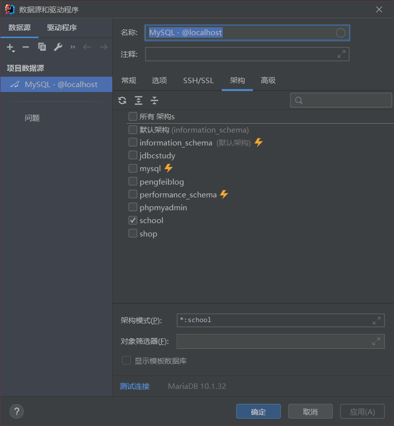

更新数据

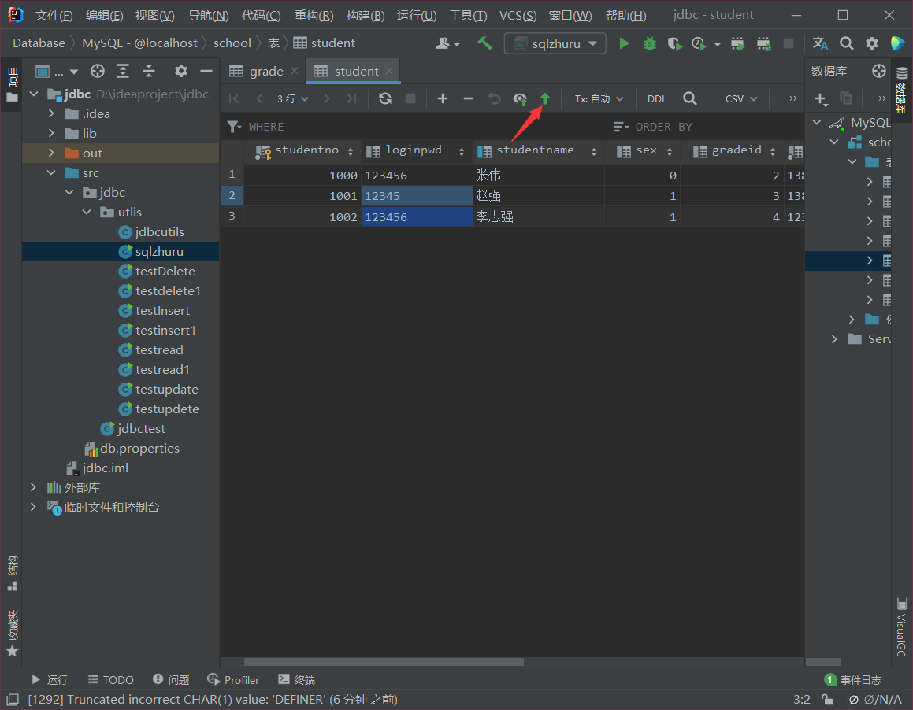

编写SQL代码


#### 10.7、事务

==要么都成功，要么都失败==

> ACID原则

原子性：要么全部完成，要么都不完成

一致性：总数不变

**隔离性：多个线程互不干扰**

持久性：一旦提交不可逆，持久化到数据库了


隔离性的问题：

脏读：一个事务读取了另一个没有提交的事务

不可重复读：在同一个事务内，重复读取表中的数据，表数据发生了改变

虚读（幻读）：在一个事务内，读取到了别人插入的数据，导致前后读出来的结果不一致


> 代码实现

1、开启事务 

2、一组业务执行完毕，提交事务

3、可以在catch语句中显示的定义回滚语句，但默认失败就会回滚

```java
package jdbc.utlis;

import java.sql.Connection;
import java.sql.PreparedStatement;
import java.sql.ResultSet;
import java.sql.SQLException;

public class testtransaction1 {
    public static void main(String[] args) {
        Connection conn = null;
        PreparedStatement pst = null;
        ResultSet rs =null;


        try {
            conn = jdbcutils.getConnection();
            //关闭数据库的自动提交功能,自动会开启事务
            conn.setAutoCommit(false);

            String sql = "update account set money = money-100 where name = 'A'";
            pst=conn.prepareStatement(sql);
            pst.executeUpdate();

            int x = 1/0; //报错

            String sql1 = "update account set money = money+100 where name = 'B'";
            pst=conn.prepareStatement(sql1);
            pst.executeUpdate();

            //业务完毕，提交事务
            conn.commit();
            System.out.println("成功");
        } catch (SQLException e) {
//            try {
//                //如果失败，则默认回滚
//            } catch (SQLException ex) {
//                ex.printStackTrace();
//            }
            e.printStackTrace();
        }finally {
            jdbcutils.release(conn,pst,rs);
        }

    }
}
```

#### 10.8、数据库连接池

数据库连接 -- 执行完毕 -- 释放 连接-- 释放 十分浪费系统资源

**池化技术：准备一些预先的资源，过来就链接预先准备好的**


最小连接数：10

最大连接数：100  业务最高承载上限

等待超时：100ms


`编写连接池，实现一个接口 DataSource`

> 开源数据源实现(拿来即用)

DBCP

C3P0

Druid:阿里巴巴


使用了这些数据库连接池之后，我们在项目开发中就不需要编写连接数据库的代码了！


> DBCP

需要用到jar包

commons-dbcp-1.4.jar、commons-pool-1.6.jar

```dbcpconfig.properties
#连接设置
driverClassName=com.mysql.cj.jdbc.Driver
url=jdbc:mysql://localhost:3306/jdbcstudy?useUnicode=true&characterEncoding=utf8&useSSL=true
username=root
password=123456

#<!-- 初始化连接 -->
initialSize=10

#最大连接数量
maxActive=50

#<!-- 最大空闲连接 -->
maxIdle=20

#<!-- 最小空闲连接 -->
minIdle=5

#<!-- 超时等待时间以毫秒为单位 6000毫秒/1000等于60秒 -->
maxWait=60000
#JDBC驱动建立连接时附带的连接属性属性的格式必须为这样：【属性名=property;】
#注意："user" 与 "password" 两个属性会被明确地传递，因此这里不需要包含他们。
connectionProperties=useUnicode=true;characterEncoding=UTF8

#指定由连接池所创建的连接的自动提交（auto-commit）状态。
defaultAutoCommit=true

#driver default 指定由连接池所创建的连接的只读（read-only）状态。
#如果没有设置该值，则“setReadOnly”方法将不被调用。（某些驱动并不支持只读模式，如：Informix）
defaultReadOnly=

#driver default 指定由连接池所创建的连接的事务级别（TransactionIsolation）。
#可用值为下列之一：（详情可见javadoc。）NONE,READ_UNCOMMITTED, READ_COMMITTED, REPEATABLE_READ, SERIALIZABLE
defaultTransactionIsolation=READ_UNCOMMITTED
```

```java
package Dbcp.utlis;

import org.apache.commons.dbcp.BasicDataSourceFactory;

import javax.sql.DataSource;
import java.io.InputStream;
import java.sql.*;
import java.util.Properties;

public class jdbcutils_Dbcp {
    private static DataSource dataSource = null;
    static {
        try {
            InputStream input = jdbcutils_Dbcp.class.getClassLoader().getResourceAsStream("dbcpconfig.properties");
            Properties properties = new Properties();
            properties.load(input);

            //创建数据源 工厂模式 --> 创建
           dataSource = BasicDataSourceFactory.createDataSource(properties);
           
        }catch (Exception e){
            e.printStackTrace();
        }
    }
    //获取连接
    public static Connection getConnection() throws SQLException {
       return dataSource.getConnection(); //从数据源中获取连接
    }
    //释放连接资源
    public static void release(Connection conn, Statement st, ResultSet rs){
        if (rs!=null){
            try {
                rs.close();
            } catch (SQLException e) {
                e.printStackTrace();
            }
        }
        if (st!=null){
            try {
                st.close();
            } catch (SQLException e) {
                e.printStackTrace();
            }

        }
        if (conn!=null){
            try {
                conn.close();
            } catch (SQLException e) {
                e.printStackTrace();
            }

        }
    }
}
```

```java
package Dbcp.utlis;

import java.sql.Connection;
import java.sql.PreparedStatement;
import java.sql.ResultSet;
import java.sql.SQLException;
import java.util.Date;

public class test {
    public static void main(String[] args) {
        Connection conn = null;
        PreparedStatement pst = null;
        ResultSet rs = null;
        try {
            conn = jdbcutils_Dbcp.getConnection();
            //区别
            //使用？占位符代替参数
            String sql = "insert into users(`id`,`NAME`,`PASSWORD`,`email`,`birthday`) values(?,?,?,?,?)";
            pst=conn.prepareStatement(sql);//预编译SQL,先写sql,然后不执行

            //手动给参数赋值
            pst.setInt(1,5); //id
            pst.setString(2,"鹏飞122");
            pst.setString(3,"123456");
            pst.setString(4,"2910919712@qq.com");
            //注意点：sql.Date 数据库
            //      util.Date  java.util new Date().getTime() 获得时间戳
            pst.setDate(5,new java.sql.Date(new Date().getTime()));

            //执行
            int i = pst.executeUpdate();
            if (i>0){
                System.out.println("插入成功");
            }
        } catch (SQLException e) {
            e.printStackTrace();
        }finally {
            jdbcutils_Dbcp.release(conn,pst,null);
        }

    }
}

```


> C3P0

需要用到的jar包

c3p0-0.9.5.5.jar、mchange-commons-java-0.2.19.jar

```xml
<?xml version="1.0" encoding="UTF-8"?>
<c3p0-config>
    <!--
c3p0的缺省（默认）配置
如果在代码中"ComboPooledDataSource ds=new ComboPooledDataSource();"这样写就表示使用的是c3p0的缺省（默认）-->
    <default-config>
        <property name="driverClass">com.mysql.cj.jdbc.Driver</property>
        <property name="jdbcUrl">jdbc:mysql://localhost:3306/jdbcstudy?userUnicode=true&amp;characterEncoding=utf8&amp;uesSSL=true&amp;serverTimezone=UTC</property>
        <property name="user">root</property>
        <property name="password"></property>

        <property name="acquireIncrement">5</property>
        <property name="initialPoolSize">10</property>
        <property name="minPoolSize">5</property>
        <property name="maxPoolSize">20</property>
    </default-config>
</c3p0-config>

```


```java
package Dbcp.utlis;

import com.mchange.v2.c3p0.ComboPooledDataSource;
import org.apache.commons.dbcp.BasicDataSourceFactory;

import javax.sql.DataSource;
import java.io.InputStream;
import java.sql.Connection;
import java.sql.ResultSet;
import java.sql.SQLException;
import java.sql.Statement;
import java.util.Properties;

public class jdbcutils_c3p0 {
    private static ComboPooledDataSource dataSource = null;
    static {
        try {
            //代码版配置
//           dataSource = new ComboPooledDataSource();//配置文件写法
//            dataSource.setDriverClass();
//            dataSource.setUser();
//            dataSource.setPassword();
//            dataSource.setJdbcUrl();
//
//            dataSource.setMaxPoolSize();
//            dataSource.setMinPoolSize();

            //创建数据源 工厂模式 --> 创建
          dataSource = new ComboPooledDataSource();//配置文件写法

        }catch (Exception e){
            e.printStackTrace();
        }
    }
    //获取连接
    public static Connection getConnection() throws SQLException {
       return dataSource.getConnection(); //从数据源中获取连接
    }
    //释放连接资源
    public static void release(Connection conn, Statement st, ResultSet rs){
        if (rs!=null){
            try {
                rs.close();
            } catch (SQLException e) {
                e.printStackTrace();
            }
        }
        if (st!=null){
            try {
                st.close();
            } catch (SQLException e) {
                e.printStackTrace();
            }

        }
        if (conn!=null){
            try {
                conn.close();
            } catch (SQLException e) {
                e.printStackTrace();
            }

        }
    }
}
```

```java
package Dbcp.utlis;

import java.sql.Connection;
import java.sql.PreparedStatement;
import java.sql.ResultSet;
import java.sql.SQLException;
import java.util.Date;

public class test {
    public static void main(String[] args) {
        Connection conn = null;
        PreparedStatement pst = null;
        ResultSet rs = null;
        try {
            conn = jdbcutils_c3p0.getConnection(); //原来是自己实现的，现在是别人实现的
            //区别
            //使用？占位符代替参数
            String sql = "insert into users(`id`,`NAME`,`PASSWORD`,`email`,`birthday`) values(?,?,?,?,?)";
            pst=conn.prepareStatement(sql);//预编译SQL,先写sql,然后不执行

            //手动给参数赋值
            pst.setInt(1,6); //id
            pst.setString(2,"鹏飞122");
            pst.setString(3,"123456");
            pst.setString(4,"2910919712@qq.com");
            //注意点：sql.Date 数据库
            //      util.Date  java.util new Date().getTime() 获得时间戳
            pst.setDate(5,new java.sql.Date(new Date().getTime()));

            //执行
            int i = pst.executeUpdate();
            if (i>0){
                System.out.println("插入成功");
            }
        } catch (SQLException e) {
            e.printStackTrace();
        }finally {
            jdbcutils_c3p0.release(conn,pst,null);
        }

    }
}

```

> 结论

无论使用什么数据源，本质还是一样的,DataSource接口不会变，方法就不会变


Druid
