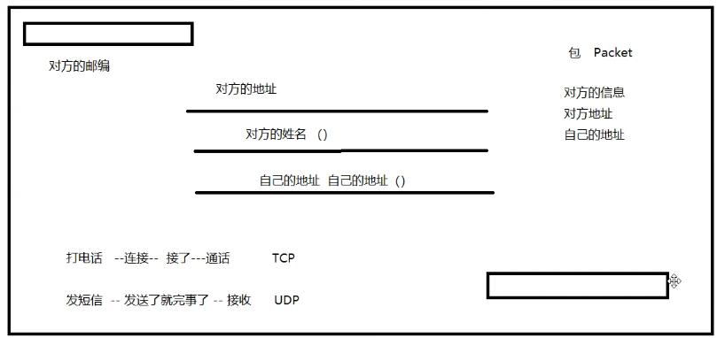
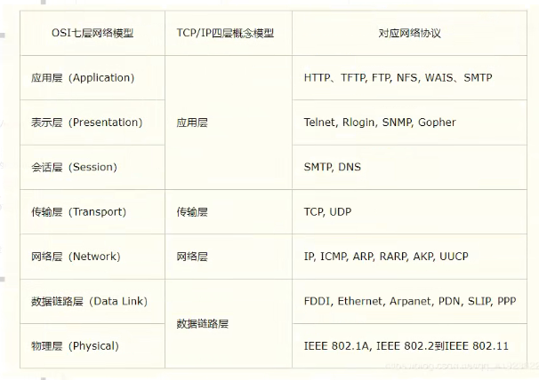
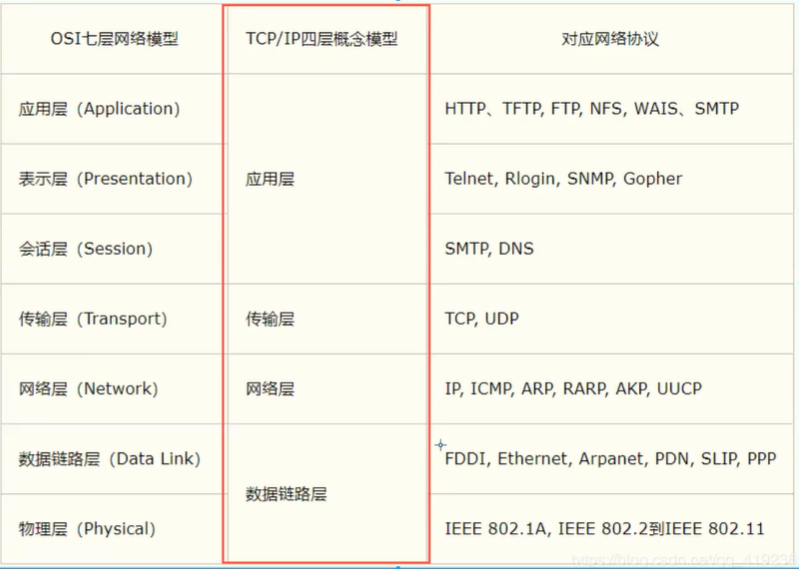
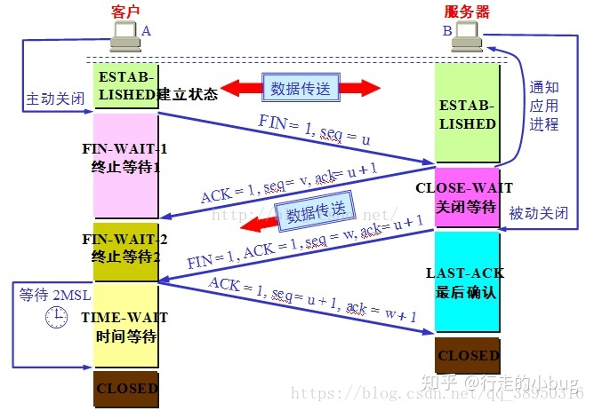

### 网络编程


#### 1.1、概述

------

**地球村**：你在西安，你的一个美国朋友！

信件：



**计算机网络**：

计算机网络系统就是利用通信设备和线路将==地理位置不同==、功能独立的多个[计算机](https://baike.baidu.com/item/计算机)系统互联起来，以功能完善的[网络软件](https://baike.baidu.com/item/网络软件/708424)实现网络中资源共享和信息传递的系统。


**网络编程的目的**：

无线电台..传播交流信息，数据交换，通信


**想要达到这个效果需要什么：**

1. 如何准确的定位网络上的一台主机 182.46.173.220：端口，定位到这个计算机上的某个资源
2. 找到了这个主机，如何传输数据呢？


javaweb:网页编程 B/S

网络编程：TCP/IP C/S


#### 1.2、网络通信的要素

------

如何实现网络的通信？

**通信双方的地址：**

- ip  
- 端口号
- 182.46.173.220：8080

**规则：网络通信协议**

TCP/IP参考模型：




小结：

1. 网络编程中有两个主要问题
   - 如何准确的定位到网络上的一台或者多台主机
   - 找到主机之后如何进行通信
2. 网络编程中的要素
   - IP和端口号  IP
   - 网络通信协议 udp tcp
3. 万物皆对象


#### 1.3、IP

------

ip地址：InetAddress

- 唯一定位一台网络上计算机
- 127.0.0.1：本机localhost
- ip地址的分类
  - ipv4 / ipv6
    - ==IPV4==：127.0.0.1,四个字节组成 ， 0~255 ，42亿；30亿都在北美，亚洲4亿。2011年就用尽了！
    - ==IPV6==:fe80::cc8a:b516:69f:7589%17,128位。8个无符号整数！
  - 公网（互联网）-私网（局域网）
    - 
- 域名：记忆IP问题！


```java
package net;

import java.net.InetAddress;
import java.net.UnknownHostException;

//测试IP
public class TestIP {
    public static void main(String[] args) {
        try {
            //查询本机地址
            InetAddress inetAddress1= InetAddress.getByName("127.0.0.1");
            System.out.println(inetAddress1);
            InetAddress inetAddress3= InetAddress.getByName("localhost");
            System.out.println(inetAddress3);
            InetAddress inetAddress4= InetAddress.getLocalHost();
            System.out.println(inetAddress4);

            //查询网站ip地址
            InetAddress inetAddress2= InetAddress.getByName("www.baidu.com");
            System.out.println(inetAddress2);

            //常用方法
//             System.out.println(inetAddress2.getAddress());
             System.out.println(inetAddress2.getHostAddress());
             System.out.println(inetAddress2.getCanonicalHostName()); //规范
             System.out.println(inetAddress2.getHostName()); //域名，获取自己电脑的名字


        } catch (UnknownHostException e) {
            e.printStackTrace();
        }
    }
}

```


#### 1.4、端口

------

端口表示计算机上的一个程序的进程；

- 不同的进程有不同的端口号！用来区分软件！

- 被规定0~65535

- TCP,UDP:65535 * 2 tcp:80,udp:80吗，单个协议下，端口号不能冲突

- 端口分类

  - 公有端口0~1023 
    - Http:80
    - Https:443
    - FTP:21
    - Telent:23
  - 程序注册端口：1024~49151，分配用户或者程序
    - Tomcat :8080
    - MySql:3306
    - Oracle:1521
  - 动态、私有：49152~65535

  ```bash
  netstat -ano #查看所有的端口
  
  netstat -ano|findstr "5900" #查看指定端口
  
  tasklist|findstr "7740" #查看指定端口的进程
  ```
  
  ```java
  package net;
  
  import java.net.InetSocketAddress;
  
  public class TestinetSocketAddress {
      public static void main(String[] args) {
          InetSocketAddress socketAddress = new InetSocketAddress("127.0.0.1",8080);
          InetSocketAddress socketAddress2 = new InetSocketAddress("localhost",8080);
          System.out.println(socketAddress);
          System.out.println(socketAddress2);
  
          System.out.println(socketAddress.getAddress());
          System.out.println(socketAddress.getHostName()); //地址
          System.out.println(socketAddress.getPort());//端口
      }
  }
  
  ```


#### 1.5、通信协议

------

协议：约定，就好比我们现在说的是普通话。

**网络通信协议：**速率，传输码率，代码结构，传输控制。。。

**问题**：非常复杂？

大事化小：分层！

**TCP/IP协议簇**：实际上是一组协议

重要：

- TCP：用户传输协议
- UDP: 用户数据报协议

出名的协议：

- TCP:
- IP:网络互连协议




**TCP udp 对比**

TCP:打电话

- 链接，稳定
- 三次握手，四次挥手

```
最少需要三次，保证稳定链接！
A:你愁啥？
B:瞅你咋地？
A:干一场！


A:我要断开了！
B:我知道你要断开了！
B:你真的断开了吗？
A:我真的要断开了！
```




- 客户端，服务端
- 传输完成，释放连接，效率低

UDP:发短信

- 不连接，不稳定
- 客户端、服务端：没有明确的界限
- 不管你没有准备好，就可以发给你。。
- 导弹
- DDOS：洪水攻击！（饱和攻击）


#### 1.6、TCP

------

客户端

1. 链接服务器 Socket
2. 发送消息

```java
package net;

import java.io.IOException;
import java.io.OutputStream;
import java.net.InetAddress;
import java.net.Socket;
import java.net.UnknownHostException;

//客户端
public class TCPclientDemo {
    public static void main(String[] args) {
        Socket socket = null;
        OutputStream os=null;
        try {
            //1.要知道服务器的地址,端口号
            InetAddress serverip = InetAddress.getByName("127.0.0.1");
            int port = 9999;
            //2.创建一个socket连接
             socket = new Socket(serverip,port);
            //3.发送消息 IO流
             os = socket.getOutputStream();

            os.write("你好，欢迎".getBytes());

        } catch (Exception e) {
            e.printStackTrace();
        }finally {
            if (os!=null){
                try {
                    os.close();
                } catch (IOException e) {
                    e.printStackTrace();
                }
            }
            if (socket!=null){
                try {
                    socket.close();
                } catch (IOException e) {
                    e.printStackTrace();
                }
            }
        }
    }
}

```


服务器

1. 建立服务端口ServerSocket
2. 等待用户的链接accept
3. 接收用的消息

```java
package net;

import java.io.ByteArrayOutputStream;
import java.io.IOException;
import java.io.InputStream;
import java.net.ServerSocket;
import java.net.Socket;

//服务端
public class TcpServerDemo {
    public static void main(String[] args) {
        ServerSocket serverSocket =null;
        Socket socket =null;
        InputStream is =null;
        ByteArrayOutputStream basos =null;
        try {
            //1.我得有一个地址
             serverSocket = new ServerSocket(9999);
             while (true) {
                 //2.等待客户端连接过来
                 socket = serverSocket.accept();
                 //3.读取客户端的消息
                 is = socket.getInputStream();

//            byte[] buffer = new byte[1024];
//            int len;
//            while ((len = is.read(buffer))!=-1){
//                String msg = new String(buffer,0,len);
//                System.out.println(msg);
//            }

                 //管道流
                 basos = new ByteArrayOutputStream();
                 byte[] bytes = new byte[1024];
                 int len;
                 while ((len = is.read(bytes)) != -1) {
                     basos.write(bytes, 0, len);
                 }
                 System.out.println(basos.toString());
             }

        } catch (IOException e) {
            e.printStackTrace();
        }finally {
            if (basos!=null){
                try {
                    basos.close();
                } catch (IOException e) {
                    e.printStackTrace();
                }
            }
            if (is!=null){
                try {
                    is.close();
                } catch (IOException e) {
                    e.printStackTrace();
                }
            }
            if (socket!=null){
                try {
                    socket.close();
                } catch (IOException e) {
                    e.printStackTrace();
                }
            }
            if (serverSocket!=null){
                try {
                    serverSocket.close();
                } catch (IOException e) {
                    e.printStackTrace();
                }
            }
        }
    }
}
```


##### 文件上传

服务器端：

```java
package net;

import java.io.*;
import java.net.ServerSocket;
import java.net.Socket;
import java.util.Scanner;

public class Tcpdemo {
    public static void main(String[] args) throws IOException {
        //创建服务
        ServerSocket serverSocket = new ServerSocket(9100);
        //监听客户端的连接
        Socket socket = serverSocket.accept();//阻塞式监听，会一直等待客户端链接
//获取输入流
        InputStream is = socket.getInputStream();

        //文件输出
        FileOutputStream fos = new FileOutputStream(new File("D:\\壁纸\\头像\\23.jpg"));
        byte[] bytes = new byte[1024];
        int len;
        while ((len = is.read(bytes))!=-1){
            fos.write(bytes,0,len);
        }

        //通知客户端我接收完毕了
        OutputStream os = socket.getOutputStream();
        os.write("我接收完毕了".getBytes());

        //关闭资源
        os.close();
        fos.close();
        is.close();
        socket.close();
        serverSocket.close();
    }
}

```

客户端：

```java
package net;

import java.io.*;
import java.net.InetAddress;
import java.net.Socket;
import java.net.UnknownHostException;

public class Demo {
    public static void main(String[] args) throws IOException {
        //1.创建一个Socket链接
        Socket socket = new Socket(InetAddress.getByName("127.0.0.1"), 9100);
        //2.创建一个输出流
        OutputStream os = socket.getOutputStream();
        //3.读取文件
        FileInputStream  fis = new FileInputStream(new File("D:\\壁纸\\头像\\123.jpg"));
        //4.写出文件
        byte[] buffer = new byte[1024];
        int len;
        while ((len = fis.read(buffer))!=-1){
            os.write(buffer,0,len);
        }
        //通知服务器，我己经结束了
        socket.shutdownOutput();//我已经传输完了

        //确定服务器接收完毕，才能够断开连接
        InputStream inputStream = socket.getInputStream();
        //String byte[]
        ByteArrayOutputStream baos = new ByteArrayOutputStream();
        byte[] bytes = new byte[2014];
        int len1;
        while ((len1 = inputStream.read(bytes))!=-1){
            baos.write(bytes,0,len1);
        }
        System.out.println(baos.toString());


        //关闭资源
        baos.close();
        inputStream.close();
        fis.close();
        os.close();
        socket.close();
    }
}

```


##### Tomcat

服务端

- 自定义 S
- Tomcat服务器 S:java后台开发

客户端

- 自定义 C
- 浏览器 B


#### 1.7、UDP

------

发短信：不用连接，需要知道对方的地址！

##### **发送消息**


**发送端**

```java
package net;

import java.io.IOException;
import java.net.*;

//不需要连接服务器
public class UDPdemo {
    public static void main(String[] args) throws IOException {
        //建立Socket
        DatagramSocket socket = new DatagramSocket();
        //建个包
        String msg = "你好啊，服务器";
        //发送给谁
        InetAddress local = InetAddress.getByName("localhost");
        int port = 9090;
        //数据  数据的起始长度 发送给谁
        DatagramPacket packet = new DatagramPacket(msg.getBytes(),0,msg.getBytes().length,local,port);
        //发送包
        socket.send(packet);
        //关闭流
        socket.close();
    }
}

```

**接收端**

```java
package net;

import java.io.IOException;
import java.net.DatagramPacket;
import java.net.DatagramSocket;
import java.net.SocketException;
//还是要等待客户端的连接
public class UDPServerDemo {
    public static void main(String[] args) throws IOException {
        //开放端口
        DatagramSocket socket = new DatagramSocket(9090);
        //接收数据包
        byte[] bytes = new byte[1024];
        DatagramPacket packet = new DatagramPacket(bytes,0,bytes.length);

        socket.receive(packet);//阻塞接收
        System.out.println(packet.getAddress().getHostAddress());
        System.out.println(new String(packet.getData(),0,packet.getLength()));
        //关闭连接
        socket.close();

    }
}
```


##### 循环发送消息

```java
package chat;

import java.io.BufferedReader;
import java.io.IOException;
import java.io.InputStreamReader;
import java.net.DatagramPacket;
import java.net.DatagramSocket;
import java.net.InetSocketAddress;
import java.net.SocketException;

public class undateUDPsender {
    public static void main(String[] args) throws IOException {
        DatagramSocket socket = new DatagramSocket(8888);
        //准备数据：控制台读取
        BufferedReader br = new BufferedReader(new InputStreamReader(System.in));
        while (true) {
            String data = br.readLine();
            byte[] datas = data.getBytes();

            DatagramPacket packet = new DatagramPacket(datas, 0, datas.length, new InetSocketAddress("localhost", 6666));
            socket.send(packet);
            if (data.equals("bye")){
                break;
            }
        }
        socket.close();

    }
}

```


```java
package chat;

import java.io.IOException;
import java.net.DatagramPacket;
import java.net.DatagramSocket;

public class receiveUDP {
    public static void main(String[] args) throws IOException {
        DatagramSocket socket = new DatagramSocket(6666);

                while (true) {
                    //准备接收包裹
                    byte[] container = new byte[1024];
                    DatagramPacket packet = new DatagramPacket(container, 0, container.length);
                    socket.receive(packet);

                    //断开连接 bye
                    byte[] data = packet.getData();
                    String receivData = new String(data, 0, data.length);

                    System.out.println(receivData);

                    if (receivData.equals("bye")){
                        break;
                    }
                }
                socket.close();
    }
}

```


**在线咨询：两个人都可以是发送方，也可以是接收方！**

==TalkSend.java==

```java
package chat;

import java.io.BufferedReader;
import java.io.IOException;
import java.io.InputStreamReader;
import java.net.DatagramPacket;
import java.net.DatagramSocket;
import java.net.InetSocketAddress;

public class TalkSend implements Runnable{
    DatagramSocket socket = null;
    BufferedReader br= null;

    private int fromport;
    private String toIP;
    private int toPort;

    public TalkSend( int fromport, String toIP, int toPort) {
        this.fromport = fromport;
        this.toIP = toIP;
        this.toPort = toPort;
        try {
            socket = new DatagramSocket(fromport);
            br = new BufferedReader(new InputStreamReader(System.in));
        }catch (IOException e){
            e.printStackTrace();
        }
    }

    @Override
    public void run() {

        while (true) {
            try{
                String data = br.readLine();
                byte[] datas = data.getBytes();

                DatagramPacket packet = new DatagramPacket(datas, 0, datas.length, new InetSocketAddress(this.toIP, this.toPort));
                socket.send(packet);
                if (data.equals("bye")){
                    break;
                }
            }catch (Exception e){
                e.printStackTrace();
            }
        }
        socket.close();
    }
}

```

==TalkReceive==

```java
package chat;

import java.net.DatagramPacket;
import java.net.DatagramSocket;
import java.net.SocketException;

public class TalkReceive implements Runnable{
    DatagramSocket socket = null;

    private int port;
    private String msgFrom;

    public TalkReceive(int port,String msgFrom) {
        this.port = port;
        this.msgFrom =msgFrom;
        try {
            socket = new DatagramSocket(port);
        } catch (SocketException e) {
            e.printStackTrace();
        }
    }

    @Override
    public void run() {

        while (true) {
            try{
            //准备接收包裹
            byte[] container = new byte[1024];
            DatagramPacket packet = new DatagramPacket(container, 0, container.length);
            socket.receive(packet);

            //断开连接 bye
            byte[] data = packet.getData();
            String receivData = new String(data, 0, data.length);

            System.out.println(msgFrom+"："+receivData);

            if (receivData.equals("bye")){
                break;
            }
        }catch (Exception e){
                e.printStackTrace();
            }
        }
        socket.close();
    }
}

```

==TalkStudent.java==

```java
package chat;

public class TalkStudent {
    public static void main(String[] args) {
        new Thread(new TalkSend(7777,"localhost",9999)).start();
        new Thread(new TalkReceive(8888,"老师")).start();
    }
}

```

==Talkteacher.java==

```java
package chat;

public class Talkteacher {
    public static void main(String[] args) {
        new Thread(new TalkSend(5555,"localhost",8888)).start();
        new Thread(new TalkReceive(9999,"学生")).start();
    }
}

```


#### 1.8、URL

------

统一资源定位符：定位资源的，定位互联网上的某一个资源

DNS域名解析  www.baidu.com 

```
协议：//ip地址：端口/项目名/资源
```

```java
package urldemo;

import java.net.MalformedURLException;
import java.net.URL;

public class demo {
    public static void main(String[] args) throws MalformedURLException {
        URL url = new URL("http://localhost:8080/helloworld/index.jsp?username=pengfei&password=123456");
        System.out.println(url.getProtocol());//协议
        System.out.println(url.getHost());//主机ip
        System.out.println(url.getPort());//端口
        System.out.println(url.getPath());//文件
        System.out.println(url.getFile());//全路径
        System.out.println(url.getQuery());//参数
    }
}

```


```java
package urldemo;

import java.io.FileOutputStream;
import java.io.IOException;
import java.io.InputStream;
import java.net.HttpURLConnection;
import java.net.URL;
import java.net.URLConnection;

public class urldown {
    public static void main(String[] args) throws IOException {
        //下载地址
        URL url = new URL("http://localhost:8080/pengfei/securityFile.txt");

        //连接到这个资源
        HttpURLConnection urlConnection = (HttpURLConnection) url.openConnection();
        InputStream inputStream = urlConnection.getInputStream();
        FileOutputStream fos = new FileOutputStream("securityFile.txt");

        byte[] bytes = new byte[1024];
        int len;
        while ((len = inputStream.read(bytes)) !=-1){
            fos.write(bytes,0,len);//写出这个数据
        }
        fos.close();
        inputStream.close();
        urlConnection.disconnect();//断开连接
    }
}
```

